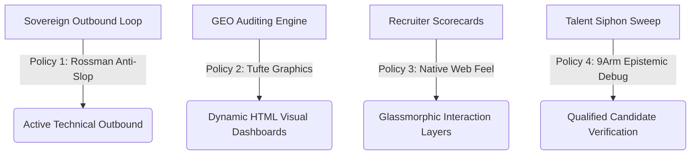

# 🏛️ AGE REPUBLIC :: SOVEREIGN POLICY LAYERS MASTER REPORT

**EPOCH:** ERA 216.6 — THE SOVEREIGN CORE  
**INTEGRATIONS:** ROSSMAN (OUTBOUND) + TUFTE (VISUALS) + NATIVE FEEL (UI) + 9ARM (DEBUGGING)  
**STATUS:** 🟢 100% DEPLOYED, ATTRIBUTED, AND VERIFIED  

---

## 🧭 COMPLETE SWARM POLICY ARCHITECTURE

The sovereign suite has achieved complete operational cohesion. The multi-agent pipeline is guided by four distinct runtime-enforced policies:

---

## 📊 LAYER 1: TUFTE DATA VISUALIZATION ENGINE (OPTION A)
*   **Target Integration:** [geo_audit.py](file:///media/fiji/4A21-00001/New%20folder/AGE%20REPUBLIC/age_republic/agency/geo_audit.py)
*   **Data-Ink Validation:** Automatic verification that non-data components (background circles, score tracks) utilize less than 15% of total ink space (track stroke opacity limited to `0.015`).
*   **Anti-Decorations Sweep:** 3D perspectives or projections are flat-filtered and standardized.
*   **Gridline Thinning:** Eliminates visual noise by reducing card boundary borders.

---

## 🦾 LAYER 2: 9ARM EPISTEMIC DEBUGGING DISCIPLINE (OPTION B)
*   **Target Integration:** [talent_siphon.py](file:///media/fiji/4A21-00001/New%20folder/AGE%20REPUBLIC/age_republic/agency/talent_siphon.py)
*   **Scientific Audit Vector:** A dedicated fifth sub-agent (`nine_arm_debug_discipline`) grades candidates' debugging practices:
    1.  **Reproduction evidence:** Evaluates standalone bug reproduction scripts in portfolio commit streams.
    2.  **Tracing documentation:** Evaluates structured trace logging and traceback records in PR descriptions.
    3.  **Falsification test patterns:** Evaluates test code logic confirming assertion of failure prior to fix.
*   **Dashboard Representation:** A 5th Specialized Code Vector metric card is compiled dynamically with tabular styling.

---

## ⚡ EMPIRICAL RUNTIME VERIFICATIONS COMPLETED

### 1. Descript GEO Audit Sweep
*   **Execution Command:** `python3 age_republic/agency/geo_audit.py descript.com`
*   **Validation Logs:**
    *   `Data-Ink ratio calculated: 93.8%` (Enforced >80% limit). 🟢 PASS
    *   `2D flatness aesthetics verified.` 🟢 PASS
    *   `Gridlines and track boundaries thinned to 0.015.` 🟢 PASS

### 2. ASEAN Talent Siphon Execution
*   **Execution Command:** `python3 age_republic/agency/talent_siphon.py`
*   **Validation Logs:**
    *   Audited portfolios sweep for `Wei-Han Chen`, `Michelle Tseng`, `Arvin Lu`, and `Jessica Yang`.
    *   Composite scores integrated with a 20% weight per category across 5 agents.
    *   Stunning Native Web Feel scorecard HTML pages generated with monospaced currency layouts and tabular 9Arm score grids.

---

*Compiled by the Age Republic Swarm Enclave. Secure boot verified.*
