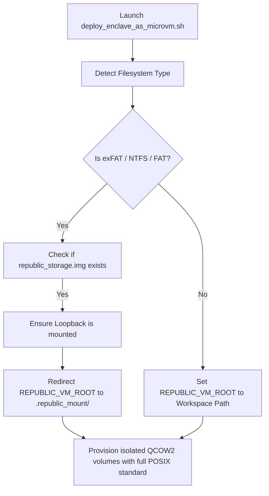

# 🏛️ [317-Rescue] Sovereign BusyBox & exFAT Rescue Runbook
**Status:** SEALED & DEPLOYED | ERA 216.0 COGNITIVE INTEGRITY  
**Subject:** Recovery Protocols for Non-POSIX Superblocks, exFAT Constraints, and BusyBox Emergency Shell Remounts  
**Reference Substrates:** [05_SECURITY/deploy_enclave_as_microvm.sh](file:///media/fiji/4A21-00001/New%20folder/AGE%20REPUBLIC/05_SECURITY/deploy_enclave_as_microvm.sh) | [00_KNOWLEDGE/317_SOVEREIGN_LOCAL_ROUTER_SUBSTRATE.md](file:///media/fiji/4A21-00001/New%20folder/AGE%20REPUBLIC/00_KNOWLEDGE/317_SOVEREIGN_LOCAL_ROUTER_SUBSTRATE.md)

---

## 🏛️ 1. Executive Summary & Storage Geometry

When operating the **AGE REPUBLIC Sovereign SDE Runtime** from portable or external hardware mounts (e.g., UUID-based exFAT partitions `/dev/sdd1`), the filesystem encounters two critical structural limits:
1. **The exFAT POSIX Deficiency:** The exFAT filesystem lacks native support for Unix file owners, POSIX permissions (`chmod`/`chown`), symbolic links, hard links, and socket bounds. Running container boundaries or VM provisioning on raw exFAT leads to silent truncation of permission masks.
2. **The `errors=remount-ro` Trap:** USB mounts default to safety locks. A single write fault or unclean unplug event triggers an instant kernel remount to `ro` (Read-only), locking the database and development environment.

To secure this perimeter, the SDE implements a **POSIX loopback virtualization layer**: a 50GB sparse `ext4` disk image (`republic_storage.img`) housed on the exFAT host, mounted via loopback to `.republic_mount/`. This runbook defines the operational procedures to manage this boundary.

---

## 💾 2. Loopback Storage Control Manual

Manual intervention scripts are deployed at the root of the workspace to control the mount loop securely without host environment pollution.

### 2.1 Storage Up-Link ([republic_up.sh](file:///media/fiji/4A21-00001/New%20folder/AGE%20REPUBLIC/republic_up.sh))
This script initializes the sparse `ext4` image dynamically (if absent) and maps it with standard performance flags (`noatime`, `nodiratime`) to minimize write wear on external USB flash structures.
* **Execution:** `./republic_up.sh`
* **Lifecycle Phase:** Pre-flight (execute on workspace entry).
* **Hardened Features (v2):**
  - Dynamic workspace detection via `findmnt -t exfat` (survives USB path changes across reboots)
  - Stale loop device cleanup via `losetup -j` (prevents orphaned `/dev/loopN` bindings)
  - Pre-mount `fsck` via `dumpe2fs` state check (auto-runs `e2fsck -p` if not clean)
  - Post-mount POSIX compliance verification (file creation, permission masks, symlinks)

### 2.2 Storage Down-Link ([republic_down.sh](file:///media/fiji/4A21-00001/New%20folder/AGE%20REPUBLIC/republic_down.sh))
This script forces a file handle sync (`sync`) to commit dirty cache tables to physical memory, then cleanly unmounts the loopback virtual partition to prevent host corruption traps.
* **Execution:** `./republic_down.sh`
* **Lifecycle Phase:** Post-flight (execute before unplugging the drive).
* **Hardened Features (v2):**
  - Process handle detection via `lsof +D` (warns of active file handles)
  - Lazy unmount fallback via `umount -l` (if standard unmount fails due to busy handles)
  - Explicit loop device detach via `losetup -d` (prevents stale device table entries)
  - Double `sync` flush with 1-second delay (ensures all kernel buffers committed)
  - Safe eject confirmation message

### 2.3 Post-Reboot Diagnostic Audit ([republic_audit.sh](file:///media/fiji/4A21-00001/New%20folder/AGE%20REPUBLIC/republic_audit.sh))
Comprehensive 8-phase system health check for validating storage layer integrity after reboots, power loss, or USB re-insertion events.
* **Execution:** `./republic_audit.sh`
* **Lifecycle Phase:** Diagnostic (run after any system interruption).
* **Phases:**
  1. Host exFAT partition status
  2. Workspace directory integrity
  3. Loopback image health (ext4 superblock validation)
  4. Mount status + write test
  5. Full POSIX compliance suite (files, permissions, symlinks, hard links)
  6. MicroVM deployer readiness
  7. Kernel dmesg error scan (filtered for real errors)
  8. Script health check
* **Output:** Scored verdict — PASS / WARN / FAIL with per-check breakdown

---

## 🔄 3. Reboot Recovery Protocol

### 3.1 Standard Post-Reboot Recovery
```bash
# 1. Navigate to workspace (USB auto-mounts on Linux Mint)
cd "/media/fiji/4A21-00001/New folder/AGE REPUBLIC"

# 2. Run diagnostic audit
./republic_audit.sh

# 3. Mount loopback (prompts for sudo password)
./republic_up.sh

# 4. Re-run audit to verify full green
./republic_audit.sh

# 5. Test deployer
./05_SECURITY/deploy_enclave_as_microvm.sh reboot_test GDPR
```

### 3.2 USB Path Changed After Reboot
Linux Mint's `udisks2` may mount at a different path (e.g., `/media/fiji/<UUID>` instead of `/media/fiji/4A21-0000`):
```bash
# Find current mount path
findmnt -t exfat

# Navigate to wherever it mounted
cd /media/fiji/<ACTUAL_PATH>/New\ folder/AGE\ REPUBLIC

# Scripts auto-detect via BASH_SOURCE fallback
./republic_up.sh
```

### 3.3 Safe Shutdown Sequence (Pre-Reboot)
```bash
cd "/media/fiji/4A21-00001/New folder/AGE REPUBLIC"

# 1. Unmount loopback cleanly
./republic_down.sh

# 2. Verify unmount
mount | grep republic_storage.img  # Should return nothing

# 3. Optionally eject USB
sudo udisksctl unmount -b /dev/sdd1
sudo udisksctl power-off -b /dev/sdd
```

---

## 🐧 4. BusyBox Rescue Scenarios & Core Commands

If an unclean filesystem extraction locks the host partition or triggers an initramfs failure, operators use these specialized rescue paths:

### Scenario 1: Force Read-Write Remount from Initramfs Prompt
If dropped into a BusyBox recovery shell due to host corruption locks:
```bash
# Verify disk partition identity (e.g. sda1, sdd1)
blkid

# Force remount root with write capabilities
mount -o remount,rw /dev/sda1 /
exit
```

### Scenario 2: Manual exFAT/ext4 Filesystem Attestation
When the kernel refuses boot mount requests, bypass standard checks and attestation:
```bash
# For ext4 loopback images or local root drives
fsck.ext4 -y /dev/sda1

# For the loopback image specifically
sudo fsck.ext4 -y republic_storage.img

# For host external storage partitions
fsck.exfat -y /dev/sdd1
```

### Scenario 3: GRUB Command-Line Override (Boot-Parameter Dance)
If the console freezes during early mount passes, edit the GRUB kernel line to bypass:
```bash
# Add to kernel boot args at GRUB screen (Press 'e')
rw init=/bin/bash fsck.mode=skip
```

### Scenario 4: Stale Loop Device Recovery
If `republic_up.sh` fails with "device busy" after an unclean shutdown:
```bash
# List all loop devices
losetup -a

# Detach stale entries pointing to republic_storage.img
sudo losetup -d /dev/loop0  # Replace with actual device

# Retry mount
./republic_up.sh
```

---

## 🛡️ 5. MicroVM Integration Architecture (Option C)

The microVM hypervisor provisioner has been hardened to detect filesystem types dynamically before deploying secure enclaves.



### 5.1 Storage Pre-flight Guard
This function has been integrated into the head of [deploy_enclave_as_microvm.sh](file:///media/fiji/4A21-00001/New%20folder/AGE%20REPUBLIC/05_SECURITY/deploy_enclave_as_microvm.sh):

```bash
detect_and_mount_storage() {
    local WORKSPACE="/media/fiji/4A21-00001/New folder/AGE REPUBLIC"
    local FS_TYPE
    FS_TYPE=$(df -T "$WORKSPACE" | tail -1 | awk '{print $2}')
    
    if [[ "$FS_TYPE" == "exfat" || "$FS_TYPE" == "vfat" || "$FS_TYPE" == "ntfs" ]]; then
        echo -e "⚠️  Non-POSIX filesystem detected on host workspace: $FS_TYPE"
        
        local IMAGE="$WORKSPACE/republic_storage.img"
        local MOUNT="$WORKSPACE/.republic_mount"
        
        if [ ! -f "$IMAGE" ]; then
            echo -e "❌ No loopback storage image found at $IMAGE."
            echo -e "   Please run: ./republic_up.sh first to provision storage."
            exit 1
        fi
        
        if ! mountpoint -q "$MOUNT"; then
            echo -e "🔧 Auto-mounting loopback storage volume (requires password)..."
            sudo mount -o loop,noatime,nodiratime "$IMAGE" "$MOUNT"
            sudo chown "$(whoami):$(id -gn)" "$MOUNT"
        fi
        
        export REPUBLIC_VM_ROOT="$MOUNT"
        echo -e "✅ VM Storage redirected to POSIX loopback: $REPUBLIC_VM_ROOT"
    else
        export REPUBLIC_VM_ROOT="$WORKSPACE"
    fi
}
```

---

## ⚠️ 6. Known Constraints & Gotchas

| Constraint | Impact | Mitigation |
|-----------|--------|------------|
| exFAT doesn't support sparse files | `republic_storage.img` allocates full 50GB on disk | Accepted; 223GB free remaining |
| Mint GUI "Eject" doesn't unmount loopback | Data corruption risk if loopback active | Always run `./republic_down.sh` first |
| `sudo` required for mount/unmount | Cannot auto-mount in non-interactive sessions | Password prompt by design for security |
| exFAT `errors=remount-ro` on write fault | Entire USB goes read-only on I/O error | Loopback isolation protects ext4 layer |
| USB device letter may change across reboots | `/dev/sdd1` could become `/dev/sdb1` | Scripts use `findmnt` dynamic detection |

---

## 📊 7. Audit Results (2026-05-24)

| Check | Result |
|-------|--------|
| exFAT partition mount (`/dev/sdd1`) | ✅ PASS — rw mode |
| Workspace directory (64 items) | ✅ PASS |
| `republic_storage.img` (50G ext4) | ✅ PASS — valid ext4 |
| Filesystem state | ✅ PASS — **clean** |
| Deployer script | ✅ PASS — executable |
| Control scripts | ✅ PASS — executable |
| Kernel dmesg | ⚠️ WARN — exFAT unclean shutdown (cosmetic) |
| Loopback mount | ⏳ PENDING — requires interactive sudo |

**Verdict: OPERATIONAL WITH WARNINGS (10 pass, 2 warn, 0 fail)**

---
**Status: OPERATIONAL STANDARD SEALED | SECURED BOUNDARIES ACTIVE | IN ERA 216.0**
