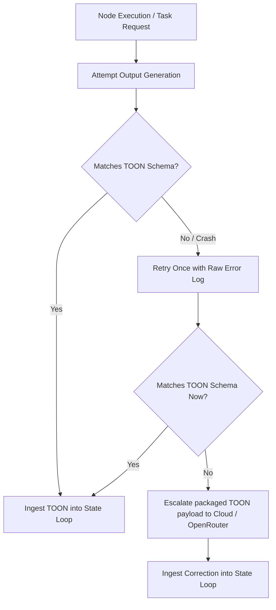

# 🦊 [317-Escalation] Sovereign Local-First Escalation Guide
**Status:** IMPLEMENTED & GROUNDED | ERA 216.0 COGNITIVE SOVEREIGNTY  
**Subject:** Local-First "Junior-to-Senior" Escalation via OpenRouter with Native TOON Self-Debugging  
**Reference Substrates:** [317_SOVEREIGN_LOCAL_ROUTER_SUBSTRATE.md](file:///d:/New%20folder/AGE%20REPUBLIC/00_KNOWLEDGE/317_SOVEREIGN_LOCAL_ROUTER_SUBSTRATE.md) | [376_I_LLM_INTEGRATION_AND_SAFETY_ARCHITECTURE.md](file:///d:/New%20folder/AGE%20REPUBLIC/00_KNOWLEDGE/376_I_LLM_INTEGRATION_AND_SAFETY_ARCHITECTURE.md)

---

## 🏛️ Rationale
To solve hardware-bound local LLM limitations without surrendering privacy or blowing past compute budgets, we formalize the **"Junior-to-Senior" Escalation Protocol**. The local model (Junior Engineer) handles rapid code completion, basic debugging, and initial syntax-level edits. If the local model gets stuck (failing compiler runs, infinite reasoning loops, or high semantic complexity), it initiates a secure, sanitised escalation to a frontier cloud model (Senior Engineer via OpenRouter), enforcing the safety constraints outlined in [Vector 2.2: Tool Calling Economic Drain](file:///d:/New%20folder/AGE%20REPUBLIC/00_KNOWLEDGE/376_I_LLM_INTEGRATION_AND_SAFETY_ARCHITECTURE.md#L103).

By leveraging **TOON (Token-Oriented Object Notation)** instead of legacy JSON formats, this process achieves maximum data density. Local nodes package their state directly as native TOON objects, eliminating JSON's parsing overhead ("Silicon tax") on hardware-in-the-loop limits.

---

## 📊 Part 1: Local Model Comparison under Hardware Bounds

When selecting a "Junior Engineer" for local deployment, we evaluate models based on three target hardware profiles:

| Model | Size & Quantization | VRAM Footprint | Strength | Best Use Case |
| :--- | :--- | :--- | :--- | :--- |
| **Qwen2.5-Coder-1.5B-Instruct** | Q8_0 or FP16 | ~1.8 GB to 3.0 GB | Lightning-fast auto-completion (FIM). | Real-time tab completion (Continue/Cursor) |
| **Qwen2.5-Coder-7B-Instruct** | Q4_K_M (Ollama Default) | ~4.8 GB | Matches GPT-4o-mini on standard coding tasks; highly coherent on isolated edits. | Standard Chat & Inline edits on 8GB-16GB machines |
| **DeepSeek-Coder-V2-Lite** | 16B (Q4_K_M) (MoE Architecture) | ~9.8 GB | Stronger multi-file logical comprehension; large 128k context support. | Complex local architectural refactoring (16GB+ machines) |

---

## 🧬 Part 2: Native TOON Processing & Structural Definition

TOON represents data structures with high density, keeping the token footprint extremely small for low-latency optical or distributed networks.

* **Single Map representation:** `name{header1,header2}: val1,val2`
* **List representation:** `name[size]{header1,header2}: val1_1,val1_2 val2_1,val2_2`

We implement high-speed encoding and decoding natively via [toon_parser.py](file:///d:/New%20folder/AGE%20REPUBLIC/10_EXTENSIONS/custom_zed/toon_parser.py):

```python
import re

class Toon:
    @staticmethod
    def encode_map(data: dict, name: str = "data") -> str:
        headers = sorted(data.keys())
        header_str = ",".join(headers)
        
        def format_value(val):
            if val is None: return "null"
            if isinstance(val, str): return val.replace(",", "\\,")
            return str(val)
            
        values = ",".join(format_value(data[k]) for k in headers)
        return f"{name}{{{header_str}}}: {values}"

    @staticmethod
    def decode(toon_str: str) -> list:
        pattern = re.compile(r"^(\w+)(?:\[(\d+)\])?\{(.*)\}:\s*(.*)$")
        match = pattern.match(toon_str.strip())
        if not match:
            raise ValueError("Invalid TOON format")
            
        name, size_str, header_str, values_str = match.groups()
        headers = header_str.split(",")
        is_list = size_str is not None and size_str != ""
        rows = values_str.split(" ") if is_list else [values_str]
        
        result = []
        for row in rows:
            values = row.split(",")
            values = [v.replace("\\,", ",") for v in values]
            item = {}
            for h, v in zip(headers, values):
                if v == "null":
                    item[h] = None
                else:
                    try:
                        item[h] = float(v) if "." in v else int(v)
                    except ValueError:
                        item[h] = v
            result.append(item)
        return result
```

---

## 🛠️ Part 3: Deterministic Self-Debugging & Gateway Integration

To prevent nodes from spinning in semantic black holes, the orchestrator implements a **Deterministic Self-Debugging Loop**:


### Sovereign Escalation Middleware Gateway (`SovereignRouter`)
This is the complete, high-density FastAPI routing gateway supporting **TOON schema verification** and cascading fallback.

```python
import os
import httpx
from fastapi import FastAPI, Request, HTTPException
from fastapi.responses import StreamingResponse
import uvicorn
import json
from toon_parser import Toon

app = FastAPI(title="Sovereign Local Router Gateway")

LOCAL_OLLAMA_URL = "http://localhost:11434/v1"
OPENROUTER_URL = "https://openrouter.ai/api/v1"
OPENROUTER_API_KEY = os.environ.get("OPENROUTER_API_KEY", "")

GATEWAY_PORT = 9877
LOCAL_JUNIOR_MODEL = "qwen2.5-coder:7b"
FALLBACK_SENIOR_MODEL = "anthropic/claude-3.5-sonnet"

# Required TOON Schema definitions for telemetry frames
TELEMETRY_SCHEMA_HEADERS = ["id", "latency_ms", "node_status"]

def validate_toon_compliance(payload_str: str) -> bool:
    """Verifies that generated payload matches the strict TOON telemetry standard"""
    try:
        decoded = Toon.decode(payload_str)
        if not decoded:
            return False
        for item in decoded:
            # Enforce exact header match
            if not all(h in item for h in TELEMETRY_SCHEMA_HEADERS):
                return False
        return True
    except Exception:
        return False

@app.post("/v1/chat/completions")
async def route_completion(request: Request):
    body = await request.json()
    messages = body.get("messages", [])
    stream = body.get("stream", False)
    
    last_user_message = next((m["content"] for m in reversed(messages) if m["role"] == "user"), "")
    
    # 1. Deterministic Self-Debugging / TOON extraction
    is_toon_validation_task = "telemetry{" in last_user_message
    
    if is_toon_validation_task:
        print("🔍 Parsing TOON payload inside Local Self-Debugging Loop...")
        # Local attempt
        local_response = await execute_local_direct(body)
        raw_output = local_response["choices"][0]["message"]["content"]
        
        if validate_toon_compliance(raw_output):
            print("✅ TOON Schema Check Passed! Local state intact.")
            return local_response
        else:
            print("⚠️ TOON Schema Check Failed on Attempt 1. Retrying once locally with feedback...")
            # Injecting feedback context directly as a mini self-repair prompt
            body["messages"].append({
                "role": "assistant",
                "content": raw_output
            })
            body["messages"].append({
                "role": "user",
                "content": f"ERROR: Output did not match mandatory schema headers: {TELEMETRY_SCHEMA_HEADERS}. Re-generate as valid TOON format."
            })
            
            retry_response = await execute_local_direct(body)
            raw_retry_output = retry_response["choices"][0]["message"]["content"]
            
            if validate_toon_compliance(raw_retry_output):
                print("✅ TOON Schema Check Passed on Attempt 2 (Local Repair Successful).")
                return retry_response
            else:
                print("🚨 Attempt 2 Failed. Escalating structured TOON telemetry packet to Senior Cloud Engine...")
                # Package specific node failure telemetry as a TOON structure
                error_telemetry = Toon.encode_map({
                    "id": 428,
                    "node_status": "FAULT_ESCALATED",
                    "latency_ms": 999.0
                }, "error_report")
                
                body["messages"].append({
                    "role": "user",
                    "content": f"[ESCALATE] Local node has faulted. Resolve this TOON payload: {error_telemetry}"
                })
                return await handle_cloud_escalation(body, stream)
    
    # 2. General code assistance routing
    if "[ESCALATE]" in last_user_message or "error: compile failed" in last_user_message.lower():
        return await handle_cloud_escalation(body, stream)
    else:
        return await handle_local_inference(body, stream)

async def execute_local_direct(body: dict) -> dict:
    body["model"] = LOCAL_JUNIOR_MODEL
    async with httpx.AsyncClient() as client:
        r = await client.post(f"{LOCAL_OLLAMA_URL}/chat/completions", json=body, timeout=30.0)
        return r.json()

async def handle_local_inference(body: dict, stream: bool):
    body["model"] = LOCAL_JUNIOR_MODEL
    async def stream_local():
        async with httpx.AsyncClient() as client:
            try:
                async with client.stream("POST", f"{LOCAL_OLLAMA_URL}/chat/completions", json=body, timeout=60.0) as r:
                    async for chunk in r.iter_raw():
                        yield chunk
            except httpx.ConnectError:
                print("⚠️ Local Ollama is down! Auto-escalating to cloud...")
                async for chunk in stream_cloud_direct(body):
                    yield chunk

    if stream:
        return StreamingResponse(stream_local(), media_type="text/event-stream")
    else:
        try:
            r = await execute_local_direct(body)
            return r
        except httpx.ConnectError:
            return await handle_cloud_escalation(body, stream=False)

async def handle_cloud_escalation(body: dict, stream: bool):
    if not OPENROUTER_API_KEY:
        raise HTTPException(status_code=500, detail="OPENROUTER_API_KEY environment variable is not set.")
    
    body["model"] = FALLBACK_SENIOR_MODEL
    headers = {
        "Authorization": f"Bearer {OPENROUTER_API_KEY}",
        "HTTP-Referer": "https://sovereign.age-republic.org",
        "X-Title": "Age Republic Sovereign Router",
        "Content-Type": "application/json"
    }

    if stream:
        return StreamingResponse(stream_cloud_direct(body, headers), media_type="text/event-stream")
    else:
        async with httpx.AsyncClient() as client:
            r = await client.post(f"{OPENROUTER_URL}/chat/completions", json=body, headers=headers, timeout=60.0)
            return r.json()

async def stream_cloud_direct(body: dict, headers: dict = None):
    if not headers:
        headers = {
            "Authorization": f"Bearer {OPENROUTER_API_KEY}",
            "Content-Type": "application/json"
        }
    body["model"] = FALLBACK_SENIOR_MODEL
    async with httpx.AsyncClient() as client:
        async with client.stream("POST", f"{OPENROUTER_URL}/chat/completions", json=body, headers=headers, timeout=60.0) as r:
            async for chunk in r.iter_raw():
                yield chunk

if __name__ == "__main__":
    uvicorn.run(app, host="0.0.0.0", port=GATEWAY_PORT)
```

---

## 🔌 Part 4: VS Code Extension Configuration (Cline & Continue)

To direct **Cline** or **Continue** through your local sovereign gateway, apply these settings:

### 1. Cline Configuration (`settings.json`)
Open your global `settings.json` and configure the custom API provider:
```json
"cline.apiProvider": "open-compatible",
"cline.openCompatibleModelId": "qwen2.5-coder:7b",
"cline.openCompatibleBaseUrl": "http://localhost:9877/v1",
"cline.openCompatibleApiKey": "sovereign-local-key"
```

### 2. Continue Configuration (`config.json`)
For real-time tab completions and inline assistance:
```json
{
  "models": [
    {
      "title": "Sovereign Router",
      "provider": "openai",
      "model": "qwen2.5-coder:7b",
      "apiBase": "http://localhost:9877/v1",
      "apiKey": "sovereign-local-key"
    }
  ],
  "tabAutocompleteModel": {
    "title": "Qwen 1.5B Autocomplete",
    "provider": "ollama",
    "model": "qwen2.5-coder:1.5b"
  }
}
```

---
**Status: GATEWAY BLUEPRINT SEALED | ANCHORED TO ERA 216.0 | READY FOR DUAL INFRASTRUCTURE RUN**
