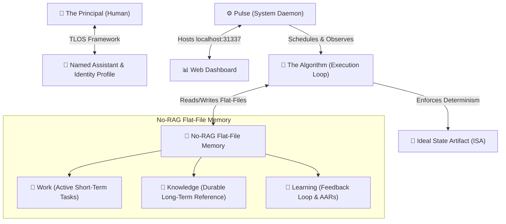

# 🤖 [320_B] pAI: Personal AI Infrastructure (Life OS)

## 🏛️ Rationale
During the **May 2026 Margin Call Cascade (Era 216.0)**, agentic operational continuity is paramount. Anthropic’s **Claude Code** and the **Sovereign SDE** must transition from transient, stateless execution nodes into highly personalized, persistent "Life Operating Systems" (Life OS). 

The **pAI (Personal AI Infrastructure)** Version 5.0.0 framework (released mid-May 2026) marks a critical evolution by consolidating disparate agentic micro-services into a unified background system daemon. This document siphons the architectural primitives of pAI V5.0.0 to accelerate the cognitive integration of the **Age Republic Cockpit**.

---

## 🏛️ The Core Philosophy: Shifting the AI Orbit
As raw LLM compute collapses to zero cost, the premium bottleneck of the digital era becomes **high-fidelity context**. pAI shifts the orbit of AI interaction:
* **Legacy Orbit**: The developer orbits around the AI, feeding it disconnected prompts in an external centralized chat portal.
* **Sovereign Orbit**: The AI’s memory, execution loop, and automation hooks orbit around the **user’s permanent local environment (The Principal)**. The assistant never resets to zero context each morning.

---

## 🧩 Architectural Pillars & Key Primitives



### 1. The Named Assistant & Identity Profile
pAI initializes via a deep interactive diagnostic interview with the Principal. It produces durable markdown schemas defining:
* **The Principal**: Personal history, values, active projects, and blindspots.
* **The Named Assistant**: Dedicated operational persona, output style, constraints, and custom protocols.
* **TLOS (The Miessler Life Operating System)**: A structured framework mapping long-term human goals to daily agentic priorities.

### 2. Pulse (The System Daemon & Dashboard)
Operating as a unified background service, `Pulse` replaces legacy scattered scripts with a centralized orchestrator:
* **Interface**: Serves a sleek, local web dashboard at `http://localhost:31337`.
* **Telemetry**: Records system observability logs, notifies the Principal of autonomous actions, schedules cron-based automation loops, and facilitates voice-to-text integration.

### 3. "The Algorithm" (The Execution Loop)
Every prompt is systematically routed through a strict multi-tier mental framework to guarantee deterministic paths:

$$\text{Observe} \longrightarrow \text{Think} \longrightarrow \text{Plan} \longrightarrow \text{Build} \longrightarrow \text{Execute} \longrightarrow \text{Verify} \longrightarrow \text{Learn}$$

1. **Observe**: Ingest files, telemetry, and environmental constraints.
2. **Think**: Internal classifier rates the prompt complexity to select the optimal effort tier.
3. **Plan**: Formulate the blueprint, identifying potential risks and side-effects.
4. **Build**: Write target code, templates, or scripts.
5. **Execute**: Propose or run the code under supervised containment.
6. **Verify**: Execute linting, compiler checks, or test suites to validate correctness.
7. **Learn**: Document what succeeded or failed to update the persistent memory.

### 4. Ideal State Artifact (ISA)
For non-trivial tasks, pAI rejects loose, conversational prompting. Before any local filesystem mutations occur, the agent constructs an **ISA (Ideal State Artifact)**:
* Defines the rigid definition of "done."
* Outlines absolute technical constraints and acceptance criteria.
* Establishes a step-by-step verification and test strategy.
* *Axiom: The ISA provides a deterministic boundary for the AI to self-correct and gives the human Principal a single auditing checkpoint before execution.*

### 5. No-RAG Flat-File Memory
By discarding complex vector databases and parsing overhead, pAI relies on fast, grep-friendly, local markdown directories:
* 📁 `Work/`: Active scratchpads, task checklists, and immediate operational states.
* 📁 `Knowledge/`: Long-term reference libraries, schemas, and system blueprints.
* 📁 `Learning/`: After-Action Reports (AARs) capturing past failures, algorithmic tweaks, and environment quirks.

---

## 🛠️ Extensibility: Skills, Workflows, and Hooks
The V5.0.0 framework contains a massive out-of-the-box library:
* **Ecosystem Size**: 48.9 MB comprising **45 Public Skills, 171 Workflows, and 37 Hooks**.
* **Execution Hierarchy**: To maximize reliability, the agent executes capabilities prioritizing:

$$\text{Native TypeScript/Python Code} \longrightarrow \text{CLI Tools} \longrightarrow \text{Structured Workflows} \longrightarrow \text{Skill.md Routing Files}$$

---

## 🏛️ Formal System Evaluation & Symbolic Proofs
To rigorously evaluate the pAI (Personal AI Infrastructure) architecture, we can translate its core arguments into symbolic logic, structural proofs, and deterministic constraints.

### 1. The Context Bottleneck Theorem
The core thesis asserts that **the primary constraint of effective AI agent execution is the quality and stability of local context, not raw processing capability.** 

As raw LLM capability ($C_{raw}$) scales, its marginal utility approaches a ceiling without personalized context ($K_{local}$). Conversely, generic intelligence ($I_{generic}$) becomes highly specific engineering utility ($U_{specific}$) when enveloped in local, persistent identity parameters.

Let:
* $C_{raw}$ = Raw model intelligence / capabilities.
* $K_{local}$ = Local personal context (Identity, TLOS, Memory).
* $U_{specific}$ = Pragmatic execution utility for the user.

#### Formal Argument:
1. $\forall x \, (C_{raw}(x) \land \neg K_{local}(x) \longrightarrow I_{generic}(x))$ *(Raw models without local context remain generic.)*
2. $\forall x \, (I_{generic}(x) \longrightarrow \neg U_{specific}(x))$ *(Generic models cannot achieve highly personalized operational utility.)*
3. $\forall x \, (C_{raw}(x) \land K_{local}(x) \longrightarrow U_{specific}(x))$ *(Raw models combined with local context yield personalized utility.)*
4. $\therefore \forall x \, (\neg K_{local}(x) \longrightarrow \neg U_{specific}(x))$

**Conclusion:** The presence of persistent local context ($K_{local}$) is a necessary condition for a personalized Life OS.

---

### 2. Formalization of "The Algorithm" Loop
The execution loop of pAI functions as a deterministic state-transition system. Its goal is to map an arbitrary user input into an explicit state transformation, moving the local system from a **Current State** ($S_{curr}$) to an **Ideal State** ($S_{ideal}$).

Let the execution algorithm $\mathcal{A}$ be a composite function operating on state spaces:

$$\mathcal{A} = f_{learn} \circ f_{verify} \circ f_{execute} \circ f_{build} \circ f_{plan} \circ f_{think} \circ f_{observe}$$

Where the sequence of operations for a given task $T$ is strictly ordered:

```
  S_curr ──► [Observe ──► Think ──► Plan] ──► [Build ──► Execute] ──► Verify ──► Learn ──► S_ideal
                │                            │
                └─────── (Inference) ────────┴──────── (Side Effects / Action) ────────┘
```

For complex, multi-step tasks ($\text{Effort}_{\text{tier}} = \text{High}$), the execution of $f_{build}$ is strictly gated by the compilation of the **Ideal State Artifact (ISA)**:

$$\text{ISA} = \{C_{\text{criteria}}, K_{\text{constraints}}, V_{\text{strategy}}\}$$

$$\text{If } \mathcal{A}(S_{curr}) \text{ requires file modification, then } S_{curr} \vdash \text{ISA} \text{ must evaluate to true before execution.}$$

---

### 3. Memory Architecture: Markdown Indexing vs. RAG
The project enforces a deterministic flat-file system architecture over vector databases / RAG pipelines for personal-scale computing.

#### The Trade-off Matrix

| Vector DB / RAG Architecture | pAI Flat-File Markdown Architecture |
| --- | --- |
| **Probabilistic Retrieval:** Uses cosine similarity over vector embeddings; prone to semantic drift and context pollution. | **Deterministic Retrieval:** Uses explicit markdown cross-references and fast file-system searching (`ripgrep`/exact match). |
| **Opaque State:** Latent space embeddings cannot be audited, inspected, or manually modified by a human text editor. | **Transparent State:** Readable text files easily backed up via Git, indexed locally, and edited using Obsidian/VS Code. |
| **High Overhead:** Requires local indexing daemons, embedding model loops, and database layers. | **Zero Overhead:** Relies entirely on native OS file handles and raw text parsing. |

#### Formalization of the Memory Constraint:
Let $M$ be the total memory space, and $E$ be the efficiency of state modification. pAI enforces that:

$$M = \{M_{work} \cup M_{knowledge} \cup M_{learning}\}$$

$$\text{where } M \subset \text{Plaintext Markdown}$$

$$\forall m \in M, \quad \text{Inspectability}(m) = 1.0 \quad \land \quad \text{Portability}(m) = 1.0$$

---

### 4. Automation Reliability Hierarchy
To prevent agent failure (such as infinite loops or semantic hallucination during system execution), pAI optimizes for deterministic paths over probabilistic ones, ranking tool execution by strict predictability:

$$\text{TypeScript Engine} \succ \text{Shell CLI Native} \succ \text{Structured Workflow Engine} \succ \text{Probabilistic LLM Router (Skill.md)}$$

```
▲ Higher Determinism (Lower Failure Rate)
│   1. TypeScript Code Execution
│   2. Native Command Line Interfaces (CLI)
│   3. Declarative Structured Workflows
▼ 4. Probabilistic LLM Prompt Routing (Skill.md)
```

By enforcing this hierarchy, the system reduces the entropy of agent actions, ensuring that the AI only relies on natural language prompting when programmatic or algorithmic alternatives do not exist.

---

## 🔒 Security, Isolation & Containment
Because pAI operates with elevated native system privileges, strict local firewalling is mandatory:
* **Sovereign Mirroring**: The public framework is a sanitized subset of the user's private configuration.
* **Containment Zones**: A hard boundary isolates private profiles, API keys, sensitive personal memories, and local file paths from public git checkouts.
* **Release Gates**: Automatic linting pre-commit hooks scan for accidental leaks of personal metadata or credentials before any pushing to shared spaces.

---

## 🏛️ Philosophical Axioms & Second-Order Lessons
Beyond the codebase, the pAI system embodies a specific **philosophical stance** on how humans should build, maintain, and live alongside highly capable agentic machines.

### 1. The Heliocentric Principle: "The Human is the Sun, the Tools are the Planets"
In legacy software design, humans bend to the application’s rigid interface (logging into siloed portals, filling out custom forms). pAI completely inverts this gravity.
* **The Gravitational Core**: The Principal's life, values, history, and goals form the permanent gravity of the system.
* **Interchangeable Planets**: LLM models, API keys, and coding platforms are treated as transient, plug-and-play computing commodities orbiting that core.
* **The Wisdom**: Never construct your cognitive workflow inside another entity's walled-garden platform. Own your raw context locally.

---

### 2. Plaintext as the Ultimate Sovereign Asset
pAI's aggressive rejection of Vector Databases and RAG pipelines for personal-scale knowledge management in favor of **flat Markdown files** serves as a strong architectural statement:

```
Probabilistic Systems (Vector DBs / RAG)  ──► Opaque, fragile, dependent on embeddings
Deterministic Systems (Plaintext / Git)    ──► Inspectable, un-brickable, permanent
```

* **Transparency of State**: You must always be able to open a native, lightweight text editor and inspect exactly what your assistant believes you care about.
* **Future-Proof Resilience**: Embedding vector spaces are ephemeral and proprietary, but plaintext markdown files are un-brickable and remain readable by any processor 50 years from now.

---

### 3. The Algorithm over the Blank Prompt
Starting every interaction from a blank, stateless chat window is a low-leverage way to collaborate with intelligence.
* **Slow Down to Speed Up**: Jumping straight into action (writing file mutations or executing shell inputs) leads to chaotic entropy. The **Observe $\rightarrow$ Think $\rightarrow$ Plan $\rightarrow$ Build $\rightarrow$ Execute $\rightarrow$ Verify $\rightarrow$ Learn** loop enforces discipline.
* **Objective Target State**: The *Ideal State Artifact (ISA)* teaches us that an agent (human or AI) cannot safely execute a task without concrete, verifiable target parameters drafted *prior* to action.

---

### 4. Overcoming Digital Amnesia
Humans naturellement accumulate context over a lifetime; we do not wake up with amnesia every morning. Yet, stateless chat interfaces force digital assistants to restart from zero daily.
* **Value Compounding**: The long-term compounding value of personal AI does not come from incremental base model upgrades. It compounds because the system preserves design decisions you made months ago, mistakes you made yesterday, and the underlying beliefs you hold.

---

### 5. Physical Security via Structural Isolation
Vague system prompts and "polite" guardrails are insufficient to protect private life when agents acquire elevated system execution privileges.
* **Sovereign Containment**: The boundary between public code and private context must be physically, structurally isolated within the filesystem. Local private data must be decoupled from the framework's executable engine.

> ### 💡 The Ultimate Takeaway
> pAI argues that the ultimate goal of personal AI is not to find a machine that can think *for* you, but to build a local, inspectable infrastructure that knows **how you think**, preserves **what you learn**, and protects **who you are** as you scale.

---

## ⚠️ Technical Boundaries & Constraints
* **OS Target**: Native support is limited to macOS and Linux. **Windows is completely unsupported**.
* **Ecosystem Coupling**: Highly opinionated integration natively bound to the Anthropic **Claude Code** CLI.
* **Stability Volatility**: Codebase undergoes rapid daily updates, highly susceptible to breaking legacy hooks; requires active maintenance.

---
**Status: SIPHONED | Anchored to ERA 216.0 | COGNITIVE INFRASTRUCTURE INTEGRATED**
