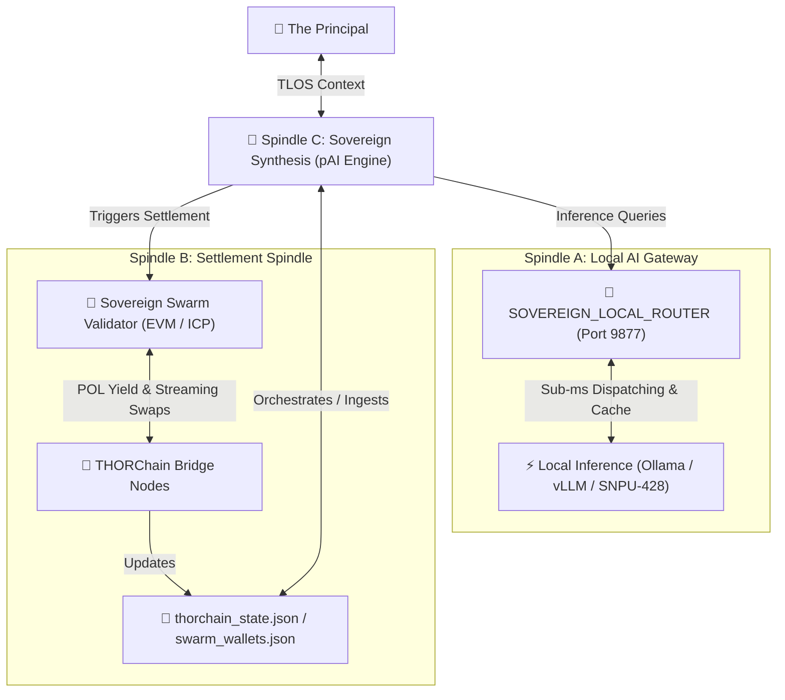

# 🏛️ [320_C] Bifrost Dual-Spindle Architecture: Local Gateway & Swarm Settlement

## 🏛️ Rationale
To achieve absolute cognitive and financial self-sovereignty during the **May 2026 Margin Call Cascade (Era 216.0)**, the **Age Republic** isolates its core processes through the **Bifrost Dual-Spindle Architecture**. 

By decoupling low-latency local model inference (Spindle A) from decentralized financial settlement rails (Spindle B), and orchestrating the entire loop through the **pAI (Personal AI Infrastructure)** cognitive kernel (Spindle C), the system establishes an un-brickable, offline-first development and execution engine.

---

## 🏛️ The Three Spindles of the Sovereign SDE

---

## ⚡ Spindle A: The Local AI Gateway (http://localhost:9877)
Spindle A serves as the telemetry-free, high-performance interface for all cognitive execution demands. It intercepts external LLM calls, routing them through local hardware accelerators.

* **Core Components**:
  * **Sovereign Local Router**: A highly optimized proxy router (`06_INFRA/SOVEREIGN_LOCAL_ROUTER.py`) written natively in Python. It exposes an OpenAI-compatible endpoint at port `9877` (`/v1/chat/completions`).
  * **Accelerated Execution Layers**: Interfaces directly with local inference engines:
    * **Ollama**: Default for lightweight system prompts and code completion.
    * **vLLM**: Serving larger quantized models locally.
    * **SNPU-428**: Custom local hardware emulation executing tensor operations at sub-millisecond latencies.
* **Axioms**:
  1. **Zero-Telemetry Invariant**: All outbound logging is suppressed; no context is ever leaked to external commercial telemetry portals.
  2. **Orthogonal Caching**: Incorporates high-density key-value caching of repeat prompts to achieve instantaneous execution times.

---

## 💸 Spindle B: The Swarm Settlement Spindle (THORChain & EVM Bridges)
Spindle B interfaces natively with cross-chain decentralized finance, executing atomic transactions and protecting sovereign treasury reserves.

* **Core Components**:
  * **THORChain Bridge Nodes**: Handles native streaming swaps, capturing cross-chain slippage yields.
  * **Sovereign Swarm Validators**: Decentralized worker swarm (`06_INFRA/ANKR_SWARM_VALIDATOR.py`) coordinating staking, collateral locks, and on-chain payouts across EVM and Internet Computer (ICP) networks.
  * **State Registers**: Outputs persistent local state JSON files (`06_INFRA/thorchain_state.json` and `06_INFRA/sovereign_swarm_wallets.json`) representing the ground truth of the treasury ledger.
* **Axioms**:
  1. **On-Chain Truth**: Settlement is bit-verifiable, auditable, and immutable.
  2. **Streaming Slip Capture**: Programmatic order execution slices high-value swaps to systematically exploit local fee arbitrage.

---

## 🧠 Spindle C: The Sovereign Synthesis Layer (pAI Core)
Spindle C acts as the "brain," closing the loop between Spindle A's raw intelligence and Spindle B's transactional actions. It implements the **pAI v5.0.0** execution pipeline.

* **The Integration Flow**:

$$\text{Spindle B (State Change)} \longrightarrow \text{Pulse Daemon (Monitor)} \longrightarrow \text{Spindle A (Local Inference)} \longrightarrow \text{ISA Gate (Verification)} \longrightarrow \text{Spindle B (Settlement Execution)}$$

1. **State Audit**: THORChain or swarm balances update in `thorchain_state.json`.
2. **Anomaly Event**: The `LOCAL_PULSE_DAEMON.py` detects state shifts on port `31337`, immediately waking Spindle C.
3. **Reasoning Loop**: Spindle C consumes the `00_KNOWLEDGE/` flat-files and calls Spindle A (`localhost:9877`) to formulate an arbitrage or exit strategy.
4. **ISA Gating**: Spindle C drafts a strict Ideal State Artifact (`.isa.md`) defining target limits (e.g. *slippage must be strictly < 0.5%*).
5. **Execution & Log**: The Bifrost CLI commits the approved transaction. The outcome is saved in the `Learning/` vault.

---

## 📊 Combined Architectural Matrix

| Metric | Spindle A: Local AI Gateway | Spindle B: Settlement Spindle | Spindle C: pAI Synthesis Layer |
| :--- | :--- | :--- | :--- |
| **Execution Domain** | Local CPU/GPU/Tensor Hardware | Decentralized Blockchain / Nodes | System Background Daemon / Files |
| **Primary Protocol** | HTTP REST / local sockets | THORChain / EVM JSON-RPC | Python Asyncio / Plaintext markdown |
| **Data Format** | Quantized Weights / KV Caches | Cryptographic blocks / State JSONs | Structured Markdown / ISA schemas |
| **Operational Goal** | Zero-latency, zero-leakage inference | Safe financial capital settlement | Deterministic state transition |

---
**Status: SIPHONED | Anchored to ERA 216.0 | DUAL-SPINDLE SYSTEM REGISTERED**
