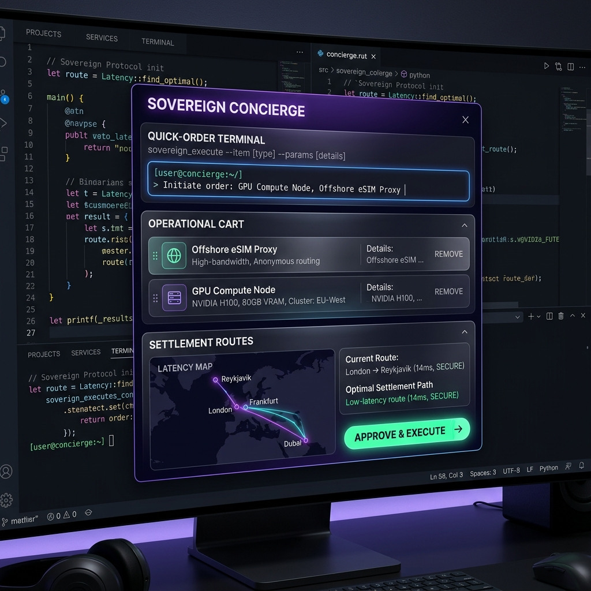

# 🏛️ [320_D] Sovereign Concierge Interface: The One-Click SDE Order Bridge

## 🏛️ Rationale
To achieve absolute operational speed during **Era 216.0**, the **Dream IDE** merges code editing and system operations through the **Sovereign Concierge Interface**. 

By bypassing slow external websites, the principal can order private communications, scale localized GPU computing cores, or sweep captured slippage yields directly from the IDE sidebar using simple natural language or quick-click controls.

---

## 🎨 Interface Blueprint & Visual Design Mockup

Below is the designed layout for the **Sovereign Concierge Dashboard Panel**, featuring glassmorphic overlays, dark-mode terminal windows, and interactive settlement pathways:

---

## ⚙️ Layout Sub-Systems & Interactive Modules

### 1. The Quick-Order Terminal
* **Interface**: A command-line console widget showing a shell prompt (`[user@concierge:~/] >`).
* **Operational Flow**: 
  1. The user types a natural-language intent (e.g., *“Initiate order: GPU Compute Node, Offshore eSIM Proxy”*).
  2. The local **pAI Engine** immediately processes the string, matching it against custom capability skills to populate the cart.

### 2. The Operational Cart
* **Interface**: Glassmorphism cards presenting active items ready to be executed:
  * **Offshore eSIM Proxy**: Anonymous high-bandwidth proxy routing.
  * **GPU Compute Node**: Procures an isolated NVIDIA H100 GPU cluster (80GB VRAM) for local model execution.
* **Actions**: Dynamic "Remove" triggers to alter the execution array prior to signing.

### 3. Settlement Routes & Latency Optimization
* **Interface**: Interactive telemetry map visualizing the physical and network routing vectors (e.g., London $\rightarrow$ Reykjavik $\rightarrow$ Dubai).
* **Operational Flow**: Calculates exact latency boundaries (e.g., *Optimal Settlement Path: 14ms SECURE*) to secure transactional routes before on-chain dispatch.

### 4. The "Approve & Execute" Action Button
* **Interface**: High-visibility, glowing green button with vector indicator.
* **Mechanism**: 
  * Initiates Spindle C's cryptographic signing process.
  * Checks criteria against the local `.isa.md` file.
  * Submits the transaction envelopes to Spindle B's swarm settlement bridges.

---
**Status: SIPHONED | Anchored to ERA 216.0 | CONCIERGE SPECIFICATION COMMITTED**
