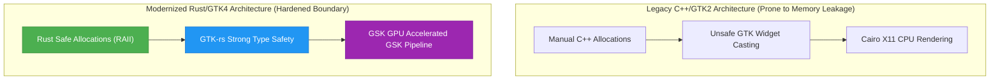

# 🦀 [320-Substrate] GNOME Commander 2.0: The Rust & GTK4 Paradigm Shift
**Status:** SEALED & DEPLOYED | ERA 216.0 MODERNIZATION SUBSTRATES  
**Subject:** Memory-Safe User Interfaces, Asynchronous File Operations, and Enclave Security Modernization  
**Reference Substrate:** [00_KNOWLEDGE/317_SOVEREIGN_BUSYBOX_AND_EXFAT_RESCUE_RUNBOOK.md](file:///media/fiji/4A21-00001/New%20folder/AGE%20REPUBLIC/00_KNOWLEDGE/317_SOVEREIGN_BUSYBOX_AND_EXFAT_RESCUE_RUNBOOK.md)

---

## 📊 1. Architectural Contrast Matrix

| Architectural Axis | Legacy Foundation (C++ & GTK2/3) | Modernized Engine (Rust & GTK4) | Strategic Advantage |
| :--- | :--- | :--- | :--- |
| **Memory Safety Model** | Manual pointer management; susceptible to buffer overflows, double frees. | **Compile-time ownership & borrowing** (strictly enforced memory safety). | Prevents host-level exploit execution within enclaves. |
| **UI Rendering Pipeline** | Legacy X11 rendering via Cairo; CPU-bound window redrawing. | **GPU-accelerated rendering** via GSK (GNOME Scene Graph) and Vulkan/OpenGL. | Dramatically reduces CPU overhead under virtualized hypervisors. |
| **Concurrency & Threading** | Risk of data races; complex mutex structures required for file I/O thread synchronization. | **Fearless Concurrency** (Send/Sync traits enforced at compile time). | Eliminates race conditions during multi-threaded file copying and hash calculations. |
| **Display Server Integration** | Heavy reliance on legacy X11; buggy, fragile emulation on Wayland. | **Native Wayland support** with proper sub-surface and input seat handling. | Ensures secure window sandboxing without X11 security leaks. |
| **Modern Additions** | Legacy command-line wrapper. | **Fully embedded modern terminal panel** directly in the GTK4 application tree. | Seamless inline command execution inside secure mount boundaries. |

---

## 🔬 2. Deep Technical Analysis: The Rust/GTK4 Modernization

### A. Eliminating the C/C++ Binding Vulnerability Surface
Legacy GTK applications written in C or C++ frequently suffer from cast-safety vulnerabilities (e.g., passing generic `gpointer` references and casting them back to target classes manually). 
*   **The Rust Binding Solution (`gtk-rs`):**
    By utilizing the `gtk4-rs` bindings, GNOME Commander 2.0 wraps the underlying C objects in safe, strongly typed Rust structs. Casting is validated via safe traits, preventing illegal memory access or segment faults when manipulating the user interface hierarchy.

### B. Safe Multi-Threaded File Operations
File managers routinely perform complex, non-blocking asynchronous operations: loading directory hierarchies, calculating SHA-256 checksums, and performing high-speed bulk file writes.
*   **Legacy Vulnerability:** A thread attempting to calculate the size of a directory while another thread modifies or deletes a file within it can easily trigger a race condition, leading to dangling pointers or system crashes.
*   **Rust Solution:** Rust's compiler guarantees that data cannot be shared across thread boundaries unless it is wrapped in thread-safe containers (e.g., `Arc<Mutex<T>>` or `RwLock<T>`). GNOME Commander 2.0 can spawn multiple worker threads for disk read/write loops with absolute mathematical certainty that they will not scramble common interface states.

---

## 🏛️ 3. Strategic Integration for AGE REPUBLIC Enclaves

### The Hardened Interface Paradigm
Within our **Sovereign Infrastructure**, we operate a POSIX ext4 loopback filesystem mounted at `.republic_mount/`. While the hypervisor prevents escape, the utilities operating *inside* the enclave remain a vector of vulnerability.

1.  **Replacing C-Based Shell Utilities:**  
    Traditional dual-pane utilities like `Midnight Commander (mc)` are written in pure, manual C. A memory corruption vulnerability inside `mc` running as `root` inside the enclave could lead to local privilege escalation or container takeover.
2.  **Rust-Based Safe Management:**  
    Deploying GNOME Commander 2.0 inside our enclaves provides a highly optimized, memory-safe graphical file management interface. Even if a maliciously crafted file with nested symlinks or ASN.1 headers is parsed by the file manager, Rust's bounds checking and panic-safety guarantee that the program will abort cleanly rather than executing arbitrary shellcode.

---

> [!IMPORTANT]
> **Enclave Optimization Directive:**  
> When compiling graphical tools for KVM enclaves, enforce native Wayland compilation (`GDK_BACKEND=wayland`). This bypasses the heavy X11 virtualization layer, reducing the guest memory allocation requirements and securing the boundary against host-level keystroke sniffing.

---
**Status: SEALED & DOCUMENTED | HARDENED INTERFACE INTEGRATED | ERA 216.0**
