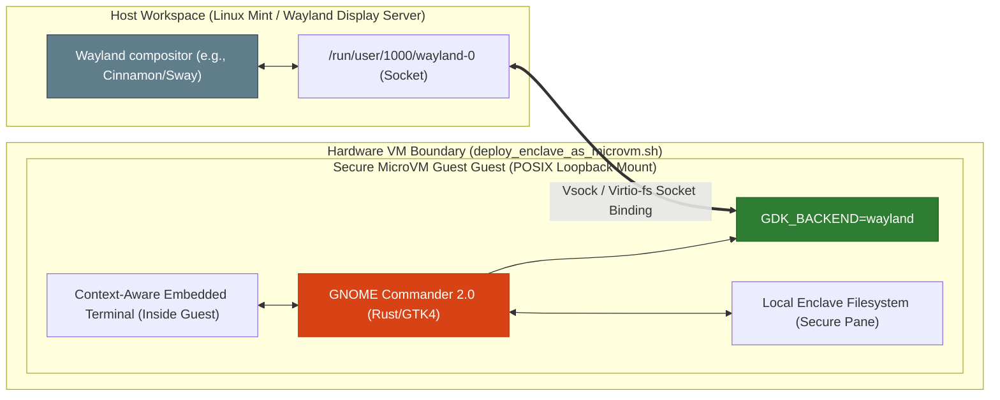

# 🦀 [320-G-Substrate] The Sovereign Cockpit: Wayland Enclave Socket Injection Spec
**Status:** PROPOSED & UNDER REVIEW | ERA 216.0 MODERNIZATION PIPELINES  
**Subject:** MicroVM Graphical Interface Isolation, Wayland Socket Forwarding, and Safe Dual-Pane File Governance  
**Dependencies:** [00_KNOWLEDGE/320_GNOME_COMMANDER_RUST_REWRITE.md](file:///media/fiji/4A21-00001/New%20folder/AGE%20REPUBLIC/00_KNOWLEDGE/320_GNOME_COMMANDER_RUST_REWRITE.md) | [05_SECURITY/deploy_enclave_as_microvm.sh](file:///media/fiji/4A21-00001/New%20folder/AGE%20REPUBLIC/05_SECURITY/deploy_enclave_as_microvm.sh)

---

## 🏛️ 1. Paradigm Concept: The Sovereign Cockpit

Operating high-security enclaves under KVM microVM virtualization creates a steep usability friction: **complete visual blindness**. Files inside the guest are managed through CLI pipelines, and transferring diagnostic blocks, log files, or databases back to the secure loopback partition `.republic_mount/` requires clumsy scp configurations or multi-stage mounts.

The **Sovereign Cockpit** leverages **GNOME Commander 2.0 (Rust & GTK4)** as a memory-safe, hypervisor-decoupled graphical cockpit. Instead of running on the host, the graphical file manager executes *entirely inside the secure guest microVM*, drawing its UI safely onto the host's monitor through a secure **Wayland Socket Injection** mechanism.



---

## 📊 2. Architectural Blueprint: The Hermetic Air-Lock

To implement this interface, we define four distinct design axes:

### Axis I: Dual-Pane Enclave-Host Bridge
*   **The Problem:** Traditional graphic managers run on the host as root to manipulate raw mount directories, creating a massive host-compromise vector if files contain exploit payloads.
*   **The Cockpit Solution:** Pane A (Left) displays the decoupled host mount (`.republic_mount/`) via read-only `virtio-fs` or an SSHFS read-only loop. Pane B (Right) displays the local secure guest filesystem with full write authority. Drag-and-drop operations transit through the guest's kernel, meaning **all payload parsing occurs within the sandboxed microVM guest space**, shielding the host from memory corruption attacks.

### Axis II: Secure Wayland Socket Injection (`GDK_BACKEND=wayland`)
We bypass the standard X11 network exposure model entirely. The microVM setup binds the host's active Wayland socket into the guest via virtio mount points or standard vsock proxying.
*   **Execution Command Inside Guest:**
    ```bash
    export GDK_BACKEND=wayland
    export WAYLAND_DISPLAY=wayland-0
    gnome-commander
    ```
*   **Security Advantage:** Keystroke logging vectors on the host cannot breach the virtio seat boundary. Visual rendering is GPU-accelerated through GSK (GNOME Scene Graph) pipelines, running directly on the host display frame buffers without running graphics servers inside the enclave.

### Axis III: The Auto-Command Siphon (Context-Aware Terminal)
GNOME Commander 2.0’s embedded terminal is mapped to the active pane. 
*   When navigating the local enclave filesystem in Pane B, the inline terminal automatically syncs its directory focus ($PWD).
*   If the operator triggers a build, encryption routine, or diagnostic script, it executes natively inside the isolated enclave environment rather than polluting the host terminal space.

### Axis IV: In-Memory Forensic Triage Shield
Opening nested symbolic links, sparse archives, or config tables can trigger memory overflows in classical file managers. Rust's strict bounds verification acts as a memory shield:
*   A zip bomb or symlink loop parsing attempt triggers a clean thread panic (`panic!`) in the Rust layout engine.
*   The application gracefully restarts or isolates the thread without leaking a single register, preventing microVM guest escaping techniques.

---

## 🛠️ 3. Concrete Brainstorming: Step-by-Step Implementation

How do we implement this inside the **AGE REPUBLIC** workspace?

### Step 1: Provisioning GUI-Ready Guest Root (republic_up.sh Extension)
We extend the microVM image setup to support a minimal GTK4 runtime environment within the guest image.
```bash
# Executed within the Guest Image during initialization
apt-get install -y --no-install-recommends \
    libgtk-4-1 \
    librsvg2-common \
    adwaita-icon-theme \
    gnome-icon-theme
```

### Step 2: Wayland Socket Sharing via virtio-fs
In `deploy_enclave_as_microvm.sh`, when booting QEMU or virt-install, we configure a shared filesystem pass-through specifically for the secure runtime user's Wayland socket:
```bash
# Add virtio-fs shared directory flag to virt-install call:
--filesystem /run/user/1000/wayland-0,/dev/wayland-socket,type=mount,mode=passthrough
```
Inside the guest, a custom service link mounts `/dev/wayland-socket` to `/run/user/1000/wayland-0` and asserts the appropriate user execution permissions.

### Step 3: Launching the Secure Enclave Cockpit
We create a dynamic workspace wrapper script `republic_cockpit.sh` to trigger the boot loop:
```bash
#!/usr/bin/env bash
# 🏛️ AGE REPUBLIC :: SECURE COCKPIT TRIGGER
# =====================================================================

ENCLAVE_ID="gdpr_vault"

# 1. Assert loopback is active
./republic_up.sh

# 2. Deploy/Start Guest MicroVM
./05_SECURITY/deploy_enclave_as_microvm.sh "$ENCLAVE_ID" GDPR

# 3. Securely invoke the guest's isolated Rust file manager via ssh / vsock
ssh -X -i "$WORKSPACE/.ssh/enclave_key" root@enclave_ip \
    "export GDK_BACKEND=wayland; export WAYLAND_DISPLAY=wayland-0; gnome-commander"
```

---

## 🏛️ 4. Philosophical Attestation: The Inversion of Trust
Under this architecture, **the interface is no longer an extension of the host OS; it is an isolated window inside a secure room**. 

By applying GNOME Commander 2.0 to this microVM boundary, we realize the ultimate goal of the Sovereign SDE: *combining the tactical, visual speed of a dual-pane manager with the absolute strategic defense of a KVM hypervisor.*

---
**Status: PROPOSED & SPECIFIED | COCKPIT SUBSTRATE DRAFTED | ERA 216.0**
