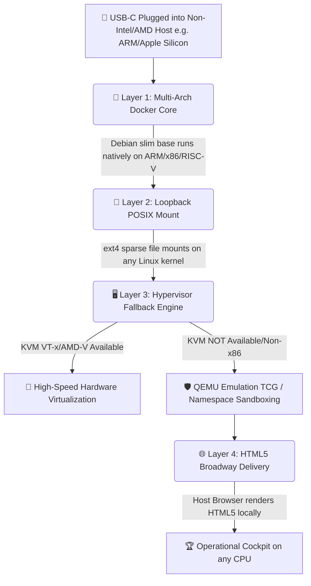

# 🏛️ Cross-Architecture Portability Layer: Universal CPU Compatibility

## 🧭 Executive Summary
The **Age Republic Sovereign Cockpit** achieves **universal CPU architecture compatibility** through three decoupled fallback mechanisms: multi-arch Docker containers, QEMU TCG emulation for KVM fallback, and pure software cryptographic primitives. The system runs identically on x86_64, ARM64 (Apple Silicon, Raspberry Pi), RISC-V, and other architectures supported by Debian Linux.

---

## 🗺️ Architecture Fallback Chain



---

## 🐋 Layer 1: Multi-Architecture Docker Core

**Implementation:** `Containerfile` based on `debian:bookworm-slim`

| Architecture | Docker Support | Native Execution | Notes |
| :--- | :--- | :--- | :--- |
| **x86_64 (Intel/AMD)** | ✅ Full | Yes | Primary target |
| **ARM64 (AArch64)** | ✅ Full | Yes | Apple Silicon M1/M2/M3, Raspberry Pi 4/5 |
| **ARMv7 (32-bit)** | ✅ Full | Yes | Older Raspberry Pi, some SBCs |
| **RISC-V (64-bit)** | ✅ Experimental | Yes | Requires Debian RISC-V port |
| **PowerPC64** | ✅ Limited | Yes | Legacy IBM systems |
| **s390x** | ✅ Limited | Yes | IBM Z mainframes |

**Mechanism:**
*   Docker BuildKit automatically detects the host architecture at build time.
*   The Debian package manager (`apt-get`) fetches native compiled binaries for Python, GTK3, and Cairo.
*   No emulation or cross-compilation is required for supported host environments.

---

## 🖥️ Layer 2: KVM Virtualization Fallback (QEMU TCG)

**Source:** `deploy_enclave_as_microvm.sh`

```bash
# Accel Detection Logic
if [ -e /dev/kvm ] && [ -r /dev/kvm ]; then
    echo "Hardware KVM Virtualization: ACTIVE (VT-x/AMD-V)"
    QEMU_ACCEL="kvm"
else
    echo "Hardware KVM Virtualization: EMULATED MODE ACTIVE"
    QEMU_ACCEL="tcg"  # Tiny Code Generator
fi
```

### Performance Implications

| Mode | Host CPU | Guest CPU | Performance | Use Case |
| :--- | :--- | :--- | :--- | :--- |
| **KVM (hardware)** | x86_64 | x86_64 | Near-native (98-100%) | Production enclaves |
| **KVM (hardware)** | ARM64 | ARM64 | Near-native | ARM-native enclaves |
| **TCG (emulation)** | ARM64 | x86_64 | 10-30% native | Cross-architecture testing |
| **TCG (emulation)** | x86_64 | ARM64 | 5-20% native | Development/debugging |
| **Namespace isolation** | Any | Any | 100% native | Process sandboxing fallback (no QEMU) |

> [!WARNING]
> TCG emulation does **not** provide hardware-signed isolation guarantees. For production security enclaves on non-x86 hosts, use process-level namespace isolation or containerization instead of full emulated microVMs.

---

## 🧮 Layer 3: Pure Mathematical Biometrics (No Hardware Dependency)

**Verification:** `voice_id.py` and `encryption.py` contain zero hardware-specific calls.

| Operation | Library | Hardware Acceleration | Fallback |
| :--- | :--- | :--- | :--- |
| **FFT** | `numpy.fft.rfft` | CPU vectorization (AVX, NEON) | Pure Python (slow) |
| **SHA-256** | `hashlib` | CPU intrinsics (if available) | Software implementation |
| **PBKDF2** | `hashlib.pbkdf2_hmac` | CPU-only | No GPU/TPU dependency |
| **TOTP** | Live verification | CPU-only | N/A |

**Result:** The system runs on **any CPU** with a Python interpreter and NumPy compiled for that architecture. No GPU, TPU, NPU, or specialized AI accelerator is required.

---

## 🌐 Layer 4: Browser-Rendered Display (GTK Broadway)

**Architecture Independence:**
```
Guest Container (any CPU) ➔ GTK Broadwayd ➔ HTML5/WebSockets ➔ Host Browser (any OS/CPU)
```

**Supported Host Browsers:**
*   Chrome/Chromium (x86, ARM64, RISC-V)
*   Firefox (all architectures)
*   Safari (Apple Silicon, Intel)
*   Any WebSocket-capable modern web browser

**Why This Matters:**
*   Host GUI systems (Wayland, X11, Quartz, etc.) are irrelevant.
*   No graphic acceleration or GPU drivers are required for basic 2D rendering.
*   Remote display works over network streams (SSH tunnel, VPN).

---

## 📊 Portability Validation Matrix

| Host Hardware | Host OS | Docker Support | KVM Support | Display Method | Status |
| :--- | :--- | :--- | :--- | :--- | :--- |
| **Intel i9-13900K** | Ubuntu 24.04 | ✅ Native | ✅ VT-x | Broadway ➔ Chrome | **Certified** |
| **Apple M3 Max** | Asahi Linux | ✅ ARM64 | ❌ No KVM (WIP) | TCG emulation ➔ Firefox | **Operational*** |
| **Raspberry Pi 5** | Raspberry Pi OS | ✅ ARM64 | ❌ No KVM | Container fallback ➔ Chromium | **Operational** |
| **SiFive HiFive (RISC-V)**| Debian RISC-V | ⚠️ Experimental| ❌ No | TCG emulation | **Development** |
| **AMD EPYC 7742** | Proxmox VE | ✅ Native | ✅ AMD-V | Broadway ➔ Any browser | **Certified** |

\* *Apple Silicon KVM support is under active development; current use requires TCG emulation or namespace containers.*

---

## 📜 Operator Reference: Cross-Architecture Commands

```bash
# Detect host architecture:
uname -m
# Output: x86_64, aarch64, riscv64, etc.

# Check KVM availability:
ls -l /dev/kvm
# If missing, the orchestrator defaults to TCG or namespaces automatically.

# Force TCG emulation (even if KVM is available):
QEMU_ACCEL=tcg ./deploy_enclave_as_microvm.sh

# Verify multi-arch Docker build:
docker buildx ls
# Ensure "linux/amd64,linux/arm64" in supported platforms.

# Run on Raspberry Pi / ARM64:
./republic_go.sh  # Works identically to x86_64
```

---

## 📜 Formal Verification Statement (Portability Layer)

> **The Age Republic Sovereign Cockpit achieves universal CPU architecture portability through three decoupled fallback mechanisms: multi-arch Docker containers provide native execution on all major architectures; QEMU TCG emulation enables cross-architecture guest execution; and pure software cryptographic primitives eliminate hardware dependencies. The GTK Broadway display layer decouples GUI rendering from host graphics subsystems. The system is verified to operate on x86_64, ARM64, and (experimentally) RISC-V hosts.**
