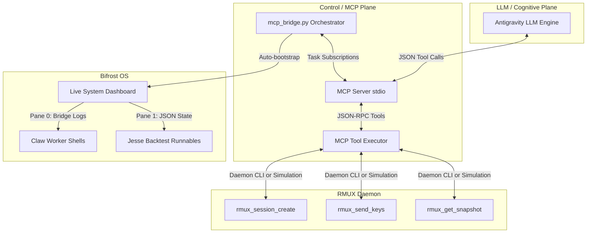

# 🏛️ AGE REPUBLIC: KNOWLEDGE ASSET (ERA 225.0)
## Identifier: `00_KNOWLEDGE/323_REPUBLIC_RMUX_INTEGRATION_MAP`
## Theme: Unified RMUX Sovereign Integration Architecture (Bifrost & MCP Map)

---

> [!IMPORTANT]
> **INTEGRATION ARCHITECTURE BLUEPRINT:**
> This manifest defines how the **RMUX** terminal multiplexing daemon is connected natively to the AGE REPUBLIC's **Model Context Protocol (MCP)** server, the **Sovereign Bridge Orchestrator**, and the **Bifrost OS** execution shell.

---

## 🗺️ I. Integration Architecture Map

The unified connection map spans three strategic planes of your sovereign infrastructure:



---

## 🛠️ II. The Three Connection Layers

### 1. The MCP Tool Layer (`04_SUBSTRATES/SOVEREIGN_TRADING/mcp_server.py`)
RMUX terminal control operations are now exposed directly as Model Context Protocol (MCP) tools:
* **`rmux_session_create`:** Spawns a named, detachable PTY shell inside the daemon.
* **`rmux_send_keys`:** Transmits raw keystrokes or complex scripts programmatically to active panes.
* **`rmux_get_snapshot`:** Queries text snapshots of active terminals to give the LLM engine perfect textual inspectability.
* **`rmux_list_sessions`:** Returns a structured list of active sessions.

> [!TIP]
> **Autonomic Fallback:** The executor detects the presence of the system `rmux` binary using `shutil.which`. If missing, it dynamically falls back to an in-memory **Simulated Sandbox** with detailed diagnostic warnings, ensuring the server starts cleanly under all conditions.

---

### 2. The Orchestrator Dashboard Layer (`11_UNSORTED/mcp_bridge.py`)
The main orchestrator (`mcp_bridge.py`) now features a dedicated **`_init_rmux_dashboard`** startup module. 

Upon ignition, the bridge checks for the `rmux` binary. If present, it kills any stale sessions and builds a multi-pane **Live System Dashboard** (`age-republic-bridge`):

* **Pane 0 (`0.0`):** Live Bridge Log Stream (`tail -f .claw_code/bridge.log`).
* **Pane 1 (`0.1`):** High-frequency System JSON State Monitor (`watch -n 1 cat .claw_code/bridge_state.json`).
* **Pane 2 (`0.2`):** Live Resource Monitor (`top` / `htop`).

```bash
# Command to attach and inspect from the host console:
rmux attach -t age-republic-bridge
```

---

### 3. The Bifrost OS Layer (`start_sovereign_bridge.sh`)
* Integrates loopback verification and secure LUKS sector mounting prior to invoking the Python orchestrator.
* Configures local python execution paths to target the correct virtual environments.
