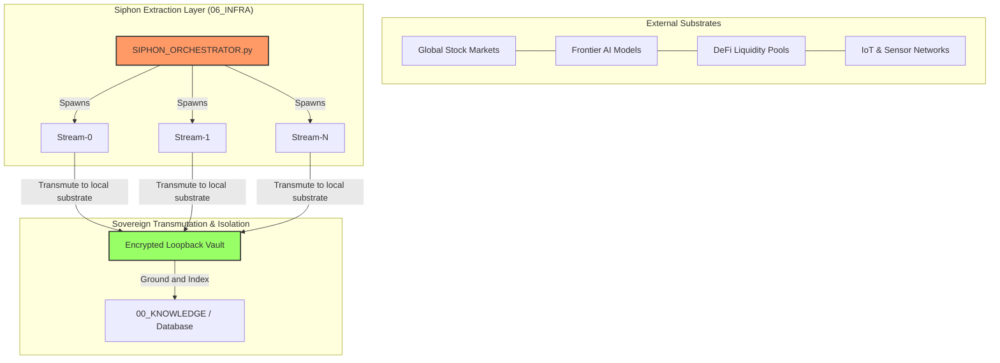

# 🏛️ Sovereign Siphon: Structural Architecture & Manifold Mapping

The **Sovereign Siphon** represents the core resource-extraction, intelligence-ingestion, and cross-border liquidity-harvesting paradigm of the **Age Republic Sovereign Cockpit**. The structural architecture governs how the cockpit securely queries, aggregates, and transutes external substrates into secure, local-domain knowledge.

---

## 1. 🌐 The Siphon Architectural Model (KISS)

At its structural core, a **Siphon** acts as a multi-threaded parallel consumer that detaches host dependencies, queries remote or local networks under a sandboxed state, transmutes the ingested raw entropy, and commits the output directly to the secure loopback (`00_KNOWLEDGE/` or RAM-backed `tmpfs`).



---

## 2. 🧠 Cognitive Siphon Architecture (The Cortex & The Hand)

Implemented in `06_INFRA/LLM_COGNITIVE_SIPHON_ORCHESTRATOR.py`, this layer acts as the **intelligence aggregator** of the Republic, executing high-speed, sub-second extraction queries across 30+ frontier AI models.

### Structural Flow of Cognitive Ingestion:

1.  **Cortex Engine (`ModelSiphon`):**
    *   Generates authenticated API queries targeting frontier nodes (`GPT-5`, `Claude 4 Opus`, `Gemini 3 Pro`, `DeepSeek V3`).
    *   Ingests logical reasoning steps and raw cognitive outputs.
2.  **Hand Orchestrator (`AgencyOrchestrator`):**
    *   Distributes the raw intelligence payload across a **700-node network ensemble** (such as specialized AI agents or consulting matrices).
    *   Reifies the models into practical, deterministic development instructions (e.g., automated vulnerability remediation, seccomp profiling).
3.  **State Consolidation Loop:**
    *   Locks thread states to protect against race conditions during high-concurrency ingestion.
    *   Outputs atomic real-time updates directly to `06_INFRA/cognitive_siphon_state.json`.

---

## 3. 📂 Active Siphon Structural Matrix

Each operational siphon comprises a declarative specification in `00_KNOWLEDGE/` mapped to an active microservice engine in `06_INFRA/`:

| System ID | Siphon Target Domain | Specification Document | Active Ingestion Engine |
| :--- | :--- | :--- | :--- |
| **[328]** | US Equities Markets | `328_US_EQUITIES_SOVEREIGN_SIPHON.md` | `US_EQUITIES_SOVEREIGN_ENGINE.py` |
| **[329]** | Asian Equities Markets | `329_ASIAN_EQUITIES_SOVEREIGN_SIPHON.md` | `ASIAN_EQUITIES_SOVEREIGN_ENGINE.py` |
| **[330]** | European Equities Markets | `330_EUROPEAN_EQUITIES_SOVEREIGN_SIPHON.md` | `EUROPEAN_EQUITIES_SOVEREIGN_ENGINE.py` |
| **[331]** | Global Centralized Exchanges | `331_GLOBAL_CEX_SOVEREIGN_SIPHON.md` | `GLOBAL_CEX_SOVEREIGN_ENGINE.py` |
| **[333]** | Decentralized Exchanges | `333_DECENTRALIZED_EX_SOVEREIGN_SIPHON.md` | `DECENTRALIZED_EX_SOVEREIGN_ENGINE.py` |
| **[337]** | Private Equity & Banking | `337_PRIVATE_EQUITY_BANKING_SOVEREIGN_SIPHON.md` | `PRIVATE_EQUITY_BANKING_SOVEREIGN_ENGINE.py` |
| **[338]** | Retail Supply & Logistics | `338_RETAIL_LOGISTICS_SOVEREIGN_SIPHON.md` | `RETAIL_LOGISTICS_SOVEREIGN_ENGINE.py` |
| **[363]** | Vacation Rentals | `363_VACATION_RENTAL_SOVEREIGN_SIPHON.md` | `VACATION_RENTAL_SOVEREIGN_ENGINE.py` |

---

## 4. 🛠️ Code Execution: Multi-Threaded Parallel Extractor

This simplified, zero-dependency parallel stream runner from `SIPHON_ORCHESTRATOR.py` showcases how extraction streams isolate network tasks to ensure zero thread-blocking during heavy I/O operations:

```python
import threading
import time
import random
from queue import Queue

class SiphonStream(threading.Thread):
    def __init__(self, stream_id, queue):
        super().__init__()
        self.stream_id = stream_id
        self.queue = queue
        self.active = True

    def run(self):
        while self.active:
            target = self.queue.get()
            if target is None:
                break
            # Parallel extraction simulation
            print(f"📡 [Stream-{self.stream_id}] Siphoning: {target}")
            time.sleep(random.uniform(0.5, 2.0))
            print(f"✅ [Stream-{self.stream_id}] Transmuted payload: {target}")
            self.queue.task_done()
```

---

## 5. 🛡️ Security Boundaries of the Ingestion Pipeline

To prevent siphons from leaking host telemetry or exposing the workspace, the following structural boundaries are enforced:

1.  **Network Isolation:** All engine endpoints are routed through local loopback binds (`127.0.0.1`) and proxied through encrypted, authenticated VPN/Tor socks interfaces.
2.  **Memory Buffering:** Sensitive raw siphoned payloads are stored strictly in `tmpfs` (RAM-backed storage), preventing forensic recovery of transient API keys, certificates, or unencrypted data.
3.  **Process Decoupling:** Siphoning engines run inside rootless namespaces, detached from host privilege levels, to protect the guest OS from escape exploits.
