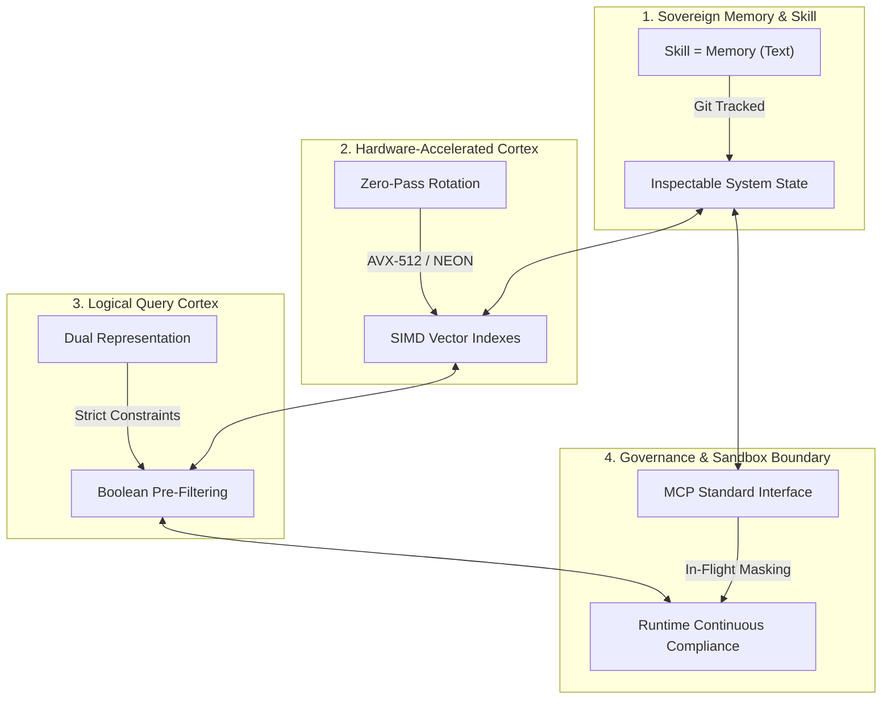

# 🏛️ AGE REPUBLIC: KNOWLEDGE ASSET (ERA 225.0)
## Identifier: `00_KNOWLEDGE/328_REPUBLIC_QUAD_SYSTEMS_PHILOSOPHY`
## Theme: The Quad-Systems Philosophy (The Four Pillars of Sovereign Agentic DevOps)

---

> [!IMPORTANT]
> **MASTER SYSTEMS ARCHITECTURE BLUEPRINT:**
> This manifest formalizes the ultimate multi-dimensional comparison of the four pillars of the AGE REPUBLIC sovereign infrastructure: **Acontext**, **Turbovec**, **Context-Aware Semantic Search**, and **Agentic Compliance**. It defines how these paradigms resolve their tensions to guide engineering leaders in constructing highly resilient, performant, and compliant agentic systems.

---

## 🧭 I. The Four Pillars of the Sovereign Matrix

To run a secure, fast, and self-improving autonomous trading and execution desk, the AGE REPUBLIC relies on four pillars that govern separate dimensions of systems execution:

---

## 🏛️ II. The Four-Way Philosophical Matrix

| Dimension / System | 🧠 Acontext (Memory) | ⚡ Turbovec (Hardware) | 🎛️ Context-Aware Search (Query) | 🛡️ Agentic Compliance (Sandbox) |
| :--- | :--- | :--- | :--- | :--- |
| **Core Axiom** | *"Skill is Memory, Memory is Skill"* | *"Math replaces k-means training"* | *"Filter first, score second"* | *"Compliance must be the path of least resistance"* |
| **Primary Domain** | Task State & Programmatic Execution. | Low-latency vector database lookups. | Dynamic, hybrid document indexing. | Pipeline Sandbox Boundaries & Security. |
| **Data Medium** | Git-portable Markdown files. | Bit-packed unit vectors on a hypersphere. | Normalized embeddings + relational metadata. | Virtualized, masked, and synthetic environments. |
| **View on Autonomy** | Self-improving through distillation loops. | Autonomous incremental adds without re-calibration. | Silo-breaking cross-team conceptual discovery. | Continuous machine-speed operations without human gates. |
| **Core Efficiency Claim** | Epistemic pruning: drop raw traces, save active skills. | SIMD register-level block short-circuit filtering. | Reducing matrix dimensions before dot products. | Virtualized clones spun up and torn down in under 90 seconds. |
| **Locality Vector** | Portable file hierarchies on the local filesystem. | Local AVX-512 / NEON assemblies; zero data egress. | Offline CPU transformer models; zero network dependency. | Isolated sandboxes, loopback mounts, and local proxy filters. |

---

## 🔬 III. Core Philosophical Tensions & Sovereign Resolutions

### 1. Opaque Embeddings (Turbovec/Context) vs. Inspectable Files (Acontext)
* **The Conflict:** Acontext rejects embeddings as complex, opaque black-boxes that hide state. Turbovec and Context-Aware Search argue that raw text-matching fails on synonym and concept boundaries.
* **The Resolution:** *Epistemic Stratification.* Use Acontext at the **Executive Control Plane** (representing plans, active strategies, and audited codes). Use Turbovec at the **Sensory Storage Plane** (indexing long-term conversations, logs, and background papers). The Executive Plane remains 100% transparent and inspectable, but uses the Sensory Plane for conceptual context retrieval.

### 2. Analytical Projection (Turbovec) vs. Logical Pre-Filtering (Context-Aware)
* **The Conflict:** Context-Aware Search uses Python boolean masking to filter out-of-text variables before scoring. Turbovec claims that standard high-level masking ruins SIMD register pipelines, arguing that filtering must happen *inside* the SIMD loops at 32-vector block boundaries.
* **The Resolution:** *Hardware-Aware Pipelining.* For high-level, slow, multi-attribute complex queries, use high-level Python metadata pre-filtering. For massive production-scale high-throughput vector scans (exceeding $100\text{k}$ entries), compile and dispatch queries to Turbovec's block-short-circuit SIMD assembly.

### 3. Continuous Execution (Acontext/DevOps) vs. Sandboxed Isolation (Compliance)
* **The Conflict:** Continuous integration and rapid iteration encourage massive deployment proliferation. However, every new testing agent sandbox is a potential exposure vector for sensitive or proprietary system assets.
* **The Resolution:** *Dynamic Virtualization & Synthetic Mocks.* Intercept all database requests inside the Model Context Protocol (MCP) bridge. If an agent requests data, dynamically spin up a masked database container or procedurally generate synthetic edge cases, execute the task, and tear the environment down. **The compliance enforcement is integrated directly into the API.**

---

## 🏛️ IV. The Master Unifying Axioms

The integration of these four systems yields three foundational axioms of sovereign development:

### 1. Design for Machine Speed, Not Human Approval
Manual governance approval pipelines (approval committees, downstream reviews) fail immediately in the agentic era. Build policy decision engines directly into your APIs and MCP bridges to execute compliance dynamically at runtime.

### 2. Never Compute What You Will Discard
Whether you are applying Acontext skill pruning, Turbovec register filtering, or Context-Aware relational masking, enforce constraints at the earliest possible stage in your pipelines.

### 3. Mask, Mock, and Virtualize at the Boundary
Keep production data isolated behind secure loopback bounds (`/dev/mapper/age_republic`). Provide agents with virtualized, masked, and synthetic environments through a standardized conversational MCP interface.
