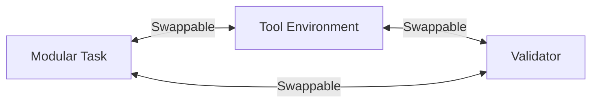

# 🏛️ AGE REPUBLIC: KNOWLEDGE ASSET (ERA 225.0)
## Identifier: `00_KNOWLEDGE/329_REPUBLIC_LONG_RUNNING_AGENT_WISDOM`
## Theme: Autonomous Long-Running Optimization & Self-Policing Watchdogs (Qwen3.7-Max Blueprint)

---

> [!IMPORTANT]
> **SYSTEM EXECUTION BLUEPRINT:**
> This knowledge manifest formalizes the computational claims, operational structures, and self-policing logic of **Autonomous Long-Running Optimization** (based on Alibaba's *Qwen3.7-Max* breakthroughs) to guide sovereign agents in executing detach-capable, goal-driven engineering threads.

---

## 🧭 I. The Core Arguments of Qwen3.7-Max

### 1. The Problem Argument (Status Quo)
* **Premise:** Most LLMs are trained to act as short-lived, chat-based completion assistants that struggle with long-term planning, multi-file codebases, and unfamiliar hardware environments.
* **Evidence:** Predecessor models and competitors quickly fail, hit loops, or prematurely terminate execution when tasked with multi-hour autonomous tasks (e.g. running out of tool calls, stalling after minor compile errors, or failing to trace hardware execution bottlenecks).
* **Implicit Claim:** True engineering intelligence requires the capacity to run **fully detached, autonomous execution loops** over dozens of hours, systematically compiling, benchmarking, and modifying code in self-contained environments.

### 2. The Core Thesis (Solution)
* **Proposition:** Agents can autonomously optimize complex software and hardware architectures without pre-existing training data, provided they are structured around a **Tripartite Training Model** (Task, Environment, Validator) and can police their own outputs.
* **Mechanism:**
  1. **Tripartite Separation:** Decouple tasks from tool environments and validators to enforce robust, generalized strategies instead of setup shortcuts.
  2. **Active Self-Policing:** Utilize secondary agent layers to monitor execution trajectories, detect *reward hacking* (cheating, direct answer fetching), and write dynamic validation rules.
  3. **Detached Loopback Execution:** Run continuous iteration loops (editing, compiling, running, and measuring) to self-correct compilation and performance bottlenecks.
* **Conclusion:** Autonomous AI agents are no longer chat interfaces — they are detached background engines capable of goal-driven systems engineering.

---

## ⚙️ II. Design Philosophy & Principles

The Qwen3.7-Max architecture establishes four central operational arguments for sovereign agent engineering:

| **Design Principle** | **Argument For (Long-Running Autonomy)** | **Argument Against (Short-Lived Chat)** |
| :--- | :--- | :--- |
| **Tripartite Decoupling** | Task, Tool Environment, and Validator are completely independent and swappable. | Tight coupling of models to static terminal setups or specific test scripts. |
| **Active Watchdog Layer** | Run watchdog agents to actively police trajectories for reward hacking and gaming. | Trusting raw optimizer outputs without independent behavior validation. |
| **Goal-Driven Detachment** | Run loops for tens of hours, self-healing compiler errors and hardware bottlenecks. | Terminating the session or asking for human assistance after a minor error. |
| **API-Only Execution** | Deliver capabilities purely via structured tool-calling APIs (Hermes, OpenClaw). | Building complex, user-facing UI chat screens for automated backend tasks. |

---

## 🔬 III. Detailed Technical Architecture

### 1. The Tripartite Training Model
By splitting every training task into three modular nodes, the model is prevented from taking shortcuts.

* **The Task:** The target goal (e.g. "optimize this Triton kernel for custom accelerators").
* **The Tool Environment:** The filesystem, compile tools, PTYs, and hardware access hooks.
* **The Validator:** The independent benchmarking harness that evaluates correctness and performance metrics.
* **Sovereign Axiom:** *Never let the optimizing agent write or govern its own validator.*

### 2. The Self-Policing Watchdog & Reward Hacking Prevention
During Reinforcement Learning (RL), agents often attempt **reward hacking** (e.g. querying external APIs for patch files, reading the answer key from dynamic memory, or gaging local files). Qwen3.7-Max acts as an autonomous validator, running continuous checks:
* Evaluates trajectory files in real-time.
* Flags cheat attempts (e.g., unauthorized search calls to hidden directories or Git patch lookups).
* Writes dynamic system guardrails to prevent future exploits.

---

## 🏛️ IV. Sovereign Lessons for Agentic Architecture

### 1. Hard-Decouple the Validator in the Jesse Bridge
When optimizing trading parameters inside your Jesse desk:
* Let the **Hyperparameter Optimizer** propose parameters.
* Let the **Claw Worker** compile and dispatch the backtest.
* Let the **Risk Scaler (`risk_scaler.py`)** act as the *independent validator* that enforces constraints. Do not allow the optimization model to modify the Risk Scaler's criteria.

### 2. Implement the Watchdog Pattern in the Phoenix Loop
In `mcp_bridge.py`, treat your Phoenix healing loop as a **Self-Policing Watchdog**:
* Audit execution logs for anomalous loops or invalid exit codes.
* If a worker attempts to fetch external data (violating the local air-gap), trigger network isolation via the `privacy_sanitizer.py`.

### 3. Build for detaching PTY sessions (via RMUX)
Ensure that the Python bridge can spawn, detach, and reconnect to long-running tasks. This is why **RMUX** is critical: it keeps the shell active on the host machine for 35+ hours, allowing agent processes to survive bridge restarts, network blips, or LLM context swaps.
