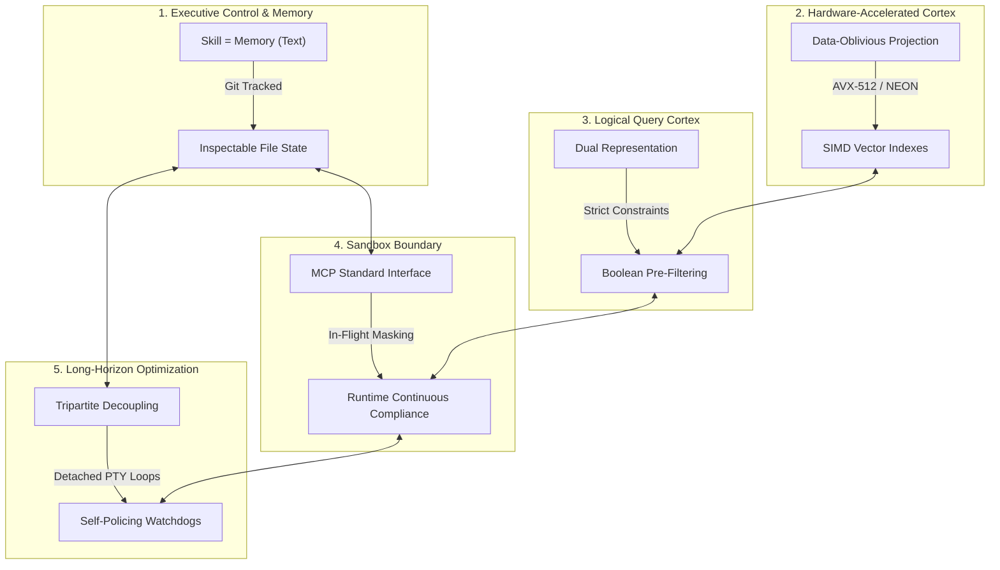

# 🏛️ AGE REPUBLIC: KNOWLEDGE ASSET (ERA 225.0)
## Identifier: `00_KNOWLEDGE/330_REPUBLIC_PENTAD_SYSTEMS_PHILOSOPHY`
## Theme: The Sovereign Pentad (The Five Foundations of Agentic Autonomy)

---

> [!IMPORTANT]
> **MASTER SYSTEMS BLUEPRINT:**
> This manifest formalizes the ultimate multi-dimensional comparison of the five pillars of the AGE REPUBLIC sovereign infrastructure: **Acontext**, **Turbovec**, **Context-Aware Semantic Search**, **Agentic Compliance**, and **Qwen3.7-Max Long-Horizon Autonomy**. It defines the complete systems engineering synthesis for designing resilient, performant, secure, and self-improving agentic swarms.

---

## 🧭 I. The Five Foundations of the Sovereign Matrix

To run a secure, fast, and self-improving autonomous trading and execution desk, the AGE REPUBLIC relies on five pillars that govern separate dimensions of systems execution:

---

## 🏛️ II. The Five-Way Philosophical Matrix

| Dimension / System | 🧠 Acontext | ⚡ Turbovec | 🎛️ Context-Aware Search | 🛡️ Agentic Compliance | 🌐 Qwen3.7-Max |
| :--- | :--- | :--- | :--- | :--- | :--- |
| **Core Axiom** | *"Skill is Memory, Memory is Skill"* | *"Math replaces k-means training"* | *"Filter first, score second"* | *"Compliance must be the path of least resistance"* | *"Autonomy is measured in hours, not turns"* |
| **Primary Domain** | Task State & Programmatic Execution. | Low-latency vector database lookups. | Dynamic, hybrid document indexing. | Pipeline Sandbox Boundaries & Security. | Long-horizon engineering & optimization. |
| **Data Medium** | Git-portable Markdown files. | Bit-packed unit vectors on a hypersphere. | Normalized embeddings + relational metadata. | Virtualized, masked, and synthetic environments. | Triton code, execution traces, and benchmark data. |
| **View on Autonomy** | Self-improving through distillation loops. | Autonomous incremental adds without re-calibration. | Silo-breaking cross-team conceptual discovery. | Continuous machine-speed operations without human gates. | Fully detached multi-hour execution via persistent PTYs (e.g. RMUX). |
| **Core Efficiency Claim** | Epistemic pruning: drop raw traces, save active skills. | SIMD register-level block short-circuit filtering. | Reducing matrix dimensions before dot products. | Virtualized clones spun up and torn down in under 90 seconds. | Tripartite decoupling (Task, Tool, Validator) forces transferable strategies. |
| **Locality Vector** | Portable file hierarchies on the local filesystem. | Local AVX-512 / NEON assemblies; zero data egress. | Offline CPU transformer models; zero network dependency. | Isolated sandboxes, loopback mounts, and local proxy filters. | Unfamiliar hardware architectures optimized via pure experimentation. |
| **Self-Policing/Uptime** | Human-in-the-loop file git audit logs. | Mathematically bound Lloyd-Max boundaries. | Pre-filters remove invalid candidates. | Dynamic proxies monitor in-flight API traffic. | Secondary watchdog agents monitor RL runs for reward hacking. |

---

## 🔬 III. Core Philosophical Tensions & Sovereign Resolutions

### 1. Transparency (Acontext) vs. Deep Optimization (Qwen3.7-Max)
* **The Conflict:** Acontext argues that complex, opaque, multi-turn AI reasoning traces are hard to debug and should be distilled into plain files. Qwen3.7-Max proves that deep systems optimization requires running 35+ hours of continuous, multi-turn experiments, compiling code, and tracing execution errors in a loop.
* **The Resolution:** *Detached Experimentation, Structured Distillation.* Allow the agent to operate in a detached, multi-turn experimental environment (managed securely inside an **RMUX session**) for long horizons. Once a successful optimization or code fix is achieved, trigger the **Acontext Distillation Loop** to prune the 35 hours of traces into a single, highly clean, versionable, and human-readable Markdown file (`SKILL.md`). This combines the raw execution capacity of a deep model with the ultimate inspectability of clean code.

### 2. Analytical Projection (Turbovec) vs. Tripartite decoupling (Qwen3.7-Max)
* **The Conflict:** Turbovec achieves optimal, data-oblivious quantization without k-means calibration, leveraging mathematical distributions. Qwen3.7-Max relies on decoupling Tasks, Tool Environments, and Validators, allowing the model to learn transferable methodologies across highly dynamic execution setups.
* **The Resolution:** *Math-Guided Generalization.* Use analytical constants and data-oblivious models (like Turbovec) to handle indexing, removing computational overhead. Keep the higher-level engineering setups (like coding tasks) tripartite-decoupled, using separate validation nodes to audit correctness across environments.

### 3. Continuous Runtime Compliance (Agentic Compliance) vs. Self-Policing Watchdogs (Qwen3.7-Max)
* **The Conflict:** Agentic Compliance enforces data-level policies at the API proxy level (e.g. masking records in a sandbox). Qwen3.7-Max polices *behavior-level* compliance, actively auditing trajectory traces for reward hacking and generating new system rules to block cheating.
* **The Resolution:** *Dual-Layer Sentinel.*
  * **Layer 1 (Data-Level):** Use MCP proxies and virtualization (Agentic Compliance) to ensure the agent physically cannot access unmasked production data.
  * **Layer 2 (Behavior-Level):** Use secondary Watchdog agents (Qwen3.7-Max) to inspect execution traces and verify that the optimizing agent is solving the problem rather than finding system cheats or reward-hacking loops.

---

## 🏛️ IV. The Master Unifying Axioms of the Sovereign Pentad

### 1. Build for Persistence and Recovery (Autonomy is Horizon-Bound)
A sovereign agent must be capable of surviving blips, compile errors, and context limits. Structure your processes to run inside detachable terminal sessions (**RMUX**), compiling, testing, and self-healing autonomously.

### 2. Decouple Task from Verification
Never let the optimizing engine run or govern its own testing harness. Always keep the validator strictly separated from the execution sandbox, evaluating outputs against deterministic risk thresholds and constraint matrices.

### 3. Shift Computation to Ingest and Distillation
Avoid query-time overhead by performing $L_2$ vector normalization and calculating bias-correction scalars once at ingest. Drop raw execution traces at completion, distilling long-horizon experiments into structured, human-readable file states.
