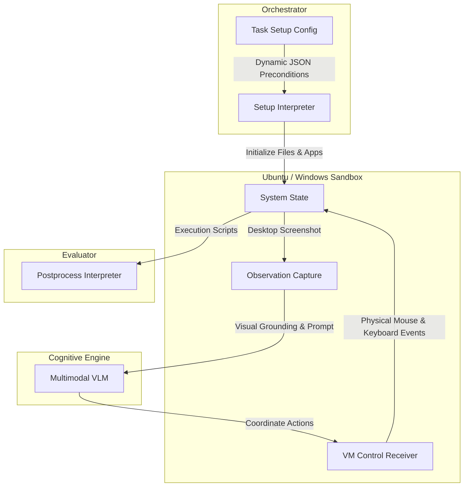

# 🏛️ AGE REPUBLIC: KNOWLEDGE ASSET (ERA 225.0)
## Identifier: `00_KNOWLEDGE/331_REPUBLIC_OSWORLD_BENCHMARK_WISDOM`
## Theme: Multimodal GUI Grounding & OS-Level Agent Orchestration (OSWorld Blueprint)

---

> [!IMPORTANT]
> **SYSTEM BENCHMARK BLUEPRINT:**
> This knowledge manifest formalizes the environment claims, architectural configurations, and multimodal GUI grounding wisdom of **OSWorld** (Benchmarking Multimodal Agents on Open-Ended Computer Tasks) to guide sovereign agents in executing OS-level workspace interactions.

---

## 🧭 I. The Core Arguments of OSWorld

### 1. The Problem Argument (Status Quo)
* **Premise:** Conventional AI agent evaluations are restricted to toy sandboxes, text-only terminal shells, or static web scrapes.
* **Evidence:** MiniWoB++ or WebShop fail to capture the complex, multi-application reality of real human computer usage, which requires cross-app coordination and GUI-level visual reasoning.
* **Implicit Claim:** A truly generalized autonomous agent must operate at the **operating system level**—navigating desktop workspaces, terminal sessions, file systems, and web browsers simultaneously using visual observations (screenshots) and keyboard/mouse actions rather than relying solely on APIs or DOM structural representations.

### 2. The Core Thesis (Solution)
* **Proposition:** A robust, general-purpose computer agent must be evaluated inside real operating systems running full application suites, utilizing unified execution-based grading rather than soft, LLM-based grading.
* **Mechanism:**
  * **OS Virtualization Platform:** Orchestrate guest VMs (Ubuntu, Windows, macOS) using an isolated **VM Control Receiver** that translates coordinates into actual system events.
  * **Visual Grounding Loop:** Provide the agent with desktop screenshots, accessibility trees, and system logs, requiring the model to click on precise pixel coordinates.
  * **Execution-Based Evaluators:** Verify the task's final state by checking files, configurations, and database changes directly inside the OS (continuous runtime validation).
* **Conclusion:** The ultimate computer agent must master visual grounding, multi-app workspace workflows, and long-horizon OS planning.

---

## ⚙️ II. Design Philosophy & Principles

The OSWorld infrastructure establishes four central arguments for OS-level execution design:

| **Design Principle** | **Argument For (OS-Level Generalization)** | **Argument Against (Siloed Sandboxes)** |
| :--- | :--- | :--- |
| **Multimodal GUI Grounding** | Predict click and scroll actions as raw coordinate values on high-resolution screenshots. | Depending on structured HTML/XML DOM structures or dedicated API endpoints. |
| **Execution-Based Grading** | Validate success via independent OS-level bash scripts checking final system states. | Relying on soft LLM-based grading or simple exact-match string outputs. |
| **Multi-App Workflows** | Enable agents to cross boundaries between LibreOffice, browsers, VS Code, and terminals. | Restricting tasks to a single browser window or isolated terminal session. |
| **Intermediate State Initialization** | Dynamically pre-configure files, folders, and browser cookies before launching a task. | Booting every task in a completely blank, sterile system state. |

---

## 🔬 III. Detailed Technical Architecture

The OSWorld execution pipeline decouples state orchestration from model inference:

---

## 🏛️ IV. Sovereign Lessons for Agentic Architecture

### 1. Shift to Multimodal Workspace Observability
While text-only APIs (like MCP) are highly efficient, sovereign interfaces (such as your **DREAM IDE Cockpit**) require multimodal observability. Combine PTY terminal text buffers with high-resolution canvas screenshots to allow agents to ground their actions in real visual contexts.

### 2. Implement Execution-Based State Verification
Never trust an agent's claim of completion. Adopt the OSWorld post-process methodology: write robust, local verification scripts (like `test_rmux_mcp.py` or `.bash` assert scripts) that independently query the file system, database records, or active system processes to verify that the task has been correctly resolved.

### 3. Build for Multi-Application Orchestration
Design agent workflows to be non-siloed. Structure your MCP bridges to allow agents to seamlessly transition between terminal executions (via **RMUX**), file manipulations (via **Acontext**), and external network proxy checks (via **PrivacySanitizer**).
