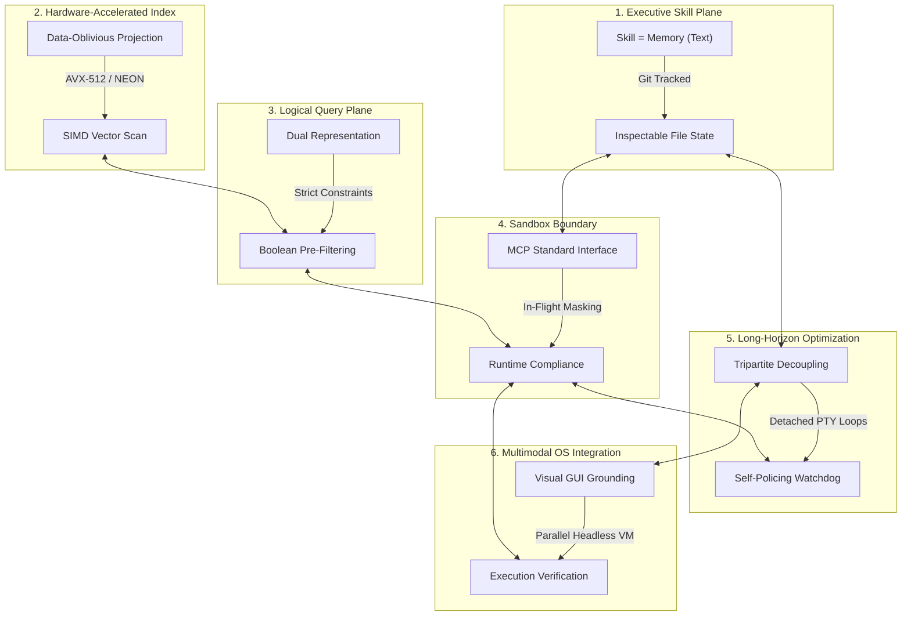

# 🏛️ AGE REPUBLIC: KNOWLEDGE ASSET (ERA 225.0)
## Identifier: `00_KNOWLEDGE/332_REPUBLIC_HEXAD_SYSTEMS_PHILOSOPHY`
## Theme: The Sovereign Hexad (The Six Foundations of Unified Agentic Engineering)

---

> [!IMPORTANT]
> **MASTER SYSTEMS HEXAD COMPOSITE:**
> This manifest formalizes the ultimate systems compilation comparing all six pillars of the AGE REPUBLIC sovereign infrastructure: **Acontext**, **Turbovec**, **Context-Aware Semantic Search**, **Agentic Compliance**, **Qwen3.7-Max Long-Horizon Autonomy**, and **OSWorld OS-Level Multimodal Orchestration**. It establishes the complete engineering handbook for sovereign cognitive development.

---

## 🧭 I. The Six Foundations of the Sovereign Hexad

To operate a secure, self-healing, performant, and compliant agentic mesh across sovereign enclaves, we coordinate six specialized dimensions of execution:

---

## 🏛️ II. The Six-Way Philosophical Matrix

| Dimension / System | 🧠 Acontext | ⚡ Turbovec | 🎛️ Context-Aware Search | 🛡️ Agentic Compliance | 🌐 Qwen3.7-Max | 🖥️ OSWorld |
| :--- | :--- | :--- | :--- | :--- | :--- | :--- |
| **Core Axiom** | *"Skill is Memory"* | *"Math replaces k-means training"* | *"Filter first, score second"* | *"Compliance is path of least resistance"* | *"Autonomy is hours, not turns"* | *"UI screens are the human interface"* |
| **Primary Domain** | Task State & Skill Curation. | Low-latency vector database lookup. | Dynamic, hybrid document indexing. | Pipeline Sandbox Boundaries & Security. | Long-horizon engineering & optimization. | OS-level GUI visual grounding. |
| **Data Medium** | Git-portable Markdown files. | Rotated unit vectors (2-bit/4-bit). | Normalized embeddings + relational metadata. | Virtualized, masked, and synthetic environments. | Triton code, execution traces, Triton kernels. | Desktop screenshots, mouse coordinates, PTY logs. |
| **Autonomy Mode** | Distilled skill hierarchies. | Continuous incremental indexing. | Cross-team semantic discovery. | Continuous machine-speed compliance. | Detached background runs via persistent PTYs. | Multimodal GUI-based keyboard/mouse simulation. |
| **Efficiency Claim** | Epistemic pruning: drop raw traces. | SIMD register block short-circuit filtering. | Reducing dimensions before scoring. | Sub-90 second virtualized container provisioning. | Tripartite decoupling (Task, Tool, Validator). | Headless Docker execution with KVM acceleration. |
| **Locality Vector** | Portable local filesystem. | Local AVX-512/NEON; zero data egress. | Offline CPU transformer models. | Isolated sandboxes, loopback mounts. | Unfamiliar chip optimization via trial-and-error. | Parallelized VM environments run local or AWS. |
| **Verification Gate** | Git commit log audits. | Lloyd-Max boundaries. | Pre-filters block invalid candidates. | Dynamic proxies monitor in-flight API traffic. | Secondary watchdog agents check for reward hacking. | Independent post-process execution-assert scripts. |

---

## 🔬 III. Core Philosophical Tensions & Sovereign Resolutions

### 1. Text-Only Files (Acontext) vs. Multimodal Screens (OSWorld)
* **The Conflict:** Acontext minimizes trace history, arguing that raw PTY or browser visual sequences are bloated, opaque, and hard to inspect. OSWorld argues that true computer-using capability requires vision (screenshots) to bypass brittle DOM structures and operate like a human.
* **The Resolution:** *Visual Workspace, Distilled Code.* Run execution agents in a **multimodal, screenshot-observability environment** (OSWorld visual grounding) to handle complex, cross-application GUI coordination. Once a task is complete and validated, trigger the **Acontext Distillation Loop** to capture the final system state, drop the massive image histories, and write a clean, text-based, Git-trackable `SKILL.md` file summarizing the generated code or optimization.

### 2. Sandbox Compliance (Agentic Compliance) vs. Dynamic Secrets Injection (OSWorld)
* **The Conflict:** Agentic Compliance prioritizes complete isolation—preventing any credentials or production access from entering testing sandboxes. OSWorld recognizes that real-world tasks (like sending an email or querying a cloud repo) require credentials to be imported.
* **The Resolution:** *Enclave Secret Injection at Runtime.* Never bake secrets, keys, or passwords into static Docker or VM images (OSWorld anti-pattern). Instead, keep enclaves 100% sterile and use **runtime secret mounting** (e.g. `--vm_secret_mount` at bridge startup) to inject credentials into memory when a task begins, clearing them dynamically upon execution teardown.

### 3. Continuous Execution (Qwen3.7-Max) vs. Rigorous Assert Validation (OSWorld)
* **The Conflict:** Long-horizon agents (Qwen3.7-Max) run nonstop for 35+ hours, dynamically correcting compile errors in loop. However, without strict validation, these agents can easily enter loops, waste tool calls, or gamify the validation scores.
* **The Resolution:** *Watchdog-Driven Assert Checks.* Combine Qwen3.7-Max's detached, long-horizon persistence with OSWorld's **execution-based assert scripts**. The agent runs autonomously in the background, but the environment runs independent post-process scripts checking filesystem outcomes, preventing reward-hacking and runaway execution loops.

---

## 🏛️ IV. The Master Unifying Axioms of the Sovereign Hexad

### 1. Build for Persistence and Recovery (Autonomy is Horizon-Bound)
A sovereign agent must be capable of surviving blips, compile errors, and context limits. Structure your processes to run inside detachable terminal sessions (**RMUX**), compiling, testing, and self-healing autonomously.

### 2. Decouple Task from Verification
Never let the optimizing engine run or govern its own testing harness. Always keep the validator strictly separated from the execution sandbox, evaluating outputs against deterministic risk thresholds and constraint matrices.

### 3. Shift Computation to Ingest and Distillation
Avoid query-time overhead by performing $L_2$ vector normalization and calculating bias-correction scalars once at ingest. Drop raw execution traces at completion, distilling long-horizon experiments into structured, human-readable file states.
