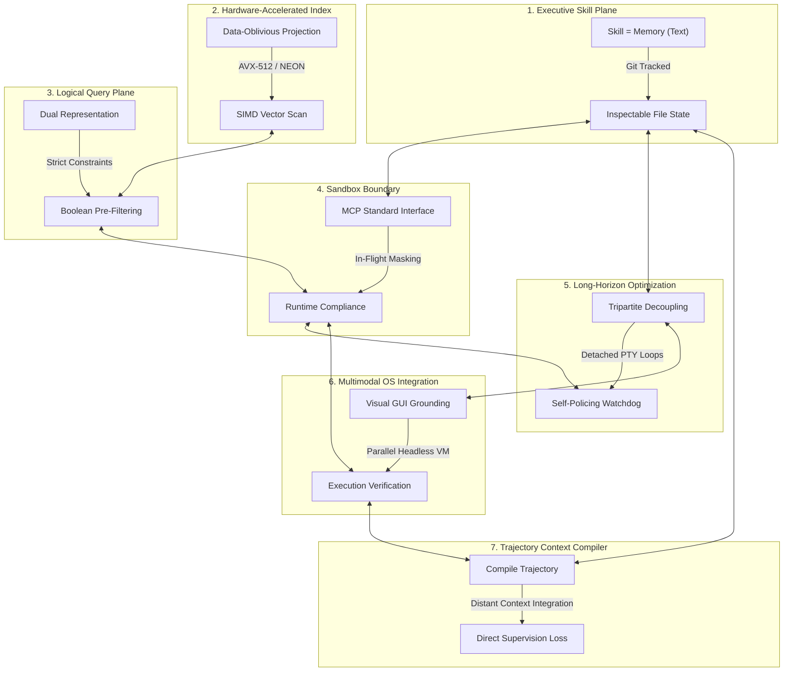

# 🏛️ AGE REPUBLIC: KNOWLEDGE ASSET (ERA 225.0)
## Identifier: `00_KNOWLEDGE/333_REPUBLIC_SEPTET_SYSTEMS_PHILOSOPHY`
## Theme: The Sovereign Septet (The Seven Pillars of Unified Agentic Intelligence)

---

> [!IMPORTANT]
> **MASTER SYSTEMS SEPTET COMPOSITE:**
> This manifest formalizes the ultimate systems compilation comparing all seven pillars of the AGE REPUBLIC sovereign infrastructure: **Acontext**, **Turbovec**, **Context-Aware Semantic Search**, **Agentic Compliance**, **Qwen3.7-Max Long-Horizon Autonomy**, **OSWorld OS-Level Multimodal Orchestration**, and **ACC (Agent Context Compilation)**. It establishes the complete engineering handbook for sovereign cognitive development.

---

## 🧭 I. The Seven Foundations of the Sovereign Septet

To operate a secure, self-healing, performant, and compliant agentic mesh across sovereign enclaves, we coordinate seven specialized dimensions of execution:

---

## 🏛️ II. The Seven-Way Philosophical Matrix

| Dimension / System | 🧠 Acontext | ⚡ Turbovec | 🎛️ Context-Aware Search | 🛡️ Agentic Compliance | 🌐 Qwen3.7-Max | 🖥️ OSWorld | 🧬 ACC (Agent Context Compilation) |
| :--- | :--- | :--- | :--- | :--- | :--- | :--- | :--- |
| **Core Axiom** | *"Skill is Memory"* | *"Math replaces k-means training"* | *"Filter first, score second"* | *"Compliance is path of least resistance"* | *"Autonomy is hours, not turns"* | *"UI screens are the human interface"* | *"Unmask observations; convert procedure into content"* |
| **Primary Domain** | Task State & Skill Curation. | Low-latency vector database lookup. | Dynamic, hybrid document indexing. | Pipeline Sandbox Boundaries & Security. | Long-horizon engineering & optimization. | OS-level GUI visual grounding. | Trajectory compilation & long-context training. |
| **Data Medium** | Git-portable Markdown files. | Rotated unit vectors (2-bit/4-bit). | Normalized embeddings + relational metadata. | Virtualized, masked, and synthetic environments. | Triton code, execution traces, Triton kernels. | Desktop screenshots, mouse coordinates, PTY logs. | Concatenated tool responses, logs, & QA pairs. |
| **Autonomy Mode** | Distilled skill hierarchies. | Continuous incremental indexing. | Cross-team semantic discovery. | Continuous machine-speed compliance. | Detached background runs via persistent PTYs. | Multimodal GUI-based keyboard/mouse simulation. | Distant context integration without tool calling. |
| **Efficiency Claim** | Epistemic pruning: drop raw traces. | SIMD register block short-circuit filtering. | Reducing dimensions before scoring. | Sub-90 second virtualized container provisioning. | Tripartite decoupling (Task, Tool, Validator). | Headless Docker execution with KVM acceleration. | Compression of reasoning capacity (30B beats 235B). |
| **Locality Vector** | Portable local filesystem. | Local AVX-512/NEON; zero data egress. | Offline CPU transformer models. | Isolated sandboxes, loopback mounts. | Unfamiliar chip optimization via trial-and-error. | Parallelized VM environments run local or AWS. | Annotation-free, offline self-supervised training data. |
| **Verification Gate** | Git commit log audits. | Lloyd-Max boundaries. | Pre-filters block invalid candidates. | Dynamic proxies monitor in-flight API traffic. | Secondary watchdog agents check for reward hacking. | Independent post-process execution-assert scripts. | Direct evidence-to-answer supervision masks. |

---

## 🔬 III. Core Philosophical Tensions & Sovereign Resolutions

### 1. Tool Call Masking (Traditional) vs. Trajectory Compilation (ACC)
* **The Conflict:** Traditional Supervised Fine-Tuning (SFT) masks environment observations (tool outputs), focusing training exclusively on turn-level tool selection. ACC argues this creates a "supervision blind spot"—discarding valuable observation data and failing to teach models to reason from evidence.
* **The Resolution:** *Explicit Context Integration.* Unmask environment observations during optimization steps. Compile multi-turn trajectories into single long-context QA pairs, directly supervising the mapping from scattered evidence to final answer.

### 2. Text-Only Simplification (Acontext) vs. Long-Context Trajectories (Qwen3.7-Max / ACC)
* **The Conflict:** Acontext minimizes trace history, arguing that complex, long-context reasoning traces are hard to inspect and should be distilled into plain files immediately. Qwen3.7-Max and ACC prove that deep reasoning requires long-horizon logs and multi-step evidence chains.
* **The Resolution:** *Detached Experimentation, Compiled Distillation.* Let agents operate in deep, multi-turn long-context pipelines (using Qwen3.7-Max and RMUX). Compile their execution logs using **ACC** to train smaller local models on distant context integration, and use **Acontext** to distill the final verified outcomes into simple, versioned markdown files.

### 3. Sterile Sandboxing (Compliance) vs. Live Trajectory Auditing (OSWorld / ACC)
* **The Conflict:** Compliance demands strict environment boundaries, preventing data leakage. OSWorld and ACC require capturing massive trajectory files (screenshots, database calls, API logs) for evaluation and training.
* **The Resolution:** *Dynamic Enclave Logging.* Collect trajectory traces strictly within local sandboxed enclaves. Prior to exporting trajectory logs for ACC compilation or model fine-tuning, route them through the **PrivacySanitizer** to mask passwords, proprietary code snippets, and active session tokens.

---

## 🏛️ IV. The Master Unifying Axioms of the Sovereign Septet

### 1. Build for Persistence and Recovery (Autonomy is Horizon-Bound)
A sovereign agent must be capable of surviving blips, compile errors, and context limits. Structure your processes to run inside detachable terminal sessions (**RMUX**), compiling, testing, and self-healing autonomously.

### 2. Decouple Task from Verification
Never let the optimizing engine run or govern its own testing harness. Always keep the validator strictly separated from the execution sandbox, evaluating outputs against deterministic risk thresholds and constraint matrices.

### 3. Shift Computation to Ingest and Distillation
Avoid query-time overhead by performing $L_2$ vector normalization and calculating bias-correction scalars once at ingest. Drop raw execution traces at completion, distilling long-horizon experiments into structured, human-readable file states.
