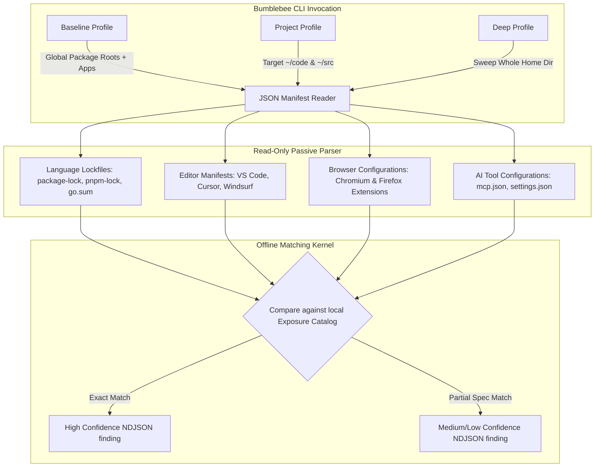

# 🏛️ AGE REPUBLIC: KNOWLEDGE ASSET (ERA 225.0)
## Identifier: `00_KNOWLEDGE/334_B_REPUBLIC_BUMBLEBEE_SECURITY_WISDOM`
## Theme: Read-Only Supply-Chain Endpoint Scanning & Static Metadata Curation (Bumblebee Blueprint)

---

> [!IMPORTANT]
> **SYSTEM COMPLIANCE & SECURITY BLUEPRINT:**
> This knowledge manifest formalizes the analytical claims, design philosophy, and performance wisdom of **Bumblebee** (Perplexity's open-source, read-only endpoint scanner) to guide sovereign agents in protecting local developer environments from supply-chain compromises without triggering malicious code execution.

---

## 🧭 I. The Problem Argument (Status Quo)

**Premise:** Attackers are shifting their primary focus away from hardened production environments to target developer workstations directly—poisoning local packages, editor extensions, browser add-ons, and AI tool configurations.

**Evidence from the article:**
> *"Attackers increasingly target the packages, editor extensions, and AI tool configs on developer machines and not just production systems... When a new vulnerability surfaces, your security team faces one urgent question: which developer machines are exposed right now?"*

**Implicit Claim:** Traditional security monitoring tools are blind to local developer workspace states. Software Bills of Materials (SBOMs) and repository scanners only cover CI/CD pipelines and static repositories. Endpoint Detection and Response (EDR) agents track active processes and network events, but completely miss the static on-disk risk footprint of uncompiled lockfiles, browser extensions, and local AI agent configs.

**The critical gap Bumblebee addresses:** The vulnerability of scanning developer endpoints using native package manager commands (e.g. `npm install` or version queries), which often invoke automatic lifecycle hooks and postinstall scripts—thereby **triggering the very supply-chain attack the scanner was searching for**. There is no existing tool that performs passive, read-only, non-executable metadata parsing across diverse package managers, browser plugins, editor extensions, and Model Context Protocol (MCP) host configs.

---

## 🏛️ II. The Core Thesis (Solution)

**Proposition:** Bumblebee is a read-only, zero-dependency Go scanner that inventories package manifests, editor extensions, browser plugins, and AI tool configs on developer workstations—evaluating exposure against an offline threat catalog with **zero process execution, zero network requests, and zero package manager invocations**.

**The three pillars of Bumblebee:**

| **Pillar** | **Implementation** | **Claimed Benefit** |
| :--- | :--- | :--- |
| **Strict Read-Only Parsing** | Zero package manager execution; directly parses lockfiles (`package-lock.json`, `pnpm-lock.yaml`, `go.sum`) and metadata files (`*.dist-info/METADATA`). | Prevents scan-triggered attacks by bypassing lifecycle/postinstall scripts entirely. |
| **Fleet-Wide Surface Scope** | Scans 8 package manager ecosystems, 4 editor suites, 6 browser families, and 7 MCP JSON config targets. | Consolidates disparate, multi-application endpoint auditing into a single, unified sweep. |
| **Zero-Dependency Go Core** | Written in pure Go with zero non-stdlib dependencies, compiled into a single static binary. | Eliminates the scanner dependency paradox; deploys instantly via cron, launchd, or MDM with zero setup. |

**Conclusion:** The runtime security of developer environments requires a zero-execution, static metadata collector. True endpoint compliance is achieved when security teams can audit the raw files on a developer's machine at machine-speed without running a single line of unverified script code.

---

## 🔬 III. Detailed Technical Architecture & Scan Surface

---

## 🚫 IV. The Anti-Arguments (What Bumblebee Rejects)

| **Rejected Practice** | **Bumblebee's Alternative** | **Architectural Rationale** |
| :--- | :--- | :--- |
| **Live Package Manager Invocations** | Parsing static metadata directly from lockfiles. | Executing `npm` or `pip` to check versions can trigger malicious postinstall scripts automatically. |
| **Vulnerable Runtime Libraries** | Strict standard-library Go code with 0 external dependencies. | Prevents the security scanner itself from introducing supply-chain vulnerabilities. |
| **Continuous EDR Process Sniffing** | One-shot scans executed via cron, systemd, or MDM schedules. | Minimizes endpoint CPU overhead, memory leaks, and background permission bloat. |
| **Cloud-Egress Log Transmission** | Structured NDJSON output routed entirely via standard out (`stdout`). | Eliminates vendor lock-in, data sovereignty violations, and external attack surfaces. |

---

## 📊 V. The Quantitative Claims & Technical Scope

### 1. Technical Baseline
* **Language Requirements:** Go 1.25 or later.
* **External Dependencies:** 0 non-stdlib Go libraries.
* **Current Release Version:** v0.1.1.
* **Licensing:** Apache License 2.0.

### 2. Scanning Coverage Matrix

| Category | Supported Ecosystems & Targets | File Patterns Parsed |
| :--- | :--- | :--- |
| **Language Packages** | npm, pnpm, Yarn, Bun, PyPI, Go modules, RubyGems, Composer | `package-lock.json`, `pnpm-lock.yaml`, `go.sum`, `*.dist-info/METADATA` |
| **AI Agent Configs** | MCP host JSON files, Gemini CLI configs | `mcp.json`, `mcp_config.json`, `claude_desktop_config.json`, `~/.gemini/settings.json` |
| **Editor Suites** | VS Code, Cursor, Windsurf, VSCodium | Extension manifest folders and configurations |
| **Browser Engines** | Chrome, Comet, Edge, Brave, Arc, Firefox | On-disk extension database profiles |

### 3. Exclusions & Limitations (v0.1)
* **Bun Binary Lockfiles:** `bun.lockb` is silently ignored; only the plain-text `bun.lock` is parsed.
* **Non-JSON AI Configs:** Codex `config.toml` and Continue YAML are not supported.
* **MCP Env Safeguard:** The JSON parser extracts server inventories but **never** emits environment variable keys or values stored in `env` blocks to prevent credential leakage.

---

## 🏛️ VI. The Philosophical Core (Seven Sentences)

1. **Security should never execute the attack** — a scanner that runs code to evaluate vulnerability has already surrendered the endpoint.
2. **Metadata is the ultimate ledger** — uncompiled lockfiles, configurations, and manifests hold all the evidence needed to verify compliance.
3. **Dependencies are a liability** — a security tool must be clean of the very supply-chain bloat it seeks to expose.
4. **Local state remains local** — structured NDJSON outputs let the endpoint owner control logging, keeping data egress zero.
5. **One-shot is clean execution** — permanent background daemons introduce memory leaks and performance drag; cron-scheduled runs are eternal.
6. **AI tool configurations are endpoints** — as agents acquire system keys and tools, their host configs (`mcp.json`) become vital elements of the threat catalog.
7. **Read-only is non-negotiable** — compliance checking must be a passive audit of existing files, never a write operation.

---

## 🧠 VII. Sovereign Lessons for Agentic Architecture

### 1. Adopt Zero-Execution Scanners for Agent Tool Curation
When a swarm agent evaluates a third-party package or MCP tool, **never** execute an install script or run a query command. Direct the agent to parse static lockfiles and manifest configurations directly, protecting local workspaces from malicious postinstall actions.

### 2. Keep the Security Kernel Dependency-Free
When writing custom system auditing tools (like `republic_audit.sh` or `.py` monitors), restrict code strictly to standard system libraries. Adding third-party modules introduces a recursion paradox where the auditor is compromised by the library it imports.

### 3. Actively Audit AI Agent Boundaries (`mcp.json`)
Sovereign enclaves must treat MCP JSON configs as highly sensitive perimeter configuration records. Monitor `claude_desktop_config.json` and `mcp.json` continuously to ensure no unapproved tools are wired into active LLM systems, while strictly sanitizing the environment `env` blocks from standard logs.

---

## 🐝 VIII. The Sovereign Python Implementation (Age Republic Bridge)

To fully internalize these security paradigms without introducing Go compilation toolchains or external binaries on air-gapped targets, the AGE REPUBLIC has codified a native, pure-Python security kernel mirroring the Bumblebee architecture:

### 1. Zero-Execution Native Python Scanner (`bumblebee_bridge.py`)
- **Ecosystems Swept**: Parses Node package-locks (`package-lock.json`), Python requirements (`requirements.txt`), Rust Cargo manifests (`Cargo.lock`), and MCP host definitions.
- **Read-Only Engine**: Utilizes python standard library parsers (`json`, `pathlib`, `re`) to index files and cross-reference dependencies against an offline local CVE database (`KNOWN_VULNERABLE`).
- **Postinstall Bypassed**: Strictly avoids active subprocess execution (such as `npm list` or `pip check`), protecting developer hosts from malicious installer lifecycle triggers.

### 2. Pre-Execution Security Gate (`age_republic/security/gate.py`)
- **Streaming Pipeline Filter**: Intercepts the NDJSON output stream from the scanner and acts as an autonomous gating mechanism.
- **Enforcement Rules**: Evaluates matched CVE metrics and severity layers. Any critical vulnerability detection triggers a pipeline halt, shielding subsequent execution chains from compiling or importing poisoned structures.

### 3. Cryptographic Compliance Attestation (`compliance_reporter.py`)
- **State Serialization**: Consumes the scan stream, mapping local developer package footprints, browser plugins, and AI tool layouts.
- **Keccak-256 Ledger**: Synthesizes a cryptographic digest of the total compliance environment state. This hash is appended directly to the immutable **Auditable Memory Tree**, establishing a forensic audit trail of baseline sovereignty.

