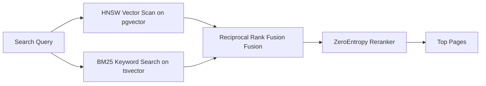

# 🏛️ AGE REPUBLIC: KNOWLEDGE ASSET (ERA 225.0)
## Identifier: `00_KNOWLEDGE/334_REPUBLIC_GBRAIN_MEMORY_WISDOM`
## Theme: Embedded WASM Graph Memory & Zero-Cost Self-Wiring Graphs (GBrain Blueprint)

---

> [!IMPORTANT]
> **SYSTEM MEMORY LAYER BLUEPRINT:**
> This knowledge manifest formalizes the database structures, parsing pipelines, and hybrid search mechanics of **GBrain** (The self-wiring Postgres-backed memory layer developed by YC's Garry Tan) to guide sovereign agents in constructing resilient, zero-LLM-cost typed knowledge graphs.

---

## 🧭 I. The Core Arguments of GBrain

### 1. The Problem Argument (Status Quo)
* **Premise:** AI agents suffer from a fundamental memory gap—starting every new session from zero, unable to persist context about people, companies, or concepts across reboots.
* **Evidence:** Conventional vector-only search fails on relational queries (e.g. "Who works at Acme AI?"), returning noisy semantic similarity scores rather than deterministic, structured connections.
* **Implicit Claim:** Existing graph-extraction pipelines are too expensive, slow, and brittle because they rely on LLMs to extract nodes and edges, leading to massive API credit burn and unstructured schema drift.

### 2. The Core Thesis (Solution)
* **Proposition:** A robust, persistent agent memory layer should be **markdown-first**, backed by an embedded database, and utilize deterministic rules to build self-wiring typed knowledge graphs with **zero LLM cost**.
* **Mechanism:**
  1. **Embedded WASM Postgres (PGLite):** Run Postgres 17 locally with `pgvector` inside WASM, requiring zero server setup or Docker configurations.
  2. **Inference Cascade Parser:** Extract typed connections (works_at, founded, invested_in, advises, mentions) directly from directory-scoped wikilinks using a regex parser.
  3. **RRF Hybrid Retrieval:** Combine vector similarity (HNSW) with keyword matches (BM25) using Reciprocal Rank Fusion, with a reranker on top.
* **Conclusion:** Combining a structured local graph with hybrid vector retrieval drives a +31.4-point precision lift over graph-disabled baselines.

---

## ⚙️ II. Design Philosophy & Principles

The GBrain architecture establishes four central operational arguments for agent memory:

| **Design Principle** | **Argument For (GBrain Memory)** | **Argument Against (Traditional Vector DBs)** |
| :--- | :--- | :--- |
| **Zero-LLM Graph Extractions** | Parse directory-structured wikilinks (`[[people/alice-chen]]`) using regex. | Calling expensive LLM parsing APIs to extract nodes and relationships. |
| **WASM Embedded Database** | Run PGLite locally inside a single file; scale to Supabase when page count > 50K. | Requiring complex cloud clusters or Docker orchestration for local dev. |
| **Idempotent Sync** | Sync is filesystem-deduplicated; humans and agents edit markdown files directly. | Opaque black-box databases where state cannot be easily modified or Git-tracked. |
| **Cost-Capped Autopilot** | A daemon supervisor plans remediation steps and halts before spending past USD limits. | Runaway background agent cycles that burn API tokens without verification. |

---

## 🔬 III. Detailed Technical Architecture

### 1. The Regex Inference Cascade
Rather than relying on models to classify links, GBrain uses the directory folder and context to infer typed relationships.

```mermaid
graph TD
    A[Wikilink: [[people/alice-chen]] inside companies/acme-ai.md] --> B{Folder Match}
    B --> |company pointing to person| C[Apply Inference Cascade]
    C --> D[FOUNDED]
    D --> E[INVESTED]
    E --> F[ADVISES]
    F --> G[WORKS_AT]
    G --> H[MENTIONS]
```

* **The Rule:** The links must use the full path slug (`[[people/alice-chen]]`) to ensure the regex extractor resolves the node boundary accurately.
* **The Result:**alice-chen `--works_at-->` acme-ai is created in PGLite with **0ms latency and 0 API cost**.

### 2. The Hybrid Search Pipeline


* **Formula:** $Score = \sum \frac{1}{60 + Rank}$
* **Reranking:** The ZeroEntropy reranker filters the final results, delivering high-precision context to the agent prompt.

---

## 🏛️ IV. Sovereign Lessons for Agentic Architecture

### 1. Embed PGLite for Air-Gapped Local State
For local deployments, phase out heavy standalone database configurations. Use **PGLite** (embedded WASM Postgres) or SQLite to maintain vector indexes (`pgvector`/`sqlite-vec`) in a single file on disk, keeping the system fully local and zero-config.

### 2. Standardize on Markdown-First Trajectories
Always keep the filesystem as the **source of truth**. Represent agent memory as a structured note repository (`00_KNOWLEDGE/`). Let human operators edit files directly using standard markdown, and let the agent parse links deterministically to update its internal graph representation.

### 3. Implement Cost-Capped Auto-Remediation Loops
In your agent maintenance scripts (`run_curation_cycle` or `mcp_bridge.py`), compile dynamic remediation plans before running LLM-intensive jobs. Implement a strict cost gate (e.g. `--max-usd 5`) to prevent runaway API billing during background tasks.
