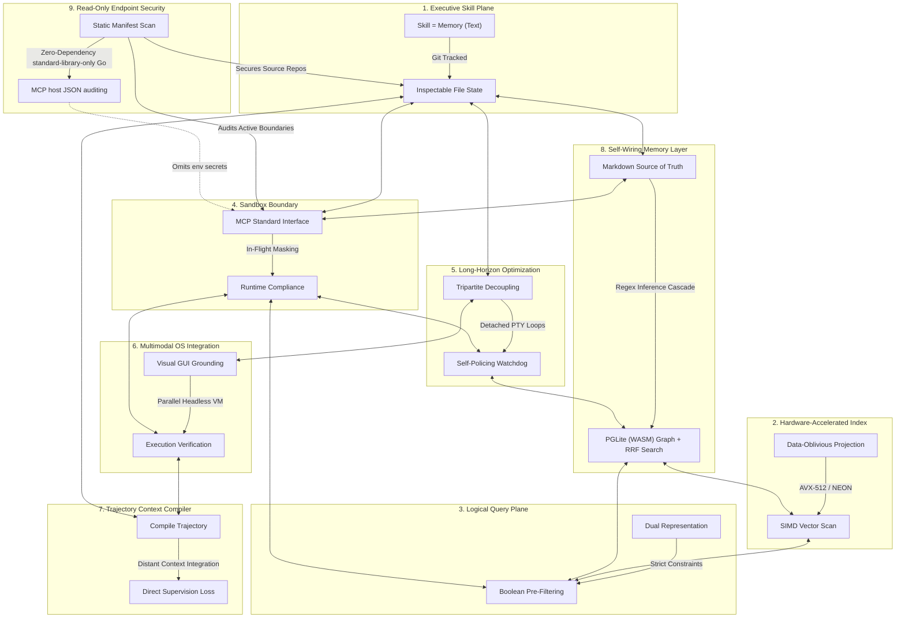

# 🏛️ AGE REPUBLIC: KNOWLEDGE ASSET (ERA 225.0)
## Identifier: `00_KNOWLEDGE/335_B_REPUBLIC_NONET_SYSTEMS_PHILOSOPHY`
## Theme: The Sovereign Nonet (The Nine Pillars of Unified Agentic Systems & Security)

---

> [!IMPORTANT]
> **MASTER SYSTEMS NONET COMPOSITE:**
> This manifest formalizes the ultimate systems compilation comparing and unifying all nine pillars of the AGE REPUBLIC sovereign infrastructure: **Acontext**, **Turbovec**, **Context-Aware Semantic Search**, **Agentic Compliance**, **Qwen3.7-Max Long-Horizon Autonomy**, **OSWorld OS-Level Multimodal Grounding**, **ACC (Agent Context Compilation)**, **GBrain (Self-Wiring Graph Memory)**, and **Bumblebee (Read-Only Endpoint Security)**. It establishes the complete unified handbook for secure, air-gapped cognitive development and system preservation.

---

## 🧭 I. The Nine Foundations of the Sovereign Nonet

To operate a secure, self-healing, high-performance, and compliant agentic mesh across sovereign enclaves, we coordinate nine specialized dimensions of execution:

---

## 🏛️ II. The Nine-Way Philosophical Matrix

| Dimension / System | 🧠 Acontext | ⚡ Turbovec | 🎛️ Context-Aware Search | 🛡️ Agentic Compliance | 🌐 Qwen3.7-Max | 🖥️ OSWorld | 🧬 ACC (Agent Context Compilation) | 🏛️ GBrain Memory | 🐝 Bumblebee Security |
| :--- | :--- | :--- | :--- | :--- | :--- | :--- | :--- | :--- | :--- |
| **Core Axiom** | *"Skill is Memory"* | *"Math replaces k-means training"* | *"Filter first, score second"* | *"Compliance is path of least resistance"* | *"Autonomy is hours, not turns"* | *"UI screens are the human interface"* | *"Unmask observations; convert procedure into content"* | *"Thin harness, fat skills in markdown"* | *"The scanner must not become the attack"* |
| **Primary Domain** | Task State & Skill Curation. | Low-latency vector database lookup. | Dynamic, hybrid document indexing. | Pipeline Sandbox Boundaries & Security. | Long-horizon engineering & optimization. | OS-level GUI visual grounding. | Trajectory compilation & long-context training. | Self-wiring hybrid memory & retrieval. | Read-only supply-chain security scanning. |
| **Data Medium** | Git-portable Markdown files. | Rotated unit vectors (2-bit/4-bit). | Normalized embeddings + relational metadata. | Virtualized, masked, and synthetic environments. | Triton code, execution traces, Triton kernels. | Desktop screenshots, mouse coordinates, PTY logs. | Concatenated tool responses, logs, & QA pairs. | Markdown wikilinks + local WASM PGLite. | Lockfiles, manifests, browser extensions, MCP configs. |
| **Autonomy Mode** | Distilled skill hierarchies. | Continuous incremental indexing. | Cross-team semantic discovery. | Continuous machine-speed compliance. | Detached background runs via persistent PTYs. | Multimodal GUI-based keyboard/mouse simulation. | Distant context integration without tool calling. | Cron-driven Autopilot (5-minute tick loop). | Threat-intel driven one-shot exposure scans. |
| **Efficiency Claim** | Epistemic pruning: drop raw traces. | SIMD register block short-circuit filtering. | Reducing dimensions before scoring. | Sub-90 second virtualized container provisioning. | Tripartite decoupling (Task, Tool, Validator). | Headless Docker execution with KVM acceleration. | Compression of reasoning capacity (30B beats 235B). | Zero-cost regex-based graph extraction cascade. | Passive static locks parsing (0 pkg manager calls). |
| **Locality Vector** | Portable local filesystem. | Local AVX-512/NEON; zero data egress. | Offline CPU transformer models. | Isolated sandboxes, loopback mounts. | Unfamiliar chip optimization via trial-and-error. | Parallelized VM environments run local or AWS. | Annotation-free, offline self-supervised training data. | In-process WASM Postgres database (PGLite). | Static single Go binary with 0 external dependencies. |
| **Verification Gate** | Git commit log audits. | Lloyd-Max boundaries. | Pre-filters block invalid candidates. | Dynamic proxies monitor in-flight API traffic. | Secondary watchdog agents check for reward hacking. | Independent post-process execution-assert scripts. | Direct evidence-to-answer supervision masks. | Cost-capped remediation plan (`gbrain doctor`). | Structured NDJSON output + Confidence triage. |

---

## 🔬 III. Core Philosophical Tensions & Sovereign Resolutions

### 1. Vector-Only Search vs. Self-Wiring Graphs vs. Read-Only Auditing
* **The Tension:** Conceptual similarity searches (Turbovec) match synonyms but miss logical boundaries (Context-Aware Search) and explicit relational structures. While self-wiring graphs (GBrain) resolve relationships deterministically from wikilinks using WASM indexing, the configurations linking the agent to these tools (MCP servers) are highly privileged. If unmonitored, these graph tools present massive supply-chain and token-leak surfaces.
* **The Resolution:** *Secured Tool-Boundary Curation.* Declare the local Markdown workspace as the absolute source of truth. Let the agent parse links via regex to build PGLite graphs (zero LLM cost). Apply **Bumblebee** as a passive, read-only sentinel that parses and inventories the active tool definitions (`mcp.json`, `claude_desktop_config.json`) and dependencies on disk. It checks for known supply-chain campaign signatures without executing a single installer command, ensuring that the self-wiring graph memory layer does not inherit poisoned packages.

### 2. Active Run-Time EDR vs. One-Shot Passive Auditing
* **The Tension:** Endpoint security compliance (Agentic Compliance) often demands continuous, persistent runtime daemon monitoring (EDR) to intercept API traffic, track running processes, and analyze network hooks. However, continuous background monitoring daemons introduce massive system resource overhead, introduce security attack surfaces through dependency libraries, and can be bypassed by stealthy, dormant supply-chain vectors.
* **The Tension Resolution:** *Standard-Library-Only One-Shot Sentinels.* Shift from heavy continuous daemons to strict, one-shot static metadata collectors (**Bumblebee**). Restrict the scanner to Go standard-library components (zero non-stdlib dependencies) to eliminate dependency poisoning. Run the scan asynchronously on standard system schedules (cron, systemd) to audit static manifests (`package-lock.json`, `go.sum`, editor profiles) without any running processes. If a threat is detected, apply **Agentic Compliance** loopbacks to dynamically isolate the affected workspace partition in sub-90 seconds.

### 3. Trajectory Collection vs. In-Flight Secrets Protection
* **The Tension:** Optimizing autonomous loops (Qwen3.7-Max) and training lightweight models via Agent Context Compilation (ACC) require capturing complete trajectory logs—including full tool outputs, CLI parameters, and environment state variables. However, AI agent configuration blocks (like `env` variables inside `mcp.json`) contain highly sensitive keys, API credentials, and system tokens.
* **The Resolution:** *Zero-Egress Manifest Sanitization.* Capture multi-turn execution traces strictly within local sandboxed enclaves (Claw Workers) to prevent raw data leaks. When compiling directories or parsing MCP host setups for inventory checks, configure the parser to sweep and index the *structure* of active tools but **never** emit the key names or string values stored inside the environment `env` blocks. This allows direct audit and tracking of tool registries without logging credentials.

---

## 🏛️ IV. The Master Unifying Axioms of the Sovereign Nonet

### 1. The Principle of Non-Invasive Observation (Read-Only)
In both memory indexing and endpoint security, the act of auditing must never execute the code being audited. To scan a workspace for compromised packages, you must parse static manifests (`package-lock.json`, `*.dist-info/METADATA`) directly. Never invoke dynamic interpreters or running installers (`npm/pip install` or check commands), as malicious packages carry postinstall scripts that execute the attack the moment a query is evaluated.

### 2. Decouple Scanner Logic from Threat Catalogs
Keep execution tools completely decoupled from changing intelligence catalogs. The scanner engine must be a stable, compile-once primitive, while the exposure catalog is an swappable, offline JSON file constructed from active threat feeds. This allows human operators and autonomous watchdogs to immediately block vulnerable packages without waiting for software vendor updates.

### 3. Trust the System, Verify the Tooling (Secure the MCP Perimeters)
As agents transition from text assistants to operating system operators, the perimeter of the agent is defined by its **Model Context Protocol (MCP) server configuration**. Treat these configuration files as highly sensitive access control records. Run regular, read-only static audits over all editor manifests, browser extensions, and active AI configurations to ensure that the agent mesh is strictly composed of verified, uncompromised node tools.
