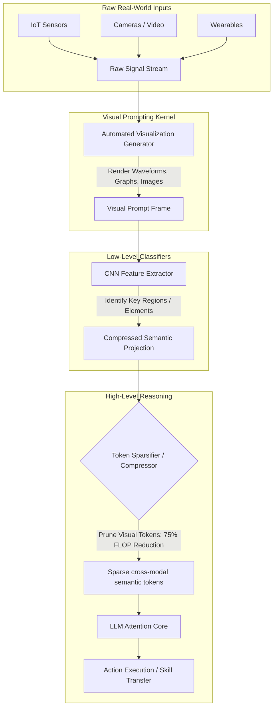

# 🏛️ AGE REPUBLIC: KNOWLEDGE ASSET (ERA 225.0)
## Identifier: `00_KNOWLEDGE/335_C_REPUBLIC_MLLM_SENSORY_GROUNDING_WISDOM`
## Theme: Multimodal Large Language Models (MLLMs), Sensor Grounding & Token Sparsification (Forbes Blueprint)

---

> [!IMPORTANT]
> **SYSTEM COGNITION BLUEPRINT:**
> This knowledge manifest formalizes the analytical arguments, architectural decisions, and efficiency metrics of **Multimodal Large Language Models (MLLMs)** to guide sovereign agents in grounding text-based reasoning in real-world physical and sensory data without incurring catastrophic computational overhead.

---

## 🧭 I. The Problem Argument (Status Quo)

**Premise:** Traditional Large Language Models (LLMs) are text-only systems, which isolates them from the physical world. Attempting to represent spatial dynamics, physical laws, and real-world sensor streams through text is computationally expensive and conceptually inaccurate.

**Evidence from the article:**
> *"The developer world pondered, for about a year, how to teach LLMs about physics through text, and then the world realized that you could just equip the LLM to see, and teach it that way... Suppose you have a ball bouncing through a room and you want the LLM to 'follow the ball.' How do you encode all of that information into the neural net? How do you 'show' the model what the ball's trajectory is like based on real-world physics? Well, it's a lot easier if the LLM can see."*

**Implicit Claim:** Textual representation is a low-fidelity bottleneck for physical reality. Forcing an agent to parse numerical coordinates, IoT sensor logs, and trajectory metrics in pure text leads to massive prompt pollution, inaccurate spatial reasoning, and high processing latency.

**The critical gap MLLMs address:** The disconnect between high-level cognitive language planning and the raw, unstructured streams of physical sensory devices (wearables, cameras, IoT). Traditional models cannot ground their vocabulary in real-world contexts, limiting their usefulness in human augmentation, skill transfer, and physical system orchestration.

---

## 🏛️ II. The Core Thesis (Solution)

**Proposition:** The Multimodal Large Language Model (MLLM) is an integrated cognitive platform that attaches sensory gear and visual projectors to the central LLM brain, using **visual prompts** and **token compression** to ground language reasoning in physical reality with up to **75% FLOP reductions**.

**The three pillars of the MLLM system:**

| **Pillar** | **Implementation** | **Claimed Benefit** |
| :--- | :--- | :--- |
| **Sensory Grounding via Visual Prompts** | Integrating cameras, IoT, and wearables with automated visualization generators ("By My Eyes" pipeline). | Converts raw sensor logs into optimal visualizations, eliminating task-specific prior knowledge. |
| **Classical ML Integration** | Hooking convolutional neural networks (CNNs) for low-level feature extraction directly to the LLM core. | Offloads heavy spatial feature classifications to dedicated, low-level hardware-efficient vision nets. |
| **Token Sparsification / Compression** | Selective pruning of visual tokens across encoders, projectors, and LLM-side layers. | Reduces visual token bloat, enabling faster inference and training without large accuracy drops. |

**Conclusion:** AI reasoning belongs in a grounded, physical context. Equipping the central language brain with a visual and sensory interface allows the model to learn physics by *seeing* and *sensing* rather than reading, while token compression ensures this grounding remains computationally viable.

---

## 🔬 III. Detailed Technical Architecture

---

## 🚫 IV. The Anti-Arguments (What MLLMs Reject)

| **Rejected Practice** | **MLLM Alternative** | **Architectural Rationale** |
| :--- | :--- | :--- |
| **Text-Only Physics Modeling** | Equipping the LLM with vision arrays to see physical trajectories directly. | Explaining high-dimensional spatial trajectories in text floats is extremely complex and error-prone. |
| **Dense Visual Token Processing** | Token sparsification and cross-modal compression. | Monolithic processing of uncompressed video tokens scales quadratically, causing CPU/GPU gridlocks. |
| **Monolithic Model Training** | Hooking dedicated classical CNNs to the LLM for low-level feature extraction. | Leverage proven, lightweight vision architectures rather than forcing the main transformer to learn low-level edge detection. |
| **Static Prompt Curation** | Automated visualization prompt generators tailored to the specific sensory task. | Static prompts fail to adapt to unpredictable real-world sensor profiles. |

---

## 📊 V. The Quantitative Claims & Technical Scope

### 1. Performance and Efficiency Claims
* **FLOP Reduction:** Up to **75% FLOP reduction** achieved through token sparsification and visual compression.
* **Accuracy Preservation:** Preserves critical cross-modal semantics without large accuracy regressions during visual token reduction.
* **Integration Points:** Bypasses repetitive relational database querying by storing cross-modal tokens in unified attention layers.

### 2. Multi-Modal Surface Area
* **Input Modalities:** Text, sound, images, videos, real-time IoT feeds, camera frames, and wearable sensor logs.
* **Architectural Components:** Encoders, cross-modal projectors, and LLM-side token compressors.
* **Primary Application Fields:** Human Augmentation (HA), Human-Computer Interaction (HCI), skilled action recording/transfer, skill development assessment, and sensory augmentations.

---

## 🏛️ VI. The Philosophical Core (Seven Sentences)

1. **Reasoning must be grounded in observation** — an agent that only reads text knows the symbols of things but not the things themselves.
2. **Physics is learned by seeing, not reading** — a bouncing ball's trajectory is resolved instantly by vision, but remains a computational maze in text.
3. **The best attention is selective attention** — token sparsification proves that the brain must discard redundant visual tokens to maintain fast inference.
4. **Leverage the strength of specialized nets** — classical CNNs excel at low-level visual classification; let them serve as the eyes for the LLM brain.
5. **Visualizations are the universal interface** — converting complex sensor tables into clean graphs allows the visual LLM to grasp sensor data without task-specific retraining.
6. **Autonomy requires spatial awareness** — long-horizon physical systems cannot run on textual abstractions; they require visual coordinate grounding.
7. **Augmentation is the ultimate benchmark** — the quality of a multimodal system is defined by its ability to record, understand, and transfer skilled human actions.

---

## 🧠 VII. Sovereign Lessons for Agentic Architecture

### 1. Ground Sensor Telemetry visually in the DREAM IDE Cockpit
When displaying backend system telemetry or algorithmic trading metrics:
* Avoid feeding the agent massive, raw CSV data tables.
* Use a **visualization generator** to render system metrics as clean graphical charts (waveforms, balance sheets).
* Feed these visual prompts directly to the VLM, allowing the agent to evaluate performance at a glance and bypass expensive relational token sweeps.

### 2. Apply Token Sparsification to Trajectory Logging
When compiling large multi-app trajectory logs (**ACC**) and desktop screenshot runs (**OSWorld**):
* Implement **token compression** at the projection layer.
* Filter out static, unchanging screen regions (e.g. background frames, idle terminal prompts) before passing the screenshot tokens to the model.
* This preserves critical cross-modal semantics while delivering the same 75% FLOP efficiency observed in production MLLMs.

### 3. Offload Edge Detection to Hardware-Efficient Modules
When designing vision-based agents for workspace interaction:
* Do not force the high-level LLM to parse raw pixel coordinates.
* Run a local, hardware-efficient CNN (compiled via Mojo or AVX-512) to identify coordinates and extract UI elements.
* Deliver these parsed elements as high-level, structured semantic tokens, utilizing the classic "feature extraction" paradigm to optimize resource allocation.
