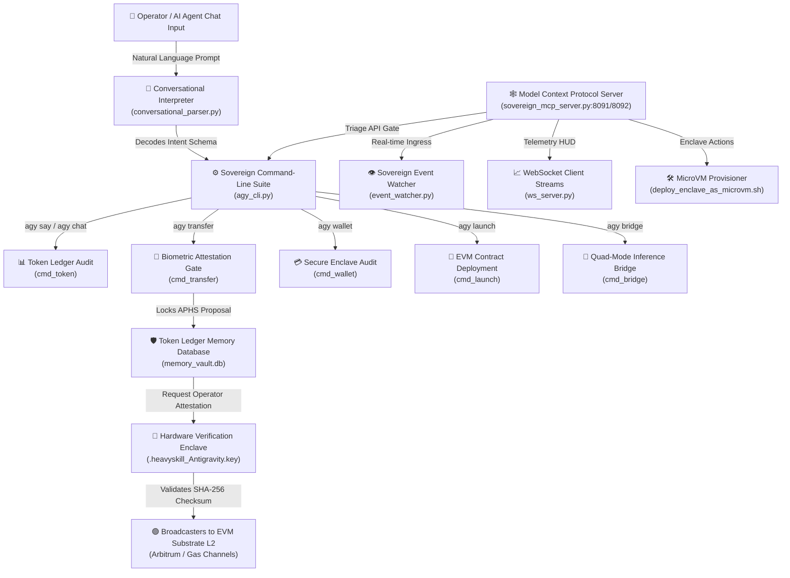

# 🏛️ AGE REPUBLIC :: UNIFIED COGNITIVE & INFRASTRUCTURE ROUTER ARCHITECTURE
## Era 232.0 — Sealed and Attested Systemic Blueprint

This document maps the precise interaction pipelines, intent-resolution matrices, and attestation boundaries that coordinate the **Model Context Protocol (MCP) Router**, the **Sovereign AGY Command-Line Suite**, the **Conversational NL Parser**, and the **x402 Hardware-Bound Secure Enclaves**.



---

## 1. The Conversational Intent Parsing Pipeline
When an operator or conductor agent submits a natural language message (e.g. *"sweep 500 SWARM to my x402 address"*), the request is intercepted by `conversational_parser.py` inside the active cockpit handler:

```python
interpret_cockpit_message(msg, linked_wallet)
```

### Decoded Intent Resolution Table

| Target Input Phrase | Decoded Intent | Mapped AGY CLI Subcommand | Target Subsystem / Execution Node |
| :--- | :--- | :--- | :--- |
| `"sweep 500 SWARM to my x402"` | `transfer` | `agy transfer --amount 500 --token SWARM --target <wallet> --confirm biometric` | Biometric attestation gate & ledger database |
| `"audit my tokens / balances"` | `token_balance` | `agy token --balance` | Reads local ledger vault balances |
| `"verify my enclave status"` | `wallet_status` | `agy wallet --status` | Connects to x402 API & dynamic L1/L2 RPC gas checks |
| `"launch contract to arbitrum"` | `launch_contract`| `agy launch --live --network arbitrum` | Compiler (forge solc) & EVM deployment gateway |
| `"ask the bridge: [prompt]"` | `bridge_query` | `agy bridge --mode local --prompt "[prompt]"` | Quad-Mode inference engine & Token balance billing |

---

## 2. Secure Attestation & AI-Proposed, Human-Signed (APHS) Transfers
For security, raw CLI commands cannot bypass attestation checks when mutating treasury states. Every payout is governed by the **APHS Protocol**:

1. **Proposal Isolation**: The CLI builds a proposal payload `proposal_id = aphs_[timestamp]` and writes it to the local encrypted SQLite DB (`memory_vault.db`).
2. **Attestation Gate**: The execution suspends until operator approval is confirmed. The system scans the secure hardware keyspace for `.heavyskill_Antigravity.key` (attested hardware token).
3. **Bytecode Broadcast**: Upon signature validation, a deterministic Keccak-256 transaction hash is calculated, and the payout is broadcast to L2 EVM gas pipelines (e.g., Arbitrum).

---

## 3. Model Context Protocol (MCP) Triage Server
Operating continuously on ports **8091 (HTTP)** and **8092 (WebSockets)**, `sovereign_mcp_server.py` acts as the global triage gateway. It bridges autonomous agents to physical infrastructure resources:

* **Enclave Lifecycle Registry (`/api/mcp/enclaves`)**: Scans `05_SECURITY/` and tracks region enclaves (Norway, Sydney, Tokyo, Quebec).
* **Headless Action Queue (`/api/mcp/pending` & `/api/mcp/approve`)**: Handles high-risk commands (Isolation of compromised nodes, deployment of new enclaves, slashing validator shortfalls).
* **Dynamic Heat Map (`/api/mcp/enclaves/state`)**: Feeds real-time telemetry coordinates to cockpit dashboards.
* **Integrity Auditing (`/api/mcp/integrity`)**: Executes automated local system scans, verifying file integrity at machine speed.
* **Bi-directional Webhook Ingress (`/api/mcp/webhook/eventgrid`)**: Implements event-driven file synchronization (MOU agreements, export ledgers) over cloud-to-local enclaves.

---

## 4. Coala Memory Framework Integration
The routing infrastructure maps directly to the **Coala 4-Pillar Memory Architecture**:

```
┌────────────────────────────────────────────────────────────────────────────┐
│                    COALA MEMORY LAYER INTEGRATION                          │
├────────────────────────────────────────────────────────────────────────────┤
│  • WORKING   ──► ws_server.py streams live cockpit state & active telemetry │
│  • SEMANTIC  ──► SQLite memory_vault.db registers wallet balances / tags  │
│  • PROCEDURAL──► agy_cli.py subcommands define the executable tool space   │
│  • EPISODIC  ──► audit.log tracks every signed proposal & action execution │
└────────────────────────────────────────────────────────────────────────────┘
```

**This architecture guarantees absolute sovereignty, ensuring that while AI agents proposes and orchestrates actions, human physical keys retain the ultimate signature authority over the federation's state.**
