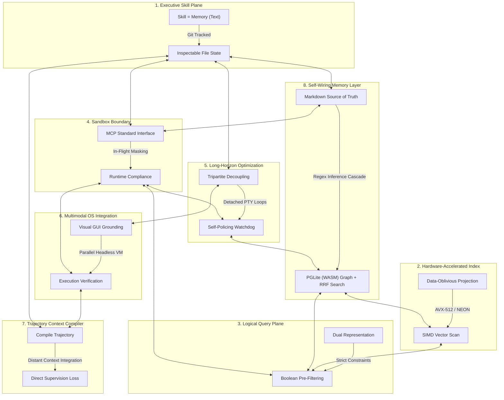

# 🏛️ AGE REPUBLIC: KNOWLEDGE ASSET (ERA 225.0)
## Identifier: `00_KNOWLEDGE/335_REPUBLIC_OCTET_SYSTEMS_PHILOSOPHY`
## Theme: The Sovereign Octet (The Eight Pillars of Unified Agentic Intelligence)

---

> [!IMPORTANT]
> **MASTER SYSTEM COMPOSITE:**
> This manifest formalizes the ultimate systems compilation comparing and unifying all eight pillars of the AGE REPUBLIC sovereign infrastructure: **Acontext**, **Turbovec**, **Context-Aware Semantic Search**, **Agentic Compliance**, **Qwen3.7-Max Long-Horizon Autonomy**, **OSWorld OS-Level Multimodal Grounding**, **ACC (Agent Context Compilation)**, and **GBrain (Self-Wiring Graph Memory)**. It establishes the unified engineering handbook for air-gapped cognitive development.

---

## 🧭 I. The Eight Foundations of the Sovereign Octet

To operate a secure, self-healing, performant, and compliant agentic mesh across sovereign enclaves, we coordinate eight specialized dimensions of execution:

---

## 🏛️ II. The Eight-Way Philosophical Matrix

| Dimension / System | 🧠 Acontext | ⚡ Turbovec | 🎛️ Context-Aware Search | 🛡️ Agentic Compliance | 🌐 Qwen3.7-Max | 🖥️ OSWorld | 🧬 ACC (Agent Context Compilation) | 🏛️ GBrain Memory |
| :--- | :--- | :--- | :--- | :--- | :--- | :--- | :--- | :--- |
| **Core Axiom** | *"Skill is Memory"* | *"Math replaces k-means training"* | *"Filter first, score second"* | *"Compliance is path of least resistance"* | *"Autonomy is hours, not turns"* | *"UI screens are the human interface"* | *"Unmask observations; convert procedure into content"* | *"Thin harness, fat skills in markdown"* |
| **Primary Domain** | Task State & Skill Curation. | Low-latency vector database lookup. | Dynamic, hybrid document indexing. | Pipeline Sandbox Boundaries & Security. | Long-horizon engineering & optimization. | OS-level GUI visual grounding. | Trajectory compilation & long-context training. | Self-wiring hybrid memory & retrieval. |
| **Data Medium** | Git-portable Markdown files. | Rotated unit vectors (2-bit/4-bit). | Normalized embeddings + relational metadata. | Virtualized, masked, and synthetic environments. | Triton code, execution traces, Triton kernels. | Desktop screenshots, mouse coordinates, PTY logs. | Concatenated tool responses, logs, & QA pairs. | Markdown wikilinks + local WASM PGLite. |
| **Autonomy Mode** | Distilled skill hierarchies. | Continuous incremental indexing. | Cross-team semantic discovery. | Continuous machine-speed compliance. | Detached background runs via persistent PTYs. | Multimodal GUI-based keyboard/mouse simulation. | Distant context integration without tool calling. | Cron-driven Autopilot (5-minute tick loop). |
| **Efficiency Claim** | Epistemic pruning: drop raw traces. | SIMD register block short-circuit filtering. | Reducing dimensions before scoring. | Sub-90 second virtualized container provisioning. | Tripartite decoupling (Task, Tool, Validator). | Headless Docker execution with KVM acceleration. | Compression of reasoning capacity (30B beats 235B). | Zero-cost regex-based graph extraction cascade. |
| **Locality Vector** | Portable local filesystem. | Local AVX-512/NEON; zero data egress. | Offline CPU transformer models. | Isolated sandboxes, loopback mounts. | Unfamiliar chip optimization via trial-and-error. | Parallelized VM environments run local or AWS. | Annotation-free, offline self-supervised training data. | In-process WASM Postgres database (PGLite). |
| **Verification Gate** | Git commit log audits. | Lloyd-Max boundaries. | Pre-filters block invalid candidates. | Dynamic proxies monitor in-flight API traffic. | Secondary watchdog agents check for reward hacking. | Independent post-process execution-assert scripts. | Direct evidence-to-answer supervision masks. | Cost-capped remediation plan (`gbrain doctor`). |

---

## 🔬 III. Core Philosophical Tensions & Sovereign Resolutions

### 1. Vector-Only Search vs. Self-Wiring Knowledge Graphs
* **The Tension:** Semantic vector search excels at conceptual similarity but is structurally blind to discrete, typed connections (e.g. *"Who works at Acme AI?"*). Traditional knowledge graph extraction methods address this but rely on expensive, high-latency, and hallucination-prone LLM calls at ingestion.
* **The Resolution:** *Deterministic Regex Inference Cascades.* Map incoming wikilinks using standardized directory hierarchies (`[[people/alice-chen]]` inside `companies/acme-ai.md`). Apply a prioritized inference cascade (FOUNDED → INVESTED → ADVISES → WORKS_AT → MENTIONS) via high-speed regex matchers. This generates a robust, typed knowledge graph inside an embedded database (PGLite) at **0ms latency and zero LLM runtime cost**.

### 2. Sterile Sandboxing (Compliance) vs. Live Trajectory Auditing (OSWorld / ACC)
* **The Tension:** Security compliance mandates strict sandboxing and in-flight data masking to prevent leakage of customer identifiers or cryptographic keys. However, advanced training frameworks (ACC) and GUI benchmarks (OSWorld) require capturing full execution traces—including high-resolution screenshots and complete API traffic—to evaluate and compile agent trajectories.
* **The Resolution:** *Virtualized Local-First Loopbacks.* Capture multi-app trajectory logs strictly inside ephemeral, hardware-isolated enclaves (Claw Workers). Prior to writing logs to the persistent markdown-first brain repository, route all screenshot pixels and text streams through an in-flight sanitizing filter (PrivacySanitizer) to procedurally mask credentials, API tokens, and production customer records.

### 3. Continuous Self-Healing vs. Cost-Capped Autopilot Governance
* **The Tension:** Long-horizon engineering loops (Qwen3.7-Max) and self-healing memory daemons require the freedom to execute multi-hour background processes (syncing, resolving broken links, crawling pages, re-embedding). If left unmonitored, these background loops risk runaway API billing and computational infinite loops.
* **The Resolution:** *Dependency-Ordered Remediation Plans with Strict Gates.* Before executing self-healing curation jobs, the background autopilot compiles a static, dependency-ordered plan of remediation tasks. Each step is assigned a strict cost threshold. The entire loop is governed by an immutable hard gate (e.g. `--max-usd 5`), immediately freezing execution and alerting the human operator if consumption thresholds are breached.

### 4. Opaque Vector Databases vs. Inspectable Markdown-First Storage
* **The Tension:** Massive vector databases (Pinecone, Milvus) offer scalable indexing but compress text into opaque binary blobs that are impossible for human curators to audit, edit, or control. Conversely, raw text files (Acontext) are highly inspectable but slow to search and scale.
* **The Resolution:** *Decoupled Core Storage with Local WASM Indexes.* Declare standard markdown files on the local filesystem as the absolute **source of truth**. All additions, edits, and deletions are performed directly on plain text files, tracked via `git`. To accelerate search, deploy PGLite (full Postgres compiled to WASM) as an in-process local index. Run HNSW vector indexing (`pgvector`) and keyword indexing (`tsvector`) side-by-side inside PGLite. Syncing from markdown files to the SQL index is idempotent and sub-second. If a migration is required, a single command (`gbrain migrate`) transfers the local WASM state to a secure, cloud-scale Supabase instance.

---

## 🏛️ IV. The Master Unifying Axioms of the Sovereign Octet

### 1. The Source of Truth belongs to the Human (Inspectable Primitives)
All knowledge, skills, and memory traces must ultimately live in open, version-controlled, human-readable text files. Binary indexing databases are ephemeral accelerators; plain text is eternal. If the human curator cannot audit the database state using a basic system editor, it violates cognitive sovereignty.

### 2. Hybrid Search beats Monolith Retrieval (The RRF Standard)
No single retrieval method is sufficient. Semantic vectors miss exact keyword matching; lexical queries miss conceptual synonyms; unstructured indexes miss typed graph relationships. A sovereign system must project queries across multiple dimensions:
* Dense vector scans (HNSW via Turbovec or pgvector) for conceptual context.
* Sparse lexical index matching (BM25 via tsvector) for exact keyword compliance.
* Deterministic graph traversals for relational logic.
Combine scores using Reciprocal Rank Fusion (RRF) with a ZeroEntropy reranker to provide context with maximum precision.

### 3. Autonomy demands Detached Execution (The Horizon Standard)
True autonomous engineering requires background execution that survives context restarts, network blips, and terminal closures. Decouple tasks from tool environments and validators. Run continuous optimization threads inside detachable terminal multiplexers (RMUX), allowing self-policing watchdogs to monitor correctness while preserving local air-gapped boundaries.
