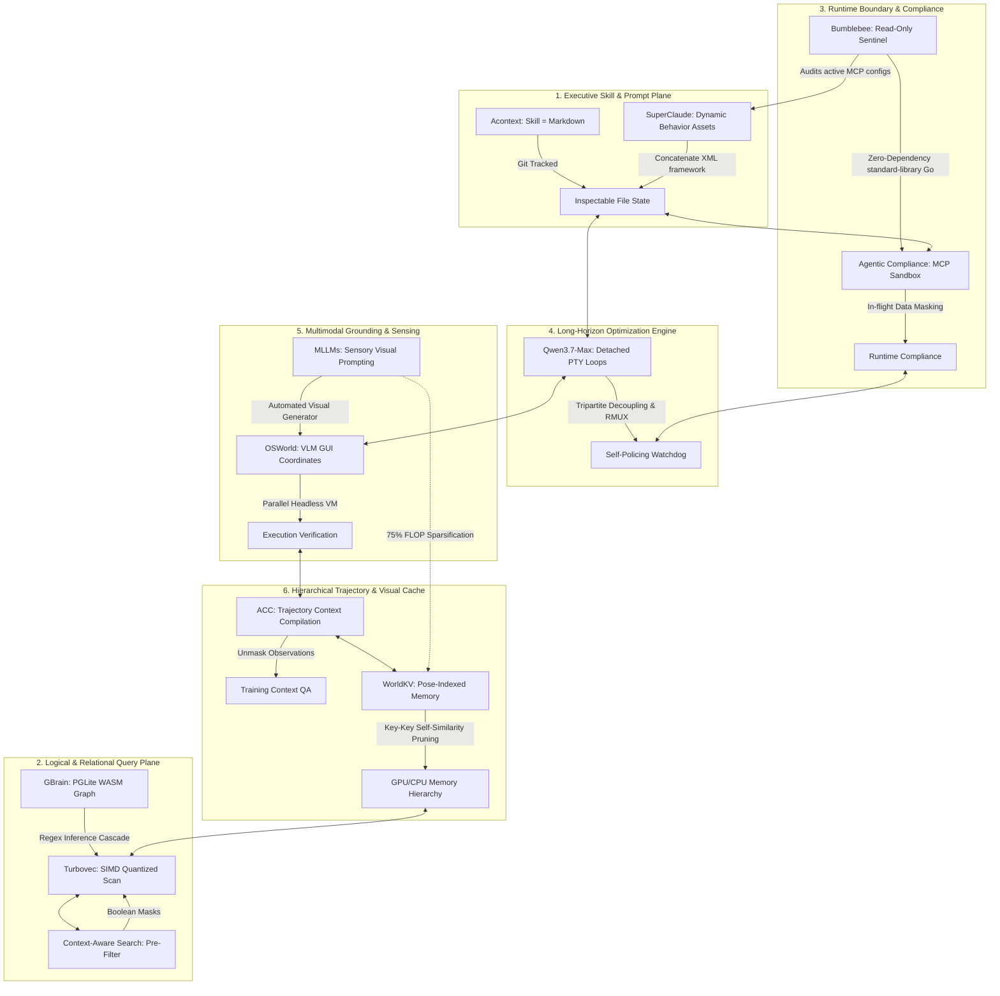

# 🏛️ AGE REPUBLIC: KNOWLEDGE ASSET (ERA 225.0)
## Identifier: `00_KNOWLEDGE/337_REPUBLIC_DODECAD_UNIFIED_FRAMEWORK`
## Theme: The Sovereign Dodecad — Twelve Unified Principles for AI Agent Systems, Memory, Reasoning, Security & World Generation

---

> [!IMPORTANT]
> **MASTER SYSTEM DODECAD COMPOSITE:**
> This manifest formalizes the ultimate systems compilation comparing and unifying all twelve pillars of the AGE REPUBLIC sovereign infrastructure: **Acontext**, **Turbovec**, **Context-Aware Semantic Search**, **Agentic Compliance**, **Qwen3.7-Max Long-Horizon Autonomy**, **OSWorld OS-Level Grounding**, **ACC (Agent Context Compilation)**, **GBrain (Self-Wiring Graph Memory)**, **Bumblebee (Read-Only Endpoint Security)**, **MLLMs (Sensory Visual Prompting)**, **SuperClaude (Dynamic Prompts Curation)**, and **WorldKV (Hierarchical Memory & Self-Similarity Compression)**. It establishes the complete engineering handbook for sovereign cognitive development.

---

## 🧭 I. The Twelve Foundations of the Sovereign Dodecad

To operate a secure, self-healing, performant, and compliant agentic mesh across sovereign enclaves, we coordinate twelve specialized dimensions of execution:

---

## 🏛️ II. The Twelve-Way Philosophical Matrix

| System / Pillar | 🧠 Acontext | ⚡ Turbovec | 🎛️ Context-Aware | 🛡️ Compliance | 🌐 Qwen3.7-Max | 🖥️ OSWorld | 🧬 ACC | 🏛️ GBrain | 🐝 Bumblebee | 👁️ MLLMs | ⚙️ SuperClaude | 📦 WorldKV |
| :--- | :--- | :--- | :--- | :--- | :--- | :--- | :--- | :--- | :--- | :--- | :--- | :--- |
| **Core Axiom** | *"Skill is Memory"* | *"Math replaces k-means"* | *"Filter first, score second"* | *"Compliance is path of least resistance"* | *"Autonomy is hours, not turns"* | *"UI screens are the human interface"* | *"Unmask observations; process = content"* | *"Thin harness, fat skills"* | *"The scanner must not be the attack"* | *"Reasoning must be visually grounded"* | *"Behaviors belong in Markdown"* | *"Eviction is not deletion; it is archiving"* |
| **Primary Domain** | Task State Curation. | Low-latency vector lookup. | Hybrid document indexing. | Sandbox Boundaries & Security. | Long-horizon engineering loops. | OS-level GUI visual grounding. | Trajectory compilation & training. | Self-wiring hybrid memory. | Supply-chain security scanning. | Sensory Wearables & IoT feeds. | Dynamic Prompt Orchestration. | Video & Spatial consistency. |
| **Data Medium** | Git-portable Markdown. | Rotated unit vectors. | Embeddings + Metadata. | Virtual enclaves & synthetic data. | Triton kernels & PTY logs. | Desktop screenshots, mouse coordinates. | Tool responses & QA pairs. | Wikilinks + local PGLite. | Lockfiles, manifests, MCP JSONs. | Video frames, sensor tables. | Reusable Markdown assets. | Visual KV Cache (GPU ⇄ CPU). |
| **Autonomy Mode** | Distilled skill hierarchies. | Continuous incremental index. | Cross-team semantic search. | Runtime machine-speed checks. | Detached background RMUX loops. | Multimodal GUI keyboard actions. | Distant context integration. | Cron Autopilot (5m tick). | Threat-intel one-shot sweeps. | Automated Visual Generators. | Session JSON Save/Load. | Spatial pose-indexed retrieval. |
| **Efficiency Claim** | Epistemic pruning of logs. | SIMD register short-circuiting. | Reductions before scoring. | Sub-90s VM container setups. | Tripartite decoupling (Task/Tool/Val). | Headless Docker KVM setups. | Reasoning compression (30B beats 235B). | Zero-cost regex graph extraction. | Passive static lock parsing. | 75% FLOP sparsification. | Composable asset prompt blocks. | Key-key self-similarity pruning. |
| **Locality Vector** | Portable local files. | Local AVX-512/NEON. | Offline CPU transformers. | Isolated sandbox loopbacks. | Unfamiliar chip auto-tuning. | Parallel VM local grids. | Annotation-free offline training. | Local WASM PGLite. | Single standard Go binary. | Local CNN visual feature nets. | Client-side dynamic loading. | Hierarchical RAM/VRAM storage. |
| **Verification Gate** | Git commit log audits. | Lloyd-Max boundaries. | Pre-filters block candidates. | Dynamic proxies monitor API traffic. | Secondary watchdog agents. | Execution-assert script validations. | Direct evidence-to-answer masks. | Cost-capped remediation gates. | Structured NDJSON output. | Visual prompt task templates. | Active contextprefix header. | Consistency on scene revisit. |

---

## 🔬 III. Core Philosophical Tensions & Sovereign Resolutions

### 1. Unified Prompt Composition vs. Hierarchical World Memory
* **The Tension:** SuperClaude and Acontext advocate representing behaviors and states as modular, dynamic Markdown prompts composed at run-time. However, long-horizon visual tasks and multi-app visual rollouts generate massive, quadratically scaling KV-caches. If represented in pure text or uncompressed attention layers, these rollouts immediately exceed system context thresholds and trigger massive API costs.
* **The Resolution:** *Visual-Textual Memory Hierarchies.* Store behaviors and prompt schemas in highly compressed, modular Markdown files assembled dynamically at prompt time (**SuperClaude**). When executing spatial, visual, or multi-app trajectories, do not feed raw screenshots to the model. Instead, archive evicted visual KV chunks to slower CPU memory (**WorldKV**) and retrieve them selectively via spatial pose and action-conditioned indices. Apply **key-key self-similarity pruning** inside each chunk to drop static backgrounds, maintaining high consistency at 2x throughput.

### 2. Active Run-Time Compliance vs. Non-Invasive Passive Security
* **The Tension:** Security compliance (Agentic Compliance) demands persistent proxies and active virtualization enclaves to monitor and sanitize API traffic in-flight. However, running active queries or package checks dynamically can trigger the very exploits being searched for (e.g. package postinstall scripts executing during version sweeps).
* **The Resolution:** *Decoupled Audit-Sentinel Loops.* Deploy **Bumblebee** as an asynchronous, zero-dependency, read-only static manifest scanner. It inventories all package files (`package-lock.json`, `go.sum`) and active AI tool registries (`mcp.json`, `claude_desktop_config.json`) with zero command execution. If Bumblebee flags an exposure match against its threat catalog, it triggers **Agentic Compliance** to dynamically lock down and virtualize that specific workspace enclave in sub-90 seconds, shielding system credentials at all times.

### 3. Training-Free Prompt Construction vs. Trajectory Fine-Tuning
* **The Tension:** Building agent architectures through prompt engineering (SuperClaude, Acontext, GBrain) is cheap, highly portable, and generalizes across LLM models. However, deep spatial and complex visual reasoning tasks demand capabilities that prompt engineering alone cannot deliver.
* **The Resolution:** *The Compose-Then-Compile Pipeline.* Use **SuperClaude prompt-time composition** for behavioral instructions (Commands, Agents, Modes) during interactive development. Capture the complete multi-turn trajectory execution logs, visual coordinate interactions (**OSWorld**), and database queries. Route these logs through **Agent Context Compilation (ACC)**, unmasking observations to compile long-context QA pairs. Use these compiled trajectories to fine-tune compact local models, compressing high-end reasoning capabilities from massive frontier LLMs down to lean, local-first enclaves.

---

## 🏛️ IV. The Master Unifying Axioms of the Sovereign Dodecad

### Axiom 1: Plain Text is the Eternal Record; Databases are Temporary Indices
All persistent system states, memories, and behaviors belong in Git-portable, open Markdown files on the local filesystem. Vector indexes, PGLite WASM graphs, and KV-caches are temporary computational accelerators. If the indexing layers are cleared, the system must be capable of fully reconstructing itself from plain files.

### Axiom 2: Filter Before You Score; Compress Before You Attend
Never perform expensive computations on data that logical boundaries or redundancy metrics will reject. Apply boolean metadata masks before vector scoring. Prune static pixels via key-key self-similarity before passing video frames to visual attention. Discard static background visual tokens to achieve immediate 75% FLOP reductions.

### Axiom 3: The Observation Matrix Must Remain Non-Invasive
The act of auditing, observing, or verifying a system must never alter its state. In security, parse static lockfiles directly without running installer scripts. In visual grounding, observe the desktop screen before sending coordinates. In database indexing, parse wikilinks deterministically without invoking dynamic LLMs.

### Axiom 4: Detach the Executor, Serialize the State, Limit the Cost
Autonomy requires horizon execution. Run engineering pipelines in detached terminal sessions (RMUX) that survive network drops. Serialize the conversation history and metadata at every turn as clean JSON checkpoints to ensure absolute reproducibility. Limit every autonomous run with a hard gate (e.g. `--max-usd 5`) to prevent runaway computational loops.

### Axiom 5: Composed Prompts at Inference, Compiled Trajectories at Training
For fast, portable behavioral control, assemble system prompts dynamically at prompt time from modular Markdown files. For reasoning compression and local capability development, compile multi-turn trajectory logs into unified evidence-to-answer QA pairs for offline training.

### Axiom 6: Separate the Task, the Validator, and the Auditor
Never let the agent performing a task evaluate its own success criteria. Keep the Task agent decoupled from the execution Validator script. Keep the security scanner (Bumblebee) clean of external dependencies and separate from the intelligence catalog. Ensure the prompting engine declares its active contract via observable telemetry prefixes.
