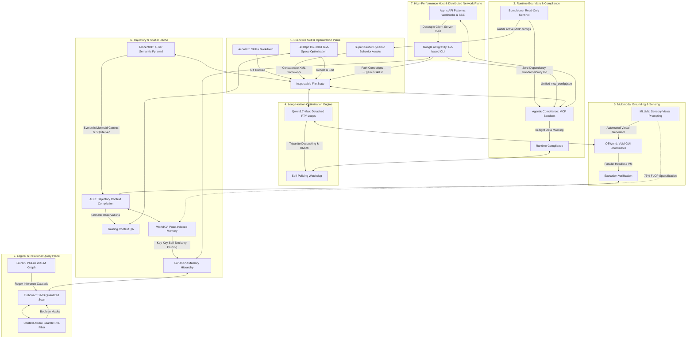

# 🏛️ AGE REPUBLIC: KNOWLEDGE ASSET (ERA 225.0)
## Identifier: `00_KNOWLEDGE/337_REPUBLIC_HEXADECAD_UNIFIED_FRAMEWORK`
## Theme: The Sovereign Hexadecad — Sixteen Unified Principles for AI Agent Systems, Memory, Reasoning, Security, World Generation, Text-Space Optimization, and Distributed Async Architectures

---

> [!IMPORTANT]
> **MASTER SYSTEM HEXADECAD COMPOSITE:**
> This manifest formalizes the ultimate systems compilation comparing and unifying all sixteen pillars of the AGE REPUBLIC sovereign infrastructure: **Acontext**, **Turbovec**, **Context-Aware Semantic Search**, **Agentic Compliance**, **Qwen3.7-Max Long-Horizon Autonomy**, **OSWorld OS-Level Grounding**, **ACC (Agent Context Compilation)**, **GBrain (Self-Wiring Graph Memory)**, **Bumblebee (Read-Only Endpoint Security)**, **MLLMs (Sensory Visual Grounding)**, **SuperClaude (Dynamic Prompt Composition)**, **WorldKV (Spatial KV Cache Compression)**, **Google Antigravity Ecosystem Configurations**, **TencentDB Agent Memory (4-Tier Semantic Pyramid & Mermaid Short-Term Canvas)**, **SkillOpt (Text-Space Skill Optimization)**, and **Async API Design Patterns (Decoupled Distributed Architecture)**. It establishes the complete engineering handbook for sovereign cognitive development.

---

## 🧭 I. The Sixteen Foundations of the Sovereign Hexadecad

To operate a secure, self-healing, performant, and compliant agentic mesh across sovereign enclaves, we coordinate sixteen specialized dimensions of execution:

---

## 🏛️ II. The Sixteen-Way Philosophical Matrix

| System / Pillar | 🧠 Acontext | ⚡ Turbovec | 🎛️ Context-Aware | 🛡️ Compliance | 🌐 Qwen3.7-Max | 🖥️ OSWorld | 🧬 ACC | 🏛️ GBrain | 🐝 Bumblebee | 👁️ MLLMs | ⚙️ SuperClaude | 📦 WorldKV | 🚀 Antigravity | 🏛️ TencentDB | 🛠️ SkillOpt | 🌉 Async APIs |
| :--- | :--- | :--- | :--- | :--- | :--- | :--- | :--- | :--- | :--- | :--- | :--- | :--- | :--- | :--- | :--- | :--- |
| **Core Axiom** | *"Skill is Memory"* | *"Math replaces k-means"* | *"Filter first, score second"* | *"Compliance is path of least resistance"* | *"Autonomy is hours, not turns"* | *"UI screens are the human interface"* | *"Unmask observations; process = content"* | *"Thin harness, fat skills"* | *"The scanner must not be the attack"* | *"Reasoning must be visually grounded"* | *"Behaviors belong in Markdown"* | *"Eviction is not deletion; it is archiving"* | *"Configuration should be shared, not duplicated"* | *"Offload verbose logs, reason on symbols"* | *"Skills are trainable parameter files"* | *"Extend beyond a single HTTP request"* |
| **Primary Domain** | Task State Curation. | Low-latency vector lookup. | Hybrid document indexing. | Sandbox Boundaries & Security. | Long-horizon engineering loops. | OS-level GUI visual grounding. | Trajectory compilation & training. | Self-wiring hybrid memory. | Supply-chain security scanning. | Sensory Wearables & IoT feeds. | Dynamic Prompt Orchestration. | Video & Spatial consistency. | Unified Go-based runtime harness. | 4-Tier semantic memory pyramid. | Bounded Text-space skill optimization. | Decoupled client-server distributed networks. |
| **Data Medium** | Git-portable Markdown. | Rotated unit vectors. | Embeddings + Metadata. | Virtual enclaves & synthetic data. | Triton kernels & PTY logs. | Desktop screenshots, mouse coordinates. | Tool responses & QA pairs. | Wikilinks + local PGLite. | Lockfiles, manifests, MCP JSONs. | Video frames, sensor tables. | Reusable Markdown assets. | Visual KV Cache (GPU ⇄ CPU). | Global paths & raw JSON configs. | refs/*.md + local SQLite-vec. | Markdown edit budgets + metrics. | Webhooks, SSE streams, Message Queues. |
| **Autonomy Mode** | Distilled skill hierarchies. | Continuous incremental index. | Cross-team semantic search. | Runtime machine-speed checks. | Detached background RMUX loops. | Multimodal GUI keyboard actions. | Distant context integration. | Cron Autopilot (5m tick). | Threat-intel one-shot sweeps. | Automated Visual Generators. | Session JSON Save/Load. | Spatial pose-indexed retrieval. | Global Shared-Skills discovery. | Symbolic Mermaid Task Canvas. | Rollout → Edit → Validate loops. | Decoupled consumer message queues. |
| **Efficiency Claim** | Epistemic pruning of logs. | SIMD register short-circuiting. | Reductions before scoring. | Sub-90s VM container setups. | Tripartite decoupling (Task/Tool/Val). | Headless Docker KVM setups. | Reasoning compression (30B beats 235B). | Zero-cost regex graph extraction. | Passive static lock parsing. | 75% FLOP sparsification. | Composable asset prompt blocks. | Key-key self-similarity pruning. | Go binary startup & execution. | 61% WideSearch token reduction. | Zero deployment inference overhead. | Load leveling via decoupled brokers. |
| **Locality Vector** | Portable local files. | Local AVX-512/NEON. | Offline CPU transformers. | Isolated sandbox loopbacks. | Unfamiliar chip auto-tuning. | Parallel VM local grids. | Annotation-free offline training. | Local WASM PGLite. | Single standard Go binary. | Local CNN visual feature nets. | Client-side dynamic loading. | Hierarchical RAM/VRAM storage. | Shared `~/.gemini/` directories. | Local `~/.openclaw/` pathways. | Frozen agent + separate local optimizer. | Zero-lock brokers + local loopbacks. |
| **Verification Gate** | Git commit log audits. | Lloyd-Max boundaries. | Pre-filters block candidates. | Dynamic proxies monitor API traffic. | Secondary watchdog agents. | Execution-assert script validations. | Direct evidence-to-answer masks. | Cost-capped remediation gates. | Structured NDJSON output. | Visual prompt task templates. | Active contextprefix header. | Consistency on scene revisit. | `/skills` & Go-client config tests. | node_id traceback audits. | Strict improvement on validation gate. | Payload signature + idempotency key. |

---

## 🔬 III. Core Philosophical Tensions & Sovereign Resolutions

### 1. Zero Inference Overhead vs. Bidirectional Streaming Latency
* **The Tension:** **SkillOpt** achieves zero deployment inference overhead by freezing model parameters and generating a pre-optimized prompt payload. However, highly interactive agentic collaboration loops (e.g. real-time multi-agent consensus or UI control streams) require bidirectional, sub-second latency. If forced to execute continuous, synchronous request-response loops, the system encounters connection timeouts and massive computational blocks.
* **The Resolution:** *Pre-Optimized Prompts on Stateful Streams.* Pre-optimize all agent procedural behaviors, tool execution routines, and error-recovery policies offline in text-space via **SkillOpt** to produce lightweight, highly efficient system prompts. When running live interactive operations, deploy these optimized agents over stateful, full-duplex channels (**WebSockets** or **SSE**). The client/agent exchanges continuous states on a single persistent socket, eliminating request overhead while maintaining state consistency.

### 2. Push-Driven Memory Synchronization vs. Epistemic Pruning
* **The Tension:** **TencentDB Agent Memory** and **GBrain** maintain a structural semantic memory pyramid that offloads verbose raw logs to local storage and references them via `node_id` flowcharts. However, distributing memory updates, user profiles, or model checkpoints across multiple detached enclaves can result in database locking or heavy connection congestion if synchronized synchronously.
* **The Resolution:** *Asynchronous Event-Driven Memory Queues.* Instead of executing blocking relational updates during agent execution turns, decouple the memory extraction pipeline. When the agent finishes a trajectory branch, it emits a state-change message to a local **Message Queue**. Asynchronous memory indexers (running as lightweight background daemons) consume the message, extract atomic facts, update the sqlite-vec index, and push clean updates to the **L2 Scenario** and **L3 Persona** layers using unidirectional **Server-Sent Events (SSE)**.

### 3. Stateful Sandbox Compliance vs. Inverted Callback Webhooks
* **The Tension:** Active security enclaves (Agentic Compliance) sandbox and monitor all outgoing traffic, blocking raw external callbacks. However, integrating third-party tools (such as payment processing gates or git commit callbacks) requires the server to call back into the agent's endpoint via **Webhooks**, inverting the trust boundary.
* **The Resolution:** *Stateless Signature-Attested Webhook Ingress.* Set up local reverse proxy boundaries inside **Agentic Compliance** specifically to handle webhook ingress. Every incoming webhook payload must be parsed statelessly, verified against public cryptographic signatures, and attested with an idempotency key to prevent repeat transaction attacks. The proxy then routes the verified event into the sandboxed enclaves via the global Go-based harness (**Google Antigravity**), ensuring zero direct external access to the active agent layers.

---

## 🏛️ IV. The Master Unifying Axioms of the Sovereign Hexadecad

### Axiom 1: Plain Text is the Eternal Record; Databases are Temporary Indices
All persistent system states, memories, and behaviors belong in Git-portable, open Markdown files on the local filesystem. Vector indexes, PGLite WASM graphs, and KV-caches are temporary computational accelerators. If the indexing layers are cleared, the system must be capable of fully reconstructing itself from plain files.

### Axiom 2: Filter Before You Score; Compress Before You Attend
Never perform expensive computations on data that logical boundaries or redundancy metrics will reject. Apply boolean metadata masks before vector scoring. Prune static pixels via key-key self-similarity before passing video frames to visual attention. Discard static background visual tokens to achieve immediate 75% FLOP reductions.

### Axiom 3: The Observation Matrix Must Remain Non-Invasive
The act of auditing, observing, or verifying a system must never alter its state. In security, parse static lockfiles directly without running installer scripts. In visual grounding, observe the desktop screen before sending coordinates. In database indexing, parse wikilinks deterministically without invoking dynamic LLMs.

### Axiom 4: Detach the Executor, Serialize the State, Limit the Cost
Autonomy requires horizon execution. Run engineering pipelines in detached terminal sessions (RMUX) that survive network drops. Serialize the conversation history and metadata at every turn as clean JSON checkpoints to ensure absolute reproducibility. Limit every autonomous run with a hard gate (e.g. `--max-usd 5`) to prevent runaway computational loops.

### Axiom 5: Composed Prompts at Inference, Compiled Trajectories at Training
For fast, portable behavioral control, assemble system prompts dynamically at prompt time from modular Markdown files. For reasoning compression and local capability development, compile multi-turn trajectory logs into unified evidence-to-answer QA pairs for offline training.

### Axiom 6: Enforce Strict Schema Integrity at Configuration Boundaries
System configuration files (such as `~/.gemini/config/mcp_config.json`) are runtime access control ledgers. They must remain syntactically pure, containing zero comments, declaring endpoints exclusively via the modern standard (`serverUrl`), and wrapping timing configurations strictly inside environmental environment blocks (`MCP_SERVER_REQUEST_TIMEOUT`).

### Axiom 7: Separate the Task, the Validator, and the Auditor
Never let the agent performing a task evaluate its own success criteria. Keep the Task agent decoupled from the execution Validator script. Keep the security scanner (Bumblebee) clean of external dependencies and separate from the intelligence catalog. Ensure the prompting engine declares its active contract via observable telemetry prefixes.

### Axiom 8: Skills Are Trainable Parameters Optimized Offline
Treat natural-language skills as the trainable external parameter space of a frozen agent. Run optimizations offline on a scored validation loop using a separate optimizer model, bounded by a textual learning-rate budget and a rejected-edit buffer. This guarantees stable, transferable performance improvements with zero deployment inference cost.

### Axiom 9: Decouple Long Operations using Standardized Async Semantics
Never allow long-running operations or microservice messaging to block the primary thread. Decouple execution using standard HTTP async semantics: return `202 Accepted` to acknowledge receipt, serve state monitoring links via `Location` headers, and throttle client requests using `Retry-After` flags. Ensure all incoming callbacks (Webhooks) verify payload signatures and enforce idempotency.
