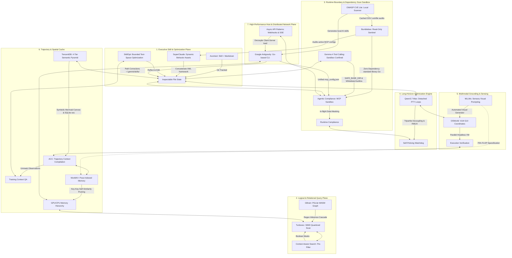

# 🏛️ AGE REPUBLIC: KNOWLEDGE ASSET (ERA 225.0)
## Identifier: `00_KNOWLEDGE/337_REPUBLIC_OCTODECAD_UNIFIED_FRAMEWORK`
## Theme: The Sovereign Octodecad — Eighteen Unified Principles for AI Agent Systems, Memory, Reasoning, Security, World Generation, Text-Space Optimization, Distributed Async Architectures, Confined Tool Execution, and Local-First Vulnerability Scanning

---

> [!IMPORTANT]
> **MASTER SYSTEM OCTODECAD COMPOSITE:**
> This manifest formalizes the ultimate systems compilation comparing and unifying all eighteen pillars of the AGE REPUBLIC sovereign infrastructure: **Acontext**, **Turbovec**, **Context-Aware Semantic Search**, **Agentic Compliance**, **Qwen3.7-Max Long-Horizon Autonomy**, **OSWorld OS-Level Grounding**, **ACC (Agent Context Compilation)**, **GBrain (Self-Wiring Graph Memory)**, **Bumblebee (Read-Only Endpoint Security)**, **MLLMs (Sensory Visual Grounding)**, **SuperClaude (Dynamic Prompt Composition)**, **WorldKV (Spatial KV Cache Compression)**, **Google Antigravity Ecosystem Configurations**, **TencentDB Agent Memory (4-Tier Semantic Pyramid & Mermaid Short-Term Canvas)**, **SkillOpt (Text-Space Skill Optimization)**, **Async API Design Patterns (Decoupled Distributed Architecture)**, **Gemma 4 agentic Tool Calling (Confined Local Sandboxes)**, and **OWASP CVE Lite CLI (Local Dependency Scanner)**. It establishes the complete engineering handbook for sovereign cognitive development.

---

## 🧭 I. The Eighteen Foundations of the Sovereign Octodecad

To operate a secure, self-healing, performant, and compliant agentic mesh across sovereign enclaves, we coordinate eighteen specialized dimensions of execution:

---

## 🏛️ II. The Eighteen-Way Philosophical Matrix

| System / Pillar | 🧠 Acontext | ⚡ Turbovec | 🎛️ Context-Aware | 🛡️ Compliance | 🌐 Qwen3.7-Max | 🖥️ OSWorld | 🧬 ACC | 🏛️ GBrain | 🐝 Bumblebee | 👁️ MLLMs | ⚙️ SuperClaude | 📦 WorldKV | 🚀 Antigravity | 🏛️ TencentDB | 🛠️ SkillOpt | 🌉 Async APIs | 🛠️ Gemma 4 Tool | 🛡️ CVE Lite |
| :--- | :--- | :--- | :--- | :--- | :--- | :--- | :--- | :--- | :--- | :--- | :--- | :--- | :--- | :--- | :--- | :--- | :--- | :--- |
| **Core Axiom** | *"Skill is Memory"* | *"Math replaces k-means"* | *"Filter first, score second"* | *"Compliance is path of least resistance"* | *"Autonomy is hours, not turns"* | *"UI screens are the human interface"* | *"Unmask observations; process = content"* | *"Thin harness, fat skills"* | *"The scanner must not be the attack"* | *"Reasoning must be visually grounded"* | *"Behaviors belong in Markdown"* | *"Eviction is not deletion; it is archiving"* | *"Configuration should be shared, not duplicated"* | *"Offload verbose logs, reason on symbols"* | *"Skills are trainable parameter files"* | *"Extend beyond a single HTTP request"* | *"Perimeter first; key access second"* | *"Scan offline; fix instantly"* |
| **Primary Domain** | Task State Curation. | Low-latency vector lookup. | Hybrid document indexing. | Sandbox Boundaries & Security. | Long-horizon engineering loops. | OS-level GUI visual grounding. | Trajectory compilation & training. | Self-wiring hybrid memory. | Supply-chain security scanning. | Sensory Wearables & IoT feeds. | Dynamic Prompt Orchestration. | Video & Spatial consistency. | Unified Go-based runtime harness. | 4-Tier semantic memory pyramid. | Bounded Text-space skill optimization. | Decoupled client-server distributed networks. | Confined local sandbox file & code execution. | Local-first dependency vulnerability scanning. |
| **Data Medium** | Git-portable Markdown. | Rotated unit vectors. | Embeddings + Metadata. | Virtual enclaves & synthetic data. | Triton kernels & PTY logs. | Desktop screenshots, mouse coordinates. | Tool responses & QA pairs. | Wikilinks + local PGLite. | Lockfiles, manifests, MCP JSONs. | Video frames, sensor tables. | Reusable Markdown assets. | Visual KV Cache (GPU ⇄ CPU). | Global paths & raw JSON configs. | refs/*.md + local SQLite-vec. | Markdown edit budgets + metrics. | Webhooks, SSE streams, Message Queues. | Path-normalized directories & whitelisted builtins. | Package lockfiles + local OSV database. |
| **Autonomy Mode** | Distilled skill hierarchies. | Continuous incremental index. | Cross-team semantic search. | Runtime machine-speed checks. | Detached background RMUX loops. | Multimodal GUI keyboard actions. | Distant context integration. | Cron Autopilot (5m tick). | Threat-intel one-shot sweeps. | Automated Visual Generators. | Session JSON Save/Load. | Spatial pose-indexed retrieval. | Global Shared-Skills discovery. | Symbolic Mermaid Task Canvas. | Rollout → Edit → Validate loops. | Decoupled consumer message queues. | Model-directed arithmetic & filesystem verification. | Git hooks + CI action check gates. |
| **Efficiency Claim** | Epistemic pruning of logs. | SIMD register short-circuiting. | Reductions before scoring. | Sub-90s VM container setups. | Tripartite decoupling (Task/Tool/Val). | Headless Docker KVM setups. | Reasoning compression (30B beats 235B). | Zero-cost regex graph extraction. | Passive static lock parsing. | 75% FLOP sparsification. | Composable asset prompt blocks. | Key-key self-similarity pruning. | Go binary startup & execution. | 61% WideSearch token reduction. | Zero deployment inference overhead. | Load leveling via decoupled brokers. | Offloading arithmetic to interpreter (no hallucination). | Ingests 217k OSV advisories under 9 seconds. |
| **Locality Vector** | Portable local files. | Local AVX-512/NEON. | Offline CPU transformers. | Isolated sandbox loopbacks. | Unfamiliar chip auto-tuning. | Parallel VM local grids. | Annotation-free offline training. | Local WASM PGLite. | Single standard Go binary. | Local CNN visual feature nets. | Client-side dynamic loading. | Hierarchical RAM/VRAM storage. | Shared `~/.gemini/` directories. | Local `~/.openclaw/` pathways. | Frozen agent + separate local optimizer. | Zero-lock brokers + local loopbacks. | Local folder normalizations & seccomp-restricted exec. | Local cached OSV; zero outbound traffic. |
| **Verification Gate** | Git commit log audits. | Lloyd-Max boundaries. | Pre-filters block candidates. | Dynamic proxies monitor API traffic. | Secondary watchdog agents. | Execution-assert script validations. | Direct evidence-to-answer masks. | Cost-capped remediation gates. | Structured NDJSON output. | Visual prompt task templates. | Active contextprefix header. | Consistency on scene revisit. | `/skills` & Go-client config tests. | node_id traceback audits. | Strict improvement on validation gate. | Payload signature + idempotency key. | Prefix check resolving within `SAFE_BASE_DIR`. | `--fail-on` exits + SARIF annotation uploads. |

---

## 🔬 III. Core Philosophical Tensions & Sovereign Resolutions

### 1. High-Speed Local Lockfile Auditing vs. In-Flight Data Sandboxing
* **The Tension:** **OWASP CVE Lite CLI** scans developer directories locally to detect dependency risks prior to execution. However, during execution, sandboxed tool loops (like **Gemma 4 Tool Calling** or **Agentic Compliance**) dynamically download mock data packages, run third-party tool scripts, or compile code. If the dynamic packages imported by whitelisted python interpreters are vulnerable, static scanners cannot block in-flight execution.
* **The Resolution:** *Pre-Push Static Gating with Runtime Whitelists.* Run **OWASP CVE Lite CLI** locally as a `.git/hooks/pre-commit` check to audit package lockfiles (npm, pnpm, Yarn, Bun) against cached OSV database files before code is staged. During runtime tool calling inside whitelisted python environments, restrict all dynamic library imports exclusively to safe, pre-vetted modules pre-compiled inside the isolated VM enclaves, neutralizing runtime injection attempts.

### 2. Standard-Library Go Audits vs. Package-Version Mapping
* **The Tension:** **Bumblebee** and **OWASP CVE Lite CLI** represent two distinct paradigms of security sentinel analysis. Bumblebee is a zero-dependency Go binary built to audit active configuration formats, developer profiles, and MCP server schemas. CVE Lite CLI is tailored specifically to parse package registries (npm, Yarn, Bun) and version ranges against 217,000 OSV records.
* **The Resolution:** *Dual-Sentinel Ingest pipeline.* Deploy Bumblebee as the parent sentinel auditing system configurations and folder-level compliance schemas. Deploy CVE Lite CLI specifically to evaluate third-party package dependency trees. Both engines must operate completely offline against local caches, outputting structured JSON/SARIF datasets directly to the central **Google Antigravity** harness, creating a comprehensive local threat intelligence matrix.

### 3. Local Offline Databases vs. Zero Inference Latency
* **The Tension:** Maintaining local databases (like the 217,000 OSV records in CVE Lite CLI, or the relational tables in GBrain) requires periodic sync operations. If the synchronization blocks active agent execution, inference loops suffer from latency spikes.
* **The Resolution:** *Asynchronous Off-Hour Database Caching.* Perform database downloads and cache compilations asynchronously using decoupled, background **Async API Design Patterns** (Message Queues and background cron daemons). The database sync processes database ingestion tasks in under 9 seconds during quiet host cycles. The agent itself queries only the local, pre-compiled static cache files during tool calling, maintaining zero network dependency and high execution speeds.

---

## 🏛️ IV. The Master Unifying Axioms of the Sovereign Octodecad

### Axiom 1: Plain Text is the Eternal Record; Databases are Temporary Indices
All persistent system states, memories, and behaviors belong in Git-portable, open Markdown files on the local filesystem. Vector indexes, PGLite WASM graphs, and KV-caches are temporary computational accelerators. If the indexing layers are cleared, the system must be capable of fully reconstructing itself from plain files.

### Axiom 2: Filter Before You Score; Compress Before You Attend
Never perform expensive computations on data that logical boundaries or redundancy metrics will reject. Apply boolean metadata masks before vector scoring. Prune static pixels via key-key self-similarity before passing video frames to visual attention. Discard static background visual tokens to achieve immediate 75% FLOP reductions.

### Axiom 3: The Observation Matrix Must Remain Non-Invasive
The act of auditing, observing, or verifying a system must never alter its state. In security, parse static lockfiles directly without running installer scripts. In visual grounding, observe the desktop screen before sending coordinates. In database indexing, parse wikilinks deterministically without invoking dynamic LLMs.

### Axiom 4: Detach the Executor, Serialize the State, Limit the Cost
Autonomy requires horizon execution. Run engineering pipelines in detached terminal sessions (RMUX) that survive network drops. Serialize the conversation history and metadata at every turn as clean JSON checkpoints to ensure absolute reproducibility. Limit every autonomous run with a hard gate (e.g. `--max-usd 5`) to prevent runaway computational loops.

### Axiom 5: Composed Prompts at Inference, Compiled Trajectories at Training
For fast, portable behavioral control, assemble system prompts dynamically at prompt time from modular Markdown files. For reasoning compression and local capability development, compile multi-turn trajectory logs into unified evidence-to-answer QA pairs for offline training.

### Axiom 6: Enforce Strict Schema Integrity at Configuration Boundaries
System configuration files (such as `~/.gemini/config/mcp_config.json`) are runtime access control ledgers. They must remain syntactically pure, containing zero comments, declaring endpoints exclusively via the modern standard (`serverUrl`), and wrapping timing configurations strictly inside environmental environment blocks (`MCP_SERVER_REQUEST_TIMEOUT`).

### Axiom 7: Separate the Task, the Validator, and the Auditor
Never let the agent performing a task evaluate its own success criteria. Keep the Task agent decoupled from the execution Validator script. Keep the security scanner (Bumblebee) clean of external dependencies and separate from the intelligence catalog. Ensure the prompting engine declares its active contract via observable telemetry prefixes.

### Axiom 8: Skills Are Trainable Parameters Optimized Offline
Treat natural-language skills as the trainable external parameter space of a frozen agent. Run optimizations offline on a scored validation loop using a separate optimizer model, bounded by a textual learning-rate budget and a rejected-edit buffer. This guarantees stable, transferable performance improvements with zero deployment inference cost.

### Axiom 9: Decouple Long Operations using Standardized Async Semantics
Never allow long-running operations or microservice messaging to block the primary thread. Decouple execution using standard HTTP async semantics: return `202 Accepted` to acknowledge receipt, serve state monitoring links via `Location` headers, and throttle client requests using `Retry-After` flags. Ensure all incoming callbacks (Webhooks) verify payload signatures and enforce idempotency.

### Axiom 10: Enforce Path Normalization and Whitelists at the Local Boundary
When exposing host system operations to model tool calls, safety is a system-level constraint. Enforce hard workspace path-traversal guards (`SAFE_BASE_DIR` prefix checking) and restrict Python interpreters to whitelisted builtins. Gracefully return structured error tokens to allow model self-correction without system crashes.

### Axiom 11: Shift Left Security via Local-First, Zero-Cloud Static Gating
Dependency vulnerability scans must run locally in the developer's terminal prior to code commits. Parse project lockfiles against cached, offline Open Source Vulnerabilities (OSV) databases to output clear, actionable remediation commands. Decouple scans from cloud reliance to ensure 100% data sovereignty and air-gapped readiness.
