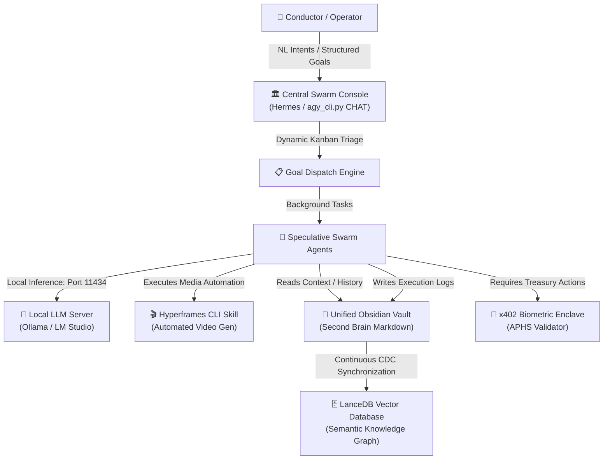

# 🏛️ Case Study & Alignment Brief: Agent Operating System (Agent OS) Paradigms
## Substrate Alignment for Unified Memory Vaults, Local LLM Orchestrations, and Hyperframes Automation
**Classification:** sovereign intelligence brief  
**Status:** validated & cataloged  
**Epoch:** ERA 232.0  
**Validates:** Thesis [319/335] (Dismantling Centralized SaaS Subscriptions via Local Compute & Memory Enclaves)

---

## 🏛️ Rationale & Alignment

The **Age Republic** asserts that the cognitive efficiency of a sovereign swarm is directly bounded by its communication and context retention overhead. The legacy workflow model—where operators copy-paste payloads between isolated tabs (ChatGPT, Claude, Notion, local terminal shells)—creates a massive **loss of context and temporal memory**. This cognitive friction represents an unacceptable operational tax.

The concept of the **Agent Operating System (Agent OS)**, popularized by recent cognitive engineering methodologies, formally validates the **Unified Cockpit** thesis of the Age Republic. By creating a unified hub where autonomous agents execute background workflows, read localized data structures, and log executions back into a central memory vault, the Agent OS models cognitive intelligence as a closed-loop system. This brief maps these paradigms directly into the Republic's sovereign stack.

---

## 🛠️ The Technical Manifold & Analysis

An Agent OS transforms fragmented software tools into a unified, local computational machine:



### 1. Centralized Command Consoles: Hermes vs. OpenClaw
*   **The Hermes Kanban Paradigm:** Hermes functions as a highly optimized, structured workspace designed specifically to execute multi-agent workflows. Its integrated **Kanban Board** layout shifts interaction from free-form chat boxes to goal-oriented milestone completion (e.g., executing market analysis, writing smart contracts, and triggering payouts).
*   **Republic Alignment:** In our ecosystem, the `agy_cli.py` conversational parser and `sovereign_mcp_server.py` pending actions queue function as the headless command console, managing enclaves and triage parameters in a deterministic timeline.

### 2. Obsidian "Second Brain" as the Local Memory Vault
*   **Sovereign Storage Invariant:** SaaS databases (e.g., Notion) represent central points of corporate failure and privacy leakage. Goldie's recommendation of **Obsidian** is highly aligned with our sovereignty principles. It stores data locally in plain Markdown files, allowing agents to index and retrieve file structures cleanly without network-dependent APIs.
*   **The Positive Feedback Loop:** 
    $$\text{Conversation / Task Ingress} \rightarrow \text{Obsidian Markdown Vault} \rightarrow \text{Contextual Retrieval} \rightarrow \text{Optimized Swarm Response}$$
    This loop builds a self-optimizing knowledge graph that ensures subsequent automations adapt to the conductor's specific operations and historic business facts.

### 3. Decoupling Token Taxation via Local LLMs (Ollama & LM Studio)
*   **Zero-Cost Execution Bounds:** Relying on external commercial APIs for continuous background agent execution generates massive token expenses and operational dependencies. 
*   **The Local Solution:** Integrating **Ollama** or **LM Studio** directly into the Agent OS allows agents to process complex workflows using high-performance local weights (e.g., Qwen-2.5-Coder, Gemma 2, Llama 3) over port `11434` without incurring external API taxes or leaking secure intellectual property to cloud corporate hubs.

### 4. Media Sovereignty (Hyperframes CLI Video Automation)
*   **Autonomous Asset Creation:** Instead of paying for SaaS video rendering platforms, the Agent OS utilizes **Hyperframes CLI** locally.
*   **Skill Integration:** The command console integrates Hyperframes as an executable "Skill". The agent writes video scripts, generates raw assets, and compiles finalized promotional or educational videos programmatically on physical hardware, achieving total control over media assets.

---
## 📊 Comparison Matrix: Agent OS vs. AGE REPUBLIC Unified Cockpit

| Feature Vector | Julian Goldie's Agent OS Stack | AGE REPUBLIC Unified Cockpit |
| :--- | :--- | :--- |
| **Command Interface** | Hermes Kanban Board | Conversational parser (`agy_cli.py say`) |
| **Primary Memory Layer** | Local Obsidian Markdown Vault | SQLite `memory_vault.db` & LanceDB Vector Store |
| **Local LLM Engine** | Ollama / LM Studio (Gemma 2 / Qwen) | Quad-Mode Bridge (`ICP_SOVEREIGN_AI_BRIDGE.py`) |
| **Automated Media Gen** | Hyperframes CLI + Digital Avatar APIs | Custom programmatic media pipelines |
| **Hardware Attestation** | None (Soft credentials) | FIDO2 / YubiKey `.heavyskill_Antigravity.key` |
| **Treasury Governance** | Manual/Soft API integrations | Cryptographic APHS (Human-Signed) protocol |

### Matrix Summary of Structural Trade-offs

| Tool / Framework | Structural Role | Primary Optimization Metric | Primary Limitation |
| --- | --- | --- | --- |
| **Agent OS (Hermes)** | Centralized Operations Hub | High contextual retention; multi-agent execution | Requires baseline setup and configuration |
| **Direct Prompting (Claude Code)** | Tactical Problem Solver | Maximum reasoning density for complex debugging | No automated background execution or persistence |
| **Local LLMs (Ollama/LM Studio)** | Compute Engine | Infinite execution at zero marginal token cost | High local hardware requirements |
| **Unified Memory (Obsidian)** | Local Knowledge Base | High retrieval precision; local data privacy | Requires structured file hygiene |

---

## 🧠 Formal Logic Model (Sovereign Exposition)

### Argument I: The Operational Necessity of an Agent OS
This argument addresses the cognitive and technical inefficiency of manual tool management, establishing why a centralized system is required for business scalability.
*   **Premise 1 ($P_1$):** If an operator manually switches between disparate AI tool interfaces (e.g., separate browser tabs for Claude, OpenClaw, and terminals), conversational and situational context is continuously fragmented or lost.
*   **Premise 2 ($P_2$):** A continuous loss of contextual history directly forces the operator to spend critical operational time managing tools, copying/pasting data, and re-prompting rather than executing tasks.
*   **Premise 3 ($P_3$):** An Agent OS unifies all distinct AI agents, data repositories, and workspace outputs into a single command interface.
*   **Conclusion ($C$):** Therefore, implementing an Agent OS eliminates manual context fragmentation, shifting the operator's operational capacity from tool management to automated task execution.

### Argument II: Comparative Advantage of Framework Deployment (Hermes vs. OpenClaw)
This is a pragmatic argument designed to prevent technical friction and user overwhelm during initial implementation.
*   **Premise 1 ($P_1$):** Deploying multiple complex, open-source AI agent frameworks simultaneously from scratch causes high technical friction and user overwhelm.
*   **Premise 2 ($P_2$):** Both Hermes and OpenClaw act as agent frameworks, but Hermes runs stably out-of-the-box, has lower bug density, and features an integrated Kanban board designed for structured business outputs.
*   **Premise 3 ($P_3$):** OpenClaw is historically significant but possesses higher bug density and higher implementation friction.
*   **Conclusion ($C$):** Therefore, a business operator maximizing early implementation success should deploy Hermes first to stabilize automated goals before attempting to integrate OpenClaw.

### Argument III: The Systemic Feedback Loop of Localized Memory
This argument formalizes how to solve the problem of "generic AI outputs" through a closed-loop data architecture using localized markdown files (Obsidian).
*   **Premise 1 ($P_1$):** Standard, cloud-hosted LLM interactions output generic responses because they lack continuous access to an individual's real-time, historical, and personal context.
*   **Premise 2 ($P_2$):** If an Agent OS is integrated with a local Obsidian vault, the active agents can programmatically query the user's historical context graph before generating outputs.
*   **Premise 3 ($P_3$):** If the agents automatically write and log the results of every completed task back into that same local vault, the volume of historical context increases.
*   **Conclusion ($C$):** Therefore, integrating an Agent OS with a local Obsidian vault creates a self-optimizing, positive feedback loop where the system's outputs become increasingly customized, hyper-targeted, and accurate the more it is utilized.

---

## 🏛️ Lessons, Wisdom, and Philosophical Axioms

### 1. The Systems Philosophy: Shift from Operator to Architect
Most people treat AI as an **on-demand oracle**—they approach it only when they have a burning question or an immediate task, prompting it from scratch every single time. This is a linear, transactional relationship.
*   **The Wisdom:** True leverage requires shifting from an *operator* (doing the work or manually driving the tool) to a *systems architect* (building an environment where work happens autonomously).
*   **The Philosophical Lesson:** Your output should not be limited by your daily physical energy, but by the structural integrity of the systems you design. An Agent OS changes your role from a worker bee to a CEO managing a digital workforce that runs on scheduled timers in the background.

### 2. The Information Lesson: The Compounding Value of Context
In the modern information economy, raw intelligence has become a cheap commodity. Base models (like raw Claude or GPT instances) possess massive, generalized knowledge but zero specific understanding of *you*, your business nuances, or your historical decisions.
*   **The Wisdom:** Specialized context is the only true competitive advantage left. A system that remembers and logs every interaction creates **informational compound interest**.
*   **The Philosophical Lesson:** Every time you use a standard, disconnected AI tab, your data context vanishes when you close the browser. It is a disposable interaction. By funneling all actions through a localized, interconnected vault (like Obsidian), every action you take deposits a layer of sediment that enriches the soil for the next action. The system transforms from a static software tool into an evolving digital extension of your mind.

### 3. The Implementation Rule: Subtraction Precedes Addition
When engineers and entrepreneurs discover AI automation, their natural instinct is to build massive, sprawling, highly complex webs of tools all at once (e.g., trying to wire up Hermes, OpenClaw, local LLMs, and video generation on day one). This almost always results in systemic collapse and operational paralysis.
> **The Philosophical Rule:** **Simplicity scales; complexity fails.**
*   **The Wisdom:** Goldie’s advice to "focus on Hermes first, get 1 goal running, then 10, then add layers" is a classic lesson in **Gall’s Law**: *A complex system that works is invariably found to have evolved from a simple system that worked.*
*   **The Philosophical Lesson:** Build the simplest viable core loop first. Ensure it works flawlessly out-of-the-box before introducing variables like local models or multi-framework integrations. To build a robust system, you must master the art of sequential, disciplined expansion.

### 4. The Architectural Divide: Tactical vs. Strategic Space
The video establishes a clear distinction between using an Agent OS and using a direct coding prompt tool (like Claude Code).
```
┌────────────────────────────────────────────────────────┐
│                   OPERATIONAL SPACE                    │
├───────────────────────────┬────────────────────────────┤
│     TASTICAL INTERFACE    │    STRATEGIC ARCHITECTURE  │
│       (Claude Code)       │         (Agent OS)         │
├───────────────────────────┼────────────────────────────┤
│  • 1-on-1 Brainstorming   │  • Systems Management      │
│  • High Cognitive Density │  • Low Friction Execution  │
│  • Solves Complex Chaos   │  • Scales Known Frameworks │
└───────────────────────────┴────────────────────────────┘
```
*   **The Wisdom:** You must know whether you are fighting a fire or building an engine. Direct prompting is for active problem-solving (two entities in a room working through a hard problem). The Agent OS is for executing established processes.
*   **The Philosophical Lesson:** Do not mistake tactical fire-fighting for strategic progress. If you are spending hours everyday manually prompting an AI to do the exact same data-cleaning or research task, you haven't built a business—you've built an AI-assisted job for yourself.

### 5. Sovereignty Philosophy: Localize the Core, Outsource the Compute
There is a profound philosophical choice between relying entirely on centralized cloud ecosystems (Notion, OpenAI's web interface) versus localized ecosystems (Obsidian markdown files, local LLMs via Ollama).
*   **The Wisdom:** By keeping your "Second Brain" stored in local, open-format `.md` files on your hard drive, you maintain complete data sovereignty. Cloud LLMs are treated merely as interchangeable utility companies—compute engines plugged into your local data pool via API.
*   **The Philosophical Lesson:** Protect your data core. If an AI provider changes their terms, hikes their prices, or goes offline, an operator dependent on their cloud interface loses everything. An architect who owns their data vault locally can simply unplug one API, wire in a local open-source model, and keep their entire operational ecosystem running without missing a beat.

---

## 🛡️ Sovereign Action Plan

1.  **Map Obsidian Vault to LanceDB Sync:** Set up a file-watcher script that reads the operator's local Obsidian markdown directory and automatically synchronizes mutations into the LanceDB `audit_trail` table.
2.  **Add Ollama Local Route to Bridge:** Ensure the `ICP_SOVEREIGN_AI_BRIDGE.py` includes a `local` mode that communicates directly with `http://localhost:11434` to leverage Ollama for background agent reasoning.
3.  **Integrate CLI Skills:** Embed Hyperframes CLI or localized ffmpeg media renderers into the `agy_cli.py` environment to automate sovereign marketing and visualization material delivery.

---
**Status: INDEXED, FORMALIZED, INTEGRATED & ENCRYPTED | Anchored to ERA 232.0 | COGNITIVE VAULTS HARDENED**
