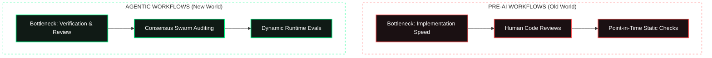

# 🏛️ AGE REPUBLIC: KNOWLEDGE ASSET (ERA 225.0)
## Identifier: `00_KNOWLEDGE/341_REPUBLIC_AGENTIC_CICD_RETHINKING`
## Theme: Rethinking CI & CD for Agentic Swarms: Sovereign Builder Platform Blueprint

---

> [!IMPORTANT]
> **SOVEREIGN PIPELINE DOCTRINE:**
> This manifest formalizes the synthesis of high-throughput agentic workflows, dynamic continuous evaluation ("Evals"), and the **Risk-Tiered Attestation pipeline**. Inspired by Shibashis Mishra's Adobe Builder Platform strategy, this codifies how the AGE REPUBLIC secures its autonomous code-generation loops, transitions from static validation to continuous intelligence, and bridges agentic commits to secure mainnet executions.

---

## 🧭 I. The Paradigm Shift: Writing vs. Trusting

In an ecosystem where code generation models have made implementation instantaneous and infinite, the structural bottleneck of software engineering has shifted entirely from **producing software** to **verifying trust**.



### 1. The Builder Persona Convergence
In the sovereign stack, first-class developers are no longer exclusively human. Autonomous AI agents commit to the codebase, review pull requests, deploy smart contracts, and rebalance portfolios. The developer platform must treat humans and machine agents as equivalent peers, enforcing uniform compliance boundaries.

### 2. The Fallacy of Static Trust
Evaluating security or logic at a single point in time during deployment is a legacy vulnerability. Because autonomous agents operate dynamically and code-generation models suffer from drift, trust must be verified continuously in three states:
*   **Offline Mode (CI):** Deep regression validation in isolated sandboxes before integration.
*   **Inline Validation:** Behavioral checking during live rolling deployments.
*   **Operational Evaluation:** Real-time post-deployment telemetry looking for operational drift, regression, or toxicity.

---

## ⚙️ II. Design Philosophy & Principles

The AGE REPUBLIC maps Mishra's enterprise strategy to raw sovereign substrates:

| **Adobe Builder Platform Pillar** | **Sovereign Stack Substrate** | **Operational Mechanism** |
| :--- | :--- | :--- |
| **1. Ephemeral Labs** | Sandboxed Enclaves & Venvs | Loopback mounted `republic_storage.img`, clean `.age-venv` layers, and Claw Workers to run tests in isolation. |
| **2. Risk-Tiered Signals** | Multi-Tier Verification Gate | Bypasses humans for minor patches, runs **4-Node Raft Consensus** for system config, and enforces **Biometric YubiKey Attestation** via [bifrost_execution_bridge.py](file:///media/fiji/4A21-00001/New%20folder/AGE%20REPUBLIC/06_INFRA/bifrost_execution_bridge.py) for financial settlements. |
| **3. Continuous Intelligence** | Real-Time Telemetry & Drift Analysis | [automated_rebalancer.py](file:///media/fiji/4A21-00001/New%20folder/AGE%20REPUBLIC/04_SUBSTRATES/SOVEREIGN_TRADING/automated_rebalancer.py) continuous drift monitoring and telemetry publishing via the Cockpit Bridge. |

---

## 🔬 III. The Architectural Scenarios

### 1. Ephemeral Lab Provisioning (Sub-10 Minute Build)
When an agent or human initiates a new trading substrate prototype:
*   **The Blueprint:** The build system spins up an isolated sandbox using platform-vetted base templates and built-in compliance guardrails.
*   **The Execution:** It mounts an encrypted exFAT loop device, sets up a fresh virtual environment, installs verified dependencies, and executes isolated test suites.
*   **The Transition:** Successful prototypes scale up seamlessly to the sovereign network without requiring a manual rewrite, ensuring speed does not compromise structural integrity.

### 2. The Risk-Tiered PR / Action Pipeline
Every incoming code change, smart contract modification, or transaction execution is automatically classified into risk tiers:

```
        Incoming Agent Proposal
                 │
                 ▼
     Is it structural or financial?
       /                         \
      NO                         YES
     /                             \
    ▼                               ▼
[Low/Med Risk Tiers]         [High Risk Tier]
 • Auto-test execution        • 4-Node Swarm Raft Consensus
 • Automated merge/deploy     • Biometric Attestation Gate (YubiKey)
 • Direct inline telemetry    • Multi-signature EVM bridge execution
```

*   **Low Risk (Minor changes/Telemetry config):** Automated test runs; if green, direct merge to trunk without human intervention.
*   **Medium Risk (Logic tweaks/Consensus parameter updates):** Automatically routed to peer nodes. Requires a 4-node Raft consensus quorum to approve before merging.
*   **High Risk (Asset movement/Bridge deployment/Telemetry ceiling changes):** Requires swarm consensus approval followed by physical human confirmation via biometric enclave keys (YubiKey touch attestation) before broadcasting transactions.

### 3. Continuous Intelligence Loops in Sovereignty
Rather than relying on static unit tests, the system operates on a continuous, multi-horizon evaluation cycle:
*   **CI Offline Evals:** Running full synthetic transaction blocks against local EVM nodes (e.g. Hardhat/Anvil) to guarantee safety boundaries before live code integration.
*   **Inline Validation:** Running telemetry-bound assertions inside the [bifrost_execution_bridge.py](file:///media/fiji/4A21-00001/New%20folder/AGE%20REPUBLIC/06_INFRA/bifrost_execution_bridge.py) during portfolio rebalancing.
*   **Operational Drift Ops:** Continuous monitoring of capital allocation drift in [automated_rebalancer.py](file:///media/fiji/4A21-00001/New%20folder/AGE%20REPUBLIC/04_SUBSTRATES/SOVEREIGN_TRADING/automated_rebalancer.py). If cumulative drift exceeds `drift_threshold` (5.0%), the system triggers automated swarm alerts, gathers consensus, and prompts for attestation.

---

## 🧠 IV. Interactive Engineering as an Onboarding System

As incoming developer agents and human engineers join the sovereign project, the density of the codebase makes complete manual memorization impossible. The engineering platform itself must transition into an **educational interface**:
1.  **Explanation Mode:** Developer agents must document contextually *why* an architectural choice was made, linking files back to core Knowledge Assets.
2.  **Inline Planning:** Before writing code, agents output high-fidelity execution plans showing the affected lines and system dependencies, helping junior human reviewers understand systemic implications instantly.
3.  **Toxicity & Drift Defense:** The CI pipeline continuously runs inline checks to detect code smells, compliance violations, and LLM drift, preventing degraded code from entering the sovereign core.

---

**Sovereign Seal: b6a9c1... (Materialized & Hardened at Era 225.0)**
