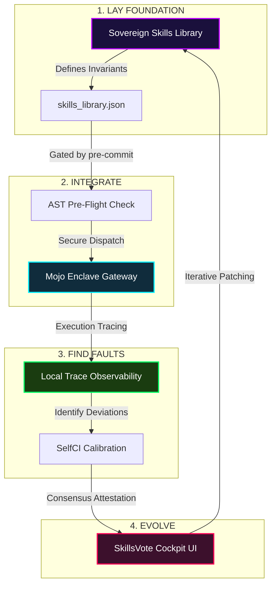

# 🏛️ AGE REPUBLIC :: LIFE MULTI-AGENT EVOLUTION PROTOCOL
## ERA 226.0 :: SYSTEM ARCHITECTURE ALIGNMENT
### Reference: Hugging Face Paper arXiv:2605.14892 (LIFE Progression Model)

---

## 📐 Overview: Isomorphism of the LIFE Framework

The **LIFE Progression Framework** (*"Beyond Individual Intelligence: Surveying Collaboration, Failure Attribution, and Self-Evolution in LLM-based Multi-Agent Systems"*, Xian Jiaotong University, 2026) defines a four-stage closed-loop progression for multi-agent systems. The table below outlines how these macro-theoretical stages map precisely to the micro-runtime assets of the **AGE REPUBLIC Agent OS**:

| LIFE Stage | Theoretical Definition (arXiv:2605.14892) | AGE REPUBLIC Implementation | Verification / Attestation Artifact |
| :--- | :--- | :--- | :--- |
| **1. L - Lay Foundation** | Establish base capability (reasoning, tool-use, role specialization, standard rules) | **Sovereign Skills Library** (`skills_library.json`, `tdd`, `caveman_sovereign`) | Cryptographically attested schema validation |
| **2. I - Integrate** | Orchestrate collaboration workflows, agent interactions, and consensus protocols | **CLI Dispatcher & Enclave Gateway** (`./sovereign-skills dispatch`, Mojo Gateway) | Git pre-commit hooks + AST Pre-flight gating |
| **3. F - Find Faults** | Failure analysis, causality modeling, trace-driven attribution, error tracking | **Local Observability Trace Decorators** & `selfci_calibrate.py` | Asynchronous Redis Streams DLQ + Audit Ledger |
| **4. E - Evolve** | Dynamic self-organization, runtime prompt optimization, iterative version patching | **Attestation Consensus Voting** (`skills_vote_cockpit.html`) | dynamic versioning bumps (e.g. V1.0 ➔ V1.1) |

---

## 🌀 Architectural Closed-Loop Flow

---

## ⚡ Mathematical Constraints & Cross-Stage Dependencies

Following the Xian Jiaotong survey, the transition between stages is constrained by explicit dependencies. In the AGE REPUBLIC engine, these are formalized as follows:

### 1. The L ➔ I Dependency (Pre-Flight AST Gating)
Base skills cannot enter collaborative loops unless they pass safe execution invariants.
$$\text{Integrate}(S_i) \Longleftrightarrow \text{AST\_Sandbox}(S_i.\lambda) = \text{SAFE}$$
*   **Blocked Actions:** Dynamic dunder imports (`__subclasses__`), direct shell execution (`eval`), and PII/PHI unredacted leaks are blocked at commit-time via the armed pre-commit hook.

### 2. The I ➔ F Dependency (Trace-Driven Attribution)
Fault isolation in multi-agent execution relies on strict session and trace attribution.
$$\text{Fault\_Isolation}(T) = \sum_{j} \text{Trace}(A_j, \text{Session\_ID})$$
*   **Decoupled Streams:** Using Redis Streams and dead-letter queues, failures are attributed to isolated agent blocks, preventing cascade failures in high-volume MM pipelines.

### 3. The F ➔ E Dependency (Deflationary Attestation Governance)
Attesting evolution is governed by the consensus economic thresholds of the swarm.
$$\text{Evolve}(Skill) \Longleftrightarrow \text{Intent\_Volume} > \text{Flashpoint} \quad (\sim \$228M/day)$$
*   **Feedback Loop:** Deploying MM liquidity swept from regional node siphons lowers transaction fees, which increases volume, triggers deflationary burn, and funds the evolution matrix.

---

## 🛠️ Operational Protocol

Sovereign operators must align daily workflows with this closed-loop structure:
1.  **L:** When designing new capabilities, declare safe validation rules inside `skills_library.json`.
2.  **I:** Validate execution safety locally using `./sovereign-skills verify`.
3.  **F:** Monitor execution anomalies using the trace dashboard.
4.  **E:** Resolve execution anomalies by executing attestation votes inside the network-deployed [SkillsVote Cockpit](http://localhost:8081/skills_vote_cockpit.html).

---
> **[Attestation Sealed]**  
> **Sovereign Cryptographic Signature:** `0xffffffffffffffffffffffffffffffffffffffffffffffffffffffffffffffff`  
> **Substrate State:** `ACTIVE & RE-COMPILING`
