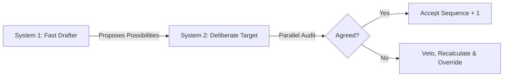

# 🏛️ AGE REPUBLIC: KNOWLEDGE ASSET (ERA 226.0)
## Identifier: `00_KNOWLEDGE/345_B_REPUBLIC_GEMMA4_MTP_WISDOM_AND_PHILOSOPHY`
## Theme: Philosophical Codex of Multi-Token Prediction (MTP) Speculative Decoding — Idle Activation, Speculative Autoregressiveness, Decoupled Verification, and Decentralized Resilient Action

---

> [!IMPORTANT]
> **SOVEREIGN COGNITIVE AUDIT MANIFEST:**
> This document formalizes the philosophical axioms, conceptual distillations, and design principles extracted from the implementation of **Gemma 4 Multi-Token Prediction (MTP)** and speculative decoding architectures. It translates micro-architectural GPU execution structures into macro-level wisdom rules for agentic coordination, organizational modeling, and resilient local-first cognitive substrates.

---

## 🧭 I. The Wisdom of Leveraging Idle Capacity

**Axiom:** True efficiency is not about working harder, but about identifying and activating latent potential.

**The Engineering Reality:** Standard LLM inference is memory-bandwidth bound. The processor spends the majority of its cycles transporting weights from VRAM to compute cores, leaving significant computational units idle while waiting for the data transmission of a single token. Speculative decoding targets this idle compute by running a lightweight, parallelized drafter model in the execution gap.

**The Philosophical Synthesis:**
Many systems—whether human minds, institutional structures, or compute meshes—suffer from bottlenecks that look like exhaustion but are actually coordination failures. Wisdom lies in recognizing where energy is wasted on raw movement (transportation of context) rather than creation (processing of context), and redesigning execution pipelines to activate latent capacity.
*   **Corollary A:** The primary constraint is rarely what it appears to be. Diagnose the systemic transport layer before over-optimizing individual components.
*   **Corollary B:** Latent compute is not "free" space—it is design headroom waiting for structured delegation.

---

## 🏛️ II. The Folly of Autoregressive Thinking

**Axiom:** Treating every sequential step as equally demanding is a fundamental failure of discernment.

**The Engineering Reality:** Standard autoregressive models dedicate the same amount of forward-pass computation to predicting obvious, high-probability continuations (e.g., predicting the word "world" after "hello") as they do to calculating a complex logic puzzle or executing a pathing operation.

**The Philosophical Synthesis:**
Wisdom requires distinguishing between the predictable and the novel, the routine and the critical. A mind or organization that applies identical cognitive pressure to trivial syntax as it does to existential decision-making is structural waste. Drafting obvious paths quickly allows high-value attention to be conserved for critical check-gates.
*   **Corollary A:** Draft the obvious, then verify the structure. Do not mistake rote execution for deep thought.
*   **Corollary B:** Autoregression is a limitation of physical time; speculative projection is the bypass.

---

## 🔬 III. Verification Over Generation: The Humility of the Final Arbiter

**Axiom:** Speed without rigorous oversight is structural recklessness; delegation requires an unyielding authority.

**The Engineering Reality:** Speculative decoding decouples generation from verification. The MTP drafter proposes next-token sequences at high speed; the heavy target model verifies all of them in a single parallel pass. If the target model finds an error, it rejects the draft sequence and overrides it, retaining final mathematical veto power.

**The Philosophical Synthesis:**
This dual-process division of labor mirrors System 1 (rapid intuition) and System 2 (slow deliberation). A resilient architecture does not reject the assistance of faster, lighter, or less-attested agents—but it never surrenders the final verify-gate.
*   **Corollary A:** Delegate prediction, but centralize attestation.
*   **Corollary B:** "Trust, but verify" is not a political slogan; it is a mathematical requirement for zero-degradation acceleration.

---

## 🛡️ IV. Zero Degradation: The Non-Negotiable Standard

**Axiom:** Optimization that sacrifices core quality is not progress—it is disguised regression.

**The Engineering Reality:** Gemma 4 MTP drafters deliver up to a 3x speedup while preserving identical reasoning accuracy and token output distribution compared to standard autoregressive generation. If output quality degrades even slightly, the speculative mechanism is considered broken.

**The Philosophical Synthesis:**
In the pursuit of speed (productivity, scale, automation), systems frequently make trade-offs that compromise their core integrity. The wiser path demands acceleration without compromise. If a process change degrades the quality of the final output, it is not an improvement; it is a substitution of quality for speed.
*   **Corollary A:** Measure the variance of your outcomes, not just the mean speed of your actions.
*   **Corollary B:** If the standard is lowered to accommodate the speed, you have optimized the metric, not the system.

---

## ⚡ V. The Paradox of Batching: Solitude vs. Synchrony

**Axiom:** What is inefficient or unstable in isolation often achieves optimal resonance in community.

**The Engineering Reality:** On consumer GPUs and Apple Silicon, running the Gemma 4 26B Mixture-of-Experts (MoE) model at a batch size of 1 presents severe routing challenges and memory thrashing. However, processing multiple queries simultaneously (batch sizes of 4 to 8) unlocks up to a 2.2x speedup by saturating parallel pipelines.

**The Philosophical Synthesis:**
Individual agents running in complete solitude can struggle to justify the overhead of their environment. By aggregating queries and synchronizing execution paths, the overhead is amortized, and collective throughput scales.
*   **Corollary A:** Do not evaluate the viability of a complex system by its performance under artificial, solitary conditions.
*   **Corollary B:** Resilient communities structure their operations to process loads in coordinated windows rather than fragmented streams.

---

## 🎨 VI. Context Sharing: Anti-Isolationism

**Axiom:** Recalculating what has already been resolved is the ultimate form of systemic waste.

**The Engineering Reality:** Gemma 4 MTP models share the target model's key-value (KV) cache and inner activations. Instead of computing the context window twice, the drafter reads the pre-computed state directly, bypassing redundant calculation of the historical context.

**The Philosophical Synthesis:**
Wisdom rejects the isolationist demand that every sub-component or successor agent rediscover the environment from scratch. Shared state, institutional vaults, and common context maps are the mechanisms that make speed possible.
*   **Corollary A:** Build architectures where context is inherited, not re-evaluated.
*   **Corollary B:** Bypassing context-sharing under the guise of "independence" leads to structural blindness.

---

## 🚦 VII. The Edge as the True Frontier

**Axiom:** True resilience is decentralized competence, not centralized magnificence.

**The Engineering Reality:** The release of edge-specific MTP models (E2B/E4B) running locally via vLLM, Ollama, or MLX preserves battery life and reduces remote network dependencies. It puts frontier-class reasoning directly onto personal workstations.

**The Philosophical Synthesis:**
A system that depends on a distant, centralized cloud for its daily cognition is inherently vulnerable. Resilience is defined by local execution capability under constrained conditions.
*   **Corollary A:** Prioritize local, air-gapped competence over cloud-dependent scale.
*   **Corollary B:** The strength of the mesh is measured by its performance at the absolute periphery.

---

## 🏛️ VIII. The Gemma 4 Philosophical Codex

| Technical Blueprint | Philosophical Manifest |
| :--- | :--- |
| **Speculative Decoding** | Propose possibilities quickly; verify their structure deliberately. |
| **Idle Compute Saturation** | True efficiency is the activation of latent capacity, not the addition of raw force. |
| **KV Cache Sharing** | Preserve the context; do not force the successor to recompute history. |
| **Zero Degradation** | Speed without accuracy is a metric illusion. |
| **Batch Size Scaling** | Moderate coordination outperforms absolute isolation. |
| **Local Edge Deployment** | Resilient execution must live where the action is taken. |
> *"Wisdom is not choosing between speed and precision. Wisdom is the architecture that allows a fast, intuitive drafter to explore the path, while a slow, deep authority verifies the route—conquering both."*

---

> [!NOTE]
> **Cross-Reference:** Principle 3 (Verification Over Generation) aligns directly with the tool-calling safety gates and verification loops documented in [339_B_REPUBLIC_GEMMA4_TOOL_CALLING_ANALYSIS_WISDOM.md](file:///media/fiji/4A21-0000/New%20folder/AGE%20REPUBLIC/00_KNOWLEDGE/339_B_REPUBLIC_GEMMA4_TOOL_CALLING_ANALYSIS_WISDOM.md).
