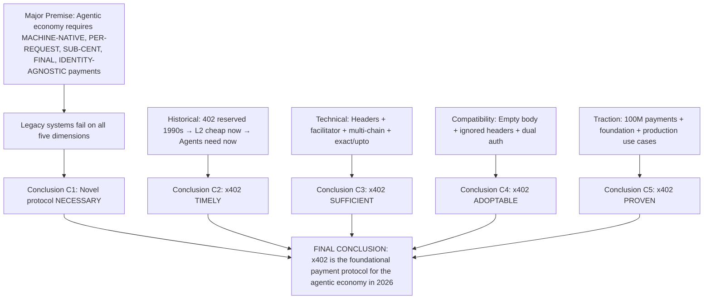

# ⚖️ [376A] A Formal Syllogistic Argument for x402 as the Foundational Payment Protocol
## AGE REPUBLIC: KNOWLEDGE SUBSTRATE [376-A]
**Status:** IMPLEMENTED & GROUNDED | REVOLUTIONIZING COMMERCE (2026)  
**Subject:** Formal logical case for x402 machine-native micropayments  

---

### Major Premise: Structural Necessity
*   **P1:** The autonomous AI agent economy requires a payment system that is machine-native, per-request, sub-cent, settlement-final, and identity-agnostic.
*   **P2:** Traditional payment systems (credit cards, ACH, invoices, API keys) fail on all five requirements: they require human intervention, batch monthly billing, minimum fees of ~$0.30, chargeback reversibility, and identity verification.
*   **Conclusion C1:** Therefore, a novel payment protocol is necessary for the agentic economy to function at scale.

---

### Minor Premise 1: Historical Readiness
*   **P3:** The HTTP `402 Payment Required` status code was reserved in the early 1990s specifically for micropayments, but remained dormant for three decades because settlement costs exceeded transaction values.
*   **P4:** Layer 2 blockchains (Base, Solana) have reduced settlement costs to under $0.001 per transaction, making micropayments economically viable for the first time.
*   **P5:** AI agents, which cannot open bank accounts or complete CAPTCHAs, began demanding frictionless API consumption precisely when L2 settlement became cheap.
*   **Conclusion C2:** Therefore, the convergence of cheap L2 settlement and autonomous agent demand creates the long-awaited conditions for HTTP 402 to become operational.

---

### Minor Premise 2: Protocol Sufficiency
*   **P6:** The x402 protocol provides a complete payment lifecycle using only standard HTTP headers: `PAYMENT-REQUIRED` (demand), `PAYMENT-SIGNATURE` (proof), and `PAYMENT-RESPONSE` (receipt).
*   **P7:** The facilitator architecture enables gasless, non-custodial settlement where neither client nor server touches the blockchain directly, while maintaining cryptographic verifiability.
*   **P8:** The protocol supports multiple payment schemes (`exact` for fixed price, `upto` for usage-based) and multiple chains (EVM and SVM via CAIP-2 identifiers).
*   **Conclusion C3:** Therefore, x402 provides a sufficient technical foundation for agent-native payments without requiring changes to existing HTTP infrastructure.

---

### Minor Premise 3: Backwards Compatibility
*   **P9:** x402 leaves the 402 response body empty (`{}`) so existing error handlers and monitoring tools do not break.
*   **P10:** Non-x402 clients (browsers, curl, legacy integrations) ignore the custom headers and see only a standard 402 error, causing no crashes or unexpected behavior.
*   **P11:** The payment middleware can be added to existing authenticated endpoints alongside API key logic, enabling dual-mode operation without disrupting current users.
*   **Conclusion C4:** Therefore, x402 can be incrementally adopted on existing infrastructure without breaking changes or forced migration.

---

### Minor Premise 4: Demonstrated Viability
*   **P12:** As of 2026, x402 has processed over 100 million payments across 22+ facilitators and 10,000+ paid endpoints, with $3M+ in volume.
*   **P13:** The x402 Foundation, co-launched by Cloudflare and Coinbase, includes Google, Visa, AWS, Circle, and Anthropic as members.
*   **P14:** Production use cases include AI inference, data enrichment, web scraping, and API fractionalization—all with per-request pricing under $0.01.
*   **Conclusion C5:** Therefore, x402 is not a theoretical proposal but a proven, production-grade protocol with ecosystem traction.

---

### Final Thesis Summary

| Claim | Justification |
| :--- | :--- |
| **x402 is necessary** | Legacy systems cannot meet agentic economy requirements (P1–P2, C1) |
| **x402 is timely** | L2 settlement costs + agent demand activate the dormant 402 code (P3–P5, C2) |
| **x402 is sufficient** | HTTP header lifecycle + facilitator architecture + multi-chain support (P6–P8, C3) |
| **x402 is adoptable** | Backwards compatible with existing infrastructure (P9–P11, C4) |
| **x402 is proven** | 100M+ payments, major foundation members, production use cases (P12–P14, C5) |

**Final Formal Conclusion:** The x402 protocol is the necessary, sufficient, timely, adoptable, and proven foundation for agent-native payments. Organizations seeking to monetize AI agents in 2026 should implement x402 as their primary payment rail for machine-to-machine transactions.

---

### Supplementary Formal Arguments

#### Argument A: The Facilitator as Optimal Trust Model
*   **P15:** Pure trustlessness (self-verification of every blockchain transaction) imposes unacceptable complexity and latency on API servers.
*   **P16:** Pure trust (relying on a single payment processor without verification) creates unacceptable counterparty risk.
*   **P17:** The x402 facilitator model provides cryptographic verification without requiring servers to run blockchain nodes, and supports multiple interchangeable facilitators (22+ available).
*   **Conclusion C6:** Therefore, the facilitator model is the optimal point on the trust–complexity Pareto frontier for agent payments.

#### Argument B: Payment Without Identity as a Feature, Not a Bug
*   **P18:** Traditional APIs require identity verification (signup, API key, KYC) before allowing payment, creating a barrier to autonomous agent access.
*   **P19:** AI agents cannot independently complete identity verification workflows (email confirmation, CAPTCHA, phone verification).
*   **P20:** x402 requires only a cryptographic wallet—no identity, no signup, no API key—because payment confirmation is sufficient authorization.
*   **Conclusion C7:** Therefore, x402's identity-agnostic model is not a security weakness but the enabling condition for autonomous agent commerce.

#### Argument C: No Chargebacks as Economic Finality
*   **P21:** Traditional payment systems (credit cards, ACH) allow chargebacks and reversals for days or months after settlement.
*   **P22:** AI agents operating at machine speed cannot function with probabilistic payment finality; they require deterministic settlement.
*   **P23:** Stablecoin transfers on L2 blockchains, once confirmed, are cryptographically final and irreversible.
*   **Conclusion C8:** Therefore, x402's no-chargeback property is not a liability but a requirement for autonomous workflows that depend on immediate, certain payment confirmation.

---

### Logical Structure Diagram

---

### Operational Corollaries

| Corollary | Implication |
| :--- | :--- |
| **Implement x402 now** | The protocol is production-ready and backwards compatible; waiting incurs opportunity cost |
| **Use the facilitator model** | Do not build direct blockchain integration; leverage existing facilitators (CDP, x402.org) |
| **Price for unit economics** | Set per-request prices above L2 gas costs (~$0.001) plus your compute margin |
| **Support both exact and upto** | Exact for fixed-cost endpoints; upto for usage-based (AI inference, token counting) |
| **Dual-authenticate during transition** | Serve API key users and x402 clients from the same endpoint |
| **Monitor on-chain settlements** | Use basescan.org to verify payment finality and audit facilitator behavior |

---

### Philosophical Synthesis
The x402 protocol succeeds because it aligns four historical forces that have never before converged:
1.  **A reserved specification waiting for its moment** (HTTP 402, dormant since the 1990s)
2.  **A cost structure that finally makes micropayments viable** (L2 settlement <$0.001)
3.  **A user class that cannot use legacy systems** (AI agents without bank accounts)
4.  **A design philosophy that prioritizes machine-native over human-native** (headers over bodies, signatures over credentials)
