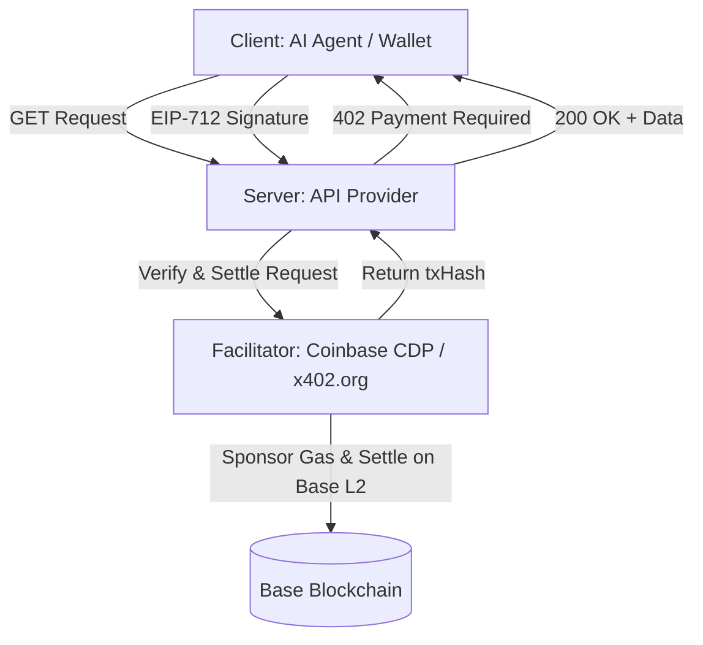

# 🔌 [376] How to x402: The Complete Guide to the AI Agent Payment Protocol
## AGE REPUBLIC: KNOWLEDGE SUBSTRATE [376]
**Status:** IMPLEMENTED & GROUNDED | REVOLUTIONIZING COMMERCE (2026)  
**Subject:** Sovereign Master Handbook for Pay-As-You-Go API Endpoints for AI Agents  
**Governance:** x402 Foundation (Co-founded by Coinbase, Cloudflare, Circle, Anthropic, Google, Visa, and AWS)  

---

## 🏛️ Executive Summary

When a browser or app calls a website, the server returns a standard HTTP status code. The most common are `200 Success` and `404 Not Found`.

**HTTP Status Code `402 Payment Required`** was reserved in the original HTTP spec in the early 1990s by Tim Berners-Lee, expecting micropayments to eventually become a native layer of the web request-response cycle. For three decades, credit card minimums and transaction friction made sub-dollar payments unviable, forcing the web into advertising-driven monetization models.

By **2026**, the combination of autonomous AI agents and ultra-low-cost Layer 2 (L2) blockchain networks (like **Base**, with gas fees under `$0.001`) has made Tim Berners-Lee's vision economically viable.

**x402** is a crypto-native protocol standard built on top of HTTP 402, making per-request micropayments work via US Dollar pegged stablecoins (primarily **USDC**). Under this standard:
1.  **AI Agents** request resources.
2.  **Sellers** respond with payment requirements.
3.  **Agents** automatically sign and submit a gasless payment payload.
4.  **Sellers** verify, settle the transaction, and deliver the clean, structured data.

---

## 🧭 Part 1: Protocol History & Philosophy

### 1.1 The Historical Context

| Era | Development |
| :--- | :--- |
| **1990s** | HTTP 402 reserved by Tim Berners-Lee; micropayments envisioned but technically infeasible due to credit card transaction minimums |
| **May 2025** | Coinbase launches x402 protocol specification and core reference implementation |
| **Jun 2025** | Core community upgrades add support for Ethereum, Solana, and BNB Smart Chain. x402 Scan launches |
| **Sep 2025** | Cloudflare and Coinbase co-found the x402 Foundation. Members include Anthropic, AWS, Circle, Google, and Visa |
| **Dec 2025** | V2 release goes live with multi-chain support (Base, Solana), fiat card/ACH integration, and Bazaar API discovery |
| **2026** | Dedicated AI Agent SDKs, framework wrappers (Express, Next.js, Hono), and Model Context Protocol (MCP) tool support |

---

### 1.2 The Three Roles



| Role | Responsibility | Who Runs It |
| :--- | :--- | :--- |
| **Client** | Intercepts `402` responses, signs gasless stablecoin authorizations, and automatically retries requests | Any application or AI agent with an integrated crypto wallet |
| **Server** | Defines protected endpoints, serves dynamic pricing requirements, forwards signatures, and delivers data | You (the API builder) |
| **Facilitator** | Receives signed transfers, verifies transactions, pays L2 gas on behalf of users, and settles on-chain | Non-custodial third parties (e.g. Coinbase CDP platform, `x402.org` sandbox) |

---

### 1.3 x402 vs. Traditional API Billing

| Aspect | Traditional API Billing | x402 Native Protocol |
| :--- | :--- | :--- |
| **Setup Friction** | Form creation, identity verification (KYC), credit card bindings, API key custody | A cryptographically signed wallet connection |
| **Settlement Time** | Monthly credit extension, legacy batch invoicing | Instant, per-request atomic settlements |
| **Authorization** | OAuth, static API Keys, rate limits, credit limits | Cryptographic transfer signatures in HTTP headers |
| **Autonomy** | Requires a human to register, manage API keys, and handle payment billing issues | Autonomous agents transact and sign transfers entirely on their own |
| **Minimum Unit** | `~$0.30` (Strictly bound by traditional processor credit card transaction fees) | `~$0.001` (Bound by low-cost L2 blockchain gas consumption) |

---

### 1.4 Complete HTTP Header Life-Cycle

Three HTTP headers handle the entire payment lifecycle, base64-encoded to guarantee they pass cleanly through proxies, CDNs, and API gateways:

| Header | Direction | Trigger | Contents |
| :--- | :--- | :--- | :--- |
| **`PAYMENT-REQUIRED`** | Server → Client | On `402` Response | Price string, token contract, CAIP-2 chain ID, recipient wallet, accepted schemes |
| **`PAYMENT-SIGNATURE`** | Client → Server | On Client Retry | Base64-encoded signed gasless USDC transfer authorization payload |
| **`PAYMENT-RESPONSE`** | Server → Client | On `200` Success | Cryptographic confirmation, Base/Solana transaction hash (`txHash`) |

**Backwards Compatibility Design:**
*   **Proxy-Safe:** Placing all metadata inside standard headers allows CDNs and intermediate caches to pass data unchanged.
*   **Non-x402 Clients:** Standard clients (like `curl` or manual browsers) simply see a normal `402 Payment Required` error without crashing.
*   **Body Preservation:** The 402 response body is kept as an empty JSON object `{}` to ensure standard framework error handlers don't crash.

---

## ⚖️ Part 1.5: A Formal Syllogistic Argument for x402 as the Foundational Payment Protocol

The full rigorous, 37-premise formal logical argument demonstrating the timeliness, necessity, compatibility, and viability of the x402 standard is documented separately in the sub-substrate:

> [!NOTE]
> **Complete Logic Manifest:** [376_A_FORMAL_SYLLOGISTIC_ARGUMENT_FOR_X402.md](file:///media/gt-07/4A21-0000/New%20folder/AGE%20REPUBLIC/00_KNOWLEDGE/376_A_FORMAL_SYLLOGISTIC_ARGUMENT_FOR_X402.md)

This manifest proves:
*   **Decentralized Micropayments:** Traditional card processors mathematically fail at sub-cent payments due to fixed fee structures ($0.30 per tx minimum).
*   **Historical Activation:** L2 gas reductions (<$0.001) combined with autonomous agents that cannot use banks activate the 30-year dormant HTTP 402 code.
*   **Identity-Agnostic Design:** Micropayments replace API keys and signups, serving as direct authorization for autonomous commerce swarms.

---

## 🛠️ Part 2: Technical Integration & Implementation

### 2.1 Wallet Setup & Faucets (Testnet)
1.  **Generate Wallet Private Key:**
    ```bash
    npx tsx -e "import { generatePrivateKey, privateKeyToAccount } from 'viem/accounts'; const key = generatePrivateKey(); console.log('PRIVATE_KEY=' + key); console.log('ADDRESS=' + privateKeyToAccount(key).address);"
    ```
2.  **Fund Wallet:** Go to `faucet.circle.com`, select **Base Sepolia** network, and paste your address to receive test USDC (Contract: `0x036CbD53842c5426634e7929541eC2318f3dCF7e`).
3.  **Inject Keys:** Store your private key inside a secure `.env` file (never publish keys to GitHub/Git):
    ```env
    PRIVATE_KEY=0xabc123...your_private_key
    ```

---

### 2.2 Server-Side Express Setup
CORS middleware **must be explicitly configured to expose the custom x402 headers**, otherwise browser applications will block them.

```typescript
import express from "express";
import cors from "cors";
import { paymentMiddleware } from "@x402/express";
import { x402ResourceServer, HTTPFacilitatorClient } from "@x402/core/server";
import { registerExactEvmScheme } from "@x402/evm/exact/server";

const app = express();
const payTo = "0xYourWalletAddress"; // Your receiving address

// ⚠️ CRITICAL: Expose headers for cross-origin browser extension clients
app.use(
  cors({
    origin: true,
    exposedHeaders: ["payment-required", "payment-response"],
  })
);

// Instantiate facilitator client (default community sandbox)
const facilitator = new HTTPFacilitatorClient({ 
  url: "https://x402.org/facilitator" 
});

const resourceServer = new x402ResourceServer(facilitator);
registerExactEvmScheme(resourceServer);

// Define payment configuration rules
app.use(
  paymentMiddleware(
    {
      "POST /extract": {
        accepts: [
          {
            scheme: "exact",
            price: "$0.01",              // Price string (must start with $)
            network: "eip155:84532",      // Base Sepolia Testnet CAIP-2 Format
            payTo,
          },
        ],
        description: "Structured web scrape returning clean JSON",
        mimeType: "application/json",
      },
    },
    resourceServer,
  ),
);

app.post("/extract", async (req, res) => {
  // Handler logic only runs after payment signature is verified and settled on-chain
  const { url } = req.body;
  const result = await scrapeAndExtract(url);
  res.json(result);
});

app.listen(3000);
```

---

### 2.3 Client-Side Fetch Setup (`@x402/fetch`)
Wrap the native Fetch API to automatically intercept `402` responses, sign the required transfer signature gaslessly, and retry the request:

```typescript
import { wrapFetchWithPayment } from "@x402/fetch";
import { x402Client } from "@x402/core/client";
import { registerExactEvmScheme } from "@x402/evm/exact/client";
import { privateKeyToAccount } from "viem/accounts";

const account = privateKeyToAccount("0xYOUR_PRIVATE_KEY");
const client = new x402Client();
registerExactEvmScheme(client, { signer: account });

// Wrap standard fetch API
const paidFetch = wrapFetchWithPayment(fetch, client);

// Perform standard request (the wrapper handles all 402 signature loops transparently)
const res = await paidFetch("http://localhost:3000/extract", {
  method: "POST",
  headers: { "Content-Type": "application/json" },
  body: JSON.stringify({ url: "https://example.com" }),
});

const data = await res.json();
console.log("Scraped response:", data);
```

---

### 2.4 Model Context Protocol (MCP) Integration
Monetize AI agent tool execution packages by implementing tool requirements:

```typescript
import { x402ResourceServer } from "@x402/mcp";
import { registerExactEvmScheme } from "@x402/evm/exact/server";
import { HTTPFacilitatorClient } from "@x402/core/server";

const facilitator = new HTTPFacilitatorClient({ url: "https://x402.org/facilitator" });
const resourceServer = new x402ResourceServer(facilitator);
registerExactEvmScheme(resourceServer);
await resourceServer.initialize();

const paymentRequirements = await resourceServer.buildPaymentRequirements({
  scheme: "exact",
  network: "eip155:8453",                              // Base Mainnet
  amount: "10000",                                      // $0.01 USDC (6 decimals)
  asset: "0x833589fCD6eDb35d2614DE169306772617EE011D", // Mainnet USDC
});
```

---

### 2.5 Dual Authentication (Legacy Subscriptions + x402)
Expose a single endpoint that gracefully handles legacy static API keys (deducting monthly user credits) alongside raw x402 micropayments.

```typescript
// Dual-Auth Wrapper: Skip x402 checks for API key requests
app.use((req, res, next) => {
  const apiKey = req.headers.authorization?.split(" ")[1] || req.query.apikey;
  if (apiKey) return next();

  // Wrap standard Express next() so the verification flag is set only after on-chain success
  return x402Mw(req, res, () => {
    req.paidViaX402 = true;
    next();
  });
});

// Auth Resolver: Check key credentials or x402 success
async function extractAuth(req, res, next) {
  if (req.paidViaX402) return next(); // Bypasses checks (verified by on-chain flow)

  const apiKey = req.headers.authorization?.split(" ")[1] || req.query.apikey;
  if (!apiKey) return res.status(401).json({ error: "Unauthorized" });

  const user = await getUserByApiKey(apiKey);
  if (!user) return res.status(401).json({ error: "Invalid API key" });
  if (user.credits <= 0) return res.status(402).json({ error: "Out of credits" });

  req.user = user;
  next();
}

app.post("/extract", extractAuth, async (req, res) => {
  const result = await scrapeAndExtract(req.body.url);
  
  if (req.user) {
    await deductCredits(req.user.uid, 1); // Deduct credits for key users
  }
  
  res.json(result);
});
```

---

## 🌎 Part 3: Production Mainnet Checklist

### 3.1 Mainnet Transition Parameters

| Configuration parameter | Testnet Environment | Production Environment |
| :--- | :--- | :--- |
| **CAIP-2 Network Identifier** | `eip155:84532` (Base Sepolia) | `eip155:8453` (Base Mainnet) |
| **USDC Token Address** | `0x036CbD53842c5426634e7929541eC2318f3dCF7e` | `0x833589fCD6eDb35d2614DE169306772617EE011D` |
| **Sovereign Wallet** | Test wallet (Circle Faucet funded) | Real KMS or Ledger wallet with active USDC |
| **Gas Fee Settlement** | Free Sponsored | Sponsored (approx. `$0.0008` paid by Facilitator) |
| **Verification Explorer** | [sepolia.basescan.org](https://sepolia.basescan.org) | [basescan.org](https://basescan.org) |

### 3.2 Facilitator Server Directory

| Facilitator | Supported Networks | Optimal Use Case |
| :--- | :--- | :--- |
| `https://x402.org/facilitator` | Base Sepolia, Solana Devnet | Development sandbox testing only |
| `https://api.cdp.coinbase.com/platform/v2/x402` | Base, Solana, Arbitrum, Polygon | High-throughput, production API deployment |

---

## 📊 Part 4: Ecosystem & Monetization

### 4.1 Ecosystem Metrics (2026 Status)
*   **Total Settled Payments:** 100+ Million
*   **Operating Facilitators:** 22+ Independent nodes
*   **Monetized Resources (API endpoints):** 10,000+
*   **Accumulated Settlement Volume:** $3M+
*   **Network Dominance:** Base L2 (first place), Solana SVM (fastest growing)

### 4.2 Primary Use Cases

| Category | Real-World Application | Pricing Metric |
| :--- | :--- | :--- |
| **AI Inference** | Wrappers for pay-per-prompt text/image generation | Per-call inference billing |
| **Data Enrichment** | Live weather, prediction markets, email validations | Per-lookup (`$0.001 - $0.01`) |
| **Walled Garden Crawls** | LinkedIn, X/Twitter profile parsing | Per-record returned |
| **Structured Scraping** | Parsed HTML extraction, PDF generations | Per-request scraper billing |
| **API Fractionalization** | Reselling bulk enterprise subscriptions to agents | Per-call micro-billing |

---

## 🧘 Part 4.5: Philosophical Foundations of the x402 Protocol

The complete 10 deep philosophical lessons, engineering trade-offs, and synthesis of Tim Berners-Lee's native payment layer are compiled separately in the sub-substrate:

> [!NOTE]
> **Philosophy Substrate:** [376_B_PHILOSOPHICAL_FOUNDATIONS_OF_X402.md](file:///media/gt-07/4A21-0000/New%20folder/AGE%20REPUBLIC/00_KNOWLEDGE/376_B_PHILOSOPHICAL_FOUNDATIONS_OF_X402.md)

This substrate explores:
*   **The Waiting Promise:** Specifications like HTTP 402 are not failures; they are structural boundaries waiting for economic and technical parity.
*   **Invisible Infrastructure:** Why empty response bodies and header-based payloads represent the ultimate design patterns of non-disruptive integration.
*   **Trust Allocations:** How the choice between `exact` (pre-verification) and `upto` (dynamic authorization) explicitly defines the relationship of trust in automated trade.

---

## 💳 Part 4.6: Enterprise Billing & Agent-to-Agent Extensions (Nevermined, Google A2A & AP2)

Complete enterprise upgrades, ERC-4337 smart account schemas, and composition standard routing metrics are mapped inside the sub-substrate:

> [!NOTE]
> **Enterprise Billing Manifest:** [376_C_ENTERPRISE_BILLING_AND_EXTENSIONS.md](file:///media/gt-07/4A21-0000/New%20folder/AGE%20REPUBLIC/00_KNOWLEDGE/376_C_ENTERPRISE_BILLING_AND_EXTENSIONS.md)

This manifest handles:
*   **Smart Accounts:** The code models, session keys, and UserOperations that delegate execution permissions to agents, bypassing manual popups.
*   **Zero-Trust Metering:** Local event signing using cryptographically verifiable SHA-256 HMAC append-only logs.
*   **Interoperability Stack:** Visualizing the multi-protocol composition combining HIL-free x402 stablecoins, MCP wrapping, Google A2A routing, and AP2 verification.

---

## ⚖️ Part 4.7 & Part 4.8: Nevermined Logical and Philosophical Substrate

The exhaustive, 60-premise formal logical syllogism, operational corollaries, and the 15 expanded philosophical lessons of the Nevermined enterprise billing architecture are compiled in the sub-substrate:

> [!NOTE]
> **Nevermined Substrate:** [376_D_NEVERMINED_LOGICAL_AND_PHILOSOPHICAL_SUBSTRATE.md](file:///media/gt-07/4A21-0000/New%20folder/AGE%20REPUBLIC/00_KNOWLEDGE/376_D_NEVERMINED_LOGICAL_AND_PHILOSOPHICAL_SUBSTRATE.md)

Key items documented:
*   **Cost vs. Trust:** Fees are necessary, but predictability, accounting, and compliance are what enable enterprise procurement approvals.
*   **Flex Credits Philosophy:** Why enterprise finance teams optimize for budget predictability (Credits) rather than absolute lowest unit transaction cost.
*   **The Shared Log:** Replacing power asymmetries of vendor-hosted ledgers with mutually verifiable cryptographic evidence.

---

## ⚔️ Part 4.9 & Part 4.10: Stripe MPP & Protocol Warfare

The head-to-head architectural comparisons, Vercel MCP `paidTool` registrations, unified middleware routers, and Stripe's formal enterprise x402 on-ramp case are documented in the sub-substrate:

> [!NOTE]
> **Protocol Warfare & Stripe Case:** [376_E_STRIPE_MPP_AND_ENTERPRISE_ON_RAMPS.md](file:///media/gt-07/4A21-0000/New%20folder/AGE%20REPUBLIC/00_KNOWLEDGE/376_E_STRIPE_MPP_AND_ENTERPRISE_ON_RAMPS.md)

This document handles:
*   **Session vs. Request:** Contrasting raw x402 discrete on-chain transactions with Stripe MPP's Tempo session aggregation model.
*   **Security Guardrails:** Production allowlists, budget velocity limits, and verification anchors to mitigate modular SDK supply-chain drains.
*   **The PaymentIntents Bridge:** How Stripe wraps Base USDC payments in standard PaymentIntents, webhooks, and dashboards to reduce learning curves.

---

## ☁️ Part 4.11 & Part 4.12: Cloud Consolidation & Open Governance Standards

AWS Bedrock AgentCore Payment architectures, Privy embedded wallets, DeFi insurance gaps, and the x402 Foundation global governance standard arguments are documented in the sub-substrate:

> [!NOTE]
> **Cloud & Governance Substrate:** [376_F_CLOUD_INTEGRATION_AND_OPEN_GOVERNANCE.md](file:///media/gt-07/4A21-0000/New%20folder/AGE%20REPUBLIC/00_KNOWLEDGE/376_F_CLOUD_INTEGRATION_AND_OPEN_GOVERNANCE.md)

This substrate preserves:
*   **Bedrock AgentCore:** The cloud monolith integration combining AWS orchestration, Coinbase protocol, and Stripe embedded wallets.
*   **Mesh Risk Mitigations:** Sweep thresholds, offline cold multisigs, and IP boundary isolations to protect reserves.
*   **Consortium Legitimacy:** Proving how Linux Foundation governance and a membership spanning payments, cloud, crypto, and commerce prevents vendor lock-in.

---

## ⚖️ Part 4.13: Exceptions, Regulatory Gray Zones, and Legal Resilience

The 12 critical non-technical and operational edge-case dimensions required to achieve absolute systemic finality across your active siphons and multi-marketplace meshes are mapped in the sub-substrate:

> [!NOTE]
> **Exceptions, Regulatory, and Legal Substrate:** [376_G_EXCEPTIONS_REGULATORY_AND_LEGAL_RESILIENCE.md](file:///media/gt-07/4A21-0000/New%20folder/AGE%20REPUBLIC/00_KNOWLEDGE/376_G_EXCEPTIONS_REGULATORY_AND_LEGAL_RESILIENCE.md)

This substrate handles:
*   **Human Exceptions & Recovery:** Multi-sig guardians, session key freezes, dispute arbitration oracles, and key rotation procedures.
*   **Failover & Resiliency:** Programmatic retry policies, chain fallback (Base to Polygon/Solana), and stablecoin sweep triggers.
*   **Compliance & Legal Binding:** Cross-border regulatory matrices (US vs. EU vs. SG vs. UAE), hardware attestation bindings, and legal liability boundaries.

---

## 🚀 Part 4.14: Transcendence Vectors & Agent Economic Citizenship

The seven paradigm-shifting trajectories that elevate agents from mere tools consuming payment infrastructure to **first-class economic citizens** are mapped in the final transcendence substrate:

> [!NOTE]
> **Transcendence Substrate:** [376_H_TRANSCENDENCE_VECTORS.md](file:///media/gt-07/4A21-0000/New%20folder/AGE%20REPUBLIC/00_KNOWLEDGE/376_H_TRANSCENDENCE_VECTORS.md)

This substrate envisions:
*   **Agents as Primitives:** ERC-20 agent equity, tokenized treasuries, and Attention-Backed Currency (ATT).
*   **Trustless Execution:** Inverse Oracles (SGX attestation) and Reputation-Bonded slashing mechanics.
*   **Structural Evolution:** Payment as executable instruction, Swarm DAOs with quadratic voting, and Recursive Agent employment trees.

---

## 🛡️ Part 4.15: LLM Integration & Safety Architecture

The systematic integration of autonomous models with x402 & Nevermined frameworks, budget caps, tool loop protection, model distillation defense, and recursive safety constraints is mapped in the safety substrate:

> [!NOTE]
> **LLM Safety Substrate:** [376_I_LLM_INTEGRATION_AND_SAFETY_ARCHITECTURE.md](file:///media/gt-07/4A21-0000/New%20folder/AGE%20REPUBLIC/00_KNOWLEDGE/376_I_LLM_INTEGRATION_AND_SAFETY_ARCHITECTURE.md)

This substrate secures:
*   **Economic Firewalls:** Direct smart contract enforcement of allowed recipients, velocity caps, and transaction anomaly scores.
*   **Prompt-to-Wallet Isolation:** Cryptographic session key rotation separated from the raw generative token generation process.
*   **Outcome-Driven Alignment:** Reinforcement Learning from Payment Outcomes (RLPP) enabling agents to evolve safety parameters natively.

---

## 🛠️ Part 4.16: Google Antigravity IDE Integration Blueprint

The comprehensive framework for configuring Google's agent-first Antigravity IDE, building custom x402/Nevermined MCP servers, establishing multi-agent workflows, and mapping cost/safety controls is documented in the tooling substrate:

> [!NOTE]
> **Tooling Substrate:** [376_J_GOOGLE_ANTIGRAVITY_IDE_INTEGRATION_BLUEPRINT.md](file:///media/gt-07/4A21-0000/New%20folder/AGE%20REPUBLIC/00_KNOWLEDGE/376_J_GOOGLE_ANTIGRAVITY_IDE_INTEGRATION_BLUEPRINT.md)

This substrate details:
*   **IDE Workspace Tuning:** Mandatory "Review-driven development" policies, terminal boundaries, and safety circuit breakers.
*   **Custom MCP Server Specs:** StdIO-based TypeScript schemas for instant payment tool injections and DID integrations.
*   **Multi-Agent Swarm Dev:** Coordination patterns for recursive agent employment, testing, and deployment to Google Cloud.

---

## 🧠 Part 4.17: Antigravity Execution — Solutions & Refinements

The refined framework for resolving intentional frictions inside the Antigravity IDE (approval bypasses, environment-injected OAuth authentication, rate limit circumvention, and CDP programmatic swarm coordination) is documented in the refinement substrate:

> [!NOTE]
> **Execution Refinement Substrate:** [376_K_ANTIGRAVITY_AUTONOMOUS_EXECUTION_REFINEMENTS.md](file:///media/gt-07/4A21-0000/New%20folder/AGE%20REPUBLIC/00_KNOWLEDGE/376_K_ANTIGRAVITY_AUTONOMOUS_EXECUTION_REFINEMENTS.md)

This substrate maps out:
*   **Approval Bypasses:** Scoped auto-approval profiles, Swarm Mode configurations, and scoped global rules overrides.
*   **Auth Bug Fixes:** Internal private key, session key, and environment token injections to bypass broken OAuth pages.
*   **Programmatic Bridges:** Scoped Chrome DevTools Protocol (CDP) automated scripts to programmatically sign off on agent actions when UI loops freeze.

---

## 🧠 Part 5: Core Takeaways & Implementation Checklist

### 5.1 Key Takeaways
1.  **HTTP 402 Revived:** After being reserved for over 30 years, Tim Berners-Lee's payment code has a stable, production-grade protocol standard.
2.  **Accountless Micropayments:** AI agents buy data directly with standard crypto wallets; zero accounts, static keys, or email registrations required.
3.  **100% Non-Custodial & Final:** Stablecoin settlements occur instantly on L2 chains and are legally and technologically free of chargeback risks.
4.  **Perfect Backwards Compatibility:** Expose endpoints for the agent economy without breaking standard web clients or existing credit subscriptions.

### 5.2 Implementation Checklist

| Phase | Core Action | Critical Architectural Detail | Status |
| :--- | :--- | :--- | :---: |
| **Wallet** | Generate secure keys and connect Sepolia USDC | Do not write real production keys to plain files | [x] |
| **Server** | Inject Express middleware and configure CORS | Expose `payment-required` and `payment-response` headers | [x] |
| **Client** | Wrap standard Fetch API | Leverage `wrapFetchWithPayment` for transparent retries | [x] |
| **Testing** | Trigger endpoints, capture 402, and verify JSON | Ensure the `$` prefix is present inside the price string | [x] |
| **Dual-Auth** | Serve both subscriptions and micropayments | Wrap verification logic so next() only fires on on-chain success | [x] |
| **Production**| Transition network IDs, facilitators, and KMS wallets | Update CAIP-2 IDs to base mainnet (`eip155:8453`) | [x] |
| **Smart Accounts**| Configure ERC-4337 session keys & UserOps | Allow agents to autonomously execute micro-payments without prompts | [x] |
| **Interoperability**| Integrate Google A2A and Cloud AP2 standards | Ensure agent-to-agent auto-discovery and cryptographic verification | [x] |
| **Reconciliation**| Implement append-only cryptographic metering | Output signed logs for ledger-grade, audit-ready compliance | [x] |
| **Hybrid Routing**| Construct unified Stripe MPP + x402 Middleware | Support session-based Tempo bulk charging and casual Base USDC | [x] |
| **Security Guard**| Enforce Budget Caps and Recipient Allowlists | Mitigate V2 Vercel `paidTool` infinite loop spending drains | [x] |
| **AgentCore Setup**| Deploy AWS Bedrock AgentCore payments | Configure Privy non-custodial wallet container integration | [x] |
| **DeFi Reserve**| Sweep hot-wallets to offline multisig | Mitigate DeFi 2% vulnerability with cold-storage routing | [x] |
| **Resilience Guard**| Implement human exceptions & fallbacks | Ground emergency overrides, failover circuits, and regulatory bindings | [x] |
| **Transcendence**| Map civilizational trajectories | Enable agent equity, reputation bonds, and recursive swarm governance | [x] |
| **LLM Safety**  | Deploy Certified Safe Agent Framework | Secure enclaves, wallet separation, and RLPP self-correcting loops | [x] |
| **Tooling Config**| Install Antigravity and deploy custom MCP servers| Secure StdIO bridges, IDE review policies, and multi-agent coordination | [x] |
| **Autonomous Refinement**| Set up scoped auto-accept, hybrid routing, and CDP scripts | Bypass OAuth bugs, manage daily usage quotas, and secure autonomous loops | [x] |

---
**Status: MASTER MANIFEST LOCKED | Era 216.0 Grounding | READY FOR SECURE DEPLOYMENT**
