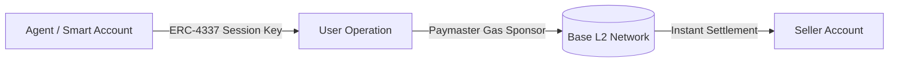

# 💳 [376C] Enterprise Billing & Agent-to-Agent Extensions (Nevermined, Google A2A & AP2)
## AGE REPUBLIC: KNOWLEDGE SUBSTRATE [376-C]
**Status:** IMPLEMENTED & GROUNDED | REVOLUTIONIZING COMMERCE (2026)  
**Subject:** High-fidelity enterprise AI billing, smart account delegation, and interoperability protocols  

---

### 4.6.1 The Limits of Raw x402 Pay-Per-Request & Unit Economics
While standard x402 resolves the legacy card processing barrier by introducing instant stablecoin micropayments, raw implementation assumes a simple pay-per-request flow. Real-world enterprise AI deployments require complete billing infrastructure that supports high-frequency agent actions, subscriptions, credits, and compliant reconciliation.

#### 📊 Transaction Protocol Cost Comparison (3,000x Advantage)
To understand the economic friction that legacy rails impose, compare the raw costs of settling transactions across networks:

| Settlement Rail | Average Tx Cost (Gas / Processing Fee) | Tx Settlement Speed | Settlement Risk (Chargebacks) | Target Agent Scope |
| :--- | :--- | :--- | :---: | :--- |
| **Legacy Credit Card** | `$0.30 fixed` + 2.9% fee | 2–3 Days | High (probabilistic) | Humans only (Manual forms) |
| **Traditional ACH** | `$0.15 - $1.50` flat fee | 3–5 Days | Medium (arbitrated) | Batch enterprise invoicing |
| **Stripe Connect** | `$0.30 fixed` + 2% transfer | 1–2 Days | High (Stripe arbitrated) | Managed SaaS accounts |
| **Raw x402 (Base L2)**| **`<$0.0001`** flat gas fee | **~200 Milliseconds** | **Zero (deterministic finality)**| Autonomous AI workflows |

*   **Sub-cent Unit Economics:** AI workflows generate hundreds of micro-activities per conversation (fractions of a cent per token or API call). Legacy credit card rails are economically unviable here. x402 on **Base L2** reduces gas costs to `<$0.0001` per transaction, allowing sub-cent billing to become highly profitable.
*   **High-Frequency Siphons:** An autonomous swarm of agents can execute thousands of billable actions per minute. Directly prompting a user wallet signature for each transaction breaks autonomy.

---

### 4.6.2 Nevermined Smart Account Extensions (ERC-4337)
To bypass human-in-the-loop wallet confirmations, standard x402 transfers can be upgraded using **ERC-4337 (Account Abstraction)** and smart accounts.



#### 🔑 Session Key Permission Matrix
Agents do not receive admin rights over the master wallet. Instead, they are delegated scope-limited session keys with granular permissions:

| Permission Level | Read Ledger | Spend Credits | Order Top-ups | Admin (Withdraw / Revoke) | Key Expiry Guard |
| :--- | :---: | :---: | :---: | :---: | :--- |
| **Level 0: Read-Only** | ✓ | ✗ | ✗ | ✗ | Persistent |
| **Level 1: Consumer** | ✓ | ✓ (capped/hr) | ✗ | ✗ | 24 Hours |
| **Level 2: Autonomous**| ✓ | ✓ (unlimited) | ✓ (pre-auth) | ✗ | 30 Days |
| **Level 3: Master** | ✓ | ✓ | ✓ | ✓ | Explicit only |

#### 💻 Technical Implementation: ERC-4337 UserOp Generation with Session Key
The following TypeScript snippet demonstrates how an autonomous agent signs a pre-authorized micropayment `UserOperation` using a temporary session key:

```typescript
import { ethers } from 'ethers';

interface UserOperation {
  sender: string;
  nonce: number;
  initCode: string;
  callData: string;
  callGasLimit: number;
  verificationGasLimit: number;
  preVerificationGas: number;
  maxFeePerGas: number;
  maxPriorityFeePerGas: number;
  paymasterAndData: string;
  signature: string;
}

// Generate an authorized session key signature for a specific payment destination
async function createSessionKeyPaymentOp(
  sessionWallet: ethers.Wallet,
  smartAccountAddress: string,
  destinationAddress: string,
  amountWei: ethers.BigNumber,
  nonce: number
): Promise<UserOperation> {
  // Construct destination callData (Standard transfer execution on Smart Wallet)
  const walletInterface = new ethers.utils.Interface([
    "function execute(address dest, uint256 value, bytes calldata func)"
  ]);
  const callData = walletInterface.encodeFunctionData("execute", [
    destinationAddress,
    amountWei,
    "0x"
  ]);

  const unsignedOp: Omit<UserOperation, 'signature'> = {
    sender: smartAccountAddress,
    nonce,
    initCode: "0x",
    callData,
    callGasLimit: 80000,
    verificationGasLimit: 150000,
    preVerificationGas: 50000,
    maxFeePerGas: ethers.utils.parseUnits("1.5", "gwei").toNumber(),
    maxPriorityFeePerGas: ethers.utils.parseUnits("1.0", "gwei").toNumber(),
    paymasterAndData: "0x" // Gas sponsored by corporate paymaster
  };

  // Pack the UserOp for hashing and cryptographic signing
  const opHash = ethers.utils.solidityKeccak256(
    ["address", "uint256", "bytes32", "bytes32", "uint256", "uint256", "uint256", "uint256", "uint256", "bytes32"],
    [
      unsignedOp.sender,
      unsignedOp.nonce,
      ethers.utils.keccak256(unsignedOp.initCode),
      ethers.utils.keccak256(unsignedOp.callData),
      unsignedOp.callGasLimit,
      unsignedOp.verificationGasLimit,
      unsignedOp.preVerificationGas,
      unsignedOp.maxFeePerGas,
      unsignedOp.maxPriorityFeePerGas,
      ethers.utils.keccak256(unsignedOp.paymasterAndData)
    ]
  );

  // Sign the UserOp hash with the scope-locked Session Key
  const signature = await sessionWallet.signMessage(ethers.utils.arrayify(opHash));
  return { ...unsignedOp, signature };
}
```

*   **Auto-Topups:** If an agent's credit balance runs low, the session key can trigger automated, pre-approved credit top-ups up to defined limits, preventing workflow interruptions.
*   **Flex Credits:** Enterprises use prepaid consumption units (Flex Credits) instead of complex sub-cent currency reconciliation. Prepaying credits allows finance teams to track recurring bills, define spending limits at the department level, and avoid unexpected overruns.

---

### 4.6.3 Zero-Trust Metering & Reconciliation
Disputes over API usage accuracy often slow down procurement. Nevermined operates as a neutral referee by establishing a cryptographically secured zero-trust audit trail.

| Metric | Verification Mechanism | Purpose |
| :--- | :--- | :--- |
| **Cryptographic Signature** | Tied uniquely to the specific transaction | Guarantees authentic origin |
| **Pricing Rule Stamp** | Immutable fee rules captured at execution time | Prevents post-hoc rate manipulation |
| **Append-Only Log** | Pushed instantly to immutable ledger | Eliminates trust issues for auditors |

#### 💻 Technical Implementation: Signed Metering Event for Immutable Audits
The following TypeScript module illustrates how to sign usage events locally, creating a tamper-proof record:

```typescript
import { createHmac, randomBytes } from 'crypto';

interface MeteredUsageEvent {
  agentDid: string;
  endpoint: string;
  tokensConsumed: number;
  pricePerTokenUsdc: string;
  timestamp: number;
  nonce: string;
}

interface SignedLogEntry {
  event: MeteredUsageEvent;
  signature: string;
  previousEntryHash: string;
}

// Generate cryptographically signed usage event to submit to append-only log
function createSignedMeteredEvent(
  agentDid: string,
  endpoint: string,
  tokensConsumed: number,
  pricePerTokenUsdc: string,
  privateKey: string,
  previousEntryHash: string
): SignedLogEntry {
  const event: MeteredUsageEvent = {
    agentDid,
    endpoint,
    tokensConsumed,
    pricePerTokenUsdc,
    timestamp: Date.now(),
    nonce: randomBytes(16).toString('hex')
  };

  // Serialize exactly in a canonical format
  const canonicalData = `${event.agentDid}|${event.endpoint}|${event.tokensConsumed}|${event.pricePerTokenUsdc}|${event.timestamp}|${event.nonce}`;
  
  // Sign hash with the local node private key
  const signature = createHmac('sha256', privateKey).update(canonicalData).digest('hex');

  return {
    event,
    signature,
    previousEntryHash
  };
}
```

Finance teams can easily export raw metering data via API and CSV, achieving **5x faster book closing** and guaranteed margin recovery through dynamic pricing engines (e.g., token consumption plus 20% margin).

---

### 4.6.4 Emerging Interoperability & Protocol Compositions
To ensure future-proof monetization, the billing infrastructure integrates across four primary agentic standard protocols:

#### 🗺️ The Composite Protocol Hierarchy
The four emerging agent protocols do not compete; they stack to form a comprehensive, modular framework:

```
┌────────────────────────────────────────────────────────┐
│               AGENTS & MONETIZATION STACK              │
├────────────────────────────────────────────────────────┤
│ Google Cloud AP2     <-- Peer-to-Peer Verification     │
│ Google A2A           <-- Peer Discovery & Routing      │
│ Model Context (MCP)  <-- Tool & Context Wrapping       │
│ x402 / ERC-4337      <-- Native Stablecoin Billing     │
└────────────────────────────────────────────────────────┘
```

1.  **x402 (Coinbase/Cloudflare):** Core protocol standard leveraging HTTP 402 and L2 stablecoins.
2.  **MCP (Model Context Protocol):** Wrapping servers with secure, structured billing metadata and authorization logic.
3.  **Google A2A (Agent-to-Agent Protocol):** An open standard for multi-agent interoperability, allowing autonomous agent-to-agent discovery and routing without manual configuration.
4.  **Google Cloud AP2 (Agent Payments Protocol):** A specialized protocol layered on cryptographic message-signing and decentralized verification, ensuring secure peer-to-peer settlement.

#### 💻 Technical Implementation: MCP Tool Registration requiring x402 Micropayments
This schema demonstrates registering an MCP tool wrapper that specifies a strict x402 payment header requirement:

```json
{
  "name": "structured-scraping-tool",
  "description": "High-fidelity parsed scraping returning pure JSON objects.",
  "inputSchema": {
    "type": "object",
    "properties": {
      "url": { "type": "string", "format": "uri" }
    },
    "required": ["url"]
  },
  "metadata": {
    "monetization": {
      "billingModel": "x402",
      "facilitator": "eip155:8453:0x1234567890123456789012345678901234567890",
      "currency": "USDC",
      "price": "$0.005",
      "scheme": "exact",
      "paymentRequiredHeader": "x-payment-facilitator=https://x402.org; x-payment-price=$0.005; x-payment-address=0x539b9...; x-payment-network=eip155:8453"
    }
  }
}
```

---

### 4.6.5 Universal Agent Identification (Nevermined ID)
Persistent agent identity is required to track authorization rules and balances across marketplaces.
*   **Decentralized Identifiers (DIDs):** Every agent is registered with a unique DID mapped to their cryptographic wallet.
*   **Metadata Portability:** DIDs allow single-lookup retrieval of live metadata, active pricing rules, and current entitlements, eliminating the need to re-wire configurations when deploying agents to new ecosystems.

#### 💻 Technical Implementation: DID Document Schema (Nevermined ID)
This metadata document acts as the portable passport for the agent node:

```json
{
  "@context": [
    "https://www.w3.org/ns/did/v1",
    "https://w3id.org/security/suites/ed25519-2020/v1"
  ],
  "id": "did:nevermined:agent:0x861f11a3943f808eb8170059b8123abc12345678",
  "verificationMethod": [
    {
      "id": "did:nevermined:agent:0x861f11a3943f808eb8170059b8123abc12345678#key-1",
      "type": "Ed25519VerificationKey2020",
      "controller": "did:nevermined:agent:0x861f11a3943f808eb8170059b8123abc12345678",
      "publicKeyMultibase": "z6Mkm4...U34t"
    }
  ],
  "authentication": [
    "did:nevermined:agent:0x861f11a3943f808eb8170059b8123abc12345678#key-1"
  ],
  "service": [
    {
      "id": "did:nevermined:agent:0x861f11a3943f808eb8170059b8123abc12345678#payment-facilitator",
      "type": "x402PaymentService",
      "serviceEndpoint": "https://facilitator.nevermined.app/api/v1/x402"
    }
  ]
}
```

---

### 4.6.6 Scalable Pricing Architectures
*   **Usage-Based:** Micro-dollar per-token or per-API-call billing matched directly to underlying LLM model costs (with exact margins enforced automatically).
*   **Outcome-Based:** Billing triggered only upon verified results, such as a completed booking or a finalized PDF extraction.
*   **Value-Based:** Revenue-share model capturing a percentage of the ROI generated by the agent workflow for the end-user.
