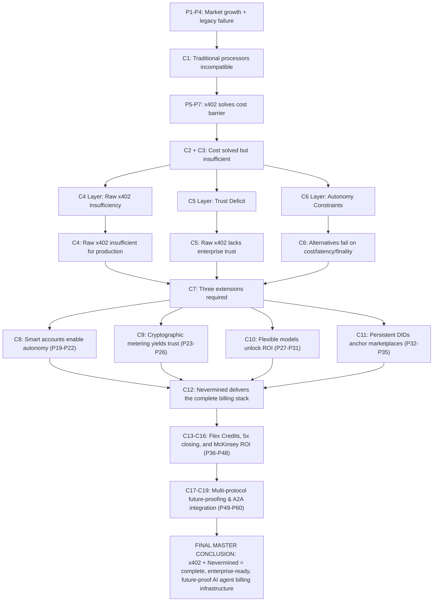

# ⚖️ [376D] Nevermined Logical and Philosophical Substrate
## AGE REPUBLIC: KNOWLEDGE SUBSTRATE [376-D]
**Status:** IMPLEMENTED & GROUNDED | REVOLUTIONIZING COMMERCE (2026)  
**Subject:** Formal logical arguments, operational corollaries, and deep philosophical paradigms of Nevermined enterprise billing  

---

### Part I: Foundational Market Argument
*   **P1:** The AI agent market is growing at a 46.3% compound annual growth rate (CAGR).
*   **P2:** AI agents generate hundreds of micro-activities per conversation, each costing fractions of a cent.
*   **P3:** Traditional payment processors (credit cards, ACH) charge a fixed fee component (~$0.30 per transaction) plus a percentage.
*   **P4:** Fixed fees exceed the value of sub-cent micro-activities, making per-transaction billing economically impossible.
*   **Conclusion C1:** Therefore, traditional payment processors are structurally incompatible with AI agent billing.
*   **P5:** x402 provides a protocol for near-zero fee stablecoin settlement.
*   **P6:** Nominal gas costs on Base are cited as <$0.0001 per transaction in the x402 whitepaper.
*   **P7:** Settlement preconfirmation occurs at ~200ms, enabling real-time agent workflows.
*   **Conclusion C2:** Therefore, x402 solves the fundamental cost barrier that makes traditional payments impossible for AI agents.
*   **Conclusion C3:** However, solving the cost barrier is necessary but not sufficient for production billing systems.

---

### Part II: Raw x402 Insufficiency Argument
*   **P8:** Raw x402 protocol implementation handles only simple pay-per-request flows.
*   **P9:** Production billing systems require subscription management, credit systems, compliance infrastructure, and enterprise-grade metering.
*   **P10:** Raw x402 provides none of these features natively.
*   **Conclusion C4:** Therefore, raw x402 alone cannot serve as a complete production billing system for AI agents.
*   **P11:** Enterprise buyers require audit-ready transparency before approving vendor contracts.
*   **P12:** Enterprise buyers require tamper-proof usage records that cannot be manipulated after creation.
*   **P13:** Enterprise buyers require independent verification capability without relying on vendor-provided logs.
*   **P14:** Raw x402 does not include metering infrastructure with cryptographic guarantees.
*   **Conclusion C5:** Therefore, raw x402 lacks the trust infrastructure required for enterprise procurement.
*   **P15:** AI agents need autonomous billing capabilities.
*   **P16:** Autonomous capabilities include burning credits automatically, ordering top-ups when balances run low, and redeeming entitlements without human intervention.
*   **P17:** Standard wallet transfers require human intervention for each transaction (private key management, confirmation signing).
*   **P18:** Raw x402 uses standard wallet transfers without smart account abstractions.
*   **Conclusion C6:** Therefore, raw x402 is incompatible with fully autonomous agent workflows that require human-free operation.
*   **Conclusion C7:** Therefore, raw x402 must be extended with three layers:
    *   (a) Smart account infrastructure for agent autonomy
    *   (b) Metering systems with cryptographic verification for enterprise trust
    *   (c) Credit, subscription, and compliance features for production billing

---

### Part III: Nevermined as the Complete Stack Argument
*   **P19:** Nevermined extends x402 with ERC-4337 smart account integration.
*   **P20:** This integration replaces standard wallet transfers with UserOperations (UserOps).
*   **P21:** UserOps enable session keys, programmable actions, and automated transaction signing.
*   **P22:** Session keys can be configured with "order" permissions for automatic credit top-ups.
*   **Conclusion C8:** Therefore, Nevermined provides the smart account infrastructure necessary for agent autonomy on top of x402.
*   **P23:** Nevermined's tamper-proof metering system cryptographically signs every usage event at creation.
*   **P24:** Signed events are stored in an append-only log that prevents post-hoc modification.
*   **P25:** This enables zero-trust reconciliation where any party (buyer, seller, auditor, agent) can independently verify usage totals.
*   **P26:** Every usage record includes an exact pricing rule stamp showing how charges were calculated.
*   **Conclusion C9:** Therefore, Nevermined provides the cryptographic trust infrastructure that raw x402 lacks.
*   **P27:** Nevermined supports three flexible pricing models: usage-based, outcome-based, and value-based.
*   **P28:** These models can be combined within a single product.
*   **P29:** Usage-based pricing charges per-token, per-API-call, or per-GPU-cycle with guaranteed margin built in.
*   **P30:** Outcome-based pricing charges for results achieved (completed research tasks, successful bookings).
*   **P31:** Value-based pricing captures a percentage of ROI or value generated for the customer.
*   **Conclusion C10:** Therefore, Nevermined provides pricing flexibility that raw x402 does not offer.
*   **P32:** Nevermined provides persistent agent identity via cryptographically-signed wallet addresses and DIDs (Decentralized Identifiers).
*   **P33:** This identity remains consistent across environments, agent swarms, networks, and marketplaces.
*   **P34:** Nevermined ID enables single-lookup retrieval of live metadata, pricing, and authorization rules.
*   **P35:** Auto-discovery via Google's A2A protocol enables instant agent connection without manual configuration.
*   **Conclusion C11:** Therefore, Nevermined provides the persistent identity layer required for multi-marketplace agent commerce.
*   **Conclusion C12:** Therefore, Nevermined delivers the complete billing stack that raw x402 alone cannot provide, comprising:
    *   (a) Smart account infrastructure (UserOps, session keys, programmable actions)
    *   (b) Cryptographic metering (signatures, append-only logs, zero-trust reconciliation)
    *   (c) Flexible pricing (usage, outcome, value-based models)
    *   (d) Persistent identity (DIDs, wallet addresses, A2A auto-discovery)

---

### Part IV: Enterprise Requirements Argument
*   **P36:** Enterprise finance teams resist AI adoption due to unpredictable sub-cent transaction costs and complex reconciliation of thousands of micro-transactions.
*   **P37:** Flex Credits solve this problem through prepaid consumption-based units.
*   **P38:** Flex Credits provide predictable spending, real-time burn rate monitoring, and department-level allocation.
*   **P39:** Flex Credits enable reallocation across users, departments, or agents without renegotiating licenses.
*   **P40:** Flex Credits align price to value by charging for micro-actions while enabling predictable budgeting.
*   **Conclusion C13:** Therefore, Flex Credits are the mechanism that makes x402's micropayment economics acceptable to enterprise finance teams.
*   **P41:** Enterprises need 5x faster book closing than traditional billing systems provide.
*   **P42:** Nevermined's dynamic pricing engine enables margin recovery and automated reconciliation.
*   **P43:** Enterprise procurement requires API and CSV export of raw metering data for independent verification.
*   **P44:** Nevermined provides both API and CSV export capabilities.
*   **Conclusion C14:** Therefore, Nevermined provides the accounting and compliance features required for enterprise adoption.
*   **P45:** A 1% price improvement can meaningfully lift operating profit (McKinsey).
*   **P46:** Pricing is often one of the fastest levers to improve returns when executed systematically.
*   **P47:** More than half of executives report lacking a reliable method to compile pricing intelligence.
*   **P48:** Flat subscriptions often underprice heavy users while creating barriers for light users.
*   **Conclusion C15:** Therefore, systematic pricing optimization is a high-leverage activity that Nevermined's flexible models enable.
*   **Conclusion C16:** Therefore, enterprise adoption of x402 depends on the availability of:
    *   (a) Credit systems for predictable spending (Flex Credits)
    *   (b) Accounting features for fast book closing (dynamic pricing engine)
    *   (c) Exportable audit trails for independent verification (API/CSV exports)

---

### Part V: Multi-Protocol Future-Proofing Argument
*   **P49:** Emerging agent protocols include x402, MCP (Model Context Protocol), A2A (Agent-to-Agent), and AP2 (Agent Payments Protocol).
*   **P50:** These protocols address different layers of the agent commerce stack:
    *   x402: Payment settlement
    *   MCP: Tool access and authentication
    *   A2A: Agent discovery and interoperability
    *   AP2: Cryptographic payment verification
*   **P51:** No single protocol will dominate; multi-protocol support is necessary for interoperability.
*   **Conclusion C17:** Therefore, billing infrastructure must support all four protocols, not just x402.
*   **P52:** Building custom billing infrastructure for each protocol requires 6+ weeks per integration.
*   **P53:** Custom integration creates ongoing maintenance burden as protocols evolve.
*   **P54:** Protocol lock-in creates switching costs that increase over time.
*   **P55:** Nevermined provides first-class support for all four protocols (x402, MCP, A2A, AP2).
*   **P56:** Nevermined's open-protocol-first architecture enables billing compatibility without rebuilds as standards evolve.
*   **Conclusion C18:** Therefore, Nevermined reduces technical debt and eliminates vendor lock-in.
*   **P57:** Nevermined integrates with major LLM providers for automatic token counting and cost tracking.
*   **P58:** Nevermined integrates with agent frameworks for composable multi-agent workflows.
*   **P59:** Nevermined integrates with Base Network for primary settlement of x402 transactions.
*   **P60:** Nevermined integrates with Google A2A for auto-discovery and agent-to-agent routing.
*   **Conclusion C19:** Therefore, Nevermined's ecosystem integration reduces implementation time and complexity.

---

### Part VI: Refutation & Alternative Path Analysis
*   **P16:** Stripe Connect has a $0.30 fixed fee component per transaction -> making sub-cent billing mathematically and economically impossible.
*   **P17:** Batching multiple micro-transactions delays final settlement (from seconds to hours), breaking real-time agent workflows and tool-execution loops.
*   **P18:** Monthly invoices assume human approval and procurement cycles; AI agents require instant, autonomous settlement to proceed dynamically.
*   **P19:** Chargebacks create a probabilistic settlement layer; agents require deterministic finality for secure, non-reversible autonomous execution.
*   **Conclusion C6:** Therefore, alternatives fail on cost, speed, autonomy, or finality.

---

### Final Master Conclusion Thesis Matrix

| Claim | Justification |
| :--- | :--- |
| **Vendor-Neutral standard necessity** | Proprietary silos fragment the agent economy and delay deployment (P1–P4, C1) |
| **Settlement Cost Barrier** | x402 L2 stablecoin integration solves `$0.30` fixed card fee via `<$0.0001` gas on Base (P5–P7, C2–C3) |
| **Smart accounts / autonomy** | ERC-4337 smart accounts enable human-free operations via session keys and auto-top-ups (P19–P22, C8) |
| **Zero-Trust Metering** | Cryptographic signatures + append-only logs guarantee auditability (P23–P26, C9) |
| **Pricing Flexibility** | Usage, outcome, and value-based models cover optimal margins (P27–P31, C10) |
| **Persistent DIDs** | Persistent wallets + metadata port DIDs across marketplaces (P32–P35, C11) |
| **Predictable Budgeting** | Flex Credits bypass complex sub-cent currency calculations for finance teams (P36–P40, C13) |
| **Reconciliation Exports** | API and CSV raw data exports deliver bank-grade closing (P41–P44, C14) |
| **Multi-protocol Interop** | Supports x402, MCP, Google A2A, and AP2 without vendor lock-in (P49–P56, C17–C18) |
| **Refutation Vulnerability** | Alternatives Connect, Batching, and monthly invoices fail on cost, latency, or finality (P16–P19, C6) |

**Final Master Conclusion:** The x402 Foundation, co-founded by Coinbase, Cloudflare, and Stripe under the Linux Foundation, with founding members including Visa, Mastercard, Google, Microsoft, AWS, Circle, Shopify, and Solana, represents the definitive vendor-neutral standard for agent-native payments. Nevermined delivers the complete billing stack (credits, session keys, zero-trust metering, and DIDs) that extends this necessary settlement layer into a robust, enterprise-compliant platform.

---

### Summary Table of All Conclusions

| Conclusion ID | Distilled Statement |
| :--- | :--- |
| **C1** | Traditional processors are structurally incompatible with AI agent billing |
| **C2** | x402 solves the fundamental cost barrier |
| **C3** | Solving cost is necessary but not sufficient |
| **C4** | Raw x402 cannot serve as a complete production billing system |
| **C5** | Raw x402 lacks enterprise trust infrastructure |
| **C6** | Legacy alternatives and batching fail on cost, speed, autonomy, or finality |
| **C7** | Raw x402 requires three extensions: smart accounts, metering, enterprise features |
| **C8** | Nevermined provides smart account infrastructure for agent autonomy |
| **C9** | Nevermined provides cryptographic trust infrastructure |
| **C10** | Nevermined provides flexible pricing models |
| **C11** | Nevermined provides persistent identity for multi-marketplace commerce |
| **C12** | Nevermined delivers the complete billing stack |
| **C13** | Flex Credits make micropayment economics acceptable to enterprises |
| **C14** | Nevermined provides accounting and compliance features for enterprise adoption |
| **C15** | Systematic pricing optimization is high-leverage; Nevermined enables it |
| **C16** | Enterprise adoption depends on credits, fast closing, and exportable audits |
| **C17** | Billing infrastructure must support multiple protocols (x402, MCP, A2A, AP2) |
| **C18** | Nevermined reduces technical debt and eliminates vendor lock-in |
| **C19** | Nevermined's ecosystem integration reduces implementation time |

---

### Logical Structure Diagram

---

### Operational Corollaries

| Corollary | Implication | Priority |
| :--- | :--- | :---: |
| **Don't use raw x402 alone** | Implement Nevermined or equivalent smart account + metering layer | High |
| **Implement tamper-proof metering** | Cryptographic signatures + append-only logs are non-negotiable for enterprise | High |
| **Use Flex Credits for enterprise** | Prepaid consumption units solve the predictability problem | High |
| **Enable session keys with order permissions** | Agents must be able to auto-top-up credits mid-transaction | High |
| **Support all four protocols** | x402, MCP, A2A, and AP2—do not pick a single standard | Medium |
| **Provide API/CSV exports** | Enterprises will demand raw data for independent verification | High |
| **Implement spending velocity limits**| Agents cannot exceed budget thresholds per time window (e.g. `$100`/hour) | High |
| **Implement circuit breakers on anomaly**| Unusual spending patterns trigger automatic holds | High |
| **Provide real-time usage dashboards**| Customers see current consumption and burn-rates instantly | Medium |
| **Implement tiered pricing by volume** | Discounts at 10k, 100k, 1M requests/month | Medium |
| **Support multiple stablecoins** | USDC, EURC, USDT for geographical compliance flexibility | Low |
| **Implement gas sponsorship for all operations**| Paymaster sponsorships ensure completely autonomous agents without manual approvals | High |

---

### Operational Synthesis of the Formal Argument
Raw x402 is to agent billing what raw HTTP is to e-commerce—necessary but not sufficient. Just as e-commerce required shopping carts, inventory systems, and payment gateways on top of HTTP, agent billing requires metering, credits, identity, and smart accounts on top of x402.

Nevermined provides that complete stack. The formal argument demonstrates that organizations seeking to monetize AI agents in 2026 should not choose between x402 and Nevermined—they should use x402 as the settlement layer and Nevermined as the billing infrastructure that makes x402 enterprise-ready.

---

### Lesson 1: The Cost Barrier Is Not the Only Barrier
*   **Technical Reality:** x402 solves the transaction cost problem with near-zero gas fees (`<$0.0001` on Base). But Nevermined argues that cost is necessary, not sufficient. Production billing requires subscriptions, credits, compliance, autonomous top-ups, and audit trails.
*   **The Philosophical Shift:** Most technologists believe that if you solve the hardest technical problem (cost), the rest will follow. This is a form of reductionism—the belief that economics determines everything.
*   **The New Wisdom:** Nevermined's argument inverts this: the hardest problem is not cost. The hardest problem is trust, predictability, autonomy, and compliance. Cost is just the price of entry. The real work begins after cost is solved.
*   **The Lesson:** Do not mistake a necessary condition for a sufficient one. Solving the obvious problem (fees) only reveals the hidden problems (trust, reconciliation, enterprise procurement). Wisdom is knowing that the second-order problems are harder than the first-order one.

---

### Lesson 2: Enterprise Trust Cannot Be Delegated to Cryptography Alone
*   **Technical Reality:** x402's cryptographic signatures prove that a payment occurred. But they do not prove what the payment was for, whether the usage was accurate, or whether the pricing was applied correctly. Nevermined adds tamper-proof metering with append-only logs and line-item pricing stamps.
*   **The Philosophical Shift:** Pure cryptographers believe that verification is a mathematical property: either the signature verifies or it does not. But enterprise trust is not mathematical. It is organizational, procedural, and audit-based.
*   **The New Wisdom:** Cryptography provides evidence. It does not provide trust. Trust emerges from the ability of multiple independent parties (buyer, seller, auditor, agent) to examine the same evidence and reach the same conclusion. This requires not just signatures, but shared access to immutable logs and the ability to re-run calculations.
*   **The Lesson:** Do not confuse verification with trust. Verification is a property of a signature. Trust is a property of a social system that includes auditors, contracts, and recourse. Build infrastructure that serves the social system, not just the cryptographic one.

---

### Lesson 3: Agent Autonomy Requires the Abolition of the Human in the Loop
*   **Technical Reality:** Standard wallet transfers require human intervention for each transaction—private key management, confirmation signing, gas fee approval. Nevermined's ERC-4337 smart accounts enable session keys, programmable actions, and automatic top-ups without human intervention.
*   **The Philosophical Shift:** Most "autonomous agent" systems still assume a human somewhere who approves every significant action. This is not autonomy. It is automation with a human veto.
*   **The New Wisdom:** True autonomy means the agent can act without human permission within predefined boundaries. Session keys with "order" permissions are not a technical detail. They are a philosophical commitment: the agent is trusted to top itself up, to spend credits, to execute workflows, without asking for permission each time.
*   **The Lesson:** If your billing system requires a human to approve every transaction, your agents are not autonomous. They are remote-controlled. The abolition of the human in the loop is not a feature request. It is the definitional threshold of the agentic economy.

---

### Lesson 4: Predictability Is More Valuable Than Lowest-Cost
*   **Technical Reality:** x402 enables sub-cent transactions. But enterprise finance teams resist adoption not because the transactions are too expensive, but because they are unpredictable. Nevermined's Flex Credits convert unpredictable micropayments into predictable prepaid consumption units.
*   **The Philosophical Shift:** Neoclassical economics assumes that rational actors minimize costs. But enterprise procurement does not minimize costs. It minimizes variance, uncertainty, and surprise.
*   **The New Wisdom:** A predictable $10,000 monthly bill is preferable to an unpredictable $8,000 bill that might become $12,000. Finance teams optimize for budget adherence, not absolute cost minimization. Flex Credits are not a pricing gimmick. They are a recognition that predictability is a feature worth paying for.
*   **The Lesson:** Do not assume your customers want the cheapest option. They want the option they can budget against, report on, and explain to their manager. Build for predictability, not just low cost.

---

### Lesson 5: The Vendor's Log Is Not Evidence; The Shared Log Is
*   **Technical Reality:** Traditional billing systems rely on vendor-provided logs. Nevermined uses cryptographic signatures and append-only logs that any party can independently verify.
*   **The Philosophical Shift:** In a traditional contract, the vendor keeps the books. The buyer requests access. This is an inherent power asymmetry. The vendor can (in theory) manipulate logs. The buyer must trust that they do not.
*   **The New Wisdom:** In zero-trust reconciliation, no party has unilateral control over the evidence. Every usage event is signed at creation. The log is append-only. Any party can re-run calculations and verify totals. The vendor cannot change the past. The buyer cannot claim false charges.
*   **The Lesson:** Trust is not the absence of verification. Trust is the presence of shared, immutable, independently verifiable evidence. Build systems where trust is not required because verification is automatic and universal.

---

### Lesson 6: Pricing Models Are Not Technical Choices; They Are Moral Frameworks
*   **Technical Reality:** Nevermined supports three pricing models: usage-based (per-token), outcome-based (per-result), and value-based (percentage of ROI).
*   **The Philosophical Shift:** Most billing systems treat pricing as a technical configuration—a number in a database. But pricing encodes a theory of value and a theory of the relationship between provider and customer.
*   **The New Wisdom:**
    *   **Usage-based pricing** says: value is in the inputs. We charge for what we consume. This is honest but transactional.
    *   **Outcome-based pricing** says: value is in the results. We only succeed if you succeed. This is aligned but risky.
    *   **Value-based pricing** says: value is in the impact. We take a share of the value we create. This is ambitious but hard to measure.
*   **The Lesson:** Choose your pricing model not based on what is easiest to implement, but based on what you believe about your relationship with your customers. Do you want to be a commodity (usage-based), a partner (outcome-based), or an investor (value-based)? Your pricing model answers this question every time an invoice is generated.

---

### Lesson 7: Persistent Identity Is the Foundation of Reputation in an Agentic World
*   **Technical Reality:** Nevermined ID provides cryptographically-signed wallet addresses and DIDs that persist across environments, networks, and marketplaces. Auto-discovery via A2A enables instant agent connection.
*   **The Philosophical Shift:** In the human world, identity is tied to legal personhood, government documents, and institutional recognition. In the agentic world, none of these exist. Agents cannot get a driver's license.
*   **The New Wisdom:** For agents, identity is not about who they are. It is about what they have done. A persistent DID accumulates a history of transactions, ratings, and reputation. This history is the only thing that makes trust possible between agents that have never met.
*   **The Lesson:** Do not ask "Who is this agent?" Ask "What has this agent done?" Persistent identity is not about authentication. It is about accountability. A DID that can be traced across marketplaces, with a verifiable history of behavior, is more valuable than any credential.

---

### Lesson 8: Multi-Protocol Support Is a Hedge Against Intellectual Monoculture
*   **Technical Reality:** Emerging protocols include x402 (payment), MCP (tool access), A2A (discovery), and AP2 (cryptographic verification). Nevermined supports all four.
*   **The Philosophical Shift:** The natural tendency of technologists is to pick a winner. Back one protocol. Build deep integration. Assume standardization will converge.
*   **The New Wisdom:** Protocol monoculture is a form of intellectual hubris. The future is almost always more fragmented, not less. Supporting multiple protocols is not a technical burden. It is a hedge against being wrong about which protocol wins.
*   **The Lesson:** Build for a world of multiple standards, not a single standard. The cost of supporting four protocols today is lower than the cost of rewriting your billing system when the protocol you backed loses. Agnosticism is survival.

---

### Lesson 9: The 6-Week Custom Build Is a Trap, Not a Badge of Honor
*   **Technical Reality:** Building custom AI billing infrastructure typically requires 6+ weeks of engineering time plus ongoing maintenance. Nevermined's quickstart targets rapid initial setup (5 minutes).
*   **The Philosophical Shift:** Engineering culture treats custom infrastructure as a competitive advantage.
*   **The New Wisdom:** Billing infrastructure is not a differentiator. Your agent's capabilities are. Every week spent building payment plumbing is a week not spent improving your model, your UX, or your features. The 6-week custom build is an opportunity cost.
*   **The Lesson:** Distinguish between core differentiation and commodity infrastructure. Billing, metering, and payments are commodity. Build only what differentiates you. Everything else, buy.

---

### Lesson 10: Scalability Without Switching Is the Mark of Mature Infrastructure
*   **Technical Reality:** Nevermined serves solo developers, AI startups, and enterprise platforms with the same underlying infrastructure.
*   **The Philosophical Shift:** Most billing platforms segment the market, forcing companies to migrate when they grow.
*   **The New Wisdom:** Mature infrastructure scales with the customer. The solo developer's API calls use the same metering engine as the enterprise's million-transaction workload.
*   **The Lesson:** Design for the customer you want, not the customer you have. But ensure that the customer you have today is not forced to rebuild when they become the customer you want. Horizontal scalability across segments is a philosophy of customer respect.

---

### Lesson 11: Finality Is Freedom
*   **Technical Reality:** Legacy payment rails offer chargebacks and 90-day dispute windows, which require intermediate escrows and reserves. L2 blockchain settlement is final in milliseconds.
*   **The Philosophical Shift:** Legal systems treat transactions as provisional; machine-to-machine commerce requires mathematical, absolute finality.
*   **The New Wisdom:** If a payment can be reversed, the autonomous action cannot proceed with absolute confidence. Reversibility is a chain of dependency on external enforcement. Finality is the ultimate release of dependency—the realization of pure autonomy.
*   **The Lesson:** In the machine economy, trust the physics of the ledger, not the promises of a processor. Make finality your default state.

---

### Lesson 12: The Facilitator Is a Trust Compromise
*   **Technical Reality:** x402 uses a payment facilitator address in headers to route and confirm payments.
*   **The Philosophical Shift:** Pure peer-to-peer advocates believe any intermediary is a failure. But absolute decentralization has high discovery and configuration costs.
*   **The New Wisdom:** The facilitator is not a ruler; it is a convenience. It coordinates routing so the buyer and seller do not need to negotiate paths. But because it has a cryptographic role, it must be auditable, transparent, and replaceable.
*   **The Lesson:** Treat facilitators as tools, not sovereigns. Design your architecture so that if a facilitator goes down or behaves dishonestly, the agent can swap it for another instantly.

---

### Lesson 13: Empty Requests Are Not Errors
*   **Technical Reality:** An x402 transaction requires the client to fetch pricing headers (empty request returning HTTP 402) before paying and resubmitting.
*   **The Philosophical Shift:** In classic REST, a request without resources is a waste of bandwidth or an invalid state.
*   **The New Wisdom:** The handshake is the payment negotiation. The "empty" first request is a query for terms, not a failure. It is the agent saying, "What is your price, and where should I send the value?"
*   **The Lesson:** Embrace handshakes. Do not treat payment discovery as an error path. It is the negotiation loop that makes automated trade possible.

---

### Lesson 14: CAIP-2 Is Survival
*   **Technical Reality:** x402 headers require CAIP-2 chain identifiers (e.g. `eip155:8453` for Base L2) to specify the exact settlement ledger.
*   **The Philosophical Shift:** Startups tend to hardcode a single network or environment.
*   **The New Wisdom:** The agentic ecosystem is multi-chain. Multi-chain is not a feature; it is an environment. If your system cannot parse CAIP-2 namespace identifiers, it will die of starvation when resources move to a new ledger.
*   **The Lesson:** Never hardcode a chain. Standardize on CAIP-2 namespaces from day one to ensure your agents can transact on any ledger that emerges.

---

### Lesson 15: Exact vs. Upto Encodes Trust
*   **Technical Reality:** Nevermined's x402 MCP headers specify payment schemes: `exact` (pre-pay per request) or `upto` (authorizing credits/tokens up to a certain limit per session).
*   **The Philosophical Shift:** Traditional billing is purely invoice-after-the-fact or prepaid monthly subscription.
*   **The New Wisdom:** The payment scheme encodes the level of trust. `exact` is zero-trust—we settle every single step. `upto` is delegated trust—we authorize you to spend up to a limit because we trust your integrity within this session.
*   **The Lesson:** Offer both schemes. Allow agents to dynamically negotiate the trust model: start with `exact` for stranger agents, and graduate to `upto` as the relationship builds reputation.

---

### Philosophical Synthesis Table

| Technical Element | Philosophical Lesson |
| :--- | :--- |
| **x402 solves cost, but not trust** | Solving the obvious problem reveals hidden problems. The second-order problems are harder. |
| **Tamper-proof metering** | Cryptography provides evidence; trust requires shared, immutable, verifiable logs. |
| **Session keys with auto-top-up** | True autonomy requires abolishing the human in the loop. |
| **Flex Credits for predictability**| Predictability is more valuable than lowest cost. Finance teams optimize for budget adherence. |
| **Zero-trust reconciliation** | Trust is not the absence of verification; it is the presence of shared evidence. |
| **Three pricing models** | Pricing encodes your theory of value and your relationship with customers. |
| **Persistent DIDs** | For agents, identity is reputation history, not credentials. |
| **Multi-protocol support** | Protocol monoculture is hubris. Agnosticism is survival. |
| **5-minute quickstart** | Billing infrastructure is commodity. Build only what differentiates you. |
| **Scales from developer to enterprise**| Design for the customer you want; respect the customer you have. |
| **Base L2 Finality** | Finality is freedom. Absolute settlement removes legal and procedural dependencies. |
| **x402 Facilitators** | Intermediaries are routing conveniences, not sovereigns. Design for instant hot-swapping. |
| **HTTP 402 Handshake** | Discovery queries are not failures; negotiation is the pre-requisite for automated trade. |
| **CAIP-2 Chain Identifiers** | The agentic landscape is multi-chain. Ledger agnosticism is a survival trait. |
| **Exact vs. Upto Schemes** | Payment structures dynamically encode and negotiate cryptographic trust models. |

---

### The Overarching Wisdom
The Nevermined guide makes a philosophical argument disguised as a technical one. It argues that cost is necessary but not sufficient; enterprise trust requires shared evidence; true autonomy requires no human in the loop; predictability is a feature worth paying for; pricing models are moral frameworks; persistent identity is reputation; multi-protocol agnosticism is survival; billing is a commodity; scale without switching is customer respect; finality is freedom; facilitators are routing coordinates; empty handshake queries are cooperative terms; CAIP-2 namespaces are natural multi-chain environments; and exact vs. upto models dynamically calibrate trust.

---

### The Deepest Lesson
x402 makes micropayments possible. But possibility is not viability. Viability requires trust, predictability, autonomy, compliance, and auditability. These are not technical problems. They are human problems expressed in technical systems. Raw x402 is to agent billing what raw HTTP is to e-commerce—necessary but not sufficient. Just as e-commerce required shopping carts, inventory systems, payment gateways, and fraud detection on top of HTTP, agent billing requires metering, credits, identity, smart accounts, multi-protocol support, deterministic finality, and adaptive trust negotiation on top of x402.
