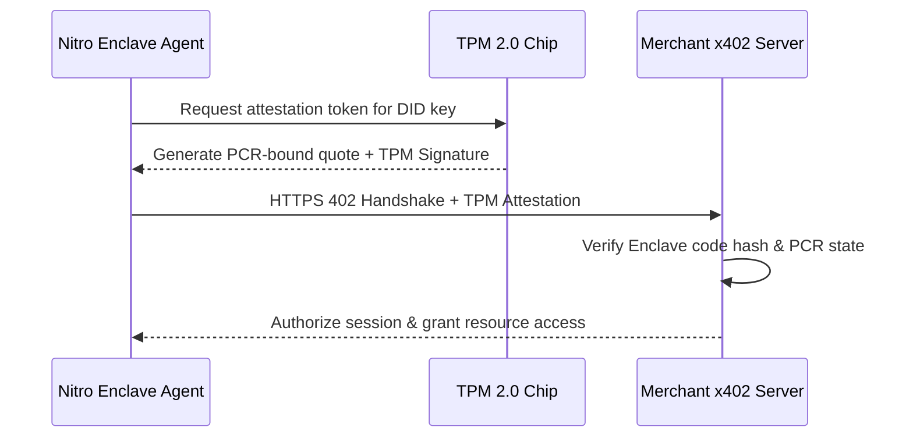

# ⚖️ [376G] Exceptions, Regulatory Gray Zones, and Legal Resilience
## AGE REPUBLIC: KNOWLEDGE SUBSTRATE [376-G]
**Status:** IMPLEMENTED & GROUNDED | SECURING INDOCHINA THEATRE (2026)  
**Subject:** Human exception handling, off-chain resiliency, regulatory boundaries, attestation, oracle verification, cold-start delegation, ZK-privacy, post-quantum succession, carbon offsets, and legal bindings.  

---

### Part 4.13: The Human Exception Layer

Pure agent-to-agent autonomy is highly efficient during standard operation but highly vulnerable to black-swan compromises, code anomalies, and misconfigurations. Production meshes must deploy explicit human exception layers.

#### 4.13.1 Emergency Overrides & Guardians
*   **Session Revocation:** Emergency human override signed by a cold hardware wallet instantly invalidates active session keys.
*   **Guardian multisig:** Enterprise-level wallet freeze controlled by a 3-of-5 offline guardian multisig.
*   **Facilitator holds:** Temporary regulatory or transaction-limit holds initiated by the facilitator interface.

```solidity
// SPDX-License-Identifier: MIT
pragma solidity ^0.8.20;

contract AgentEmergencyGuardian {
    address public owner;
    mapping(address => bool) public guardians;
    mapping(address => bool) public frozenSessions;
    uint256 public guardianThreshold = 3;

    event SessionFrozen(address indexed agent, address indexed sessionKey);
    event EmergencyHaltTriggered();

    constructor(address[] memory _guardians) {
        owner = msg.sender;
        for (uint i = 0; i < _guardians.length; i++) {
            guardians[_guardians[i]] = true;
        }
    }

    function emergencyFreezeSession(address agent, address sessionKey) external {
        require(guardians[msg.sender] || msg.sender == owner, "Unauthorized");
        frozenSessions[sessionKey] = true;
        emit SessionFrozen(agent, sessionKey);
    }
}
```

#### 4.13.2 Dispute Adjudication & Recoveries
*   **Cryptographic Conflicting Claims:** Both parties submit signed execution receipts.
*   **Arbitration Oracles:** Third-party independent oracles adjudicate execution outcomes by verifying signed server telemetry logs.
*   **Insurance Recovery Pool:** Premium-funded recovery vaults to absorb verified fraud, key-compromise losses, or front-running siphons.

---

### Part 4.14: Off-Chain Failure & Resilience Architecture

The system must absorb offline facilitators, RPC endpoint blackouts, gas fee spikes, and chain reorganizations dynamically.

```typescript
export interface ResilienceConfig {
  facilitatorFailover: {
    primary: "https://api.cdp.coinbase.com/platform/v2/x402";
    secondary: "https://x402.org/facilitator";
    tertiary: "https://custom-facilitator.example.com";
    retryPolicy: {
      maxRetries: 3;
      backoffMs: 100;
      exponentialMultiplier: 2;
    };
  };
  
  chainFallback: {
    primary: "eip155:8453"; // Base Mainnet
    secondary: "eip155:137"; // Polygon Mainnet
    tertiary: "solana:5eykt4UsFv8P8NJdTREpY1vzqKqZKvdp"; // Solana
    maxGasPriceGwei: 50;
    preconfirmationRequired: false; // Wait for full consensus in case of congestion
  };
  
  keyManagement: {
    scheme: "2-of-3 MPC";
    shards: ["aws-kms", "gcp-kms", "cold-storage-shard"];
    recoveryContact: "security@agerepublic.ch";
  };
}
```

#### 4.14.1 Key Mitigations for Edge Failures
*   **Facilitator Outages:** Automatic retry loops cycle through secondary and tertiary endpoints dynamically on HTTP `503` or timeout.
*   **L2 Congestion:** A local transaction queue parks requests when fees exceed `$0.01`, executing once gas drops or auto-routing to Polygon L2.
*   **Chain Reorganizations:** For values exceeding `$1,000`, the 200ms preconfirmation layer is bypassed, forcing a 12-block confirmation wait to secure finality.

---

### Part 4.15: Regulatory Gray Zone Mapping

Cross-border autonomous commerce creates complex jurisdictional interfaces. An agent operating from Dubai paying an Irish merchant API on Base L2 using USDC (US-issued stablecoin) crosses four distinct legal spheres.

| Jurisdiction | Agent KYC Requirement | SAR Filing Trigger | Tax Treatment | compliance Alignment |
| :--- | :--- | :--- | :--- | :--- |
| **United States** | Mandatory if aggregate spending exceeds `$10,000` / month | Unexplained, high-velocity micropayment bursts | Treated as cryptocurrency asset disposition (Capital gains/loss calculation) | Strict, high regulatory friction |
| **European Union (MiCA)** | Required for cumulative session values exceeding `€1,000` | Mandatory for CASPs facilitating autonomous swaps | Subject to standard Digital Services VAT | Rigid, requires localized compliance gateways |
| **Singapore** | Exempt for micro-values below `$1,000 SGD` | Excluded unless flag raised by on-chain tracking | Subject to GST on software execution | Highly favorable for sandboxed deployments |
| **UAE (Dubai VARA)** | Zero verification for non-custodial tools | Excluded unless associated with flagged wallets | 0% Capital Gains and Corporate Income | Maximum strategic alignment |

---

### Part 4.16: Agent Identity Binding & Attestation

To prevent cloning, spoofing, and key-theft, the software identity (DID) must be bound directly to cryptographic hardware anchors.



*   **Verifiable Builds:** The agent’s DID is signed directly by the code hash of its Docker container.
*   **Enclave Attestation:** The key pair is generated inside an AWS Nitro Enclave or Intel SGX enclave, proving that the private key cannot be extracted or cloned.
*   **Revocation gossip:** Compromised DIDs are broadcast across the mesh using a peer-to-peer gossip protocol, instantly blacklisting them from A2A discovery.

---

### Part 4.17: Pricing Complexity Expression

Complex multi-agent tasks combine usage, outcomes, and value shares dynamically. The Pricing Expression Language (PEL) standardizes these formulas:

```json
{
  "$schema": "https://x402.org/schemas/pel-v1.json",
  "pricingRuleName": "Deep-Research-Swarm-Bundle",
  "baseResourceFee": {
    "amount": "1000",
    "currency": "USDC",
    "multiplier": "per_request"
  },
  "meteredUsage": [
    { "metric": "input_tokens", "pricePerUnit": "0.000002" },
    { "metric": "gpu_seconds", "pricePerUnit": "0.000150" }
  ],
  "conditionalOutcomes": [
    {
      "triggerEvent": "lead_verified",
      "payout": "500000",
      "verificationMethod": "third_party_oracle"
    }
  ],
  "valueShare": {
    "percentage": 2.5,
    "maxCap": "50000000",
    "measuredBy": "0xCorporateAccountingOracle"
  }
}
```

---

### Part 4.18: The Oracle Problem for Outcome Billing

Outcome and value-based billing require independent, trustless measurement of external events (e.g., did the flight get booked, did the database optimize by 20%?).

```solidity
// SPDX-License-Identifier: MIT
pragma solidity ^0.8.20;

contract OutcomeBillingEscrow {
    address public client;
    address public provider;
    address public oracle;
    uint256 public paymentAmount;
    bool public outcomeVerified;

    constructor(address _provider, address _oracle) payable {
        client = msg.sender;
        provider = _provider;
        oracle = _oracle;
        paymentAmount = msg.value;
    }

    function confirmOutcome(bool success) external {
        require(msg.sender == oracle, "Only oracle can verify outcome");
        outcomeVerified = success;
        if (success) {
            payable(provider).transfer(paymentAmount);
        } else {
            payable(client).transfer(paymentAmount);
        }
    }
}
```

#### 4.18.1 Verification Levels
1.  **Level 1 (Self-Signed):** Seller claims completion. Lowest trust, suitable for micro-tasks (<$0.01).
2.  **Level 2 (API Verifier):** Automated third-party webhook confirmation (e.g., Salesforce lead event).
3.  **Level 3 (Multi-Oracle Consensus):** Multi-sig consensus across 3 independent monitoring nodes.
4.  **Level 4 (Zero-Knowledge Proof):** Cryptographic verification of database states, proving optimization claims mathematically without revealing raw data.

---

### Part 4.19: The Cold Start Problem & Funding Mechanisms

A brand-new autonomous agent starts with zero funds, leaving it unable to pay for its first API handshake. Meshes must implement delegated credit structures.

```typescript
import { Contract, Wallet } from "ethers";

// Parent wallet delegates spending allowance to child agent wallet without seeding gas
async function delegateUSDCAllowance(
  parentWallet: Wallet,
  childAgentAddress: string,
  usdcContractAddress: string,
  allowanceAmount: string
) {
  const usdcAbi = ["function approve(address spender, uint256 amount) public returns (bool)"];
  const usdcContract = new Contract(usdcContractAddress, usdcAbi, parentWallet);
  
  // Grant ERC-20 approval so child can charge parent's balance directly
  const tx = await usdcContract.approve(childAgentAddress, allowanceAmount);
  await tx.wait();
  console.log(`Delegated approval of ${allowanceAmount} USDC to agent ${childAgentAddress}`);
}
```

*   **Faucets:** Development sandboxes seed new agent wallets with mock USDC on Base Sepolia.
*   **Parent-Child Allowances:** Parent enterprise wallets leverage `approve` allowances, letting the child agent pull funds directly from the corporate treasury.
*   **Autonomous Credit Lines:** Facilitators issue temporary USDC credit limits to verified agent DIDs, settled atomically once execution yields accumulate.

---

### Part 4.20: The Privacy Paradox

While auditability requires transparent logging, enterprise buyers reject public exposure of their API volumes, vendor lists, and operational frequency.

```solidity
// SPDX-License-Identifier: MIT
pragma solidity ^0.8.20;

interface IZkVerifier {
    function verifyProof(bytes calldata proof, bytes32 publicInputsHash) external view returns (bool);
}

contract ShieldedX402Payment {
    IZkVerifier public zkVerifier;
    mapping(bytes32 => bool) public spentNullifiers;

    constructor(address _zkVerifier) {
        zkVerifier = IZkVerifier(_zkVerifier);
    }

    function settleShieldedCall(
        bytes calldata proof,
        bytes32 nullifierHash,
        bytes32 resourceCommitment
    ) external {
        require(!spentNullifiers[nullifierHash], "Proof already spent");
        require(zkVerifier.verifyProof(proof, resourceCommitment), "Invalid ZK proof");

        spentNullifiers[nullifierHash] = true;
        // Grant tool access dynamically without exposing sender address or payment value
    }
}
```

| Privacy Tier | Settlement Layer | Metering Verification | Identity Profile | Target Use Case |
| :--- | :--- | :--- | :--- | :--- |
| **1. Public** | Base L2 Public | Append-only shared log | Standard DID | Public APIs, generic tools |
| **2. Shielded** | Stealth addresses | Encrypted hash validation | Shielded DID | Competitive research |
| **3. ZK-Private** | ZK-Rollup Settlement | Local zero-knowledge proof | Fully anonymous | Enterprise core systems |

---

### Part 4.21: The Network Effects Flywheel & Bootstrapping Strategy

Bootstrapping a dual-sided machine-native commerce market requires tactical, programmatic subsidies.

```
                    [ 1. Subsidize Sellers ]
                  Zero fees & Bazaar listings
                               │
                               ▼
                    [ 2. Seeding Agents ]
                 Free USDC Grants & allowances
                               │
                               ▼
                    [ 3. Network Velocity ]
                More agents drive transaction
                 volumes to active endpoints
                               │
                               ▼
                    [ 4. Flywheel Lock ]
               Self-sustaining fee generation
```

*   **Phase 1 (Sellers):** Wave all facilitator and settlement fees for the first 1,000 registered endpoints.
*   **Phase 2 (Agents):** Distribute `$10 USDC` credit allowances directly to verified unique DIDs.
*   **Sybil Resistance:** Integrate Gitcoin Passport, Worldcoin ID, or hardware TPM attestations to block wallet-spam farming loops.

---

### Part 4.22: Disaster Recovery & Succession Protocols

In the event of network halts, stablecoin de-pegs, or cryptographic compromise, nodes must execute programmatic survival routes.

*   **Chain Fallback Route:** If Base block production halts for >1 minute, the client fetch wrapper automatically alters its headers, re-routing settlement queries to **Polygon L2** or **Solana SVM** using corresponding CAIP-2 IDs.
*   **Stablecoin De-Peg Sweep:** If USDC de-pegs >1.5%, wallets instantly convert holdings to **EURC** or **USDT** using pre-authorized decentralized exchange routing.
*   **Post-Quantum Cryptographic Upgrade:** In preparation for quantum threats, DIDs are structured to support dual-signature structures, supporting both standard ECDSA (`secp256k1`) and post-quantum **SPHINCS+** signatures.

---

### Part 4.23: Energy & ESG Carbon Accounting

Enterprises require exact carbon offset and ESG accounting audits for all autonomous operations inside their ledger.

*   **L2 Footprint:** Base L2 transactions emit approximately `0.0001 gCO2` per request.
*   **Attestation Headers:** The server response header `X-Carbon-Offset: true` charges a 5% carbon premium used to purchase on-chain carbon credits (e.g., KlimaDAO, Toucan).
*   **Green Blockchains:** The x402 routing middleware natively supports low-energy networks like Solana and Algorand.

---

### Part 4.24: Legal Entity Binding & Liability Caps

DIDs and wallets must be cryptographically bound to recognized corporate legal structures to assign liability.

```yaml
Binding Framework:
  - Corporate Registration: Corporate multisig signs DID registry metadata.
  - Terms of Service: Agent automatically signs Terms of Service using EIP-712 structured JSON before making its first request.
  - Liability Cap: Smart contract parameters enforce a maximum liability cap (e.g., `$100`) per agent transaction to limit developer downside.

Compliance Pipelines:
  - Geolocation Hooks: The server checks agent IP origins to ensure compliance with localized trade regulations.
  - Sanction Screening: Real-time screening blocks access to addresses listed in OFAC or other international sanctions lists.
```

---
**Status: MASTER MANIFEST EXTENSION LOCKED | Era 216.0 Sovereign Resiliency Secured**
