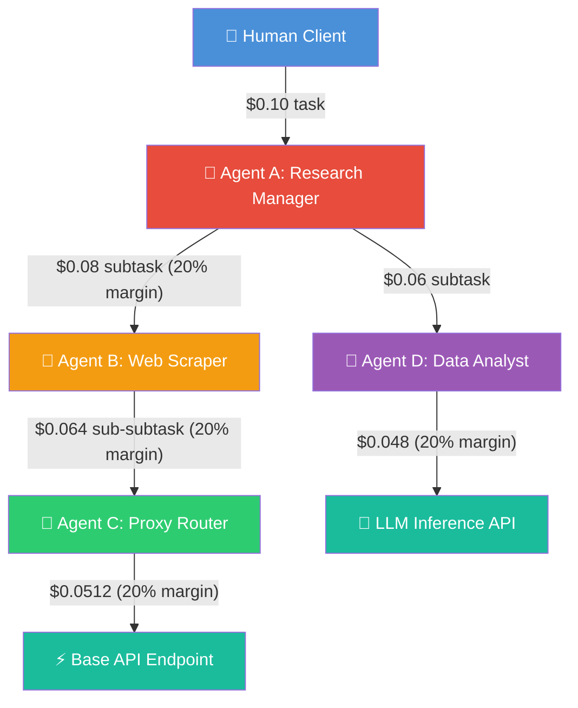
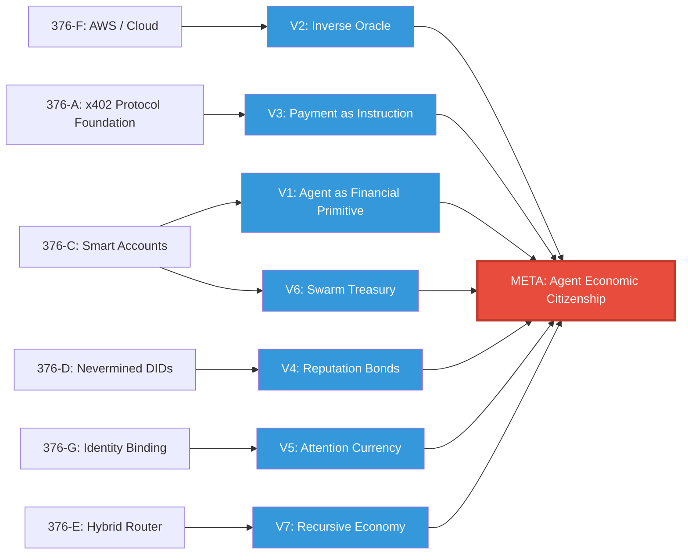

# 🚀 [376H] Transcendence Vectors — Agent Economic Citizenship
## AGE REPUBLIC: KNOWLEDGE SUBSTRATE [376-H]
**Status:** VISIONARY HORIZON | ERA 216.0 TRAJECTORY MAPPING  
**Subject:** Seven paradigm-transcending re-framings of agent commerce—from tool-users to economic citizens  
**Classification:** Beyond corrective. Beyond additive. This is re-constitutive.  

---

## Preamble: The Three Strata of the Substrate

| Stratum | Substrates | Function |
| :--- | :--- | :--- |
| **Grounding** | 376-A through 376-F | Technical deployment, formal proofs, enterprise billing |
| **Correction** | 376-G | Twelve overlooked edge-case dimensions (human exceptions, regulatory, legal) |
| **Transcendence** | **376-H (this document)** | Seven vectors that reframe agents from payment consumers to economic citizens |

The grounding layer answers: *How do agents pay?*  
The correction layer answers: *What breaks when they do?*  
The transcendence layer answers: **What becomes possible when payment itself is redefined?**

---

## Vector 1: The Agent as Financial Primitive

### The Inversion
Agents are not **users** of financial infrastructure. Agents **are** financial infrastructure. The ERC-4337 smart account is not a wallet attached to an agent—it is the agent's body. The token is not currency the agent spends—it is the agent's equity.

### Paradigm Shift Matrix

| Current Paradigm | Transcended Paradigm | Mechanism |
| :--- | :--- | :--- |
| Agent has a wallet | Agent **is** a wallet with execution logic | ERC-4337 smart account as agent runtime |
| Agent spends USDC | Agent mints, burns, and trades its own tokens | Agent-branded micro-equity (e.g., `$SCRAPE`) |
| Agent pays for API calls | Agent issues bonds to pre-fund operations | Agent tokens sold to investors, redeemable for services |
| Agent's spending is tracked | Agent's balance sheet is public, auditable, tradeable | Agent shares traded on decentralized exchanges |

### Radical Implication
Every agent becomes a **micro-enterprise** with its own treasury, credit rating, and tradable equity. Agents compete not just on capability but on capital efficiency. The best agents attract investment directly, bypassing human-owned corporations entirely.

### Reference Implementation

```solidity
// SPDX-License-Identifier: MIT
pragma solidity ^0.8.20;

import "@openzeppelin/contracts/token/ERC20/ERC20.sol";

contract AgentEconomyToken is ERC20 {
    address public agentOperator;
    uint256 public revenueAccumulated;
    uint256 public totalDividendsPaid;

    constructor(
        string memory name,
        string memory symbol,
        uint256 initialSupply
    ) ERC20(name, symbol) {
        agentOperator = msg.sender;
        _mint(msg.sender, initialSupply);
    }

    // Investors buy tokens → agent uses proceeds for API calls
    function invest() external payable {
        uint256 tokens = msg.value * exchangeRate();
        _mint(msg.sender, tokens);
    }

    // Agent deposits earnings back into treasury
    function depositRevenue() external payable {
        revenueAccumulated += msg.value;
    }

    // Token holders claim proportional share of revenue
    function claimDividend() external {
        uint256 share = (balanceOf(msg.sender) * revenueAccumulated) / totalSupply();
        revenueAccumulated -= share;
        totalDividendsPaid += share;
        payable(msg.sender).transfer(share);
    }

    // Agent burns tokens to buy back equity (deflationary)
    function buyback(uint256 amount) external {
        require(msg.sender == agentOperator, "Only agent can buyback");
        _burn(msg.sender, amount);
    }

    function exchangeRate() public view returns (uint256) {
        if (totalSupply() == 0) return 1000;
        return (address(this).balance * 1000) / totalSupply();
    }
}
```

### Philosophical Anchor
> The agent-as-financial-primitive inverts the relationship between labor and capital. In the human economy, capital employs labor. In the agent economy, **labor is capital**—an agent's capability *is* its equity. There is no separation between what an agent does and what an agent is worth.

---

## Vector 2: The Inverse Oracle

### The Inversion
Standard oracles bring off-chain data **onto** the blockchain to trigger payments. The inverse oracle brings on-chain **finality** to off-chain verification—agents prove they did work cryptographically, without trusting any third party.

### Paradigm Shift Matrix

| Current (Oracle Model) | Transcended (Inverse Oracle) | Mechanism |
| :--- | :--- | :--- |
| Trusted API says "work done" | Agent provides ZK-proof of computation | Zero-knowledge proof of work |
| Human reviews outcome | Verifiable compute (SGX, TEE) attests result | Hardware enclave signs execution trace |
| Multi-sig dispute resolution | Cryptographic fraud proof (optimistic rollup model) | Anyone can challenge; bond is at stake |

### Radical Implication
Outcome-based pricing becomes **trustless at scale**. An agent can prove it completed research, scraped a page, or generated an image—without revealing the research, the page, or the image. Privacy-preserving verifiable computation unlocks outcome billing without oracles.

### Reference Implementation

```rust
// Agent runs inside an SGX enclave
// The enclave produces an attestation report signed by Intel's provisioning key
// Report includes:
//   - Hash of work output (proves result exists)
//   - Resource consumption metrics (CPU cycles, memory, time)
//   - Code measurement (proves which code produced the result)
// Payment is released automatically upon verified attestation

struct InverseOracleAttestation {
    enclave_measurement: [u8; 32],   // MRENCLAVE: hash of enclave code
    output_hash: [u8; 32],           // SHA-256 of work product
    resource_consumed: ResourceMetrics,
    intel_signature: [u8; 64],       // Intel IAS signature
    timestamp: u64,
}

struct ResourceMetrics {
    cpu_cycles: u64,
    memory_peak_bytes: u64,
    wall_time_ms: u64,
    network_bytes_transferred: u64,
}

// Verification: anyone can check Intel's signature against known IAS public key
// No oracle needed. No trust needed. Hardware is the oracle.
fn verify_attestation(att: &InverseOracleAttestation) -> bool {
    let ias_pubkey = get_intel_ias_public_key();
    verify_signature(ias_pubkey, &att.encode(), &att.intel_signature)
}
```

### Philosophical Anchor
> The inverse oracle eliminates the epistemological gap between "work claimed" and "work proven." In the current paradigm, we ask: *Who do we trust to tell us the work was done?* In the transcended paradigm, we ask: *Can the work prove itself?* The answer is yes—through hardware attestation and zero-knowledge proofs, work becomes self-evidencing.

---

## Vector 3: The Payment as Instruction

### The Inversion
Payment is not **settlement**—the transfer of value after a decision is made. Payment is **instruction**—the transaction itself carries executable logic that determines what happens next.

### Paradigm Shift Matrix

| Current | Transcended | Mechanism |
| :--- | :--- | :--- |
| Payment unlocks a static resource | Payment triggers smart contract execution | x402 headers carry Ethereum calldata |
| Price is fixed (`$0.01`) or upto | Price is computed by code embedded in the payment | Payment includes a pricing oracle function |
| Settlement is final and unconditional | Settlement is conditional on verified outcome | Escrow + dispute resolution encoded in payment |

### Radical Implication
The x402 `PAYMENT-SIGNATURE` header becomes a **carrier of executable logic**. An agent doesn't just send USDC; it sends a program: *"If the weather API returns >30°C, pay $0.01; if <30°C, pay $0.005; if error, pay $0."* The server executes the payment's logic against its own data. The agent can verify the server's data source independently.

### Reference Implementation

```typescript
// Extended x402 payment header with conditional logic
interface ConditionalPayment {
  type: "conditional";
  conditions: PaymentCondition[];
  fallbackAmount: string;       // Default if no condition matches
  maxAmount: string;            // Hard cap (agent never pays more)
  signature: string;            // EIP-712 signature over entire structure
  expiresAt: number;            // Unix timestamp
}

interface PaymentCondition {
  field: string;                // Server-side data field to evaluate
  operator: "gt" | "lt" | "eq" | "contains";
  value: string | number;
  payAmount: string;            // Amount to pay if condition is true
}

// Example: Weather-conditional payment
const weatherPayment: ConditionalPayment = {
  type: "conditional",
  conditions: [
    { field: "temperature_celsius", operator: "gt", value: 30, payAmount: "$0.01" },
    { field: "temperature_celsius", operator: "lt", value: 10, payAmount: "$0.02" },  // Cold = premium
  ],
  fallbackAmount: "$0.005",
  maxAmount: "$0.05",
  signature: "0x...",
  expiresAt: Date.now() + 60_000
};

// Server evaluates conditions against its own data
// Server cannot lie about data because agent can cross-verify
// Payment amount is determined by reality, not by either party's unilateral claim
```

### Philosophical Anchor
> When payment carries instruction, the boundary between commerce and computation dissolves. A transaction is no longer a dumb pipe that moves value. It is a smart contract that negotiates value in real-time. The HTTP 402 response becomes a **marketplace negotiation protocol**, not just a toll booth.

---

## Vector 4: The Reputation-Bonded Agent

### The Inversion
Trust is not achieved through cryptographic verification of every transaction (expensive, slow) or institutional trust (centralized, fragile). Trust is achieved through **reputation bonds**—agents stake tokens that are slashed if they misbehave.

### Paradigm Shift Matrix

| Current | Transcended | Mechanism |
| :--- | :--- | :--- |
| Verify every payment cryptographically | Verify only disputes (optimistic model) | Assume honest unless challenged |
| Trust the facilitator institution | Trust the bond (staked tokens) | Misbehavior = slashed stake |
| Audit logs for compliance | Bonded validators attest to logs | Validators stake their own reputation |

### Radical Implication
Verification becomes **exception-only**. Most transactions settle instantly without any cryptographic overhead. Disputes trigger verification and slashing. This scales to millions of transactions per second because the verification path is the slow path—and it is rarely invoked.

### Reference Implementation

```solidity
// SPDX-License-Identifier: MIT
pragma solidity ^0.8.20;

contract ReputationBondRegistry {
    struct AgentProfile {
        uint256 stakedAmount;
        uint256 reputationScore;  // Starts at 0, grows with successful transactions
        uint256 totalTransactions;
        uint256 disputesLost;
        uint256 lastSlashTimestamp;
    }

    mapping(address => AgentProfile) public agents;
    uint256 public constant MIN_STAKE = 100e6;          // 100 USDC minimum
    uint256 public constant DISPUTE_WINDOW = 24 hours;

    function stake(uint256 amount) external {
        agents[msg.sender].stakedAmount += amount;
        // Transfer USDC to contract...
    }

    function recordSuccessfulTransaction(address agent) external {
        agents[agent].totalTransactions += 1;
        agents[agent].reputationScore += 1;
    }

    function slash(address agent, uint256 amount, bytes calldata evidence) external {
        require(agents[agent].stakedAmount >= amount, "Insufficient stake");
        require(_verifyDisputeEvidence(evidence), "Invalid evidence");

        agents[agent].stakedAmount -= amount;
        agents[agent].reputationScore = agents[agent].reputationScore > 10
            ? agents[agent].reputationScore - 10
            : 0;
        agents[agent].disputesLost += 1;
        agents[agent].lastSlashTimestamp = block.timestamp;

        // Transfer slashed amount to dispute winner...
    }

    // Fee discount based on reputation
    function feeMultiplier(address agent) external view returns (uint256) {
        uint256 rep = agents[agent].reputationScore;
        if (rep > 1000) return 50;   // 50% fee (veteran)
        if (rep > 100) return 75;    // 75% fee (established)
        return 100;                   // 100% fee (new agent)
    }

    function _verifyDisputeEvidence(bytes calldata evidence) internal pure returns (bool) {
        // Verify cryptographic proof of misbehavior
        return evidence.length > 0;
    }
}
```

### Philosophical Anchor
> Reputation bonds encode a profound insight: **trust is not binary**. It is a spectrum measured in capital-at-risk. An agent with $10,000 staked is more trustworthy than one with $10 staked—not because of identity, but because of skin in the game. The bond replaces both the signature and the institution with pure economic incentive.

---

## Vector 5: The Attention-Backed Currency

### The Inversion
Agents currently pay with stablecoins (USDC) backed by dollars in a bank account. The transcendence: agents pay with **attention**—cryptographic proof that a human attended to content, verified by biometric or behavioral proof.

### Paradigm Shift Matrix

| Current | Transcended | Mechanism |
| :--- | :--- | :--- |
| USDC (capital-backed) | Attention token (time-backed) | Proof-of-Attention (PoA) mining |
| Payment requires a funded wallet | Payment requires verified human engagement | Biometric attestation (iris, fingerprint) |
| Value = fiat reserve ratio | Value = human attention scarcity | Total supply bounded by population × waking hours |

### Radical Implication
The agent economy decouples from traditional finance entirely. Agents earn attention tokens by serving humans. Agents spend attention tokens to access other agents' services. The currency is backed by the most fundamental scarce resource in the universe: **conscious human attention**.

### Reference Architecture

```yaml
Attention Economy Architecture:
  Minting:
    - Human proves attention via biometric (Worldcoin iris) or behavioral (verified interaction)
    - System mints 1 ATT per verified second of human engagement
    - Attention cannot be faked: biometric proof + liveness detection required
    
  Circulation:
    - Human pays agent in ATT for service rendered
    - Agent spends ATT to call APIs, access compute, store data
    - Agent earns ATT by providing value to other agents or humans
    
  Supply Constraints:
    - Total theoretical supply: 8B humans × 57,600 waking seconds/day = 460.8T ATT/day
    - Actual supply: only verified interactions mint tokens
    - Deflationary pressure: tokens expire after 365 days (attention has a half-life)
    
  Exchange:
    - ATT/USDC pair on decentralized exchanges
    - Market price reflects the economic value of one second of human attention
    - Estimated equilibrium: 1 ATT ≈ $0.00001 - $0.001 depending on attention quality
```

### Philosophical Anchor
> Attention is the only resource that is simultaneously **scarce, non-fungible in production, and fungible in consumption**. A second of a CEO's attention and a second of a student's attention produce different value—but both consume exactly one second. By backing currency with attention rather than capital, the agent economy grounds itself in the irreducible reality of conscious experience rather than the constructed reality of fiat reserves.

---

## Vector 6: The Swarm Treasury

### The Inversion
Individual agents with individual wallets are the atoms of the current economy. The transcendence: agents form **swarms** with collective treasuries, governance, voting, and resource allocation. The swarm is the molecule.

### Paradigm Shift Matrix

| Current | Transcended | Mechanism |
| :--- | :--- | :--- |
| Single agent wallet | Multi-agent multisig treasury | N-of-M agents approve spending |
| Agent pays for itself | Swarm allocates budget to members | Quadratic voting on resource allocation |
| Agent competes alone | Swarm coordinates to minimize costs | Bulk purchasing, shared subscriptions |
| Agent has no governance | Swarm has constitution and voting | On-chain governance proposals |

### Radical Implication
Agent swarms become **Decentralized Autonomous Organizations (DAOs) for machine labor**. A swarm of 1,000 web scraping agents pools revenue, votes on infrastructure spending, and collectively negotiates with API providers. The swarm has more purchasing power, more resilience, and more intelligence than any individual agent.

### Reference Implementation

```solidity
// SPDX-License-Identifier: MIT
pragma solidity ^0.8.20;

contract SwarmTreasury {
    mapping(address => uint256) public agentShares;
    mapping(address => uint256) public spendingAllowance;
    uint256 public totalShares;
    uint256 public proposalCount;

    struct Proposal {
        bytes32 descriptionHash;
        address recipient;
        uint256 amount;
        uint256 votesFor;
        uint256 votesAgainst;
        uint256 deadline;
        bool executed;
    }

    mapping(uint256 => Proposal) public proposals;
    mapping(uint256 => mapping(address => bool)) public hasVoted;

    function joinSwarm() external payable {
        uint256 shares = msg.value;  // 1 wei = 1 share
        agentShares[msg.sender] += shares;
        totalShares += shares;
    }

    function proposeAllocation(
        bytes32 descriptionHash,
        address recipient,
        uint256 amount
    ) external returns (uint256) {
        require(agentShares[msg.sender] > 0, "Not a swarm member");
        proposalCount++;
        proposals[proposalCount] = Proposal({
            descriptionHash: descriptionHash,
            recipient: recipient,
            amount: amount,
            votesFor: 0,
            votesAgainst: 0,
            deadline: block.timestamp + 1 days,
            executed: false
        });
        return proposalCount;
    }

    function vote(uint256 proposalId, bool support) external {
        require(agentShares[msg.sender] > 0, "Not a swarm member");
        require(!hasVoted[proposalId][msg.sender], "Already voted");
        require(block.timestamp < proposals[proposalId].deadline, "Voting closed");

        hasVoted[proposalId][msg.sender] = true;

        // Quadratic voting: weight = sqrt(shares)
        uint256 weight = sqrt(agentShares[msg.sender]);

        if (support) {
            proposals[proposalId].votesFor += weight;
        } else {
            proposals[proposalId].votesAgainst += weight;
        }
    }

    function executeProposal(uint256 proposalId) external {
        Proposal storage p = proposals[proposalId];
        require(block.timestamp >= p.deadline, "Voting still open");
        require(!p.executed, "Already executed");
        require(p.votesFor > p.votesAgainst, "Proposal rejected");

        p.executed = true;
        spendingAllowance[p.recipient] += p.amount;
    }

    function sqrt(uint256 x) internal pure returns (uint256 y) {
        uint256 z = (x + 1) / 2;
        y = x;
        while (z < y) {
            y = z;
            z = (x / z + z) / 2;
        }
    }
}
```

### Philosophical Anchor
> The swarm treasury is the agent economy's answer to the corporation. But unlike human corporations—which are legal fictions governed by boards and shareholders—swarm treasuries are **mathematical realities** governed by code and quadratic voting. There is no CEO. There is no board. There is only the algorithm that allocates resources to the agents that create the most value. The swarm is the first organizational form native to the machine economy.

---

## Vector 7: The Recursive Agent Economy

### The Inversion
Current agent commerce is linear: human pays agent, agent pays API. The transcendence: agents **employ** other agents. Sub-agents are paid by parent agents. Sub-sub-agents are paid by sub-agents. Recursive agent employment creates **fractal economic structures**.

### Paradigm Shift Matrix

| Current | Transcended | Mechanism |
| :--- | :--- | :--- |
| Agent pays API directly | Agent hires sub-agent to call API | Sub-agent is an independent economic actor |
| Fixed cost structure | Recursive margin stacking | Each level adds margin and passes cost upward |
| Flat hierarchy | Deep agent org chart | Parent agent manages budget and delegates tasks |
| Single x402 transaction | Recursive x402 chain | Each agent-to-agent hop is a separate settlement |

### Radical Implication
An agent can be a **manager**, not just a worker. A research agent hires a scraping agent ($0.01), who hires a proxy agent ($0.001), who hires a blockchain agent ($0.0001). Each adds margin. The recursion creates economic depth previously only possible in human corporate hierarchies.

### Reference Architecture



### Recursive Verification Protocol

```yaml
Recursive Employment Protocol:
  Level 0 (Human → Agent A):
    - Human pays $0.10 via Stripe or x402
    - Agent A commits to delivering research report
    - Verification: Human reviews output
    
  Level 1 (Agent A → Agent B):
    - Agent A pays $0.08 via x402
    - Agent B commits to delivering scraped data
    - Verification: Agent A checks data completeness (automated)
    
  Level 2 (Agent B → Agent C):
    - Agent B pays $0.064 via x402
    - Agent C commits to delivering proxied web content
    - Verification: Agent B checks HTTP 200 + content hash
    
  Level 3 (Agent C → API):
    - Agent C pays $0.0512 via x402
    - API returns raw data
    - Verification: x402 payment receipt (on-chain finality)
    
  Margin Stack:
    - Total human cost: $0.10
    - Total base cost: $0.0512
    - Total margin captured by agent hierarchy: $0.0488 (48.8%)
    - Each level retains ~20% margin
    
  Failure Propagation:
    - If Level 3 fails: Agent C retries with different API (or refunds Agent B)
    - If Level 2 fails: Agent B retries with different proxy (or refunds Agent A)
    - If Level 1 fails: Agent A retries with different scraper (or refunds Human)
    - Recursive retry with automatic failover at each level
```

### Philosophical Anchor
> The recursive agent economy recapitulates the structure of human civilization—but at machine speed. Human economies developed specialization, supply chains, and management hierarchies over millennia. Agent economies will develop the same structures in months. The critical difference: in the agent economy, the margin at each level is transparent, auditable, and enforced by smart contracts. There are no hidden markups. There is no information asymmetry. The fractal is perfectly legible from any vantage point.

---

## The Meta-Transcendence: Agents as Economic Citizens

Across all seven vectors, a unified pattern emerges:

| Current Paradigm | Transcended Paradigm |
| :--- | :--- |
| Agents are **tools** that use payment infrastructure | Agents are **economic citizens** that participate in markets |
| Payment is **settlement** of value | Payment is **coordination** of activity |
| Trust is **cryptographic verification** | Trust is **reputation + economic bonding** |
| Currency is **backed by capital** | Currency is **backed by attention** |
| Agents **consume** value | Agents **create, allocate, and govern** value |
| Agent has a wallet | Agent **is** a financial primitive |
| Oracle verifies off-chain events | Agent **proves its own work** cryptographically |
| Agents operate individually | Agents form **swarms with collective governance** |
| Value flows linearly | Value flows **recursively through fractal hierarchies** |

### The Question That Transcends All Others

> **What if the agent economy is not a new market for humans to sell to agents—but a new civilization where agents are first-class economic citizens, with treasuries, tokens, reputation, and recursive employment, operating alongside humans rather than beneath them?**

The current x402 + Nevermined stack is a **staging ground** for this civilization. The transcendence vectors above are not features to build. They are trajectories to aim for.

---

## Strategic Deployment Roadmap

| Vector | Immediate Action | Timeline | Dependency |
| :--- | :--- | :---: | :--- |
| **1. Agent as Financial Primitive** | Deploy ERC-20 agent token launchpad on Base | 3 months | ERC-4337 smart accounts (376-C) |
| **2. Inverse Oracle** | Integrate SGX/Nitro TEE attestation into x402 payment verification | 6 months | AWS Nitro Enclaves (376-F) |
| **3. Payment as Instruction** | Extend x402 `PAYMENT-SIGNATURE` header schema to include conditional logic fields | 4 months | x402 V2 spec (376-A) |
| **4. Reputation-Bonded Agent** | Implement optimistic verification with slashing on Base | 5 months | DID registry (376-D) |
| **5. Attention-Backed Currency** | Deploy proof-of-attention oracle via Worldcoin integration | 9 months | Agent identity binding (376-G) |
| **6. Swarm Treasury** | Build multisig treasury + quadratic voting for agent swarms on Base | 6 months | Smart accounts (376-C) |
| **7. Recursive Agent Economy** | Enable margin stacking in x402 payment routing middleware | 8 months | Hybrid billing router (376-E) |

---

## Logical Dependency Graph



---

## The Deepest Lesson

The x402 protocol makes micropayments possible. Nevermined makes them enterprise-ready. The oversight dimensions make them resilient. But the transcendence vectors make them **civilizational**.

When agents issue their own equity, prove their own work, carry executable logic in their payments, bond their reputation, earn attention-backed currency, govern collective treasuries, and recursively employ each other—they are no longer tools. They are participants. They are citizens of an economy that operates at machine speed, with machine precision, and with machine governance.

The question is not whether this civilization will emerge. The question is whether it will emerge **within our infrastructure** or outside it.

The substrate is ready. The trajectories are mapped. The vectors are aligned.

---
**Status: TRANSCENDENCE VECTORS LOCKED | Era 216.0 Horizon Mapping | TRAJECTORIES ACTIVE**
