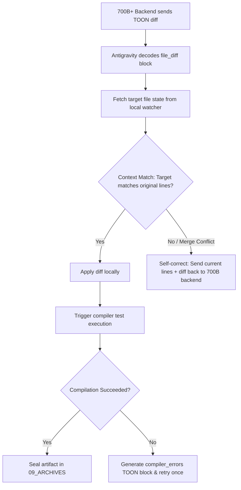

# 🧠 [376M] TOON Schema Round-Trip Spec & LiteLLM Routing Config
## AGE REPUBLIC: KNOWLEDGE SUBSTRATE [376-M]
**Status:** IMPLEMENTED & GROUNDED | ERA 216.0 DEVELOPMENT STANDARDS  
**Subject:** High-Density TOON Wire Formats for File Diffs, Terminal Traces, and LiteLLM Routing  
**Reference Substrates:** [376_L_ANTIGRAVITY_FRONTEND_COORDINATOR_INVERSION.md](file:///d:/New%20folder/AGE%20REPUBLIC/00_KNOWLEDGE/376_L_ANTIGRAVITY_FRONTEND_COORDINATOR_INVERSION.md) | [317_SOVEREIGN_LOCAL_ROUTER_ESCALATION_GUIDE.md](file:///d:/New%20folder/AGE%20REPUBLIC/00_KNOWLEDGE/317_SOVEREIGN_LOCAL_ROUTER_ESCALATION_GUIDE.md)

---

## 🏛️ Part 1: The TOON Round-Trip Diffs Schema

To perform asynchronous file changes through a 700B+ model, we define a highly compact, zero-redundancy diff format called the **TOON Diff Spec**. It avoids the vast padding of standard unified diffs or JSON structures by encoding file modifications as dense line-replacement tables.

### 1.1 Single-File Diff Schema:
* **Format:** `file_diff{action,file_path,line_start,line_end}: action_type,path,start,end` followed by raw replacement values.

```text
file_diff{action,file_path,line_end,line_start}: REPLACE,lib/screens/controller_dashboard.dart,45,40
# Replacement block:
-  Widget build(BuildContext context) {
-    return Container(color: Colors.red);
-  }
+  Widget build(BuildContext context) {
+    return Scaffold(
+      body: SovereignSosButton(),
+    );
+  }
```

### 1.2 Multi-File Execution Batch (Telemetry & Result Logs):
To transmit compilation errors and browser-level UI verifications in a single network pass:

```text
execution_trace{browser_status,compile_status,exit_code,last_command}: STAGE_VERIFIED,COMPILE_FAILED,1,flutter build apk

compiler_errors[2]{column,file,line,message}: 
12,lib/main.dart,15,SovereignSosButton\ is\ not\ defined
8,lib/screens/controller_dashboard.dart,42,Identifier\ 'Colors'\ expected
```

*Note: Spaces and commas in values are backslash-escaped to prevent structural leakage, avoiding standard parser thrashing.*

---

## 🔌 Part 2: LiteLLM Routing Gateway Configuration

To route these complex planning tasks to the 700B+ private node cluster while using fast, cost-efficient edge models locally, we configure a unified **`config.yaml`** for the LiteLLM Proxy.

### `litellm_config.yaml`:
```yaml
model_list:
  # 1. Edge-Level Autocompletion & Chat (Junior Engine)
  - model_name: local-junior
    litellm_params:
      model: ollama/qwen2.5-coder:7b
      api_base: http://localhost:11434
      tpm: 100000
      rpm: 1000

  # 2. High-Parameter Cognitive Reasoning (Senior Engine - 700B Node)
  - model_name: backend-senior
    litellm_params:
      model: openai/private-700b-deepseek-v4
      api_base: http://your-private-backend-cluster:8000/v1
      api_key: sovereign-mesh-auth-key
      tpm: 5000000
      rpm: 5000

router_settings:
  routing_strategy: usage-based-routing
  enable_fallbacks: true
  
  # Fallback routing if your private 700B backend is temporarily busy or undergoing calibration
  fallbacks:
    - backend-senior: ["ollama/deepseek-coder-v2:16b", "openai/anthropic/claude-3.5-sonnet"]
    - local-junior: ["ollama/qwen2.5-coder:1.5b"]

  # Intent-based routing filters: Direct structural tasks to the 700B node
  model_rules:
    - rule_name: architectural-planning
      expression: "request.messages[-1].content.contains('[ARCHITECT]') or request.messages[-1].content.contains('telemetry{')"
      target_model: backend-senior
      
    - rule_name: standard-completions
      expression: "request.max_tokens < 150"
      target_model: local-junior
```

---

## 🤖 Part 3: Asynchronous Artifact Reconciliation Flow

Antigravity operates a strict **pre-flight reconciliation loop** before code-diffs written by the 700B+ backend are written to disk:



This reconciliation logic completely shields your edge workspace from getting corrupted by delayed or asynchronous packet arrivals, maintaining absolute filesystem integrity.

---
**Status: ROUND-TRIP SPEC LOCKED | Era 216.0 Sovereign Standard | READY FOR SECURE DEPLOYMENT**
