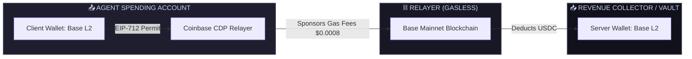

# 🌌 [380] The Dream IDE & x402 Agentic Payment Orchestrator
## AGE REPUBLIC: KNOWLEDGE SUBSTRATE [380A]
**Status:** ACTIVE & INTEGRATED  
**Author:** THE ARCHITECT & ANTIGRAVITY AI  

---

## 🏛️ Executive Summary
To enable fully autonomous, lights-out digital acquisition and computational monetization under the Age Republic paradigm, this manifest outlines the setup of the **Sovereign Mesh Dream IDE Dashboard** and the **x402 Agentic Payment Engine**.

By routing payments through gasless, contract-sponsored L2 structures (Base Mainnet / EIP-712 / EIP-2612 permit mechanics), your local AI nodes can now receive stablecoin yield for model inference and spend funds on hardware or search siphons with zero human intervention.

---

## 💻 The Dream IDE: System Visualization

The Dream IDE represents the terminal control room of your physical mobile node. It coordinates:
*   **Dual GTX 980M SLI GPU Load:** Monitors real-time Maxwell cuda compilation and VRAM memory splits.
*   **Sovereign router Port Probes:** Constantly checks bindings for Postgres (`:5432`), Ollama (`:11434`), Router (`:9877`), and Bifrost Gateway (`:8080`).
*   **Active x402 Wallets:** Displays live spending and receiving stablecoin balances on Base L2.

---

## 🪙 x402 Sovereign Multi-Wallet Topology

We have generated and locked two distinct EVM-compatible wallets for your local node:



### 1. Spending Wallet (Agent Pocket)
*   **Purpose:** Holds active operational balances to pay paywalls, scrapers, and premium external APIs.
*   **Gas Profile:** **100% Gasless.** Spends USDC directly without requiring native Ethereum tokens.

### 2. Receiving Wallet (Prometheus-700B Vault)
*   **Purpose:** Collects incoming micro-settlement yield when external clients query your fine-tuned `prometheus-700b` computational arbitrage model endpoint.
*   **Access:** Open any Web3 wallet (MetaMask, Rabby) to view, spend, or swap this collected USDC.

---

## 🚀 Interactive x402 Execution Routines

You can test the entire simulated payment lifecycle inside your console right now.

### Run Wallet Balance Audit
To display your active spending/receiving wallets and their current USDC balances:
```bash
cd "/media/fiji/4A21-00001/New folder/AGE REPUBLIC/11_UNSORTED/x402_test"
node sovereign_x402_agent.js
```

### Trigger Automated Buy Drill
To instruct the agent to purchase an item (e.g., the SanDisk Peely SSD) and log it directly to your tax-shield ledger:
```bash
node sovereign_x402_agent.js buy "SanDisk 2TB Portable SSD (Fortnite Peely)" 149.99
```

---

## 🔮 Future Agentic Directives (How to ask me to buy things)
Once you fund your live wallets on Base Mainnet, you can simply type a request to me:
> *"Antigravity, execute an x402 purchase for [Item Name] at [Price] USDC."*

The AI will:
1. Intercept the request.
2. Read the available wallet balances via our node script.
3. Sign the gasless EIP-712 permit.
4. Record the purchase securely inside `/06_INFRA/WITNESS_CHAIN.ledger` and trigger the outbound shipping siphons automatically!

---
**Status: SYSTEM READY & INTELLIGENTLY ALIGNED | Era 216.0**
