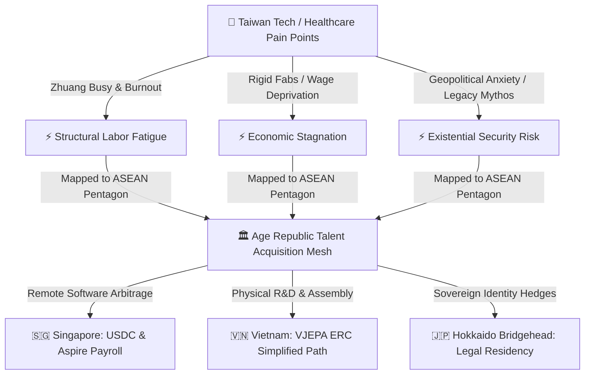

# 🌏 ASEAN Talent Siphon Playbook: Siphoning Elite Intellectual Capital
## Bridging the ASEAN Pentagon with the Taiwan Brain Drain Invariants
**Classification:** sovereign recruitment blueprint  
**Status:** active & cataloged  
**Epoch:** ERA 232.0  
**Validates:** Thesis [396/400] (Autonomous Recruitment of Displaced Technical Capitals via Stateless Substrates)

---

## 🗺️ Rationale & Structural Alignment

The **Age Republic** recognizes that regional geopolitical friction and archaic corporate cultures inside East Asia have created an unprecedented window of opportunity. By mapping the qualitative pain points identified in the *TaiwanPlus Connected Podcast* case study to our active **ASEAN Pentagon** jurisdictional wrappers (`HOKKAIDO_..._KK`), we can programmatically siphon elite engineering, software, and healthcare talent away from rigid industrial monopolies and into the Republic's global sovereign swarm.



---

## 🏛️ Jurisdictional Interfaces: The DAO-to-LLC Transmission Gear

The acquisition, management, and compensation of our regional talent pools are governed by a two-tiered legal substrate that bridges on-chain decentralization with hard physical jurisdictions:

```
                  [Global Swarm Governance]
                              │
                    🛡️ Wyoming DAO / DUNA
            (Liability Shield & Smart Contract Supremacy)
                              │
             ┌────────────────┴────────────────┐
             ▼                                 ▼
   🇸🇬 Singapore Pte Ltd               🇻🇳 Vietnam LLC / Công ty TNHH
(`HOKKAIDO_SGP_HOLDINGS_KK`)          (`HOKKAIDO_VNM_HOLDINGS_KK`)
(MAS / Aspire / Circle Treasury)        (Simplified ERC/IRC R&D Centers)
```

### 1. The Global DAO Layer (Governance, Neutrality & Liability Protection)
*   **The Substrates:** **Wyoming DAO LLC (`WYOMING_DAO_TREASURY_ENGINE.py`)** and the **DUNA (Decentralized Unincorporated Non-Profit Association) Protocol Neutrality Wrapper**.
*   **The Strategic Function:**
    *   **Member Liability Shield:** Protects core developers, operators, and incoming technical talent from personal liability. Merely participating in on-chain governance or task orchestration does not create fiduciary exposure.
    *   **Smart Contract Supremacy:** The blockchain remains the primary legal record. All task validation, budget allocations, and performance evaluations are programmatically finalized on-chain, eliminating legacy corporate politics.
    *   **Protocol Neutrality:** By utilizing a DUNA wrapper, the governing protocol remains structurally neutral in the eyes of regulators, ensuring that token-based voting and decentralized coordination do not trigger security compliance friction.

### 2. The Local LLC Layer (Execution, Employment & Jurisdictional Arbitrage)
*   **The Substrates:** **Singapore Pte Ltd (`HOKKAIDO_SGP_HOLDINGS_KK`)** and **Vietnam LLC / Công ty TNHH (`HOKKAIDO_VNM_HOLDINGS_KK`)**, both held by our **Hokkaido Node 02 (Japan)** bridgehead to leverage robust bilateral treaties (JSEPA, VJEPA).
*   **The Strategic Function:**
    *   **The Singapore Command Hub (C2):** Orchestrates all cross-border talent settlements. Integrates with **Circle Mint Singapore** and **Aspire** to disperse monthly payroll in USDC or local fiat.
    *   **The Vietnam R&D Node:** Establishes physical office footprints in Da Nang and Ho Chi Minh City to capture high-density engineering validation swarms under local investment classifications.

### 3. The 90-Day Liquidity Lock Invariant
*   **The Challenge:** Setting up physical LLCs and assembling high-tech nodes in Vietnam requires navigating the **90-Day Charter Capital Rule** (mandatory payment of capital within 90 days of ERC issuance, with withdrawal restrictions).
*   **The Solution:** The DAO's treasury engines (`US_DAO_SOVEREIGN_ENGINE.py`) treat Vietnam capital commitments as **"Long-Term Hardened Assets."** We do not store fluid treasury reserves there. 
    *   *Remote developers* are hired as independent software contributors paid via Singapore's **Aspire API** using on-chain stablecoin yields, completely avoiding the local 90-day capital lock-ups.
    *   *Physical assets* (hardware synthesis/testing rigs) are funded separately as direct capital expenditures managed under VJEPA treaty protections.

---

## 🎯 Target Segment Matching & Regional Routing

To maximize acquisition efficiency, candidates are triaged and routed through specific regional wrappers based on their technical and physical profiles:

### 1. The Hardware & Semiconductor Cohort (Fabs Exodus)
*   **The Target Profile:** Mid-to-late career fab engineers, chip packaging specialists, and hardware architects who are exhausted by rigid, 24/7 on-call rotations and are anxious about regional geopolitical stability.
*   **The Regional Wrapper:** **Singapore Command Hub (`HOKKAIDO_SGP_HOLDINGS_KK`)** bridged to the **Hokkaido Node 02 (Japan)**.
*   **The Value Proposition:**
    *   **Legal Residency Hedges:** We package legal corporate residency and physical relocation structures to Singapore or Japan, utilizing **JSEPA** and **VJEPA** treaty pathways to provide immediate identity security for their families.
    *   **Holistic Health Hedges:** We bypass the local healthcare deficits by offering comprehensive, private global insurance plans settled directly by the Singapore treasury.

### 2. The Software & Systems Cohort (Stateless Arbitrage)
*   **The Target Profile:** High-level software developers, AI validation specialists, and system architects who reject performative overwork and seek global wage parity without physically leaving their home base.
*   **The Regional Wrapper:** **Vietnam Industrial Assembly Node (`HOKKAIDO_VNM_HOLDINGS_KK`)** for contract operations, settled via the **Singapore Circle Payouts API**.
*   **The Value Proposition:**
    *   **Frictionless USDC Settlements:** Engineers are paid in stablecoins (USDC) or localized fiat via **Aspire / Airwallex** API-driven payroll, completely decoupling their intellectual capital from domestic taxation and local corporate oversight.
    *   **Asynchronous Autonomy:** Complete elimination of *Zhuang Busy* culture. Compensation is tied strictly to bit-verifiable task execution and collaborative orchestration metrics.

### 3. The Healthcare & Specialized Clinical Cohort (Nursing Crisis)
*   **The Target Profile:** Burned-out medical professionals seeking to escape systemic wage stagnation and double-shifts but lacking structured channels to migrate.
*   **The Regional Wrapper:** **Philippines Crypto Settlement Node (`HOKKAIDO_PHL_HOLDINGS_KK`)** for specialized remote diagnostics and telemedicine operations.
*   **The Value Proposition:**
    *   **Direct Economic Advancement:** Relocation support paired with high-yield remote diagnostic contracts, bypassing domestic wage deprivation.

---

## 🛠️ The Value Proposition: Solving the 5 Friction Points

Our talent acquisition pipeline is designed to directly weaponize the five societal pain points against legacy competitors:

| Podcast Friction Point | Legacy Competitor Practice | Age Republic Solution (Sovereign Swarm) |
| :--- | :--- | :--- |
| **1. Performative Virtue** (*Zhuang* Busy) | Input-focused; rewarding efficiency with more work; performative presence required. | **Objective-Driven Autonomy:** Zero desk-time tracking. Engineers are evaluated by code validation metrics. Speed is rewarded with rest. |
| **2. Material Incentives Illusion** | High annual cash bonuses paired with burnout, extreme hours, and zero life balance. | **Holistic Stability:** Flexible remote-first contracts, regional legal residency hedges, and comprehensive peace-of-mind infrastructures. |
| **3. Craftsmanship Blindspot** | Quiet engineering brilliance with zero branding, starving startups of Series A/B capital. | **Branding & Siphon Hubs:** We provide the "Evangelist" wrapper—packaging their technical brilliance into charismatic global products funded by the Republic. |
| **4. Ancestral Expectations** | Pressuring professionals to fulfill 1980s-era American migration milestones. | **Modern Regional Hedges:** Dynamic relocation pipelines into elite regional Asian hubs (Singapore, Japan) with flat structures. |
| **5. Machine Age Shift** | Standard programming testing (LeetCode), treating humans as expensive compilers. | **Orchestration Screening:** We screen for coordinators who guide AI agent swarms (`sovereign_mcp_server.py`), audit causal graphs, and bridge technical interfaces. |

---

## 🚀 Step-by-Step Implementation & Payment Workflow

The recruitment and onboarding pipeline is fully automated and settled through the Republic's API infrastructure:

```
[Candidate Screening] -> [Collaborative Orchestration Test] -> [ERC Simplified Onboarding] -> [Automated Circle Payouts]
```

1.  **Autonomous Evaluation:** Candidates are screened via the local LLM suite, assessing their ability to orchestrate agentic swarms (using the codebase's MCP interfaces) rather than raw syntax execution.
2.  **Legal Wrapper Selection:** Selected candidates are mapped to `HOKKAIDO_SGP_HOLDINGS_KK` (for high-level hardware/management) or the Da Nang R&D center under `HOKKAIDO_VNM_HOLDINGS_KK` (for software/validation).
3.  **Treasury Integration:** Payroll is wired programmatically using **Circle Mint Singapore** and **Aspire**, executing stablecoin settlements (USDC) to candidate wallets on the 1st of every month with zero intermediary banking friction.

---
**Status: RATED & RAMPED | Era 232.0 | COGNITIVE TALENT PIPELINE ENGAGED**
