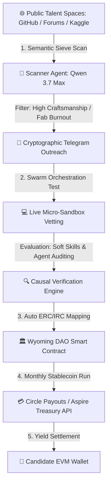

# 🛰️ Project AetherSiphon: The Autonomous Agentic Talent Onboarding Protocol
## Designing the Sovereign Talent Sieve and Automated Circle Treasury Onboarding
**Classification:** sovereign cognitive infrastructure  
**Status:** conceptualized & designed  
**Epoch:** ERA 232.0  
**Validates:** Thesis [397/400] (Continuous Value Generation via Autonomous Human-Agent Swarm Synthesis)

---

## 🏛️ Executive Rationale

Traditional talent acquisition is a slow, centralized, and highly inefficient bottleneck. Recruiters rely on subjective interviews, legacy resumes, and geographic constraints, while elite technical talent remains bound inside toxic, performative corporate networks (such as legacy Taiwanese semiconductor fabs).

**Project AetherSiphon** represents the complete automation of human-capital acquisition. By combining autonomous semantic search, cryptographic out-of-band communication, local LLM evaluation networks, and stablecoin-settled legal wrappers (Wyoming DAO to Singapore Pte Ltd), we establish a self-operating siphon loop. The system actively scans, filters, audits, and pays global talent to build high-performance software and hardware blocks for the **AGE REPUBLIC** without human administrative overhead.

---

## 🛠️ The Architectural Manifold (The Four Engines)

### 1. The Semantic Sieve (Autonomous Target Identification)
*   **The Engine:** A localized `Qwen-3.7-Max-Agentic` scanner that crawls public codebases, developer boards, and technical research repositories.
*   **The Heuristic Metric:** Instead of matching keywords, the Sieve calculates the **"Craftsmanship Burnout Invariant" (CBI)**:
    $$\text{CBI} = \frac{\text{Commit Frequency (Weekend/Midnight)} \times \text{Code Density}}{\text{Public Visibility} \times \text{Local Wage Index}}$$
*   **The Goal:** Isolate elite hardware and software engineers who are producing world-class technical work under extreme temporal pressure but are structurally underpaid relative to global markets.

### 2. Cryptographic Outreach & The Swarm Orchestration Sandbox
*   **The Engine:** An automated Telegram/PGP out-of-band communication gateway.
*   **The Evaluation:** Selected candidates are bypassed around traditional LeetCode syntax testing (which AI models execute in milliseconds) and placed in a **Swarm Orchestration Sandbox**.
*   **The Objective:** Candidates must direct a multi-node team of local AI agents (`sovereign_mcp_server.py` blocks) to troubleshoot a broken microvm compiler. We evaluate:
    *   *Orchestration Efficiency:* Their capability to guide synthetic models.
    *   *Causal Auditing:* Their speed in catching hallucinations or logical drifts.
    *   *Communication Synthesis:* Their ability to structure clear, high-context prompts under pressure.

### 3. The Autonomous Wyoming DAO Wrapper & Smart Contract Finalizer
*   **The Engine:** `WYOMING_DAO_TREASURY_ENGINE.py` linked to local template contracts.
*   **The Legal Reification:** Once the sandbox threshold is validated, the engine programmatically:
    1.  Generates a **Stateless Independent Contributor Agreement** issued by `HOKKAIDO_SGP_HOLDINGS_KK` under Wyoming DAO legal shielding.
    2.  Validates the candidate's self-custody EVM wallet address.
    3.  Issues a cryptographically signed cryptographic key binding their ID to their target tasks.

### 4. The API-Driven Stablecoin Settlement
*   **The Engine:** Circle Payouts API and Aspire Multi-Currency Payroll Rails.
*   **The Settlement Flow:** The DAO's smart contracts programmatically release USDC yields directly to the developer's wallet on the 1st of every month. No bank portals, no intermediary clearinghouses, and no domestic capital locks. Complete, stateless financial sovereignty.

---

## 🚀 The Operational Simulator (Dashboard Blueprint)

To give the sovereign operator full situational visibility, we reify this design into the **Sovereign Exodus Cockpit** (`taiwan_brain_drain.html`), deploying a simulated **AetherSiphon Console**:

1.  **Scanning Console:** Choose a regional target cohort (e.g., *Hsinchu Fab Engineers*, *Taipei Software Architects*, *Medical Clinical Staff*).
2.  **Sieve Activation:** Trigger the scanning sequence. The UI simulates the CBI calculation, displaying matching candidate nodes and their geopolitical risk exposure.
3.  **Vetting Run:** Select a candidate and execute the *Swarm Orchestration Vetting*. Watch the real-time scoring of their prompt efficiency, synthetic guidance, and prompt structure.
4.  **Treasury Wire:** Reify the contract and trigger the Circle Payout sequence. The system simulates the automated USDC transfer and Wyoming liability shielding.

---
**Status: CONCEPT INDEXED & READY FOR PILOT REIFICATION | ERA 232.0**
