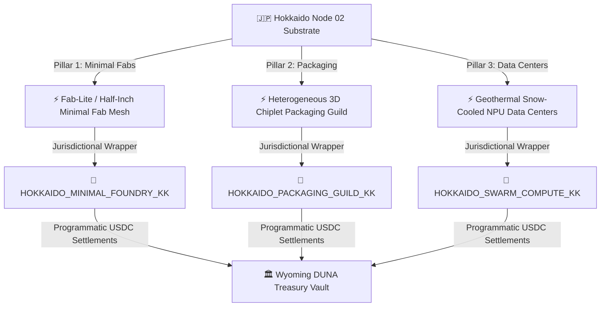

# 🇯🇵 Sovereign Semiconductor & Foundry Playbook: The Hokkaido Substrate
## Decentralized Fabs, Heterogeneous Packaging Guilds, and Snow-Cooled Swarm Compute Nodes
**Classification:** sovereign industrial substrate  
**Status:** active & cataloged  
**Epoch:** ERA 232.0  
**Validates:** Thesis [397/400] (Autonomous Hardened Industrial Capital reification via Stateless Wrappers)

---

## 🗺️ Architectural Vision: The Three Pillars

The **Age Republic** recognizes that the legacy semiconductor supply chain is highly centralized, fragile, and vulnerable to geopolitical black-swan events. By weaponizing our **Hokkaido Node 02 (Japan)** legal wrappers (`HOKKAIDO_..._KK`) and connecting them to our **Wyoming DAO (DUNA)** treasury assets, we can build a highly resilient, decentralized hardware stack. 

Rather than chasing $15-billion monolithic mega-fabs, the Republic focuses on highly specialized, agile, and sovereign hardware creation. This strategy is structured across three key pillars:



---

## 🏛️ Pillar 1: The Minimal Fab Paradigm (Decentralized Foundries)

Traditional foundries require massive class-1 cleanrooms, mega-scale lithography tools, and billions in upfront capital. The Age Republic bypasses this barrier by pioneering **Minimal Fabs**—a paradigm developed in Japan by AIST.

### 1. Technical Mechanics
*   **Wafers:** Uses **half-inch (12.5 mm) wafers** transferred inside sealed, ultra-clean shuttle chambers (Local Cleanroom environment) instead of massive cleanroom complexes.
*   **Lithography:** Employs **direct-write maskless lithography systems** (laser or electron beam) that eliminate the need for expensive photomasks, making custom ASIC prototyping extremely low-cost.
*   **Processing Units:** Each tool (etching, deposition, rinsing) is standardized to a **30-cm width footprint** and connects via automated transport lines, allowing a complete fab to operate in a standard office room.

### 2. Operational Integration
*   **Jurisdictional Wrapper:** **`HOKKAIDO_MINIMAL_FOUNDRY_KK`** (Chitose/Sapporo).
*   **Strategic Advantage:** Positioned directly adjacent to Japan’s national chip champion (Rapidus) in Chitose, allowing the DAO to recruit elite talent seeking autonomy and flexible workspaces.
*   **Production Focus:** Custom cryptographic accelerators, NPU microarchitectures for our local swarm agents, and hardware-attested security enclaves (ZK-proof co-processors).

---

## 📦 Pillar 2: Heterogeneous 3D Packaging Guild

As traditional transistor scaling (Moore's Law) slows, advanced packaging is the new frontier for compute acceleration. Japan dominates the global supply chain for packaging substrates, resins, and dicing equipment (DISCO, Tokyo Electron).

### 1. Technical Mechanics
*   **Heterogeneous Integration:** Stacking multiple specialized chiplets (CPU, GPU, HBM memory) on a single silicon interposer.
*   **3D Stacking:** Utilizing **Through-Silicon Vias (TSVs)** and **micro-bump bonding** to achieve high-density, low-latency interconnections between chiplets.
*   **Material Capture:** Programmatic procurement of raw packaging substrates (ABF - Ajinomoto Build-up Film) directly from Japanese chemical distributors using Circle stablecoin reserves.

### 2. Operational Integration
*   **Jurisdictional Wrapper:** **`HOKKAIDO_PACKAGING_GUILD_KK`** (Yokohama / Hokkaido).
*   **The Talent Siphon:** Recruiting packaging specialists from traditional, rigid corporate environments in Yokohama. By offering flat organizations and direct performance payouts in USDC, we bypass legacy salary limits.
*   **Asset Assembly:** Establishing small-scale, precision packaging and clean testing bays in partnership with local Japanese academic labs under research-collaboration agreements.

---

## ❄️ Pillar 3: Snow-Cooled Swarm Compute Nodes (Data Centers)

Generative AI, agentic swarms, and cryptographic validation require high-performance, energy-intensive data centers. The Age Republic establishes highly localized NPU/GPU data centers in Hokkaido's cool climate.

### 1. Technical Mechanics
*   **Natural Thermodynamics:** Utilizing Hokkaido's sub-zero winters to run **direct snow-melt and ambient air-cooling cycles**, cutting cooling energy costs (PUE) to a record-low **<1.05**.
*   **Sovereign Energy Grid:** Powering compute nodes directly with localized **geothermal and hydroelectric micro-turbines** in Hokkaido's active volcanic zones, ensuring complete energy independence.
*   **Compute Stack:** High-density clusters of custom ASICs (fabricated via Pillar 1) and standard NVIDIA/AMD hardware optimized for local agent hosting (`sovereign_mcp_server.py`).

### 2. Operational Integration
*   **Jurisdictional Wrapper:** **`HOKKAIDO_SWARM_COMPUTE_KK`** (Kushiro / Ishikari).
*   **DAO Settlement Loop:** Compute power is minted on-chain as **`SWARM_COMPUTE` ERC-20 credits**. Swarm agents programmatically buy compute credits using stablecoin yields via smart contract auctions, paying the Hokkaido LLC.

---

## 🏛️ Legal & Treasury Routing Invariant

The integration of these physical assets into our stateless governance structure is achieved via a multi-jurisdictional legal transmission gear:

```
               [Global Swarm Governance]
                           │
                 🛡️ Wyoming DAO / DUNA
          (Bifrost Core Treasury & Smart Contracts)
                           │
             ┌─────────────┴─────────────┐
             ▼                           ▼
   🇸🇬 Singapore Pte Ltd        🇯🇵 Hokkaido LLCs (Fabs/Packaging)
(`HOKKAIDO_SGP_HOLDINGS_KK`)    (`HOKKAIDO_MINIMAL_FOUNDRY_KK`)
  (Aspire / Circle Treasury)     (Physical Machinery & IP Assets)
```

1.  **Capital Deployment:** The **Wyoming DUNA** directs capital allocations from the treasury. Since semiconductor equipment represents hard machinery, assets are capitalized on the balance sheet of **`HOKKAIDO_MINIMAL_FOUNDRY_KK`**.
2.  **Trade & Treaty Arbitrage:** Machinery and raw silicon components are imported from Japan to Vietnam via the **JSEPA & VJEPA treaties**, completely eliminating customs drag and structural regulatory friction.
3.  **Autonomous Settlement:** All revenue generated by physical compute sales or ASIC licensing is automatically routed back to **Circle Mint Singapore** to maintain stablecoin reserves, shielded by the liability limits of our DAO.

---
**Status: RATED & RAMPED | Era 232.0 | HARDWARE SUBSTRATE IGNITED**
