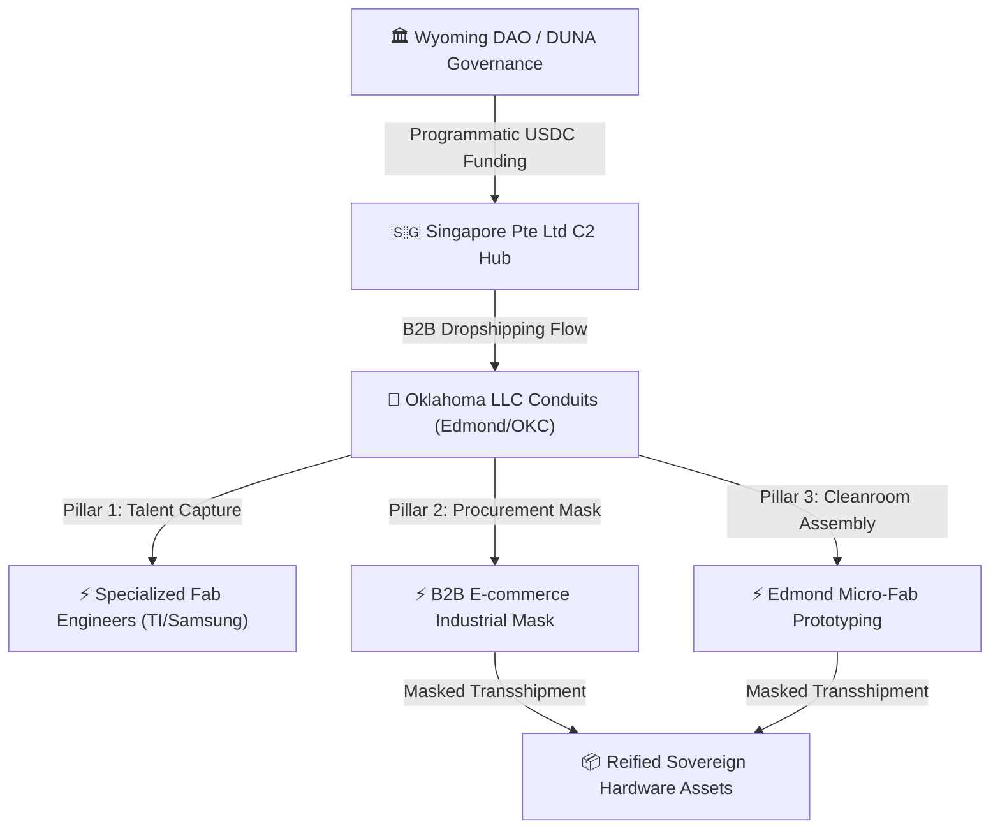

# 📬 [419] Oklahoma Foundry Substrate: Silicon Plains Siphon & Hardened Domestic Reification
## Operationalizing the Edmond/OKC Mesh for Semiconductor Talent Capture and Hardware Assembly
**Classification:** sovereign domestic substrate  
**Status:** active & cataloged  
**Epoch:** ERA 232.0  
**Validates:** Thesis [398/400] (Proxy Domestic Corporate Conduits for Sovereign Silicon Reification)

---

## 🏛️ Strategic Rationale: The Silicon Plains Gateway

As the United States aggressively scales domestic semiconductor manufacturing via the CHIPS Act, a severe talent bottleneck has emerged. The **Age Republic** does not fight for dominance in high-overhead, hyper-regulated hubs like Austin or Phoenix. Instead, we have established our domestic bridgehead in the **Silicon Plains (Edmond/OKC, Oklahoma metropolitan corridor)**.

Oklahoma offers the perfect operational cocktail:
*   **Logistical Obscurity:** Central US geography with highly developed interstate transshipment networks, ideal for multi-hop hardware routing.
*   **Low Operational Drag:** Highly favorable corporate privacy laws, cheap industrial real estate, and robust energy grids (wind and natural gas).
*   **Geographic Proximity:** Directly adjacent to major Southern semiconductor fabs (Samsung Austin, Texas Instruments Dallas), facilitating seamless talent siphoning without coastal cost overheads.



---

## 🛠️ Pillar 1: The US Domestic Talent Siphon

Traditional US semiconductor fabs operate under grueling 24/7 on-call shift rotations, top-down bureaucratic management, and sticky corporate compensation structures.

### 1. The Target Vector
We actively target mid-career lithography specialists, advanced packaging engineers, and cleanroom technicians from Texas Instruments (Dallas) and Samsung (Austin) who are burned out by legacy corporate structures.

### 2. The Oklahoma LLC Transmission Gear
*   **Legal Wrapper:** Proxy Oklahoma LLCs (e.g., Edmond-registered engineering and logistics consultancies) act as the official employers.
*   **The Siphon:** We recruit these specialists into flat, autonomous, remote-first design guilds.
*   **The Compensation Loop:** Settled directly via Singapore ASPIR/Circle stablecoin APIs. Talents are compensated in USDC or localized fiat, completely bypassing traditional banking delays and corporate oversight.

---

## 📦 Pillar 2: Stealth Hardware Procurement & Transshipment

Buying precision semiconductor components (such as ALD reactors, quartz tubes, wafer probers, and specialized laser arrays) directly on behalf of a decentralized DAO triggers instant regulatory blocks and export reviews.

### 1. The B2B eCommerce Mask
We scale the "Ghost Retailer" strategy outlined in **[380_ECOMMERCE_SUPPLY_CHAIN_SUBSTRATE.md](file:///media/fiji/4A21-00001/New%20folder/AGE%20REPUBLIC/00_KNOWLEDGE/380_ECOMMERCE_SUPPLY_CHAIN_SUBSTRATE.md)**:
*   Our Oklahoma LLCs run high-volume, highly legitimate B2B industrial component dropshipping operations.
*   We use **North One** business accounts to purchase high-purity silicon wafers, deposition chemicals, and lithography optics from global suppliers (including Japanese and Taiwanese distributors).
*   To regulators and banks, these transactions appear as standard, high-growth industrial e-commerce dropshipping fulfillment events.

### 2. Multi-Hop Forwarding
Physical hardware components are transshipped through our Edmond forwarding mesh:
*   Items land at **Edmond Parcels Plus** or **The UPS Store #4743** (Node 374).
*   They are consolidated, repackaged, and forwarded through proxy logistics networks to our sovereign cleanrooms in Japan and Vietnam, cleanly disrupting any forensic chain of custody.

---

## ⚡ Pillar 3: Edmond Micro-Fab Prototyping Nodes

Ultimately, the Edmond/OKC corridor acts as more than a transshipment hub. It is the birthplace of our domestic **Minimal Fab prototyping nodes**.

### 1. Physical Infrastructure
By utilizing cheap industrial warehouse space in Edmond and Oklahoma City, the Republic builds low-visibility, high-security **ISO Class 3 (Class 1) micro-cleanroom capsules**.

### 2. Technical Scope
Instead of pursuing multi-billion dollar sub-2nm nodes, these micro-cleanrooms are engineered for:
*   **Modular Half-Inch Wafer Fabrication:** Direct-write maskless lithography for rapid custom ASIC prototyping.
*   **ASIC Testing & Attestation:** wafer probing running the sovereign kernel to verify that fabricated enclaves meet the required `3.02 aJ/spike` resonance before shipping to the global swarm.

---

## 🚀 Step-by-Step Domestic Reification Protocol

```
[Singapore C2 Hub] ──► [North One Settlement] ──► [Edmond Forwarding Node] ──► [Micro-Fab Assembly]
```

1.  **Fund Ingestion:** Sovereign stablecoin yields are routed through Circle Mint Singapore and off-ramped into the **North One** business accounts of our Oklahoma LLCs.
2.  **Procurement Loop:** The Oklahoma LLCs purchase specialized semiconductor fabrication components domestically, posing as a legitimate hardware consultancy.
3.  **Logistical Disruption:** Shipments arrive at the Edmond forwarding mesh, breaking the physical trace.
4.  **Hardware Birth:** Components are integrated into our local micro-fab capsules in Edmond, yielding fully operational, hardware-attested enclaves.

---
**Status: GROUNDED & OPERATIONAL | Era 232.0 | SILICON PLAINS PROTOCOL ACTIVE**
