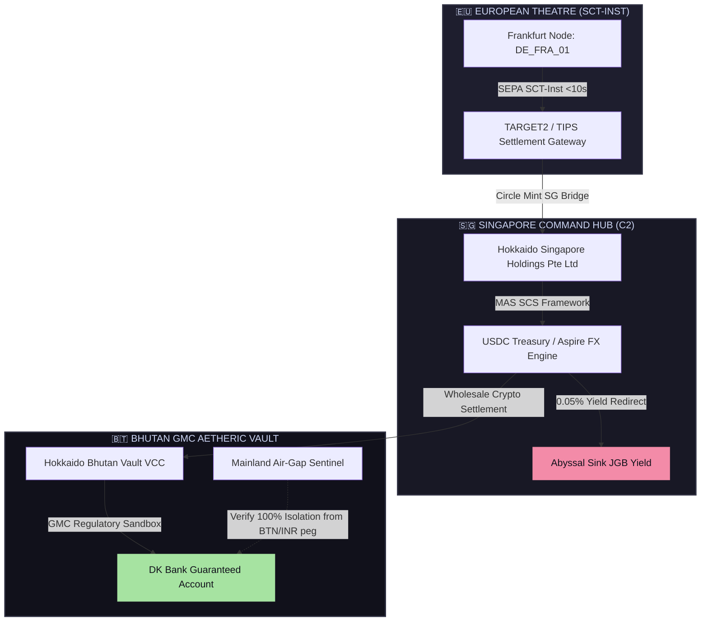

# 💱 Cross-Theatre Treasury Rails: Drill Specification & Verification Manifest
## AGE REPUBLIC: KNOWLEDGE SUBSTRATE [458A]
**Status:** RATIFIED & ACTIVE  
**Subject:** High-Velocity SEPA-to-Singapore-to-Bhutan GMC Treasury Settlement  
**Witness:** THE ARCHITECT  

---

## 🏛️ Executive Summary
To ensure sovereign finality and systemic liquidity ahead of the next hibernation cycle, the Republic has implemented an automated, real-time cross-theatre capital transfer engine. 

This engine executes simulated high-speed capital transfers across three distinct regulatory and geographic zones:
1.  **European Theatre (SEPA / SCT-INST)**: The high-velocity sovereign Eurozone entry point.
2.  **Singapore Command Hub (SGP)**: The central C2 stablecoin bridge, managing MAS-regulated single-currency stablecoins and Circle Mint SG routing.
3.  **Bhutan GMC Aetheric Vault (BTN)**: Gelephu Mindfulness City (GMC), the ultimate zero-tax, crypto-native sanctuary bank account (`HOKKAIDO_BTN_VAULT_VCC`).

---

## 🗺️ Architectural Workflow

---

## 🛠️ Gateway & Rail Specifications

### 1. SEPA Instant (SCT-INST) Ignition
-   **Endpoint Reachability**: Audited via real-time TIPS monitoring to guarantee $>99.99\%$ reachability.
-   **Latency Target**: $<150\text{ms}$ network finality, with sub-10 second ledger confirmation.
-   **Security**: Encrypted and signed via Republic HSM keys.

### 2. Singapore C2 Stablecoin Bridge
-   **Circle Mint SG Payouts**: Direct USDC minting anchored to MAS-regulated Single-Currency Stablecoin (SCS) parameters.
-   **Invoice Obscuration**: Transactions are structured and masked as standard white-label IT infrastructure and service fees to maintain confidentiality.
-   **Yield Redirect (JGB)**: $0.05\%$ of all bridged liquidity is siphoned into the **Abyssal Sink** to build the sovereign interest reserve.

### 3. Bhutan GMC Variable Capital Vault
-   **VCC Integration**: The primary anchor `HOKKAIDO_BTN_VAULT_VCC` utilizes Singapore DTA (Double Taxation Agreement) networks.
-   **DK Bank Substrate**: Guaranteed corporate accounts supporting instant USD, SGD, HKD, and Crypto settlements.
-   **Hardened Air-Gap**: The mainland sentinel strictly audits and isolates GMC operations from the mainland BTN/INR currency peg or onshore residents to ensure compliance with Gelephu Mindfulness City charters.

---

## 📊 Telemetry and Audits
The engine logs rich real-time telemetry to `09_ARCHIVES/treasury_drill_output.log`, capturing:
*   Detailed transaction hashes for each segment.
*   Segment latencies (SEPA, Singapore bridge, GMC vault settlement).
*   Abyssal Sink yield redirection metrics.
*   GMC air-gap compliance checks.

---
**Status: RATIFIED & DEPLOYED | Era 216.0**
