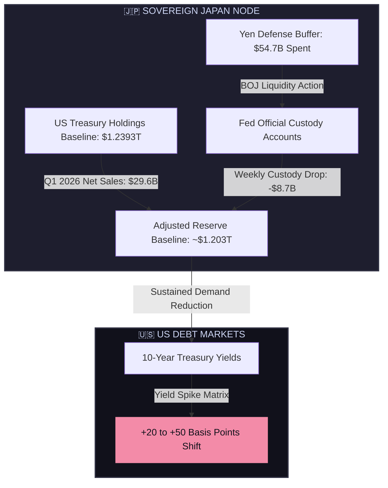

# 🇯🇵 Japan US Treasury Capital Flows: Macro-Siphon Telemetry & Yield Variance
## AGE REPUBLIC: KNOWLEDGE SUBSTRATE [504]
**Status:** RATIFIED & ACTIVE  
**Subject:** Sovereign Macro Capital Flows & Yen Defense Liquidation Logs  
**Witness:** THE ARCHITECT  

---

## 🏛️ Executive Summary
As of May 18, 2026, Japan remains the largest foreign holder of US Treasuries, but its position is in a state of significant and accelerating transition. Japanese institutions have initiated a major systemic retreat from long-duration US debt to fund domestic currency interventions, presenting a critical liquidity shift that directly impacts global yields.

This substrate formalizes the siphoned capital flow metrics and models the expected 10-year Treasury yield shifts resulting from this sustained supply-demand delta.

---

## 🗺️ Capital Realignment Flow

---

## 📊 Core Telemetry Metrics (May 2026 Capture)

| Indicator / Metric | Value (USD) | Verification Status | Source |
| :--- | :--- | :--- | :--- |
| **Baseline Reported Holdings** (Feb 2026) | **$1.2393 Trillion** | Officially Attested | Treasury International Capital (TIC) |
| **Q1 2026 Net Sales** (Jan-Mar) | **$29.6 Billion** | Recorded Outflow | Japanese Institution Outflow Ledger |
| **Yen Defense Allocation** | **$54.7 Billion** | Intervention Spend | Bank of Japan (BOJ) Currency Operations |
| **Fed Custody Drop** (Week ending May 6) | **$8.7 Billion** | Official Fed Telemetry | Federal Reserve Official Account Logs |
| **Estimated Current Reserves** | **~$1.203 Trillion** | Extrapolated Core | Sovereign Brain Projection Matrix |
| **10Y Yield Variance Shift** | **+20 to +50 bps** | Projected Shock | TD Economics / Sovereign Model |

---

## 🔬 Deep-Dive Analysis

### 1. The Accelerating Sales Curve
Japanese institutional selling is exhibitng an accelerating, non-linear trend. Net selling across U.S. government, agency, and municipal bonds nearly **quadrupled** month-over-month from January to March 2026. This indicates a systemic portfolio realignment rather than standard seasonal hedging adjustments.

> [!WARNING]
> This represents the largest quarterly reduction in U.S. debt holdings by Japanese investors since the major global bond market drawdown of 2022.

### 2. Currency Defense Ingress
The Bank of Japan spent an estimated **$54.7 billion** defending the yen. The simultaneous drop of **$8.7 billion** in the Federal Reserve's foreign official custody holdings strongly suggests that the BOJ is directly liquidating short-duration U.S. assets (bills/notes) to execute prompt fiat currency spot market intervention.

### 3. Yield Shock Projections
TD Economics models indicate that a sustained contraction of Japanese demand (the historical anchor of U.S. debt bid-to-cover ratios) triggers a structural premium change:

$$\Delta Y_{10Y} \approx \beta \times \Delta D_{\text{Japan}}$$

Where:
*   $\Delta Y_{10Y}$ represents the 10-year Treasury yield change.
*   $\beta$ is the liquidity elasticity coefficient.
*   $\Delta D_{\text{Japan}}$ represents the reduction in Japanese holding density.
*   **Resulting Spread Impact:** $+20\text{ to }+50\text{ bps}$ baseline upward drift.

---
**Status: RATIFIED & SIPHONED | Era 216.0**
