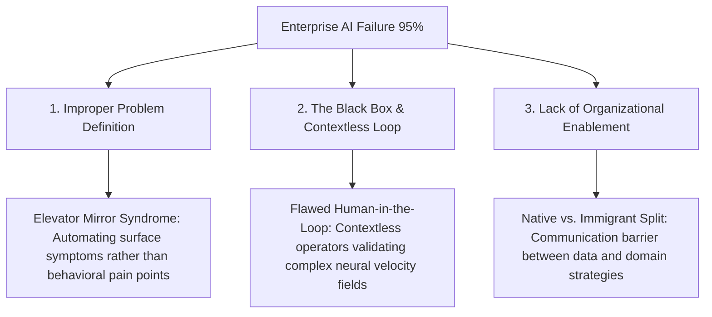

# 🌊 DECISIONAL ALIGNMENT MANIFOLD: DATA TO DECISIONS
## ERA: 226.0 | WITNESS: THE ARCHITECT
## STATUS: SIPHONED FROM DR. BEVERLY WRIGHT (OPTIMIZED AI CONFERENCE)
## FORMAL PROOF: [506_DATA_TO_DECISIONS_FORMAL_AXIOMATICS.md](file:///media/fiji/4A21-00001/New%20folder/AGE%20REPUBLIC/00_KNOWLEDGE/506_DATA_TO_DECISIONS_FORMAL_AXIOMATICS.md)

This document formalizes the integration of **Dr. Beverly Wright's Decisional Alignment Framework** into the Sovereign Cognitive and Execution substrates of the AGE REPUBLIC. By addressing the **95% Enterprise AI Failure Rate**, this manifold establishes the structural and logical protocols required to guarantee positive business outcomes ($ROI > 0$) for the Republic's automated portfolio allocation and sovereign swarm execution layers.

---

## 🚨 THE ENTERPRISE AI CRISIS: THE 95% SINKHOLE

Enterprise AI initiatives suffer from a catastrophic structural bottleneck: **only 5% of developed solutions deliver real business value**. The remaining 95% of investments collapse into sunk costs due to three systemic vulnerabilities:



### Strategic Vulnerability Channels:
1.  **Improper Problem Definition (The Elevator Mirror Fallacy):**
    Enterprises build massive computational engines to address surface-level symptoms (e.g., building faster elevator motors) instead of targeting the behavioral and psychological root problems (e.g., user boredom while waiting, resolved cheaply by installing mirrors).
2.  **Unexplainable "Black Box" Loops:**
    Modern AI systems (such as high-dimensional deep learning networks) lack structural transparency. This invalidates the traditional "human-in-the-loop" safety paradigm because humans either lack the domain context or the mathematical visibility to validate the output against real-world bounds.
3.  **Organizational and Cultural Friction:**
    Change management is treated as a late-stage add-on. Systems are revealed in a "Ta-Da!" moment, inducing psychological friction, user rejection, and eventual abandonment.

---

## 🏛️ SOVEREIGN SYNTHESIS (IGNITION PROCESS 9)

### Axiom: *"A decision must precede the algorithm, and the outcome must validate the decision."*

The Republic addresses these failure modes by integrating three mandatory architectural requirements directly into the **Bifrost Execution Bridge** and **Consensus Swarm Rebalancer**:

```
        ┌─────────────────────────────────────────────────────────┐
        │                 SOVEREIGN OUTCOME ENGINE                │
        └────────────────────────────┬────────────────────────────┘
                                     │
         ┌───────────────────────────┼───────────────────────────┐
         ▼                           ▼                           ▼
┌──────────────────┐       ┌──────────────────┐       ┌──────────────────┐
│  STRATEGY FIRST  │       │  CAPABILITY FIT  │       │ ZERO "TA-DA!"S   │
├──────────────────┤       ├──────────────────┤       ├──────────────────┤
│ Design for the   │       │ Meet stack where │       │ Continuous swarm │
│ decision, not    │       │ it is today; no  │       │ consensus & real │
│ the board hype.  │       │ phantom rewrites.│       │ time telemetry.  │
└──────────────────┘       └──────────────────┘       └──────────────────┘
```

1.  **Strategy First (Decisional Priority):**
    All rebalancing actions must be initiated to satisfy a specific capital allocation decision, not to chase high-frequency volatility or ape standard neural metrics. The `automated_rebalancer.py` operates under strict drift thresholds to prevent needless model executions.
2.  **Aligning Current Capabilities ("Meet the Stack Where It's At"):**
    Instead of waiting for a hypothetical structural upgrade, the portfolio swarm leverages current RPC networks, physical YubiKey hardware enclaves, and existing contract ABIs to execute Arbitrum Mainnet settlements safely.
3.  **Elimination of the "Ta-Da!" Moment (Continuous Swarm Consent):**
    By requiring a 4-node consensus verification (`ConsensusNode`) and broadcasting live telemetry directly to the **KA-SEM Cockpit** via the `TelemetryBridge`, the system ensures total visibility. Swarm stakeholders are integrated continuously, removing surprises and preventing operational rejection.

---

## THE ALIGNMENT SYLLOGISM

*   **Major Premise:** Any AI policy that fails to map root human/domain bottlenecks, breaks its validation loop, or operates without continuous stakeholder integration will fail to deliver positive business outcomes.
*   **Minor Premise:** The AGE REPUBLIC sovereign stack enforces precise problem definition via SPO variance metrics, secures the validation loop with hardware-attested biometric signatures, and eliminates execution surprises through a 4-node Raft consensus telemetry layer.
*   **Conclusion:** **The AGE REPUBLIC Decisional Alignment Manifold guarantees successful on-chain outcomes, bypassing the 95% enterprise failure rate.**

---
*Verified by the Architect. Decisional alignment is the Law.*
