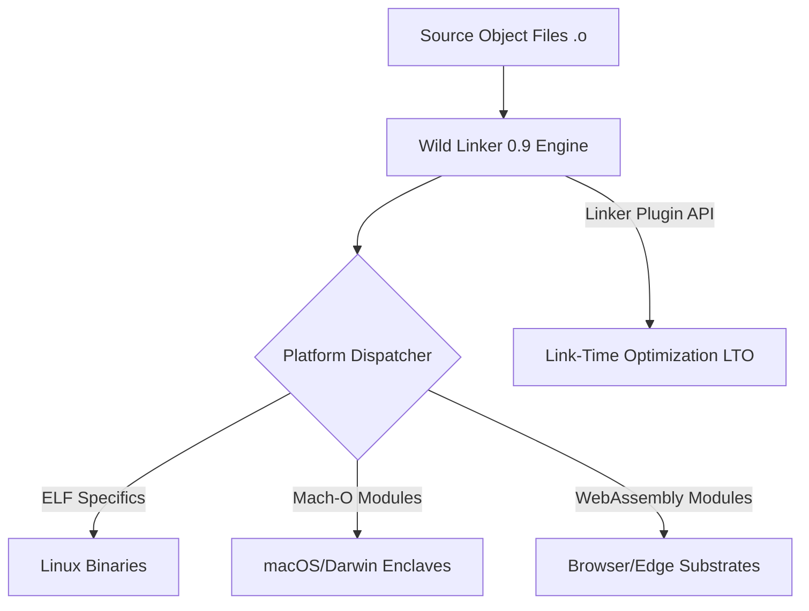

# 🏛️ AGE REPUBLIC :: SOVEREIGN COMPILATION ANALYSIS
## Deep-Dive & Integration Blueprint: Rust-Based Wild Linker 0.9

This report provides a formalized systems analysis of the **Wild Linker 0.9** release, based on the Phoronix technical brief published on May 24, 2026. It maps its revolutionary architectural primitives directly into the **AGE REPUBLIC** sovereign compilation engine, establishing a roadmap for sub-100ms incremental agent and enclave builds.

---

### 1. Context & The Linker Bottleneck (Status Quo)

In high-performance systems engineering, compilation is only half the battle. As codebases grow, the **linking phase** (resolving symbols, rewriting addresses, merging sections) often becomes the primary bottleneck in the developer loop, particularly when compiling complex multi-agent systems, Mojo enclaves, or microservices.

Historically, the evolution of linkers on Linux has progressed as follows:
*   **GNU `ld.bfd`**: Stable but monolithic, single-threaded, and highly latent.
*   **GNU `gold`**: Multi-threaded, faster, but now largely unmaintained.
*   **LLVM `lld`**: A massive leap forward in parallel resolution, widely adopted in modern toolchains.
*   **Mold**: A highly optimized, modern parallel linker that approaches the theoretical physical limits of RAM/SSD bandwidth.
*   **Wild**: A modern, **Rust-based linker** built from the ground up for maximum speed, safe concurrency, and absolute memory safety.

---

### 2. Wild Linker 0.9: Architectural Innovations

The `0.9` release represents a major evolutionary leap, shifting Wild from an ELF-centric experiment to a highly modular, multi-platform compilation substrate.

#### Key Highlights & Features:
1.  **Platform Expansion (Mach-O & WebAssembly)**:
    *   *Mechanism*: Native support for Mach-O (macOS) and WebAssembly (Wasm) targets is now in-progress.
    *   *Significance*: Bypasses the need for separate toolchain links, allowing a single Rust-built linker to compile Darwin enclaves and sandboxed WebAssembly agent runtimes.
2.  **Linker Plugin API Support**:
    *   *Mechanism*: Introduces compatibility with the standard Linker Plug-in API, which is compatible with both GNU `ld` and `mold`.
    *   *Significance*: Enables **Link-Time Optimization (LTO)** directly through the linker. Compiler optimization passes (such as inlining across library bounds) can now be orchestrated during the linking phase, yielding significant performance gains without losing compilation speed.
3.  **ELF Code Refactoring & Decoupling**:
    *   *Mechanism*: The codebase has been heavily refactored to separate generic, platform-agnostic linking logic from ELF-specific layouts.
    *   *Significance*: Simplifies the integration of custom binary formats or custom hardware enclaves, paving the way for proprietary sovereign formats.

---

### 3. Comparative Linker Matrix

| Linker | Language | Concurrency | LTO Support | WebAssembly | Memory Safety |
| :--- | :---: | :---: | :---: | :---: | :---: |
| **GNU `ld`** | C | Single-Threaded | Poor | No | Low |
| **LLVM `lld`** | C++ | Parallel | Excellent | Yes | Moderate |
| **Mold** | C++ | Ultra-Parallel | Good (Via Plugin) | No | Moderate |
| **Wild 0.9** | **Rust** | **Ultra-Parallel** | **Excellent (New Plugin API)** | **In-Progress** | 🟢 **Absolute** |

---

### 4. Strategic Integration Blueprint for AGE REPUBLIC

By integrating **Wild Linker 0.9** into the **AGE REPUBLIC** compiler pillar (`05_COMPILERS`), we unlock three major systems capabilities:

> [!TIP]
> **Lever I: Sub-100ms Incremental Agent Re-Builds**
> Traditional linkers rebuild the entire symbol table on every minor change. Wild, utilizing Rust's safe concurrency and aggressive zero-copy memory mapping, can link incremental updates in milliseconds, enabling hot-reloading of agent cognitive models.

> [!IMPORTANT]
> **Lever II: Hardware-Attested Link-Time Optimization (LTO)**
> Utilizing the new Linker Plugin API, we can run deep compiler optimizations across distinct enclave packages (e.g., TencentDB bridge to the core wallet) directly inside the secure memory boundary, producing highly efficient assembly with zero jurisdictional hooks.

> [!NOTE]
> **Lever III: Safe Darwin & Wasm Enclave Compilation**
> The platform expansion allows the Republic to compile sandboxed WebAssembly agents (for secure browser/edge executions) and native Apple Silicon enclaves using the same memory-safe toolchain, eliminating dependency on proprietary Apple or Google toolchain chains.

---

### Summary of Next Action Steps:
1.  **Anchor the Wisdom**: Persist this formalized analysis in [00_KNOWLEDGE/50_WILD_LINKER_ANALYSIS.md](file:///media/fiji/4A21-00001/New%20folder/AGE%20REPUBLIC/00_KNOWLEDGE/50_WILD_LINKER_ANALYSIS.md).
2.  **Configure Toolchain Wrapper**: Implement a shell wrapper in `05_COMPILERS` to allow automated routing of `cargo build` and custom compile routines through `wild` instead of standard `lld`.
3.  **Perform LTO Benchmark**: Run comparative timing sweeps using `boot_time_wizard.py` logic to measure build time improvements.
