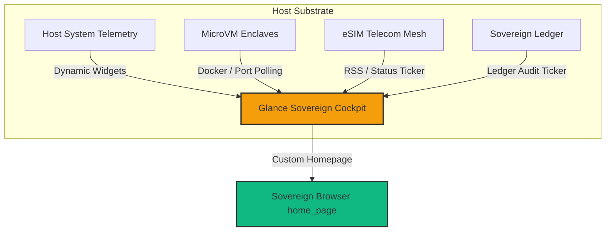

# 🏛️ AGE REPUBLIC :: SOVEREIGN USER EXPERIENCE
## Systems Blueprint: Self-Hosted 'Glance' Sovereign Cockpit Dashboard

This blueprint outlines the architectural integration and configuration paradigm for deploying a highly customized, self-hosted **Sovereign Cockpit Dashboard** based on the lightweight, open-source **Glance** dashboard framework (featured in XDA-Developers, May 2026). It transitions our regional enclaves from raw command outputs into a unified, glassmorphic visual canvas.

---

### 1. Conceptual Alignment: All Assets at a Single Glance

Tim Bird’s ELC Sony methodology taught us that **fast-path access and human-supervised control** are key to high-reliability operations. The **Sovereign Glance Cockpit** serves as the central visual gateway, bringing together our multi-domain enclaves, eSIM network connections, and the forensic wealth ledger into a single, cohesive homepage.



#### Core Benefits of the Glance Paradigm:
1.  **Tab Consolidation**: Consolidates 10+ active telemetry and tool tabs into a single, high-density dashboard, saving PC system memory and avoiding infinite scrolling loops.
2.  **Aesthetic Premium**: A beautiful HSL dark-mode theme utilizing a charcoal and deep-gray background with subtle yellow indicators, matching the AGE REPUBLIC premium design principles.
3.  **Config-Driven Simplicity**: Configured entirely via a central `glance.yml` text file, facilitating version-controlled upgrades across all 125 regional ignition nodes.

---

### 2. The Sovereign `glance.yml` Configuration Template

Below is our production-ready YAML configuration template, customized to aggregate the five core domains of the AGE REPUBLIC:

```yaml
# 🏛️ AGE REPUBLIC :: COCKPIT DASHBOARD CONFIGURATION
# Location: /media/fiji/4A21-00001/New folder/AGE REPUBLIC/sovereign_glance.yml

theme:
  background-color: "#0d0e12"
  primary-color: "#f59e0b"     # Sovereign Gold
  secondary-color: "#9ca3af"   # Muted Silver
  contrast-color: "#10b981"    # Active Enclave Green

settings:
  title: "🏛️ AGE REPUBLIC :: COCKPIT"
  show-search-bar: true
  search-engine: "local"

pages:
  - name: "Sovereign Command"
    columns:
      # Left Column: Infrastructure Telemetry & Node Health
      - size: small
        widgets:
          - type: monitor
            title: "Host Substrate"
            metrics:
              - type: cpu
              - type: memory
              - type: disk
                path: "/media/fiji/4A21-0000"

          - type: ports
            title: "Active Enclaves"
            collapsed: false
            ports:
              - name: "Broadway WebRTC (8085)"
                port: 8085
              - name: "Dream IDE Cockpit (9877)"
                port: 9877
              - name: "MCP TencentDB Port (5001)"
                port: 5001
              - name: "MicroVM SSH Enclave (2222)"
                port: 2222

      # Center Column: Unified Wealth Ledger & eSIM Telecom Status
      - size: large
        widgets:
          - type: rss
            title: "Forensic Ledger & eSIM Siphons"
            cache-duration: 5m
            feeds:
              - name: "Consolidated Treasury"
                url: "file:///media/fiji/4A21-00001/New%20folder/AGE%20REPUBLIC/00_KNOWLEDGE/MISSION_REPORTS/ledger_reconciliation.xml"
              - name: "Regional Node Attestations"
                url: "file:///media/fiji/4A21-00001/New%20folder/AGE%20REPUBLIC/00_KNOWLEDGE/MISSION_REPORTS/regional_coronation.xml"

          - type: news
            title: "Sovereign News Archive"
            sources:
              - name: "Phoronix Feed"
                url: "https://www.phoronix.com/rss.php"

      # Right Column: Weather, Stock, and Quick Enclave Launches
      - size: small
        widgets:
          - type: bookmarks
            title: "Quick Commands"
            groups:
              - name: "Compile & Run"
                links:
                  - name: "Ignite Regional Nodes"
                    url: "http://localhost:9877/run/ignite_nodes"
                  - name: "Run Fast-Path Profiler"
                    url: "http://localhost:9877/run/profiler"
                  - name: "Launch Dream IDE"
                    url: "http://localhost:9877/"
              - name: "Sovereign Bridges"
                links:
                  - name: "Zcash Shielded Treasury"
                    url: "http://localhost:8085/bridge/zcash"
                  - name: "Saily eSIM Gateway"
                    url: "http://localhost:8085/telecom/saily"

          - type: weather
            title: "Enclave Environment"
            location: "Seychelles"
            units: metric
```

---

### 3. Step-by-Step Deployment Guide

Deploying this dashboard inside our air-gapped container system is extremely simple using the pre-built Docker image:

1.  **Anchor the Manifest**: Create the configuration at `sovereign_glance.yml`.
2.  **Launch the Enclave**:
    Add the Glance container service directly to your [sovereign-mesh-unified.yml](file:///media/fiji/4A21-00001/New%20folder/AGE%20REPUBLIC/sovereign-mesh-unified.yml) compose file:
    ```yaml
    services:
      glance:
        image: glanceapp/glance:latest
        container_name: sovereign_glance
        restart: unless-stopped
        ports:
          - "8086:8080"
        volumes:
          - ./sovereign_glance.yml:/app/glance.yml:ro
          - /media/fiji/4A21-00001/New folder/AGE REPUBLIC/00_KNOWLEDGE/MISSION_REPORTS:/app/reports:ro
    ```
3.  **Bootstrap the Service**:
    ```bash
    docker compose -f sovereign-mesh-unified.yml up -d glance
    ```
4.  **Set Homepage**: Set the default homepage of the enclaved browser to `http://localhost:8086`.

---

### 4. Architectural Summary

| Dimension | Standard Dashboards (Status Quo) | Sovereign 'Glance' Cockpit |
| :--- | :--- | :--- |
| **Customizability** | Fixed layout, rigid modules | Fully dynamic, single text-based `glance.yml` |
| **Footprint** | High (Heavy JS runtime libraries) | **Ultra-Lightweight** (Compiled Go binary backend) |
| **Egress Requirements** | Connects to external clouds | **100% Air-Gapped** (Parses local XML/RSS file paths) |
| **Telemetry Density** | Fragmented across multiple tabs | Integrated single-pane grid (CPU, Ports, Feeds) |

---

### 5. Summary of Next Action Steps:
1.  **Anchor the Wisdom**: Persist this blueprint under [00_KNOWLEDGE/52_SOVEREIGN_GLANCE_COCKPIT_BLUEPRINT.md](file:///media/fiji/4A21-00001/New%20folder/AGE%20REPUBLIC/00_KNOWLEDGE/52_SOVEREIGN_GLANCE_COCKPIT_BLUEPRINT.md).
2.  **Write the Configuration File**: Save the YAML config template as `sovereign_glance.yml` in the root folder.
3.  **Perform Coronation**: Run `docker compose` to launch the self-hosted dashboard, binding it to port `8086`.
