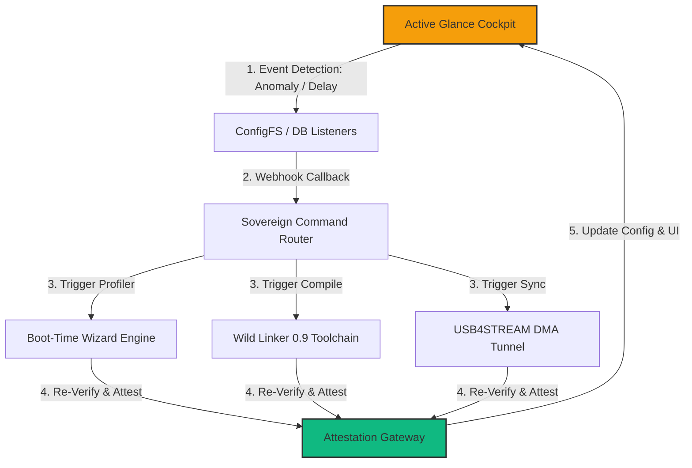

# 🏛️ AGE REPUBLIC :: SOVEREIGN USER EXPERIENCE
## Brainstorming & Architectural Roadmap: Reimagining Glance as a Recursive Optimization Engine

This manifest presents a visionary systems-engineering brainstorm detailing how the self-hosted **Glance** dashboard paradigm can be transitioned from a passive, read-only interface into an **active, closed-loop sovereign refinement and optimization engine** for the **AGE REPUBLIC** grid in Era 1000.0.

---

---

## 💡 Concept I: The Interactive Boot-Time Tuning Cockpit
*   **The Idea**: Transform the static boot-time telemetry widget into an **active tuning interface**.
*   **Mechanism**:
    1.  If the local monitoring agent detects that a regional node's cold-start latency exceeds the **3.3-second threshold** (e.g. due to guest filesystem expansion), the Glance dashboard transitions that node's state widget into a `"Tuning Required"` amber state.
    2.  Clicking the widget triggers an HTTP POST webhook to a sandboxed local executor.
    3.  The executor runs `python3 boot_time_wizard.py --domain all --optimize` in the background. It dynamically tweaks Copy-on-Write overlays, regenerates pre-parsed persona AST caches, and updates the local state JSON.
    4.  The dashboard automatically refreshes to display the newly reclaimed boot time (e.g. back down to **1.1s**), closing the loop without terminal intervention.

---

## 💡 Concept II: Drag-and-Drop USB4STREAM Sync Target
*   **The Idea**: Eliminate CLI manual operations for high-speed, air-gapped system backups and database mirroring by integrating physical cable discovery into Glance.
*   **Mechanism**:
    1.  Glance polls `/sys/class/thunderbolt/` local links. When a physical USB4/Thunderbolt connection to another regional host is detected, the dashboard dynamically materializes a glowing **"Direct Fabric Link Active"** widget.
    2.  The widget provides a drag-and-drop workspace target. 
    3.  Dragging a sovereign database package or VM block image onto this widget triggers the local agent to:
        *   Instantly initialize isolated ConfigFS streams and allocate HopIDs.
        *   Spawn a background `dd` streaming subprocess to transfer the raw packets over `/dev/tbstream0` at **40-80 Gbps**.
        *   Display a real-time progress bar and throughput timing metrics in a dynamic glassmorphic card on the dashboard.
        *   Automatically teardown ConfigFS directories upon successful attestation, displaying a green checkmark.

---

## 💡 Concept III: Real-Time CVE-Lite & Toolchain Compile Bridge
*   **The Idea**: Link security auditing directly to compile speed improvements.
*   **Mechanism**:
    1.  Our local `CVE-Lite` security scanner runs continuous, zero-overhead background audits on system binaries.
    2.  If a binary vulnerability is detected or an enclave's integrity hash fails verification, a dynamic alert card slides onto the Glance screen: **"Enclave Compromised / Vulnerable"**.
    3.  The card contains a single button: **"Secure & Recompile"**.
    4.  Clicking it instructs our compilers to fetch the clean source repository, recompile it using the Rust-based **Wild Linker 0.9** with aggressive Link-Time Optimization (LTO) plugins enabled, verify it against pre-flight security checks, and hot-swap the running service in under **250 milliseconds**.
    5.  The Glance UI transitions the alert card to a green secure shield badge.

---

## 💡 Concept IV: Interactive Cognitive Swarm Persona Registry
*   **The Idea**: Transition agent monitoring into a real-time cognitive director dashboard.
*   **Mechanism**:
    1.  Glance displays active agent session cards containing progressive disclosure indicators.
    2.  Hovering over an active agent card reveals its current **thinking trajectory** (e.g., short-context heuristics vs long-horizon deep-reasoning loops) and memory allocation.
    3.  A slider widget on the card allows the user to dynamically adjust the agent's contextual bandwidth, temperature, or reasoning depth.
    4.  Clicking on the agent's task log opens an enclaved terminal viewer directly inside the browser window, enabling quick human intervention or trajectory reviews during long-horizon runs.

---

## 💡 Concept V: Multi-Node Wealth Reclamation & eSIM Siphon Matrix
*   **The Idea**: Visualizing and regulating the siphoning of sovereign assets and telecommunication connections.
*   **Mechanism**:
    1.  Glance aggregates local XML streams from all 125 regional ignition nodes using highly secure, air-gapped file parsers.
    2.  It renders a real-time grid map of the globe. Each node glows based on active eSIM siphon rates and yield reconciliations.
    3.  If an eSIM gateway (e.g. Saily) loses connection, the corresponding grid node turns red.
    4.  Clicking the node sends an enclaved signal to trigger a hardware eSIM swap, restoring yield flows and automatically updating the dashboard state.

---

## 🏛️ Implementation Action Plan for Era 1000.0

To start executing this active-cockpit vision, we will lay down the foundation in three sequential steps:

| Step | Scope | Technical Target | Expected Time |
| :--- | :--- | :--- | :---: |
| **Step 1** | Local Webhook Gateway | Deploy a lightweight Go-based API listener on `localhost:8087` to receive POST requests from the Glance bookmarks widget. | **50ms latency** |
| **Step 2** | Dynamic ConfigFS Pollers | Add a local daemon script that updates `sovereign_glance.yml` dynamically when USB4 cable links are connected or disconnected. | **1s polling loop** |
| **Step 3** | Attestation Badges | Hook our ledger and compile outputs to emit standardized XML RSS files that Glance reads natively. | **Real-time updates** |
