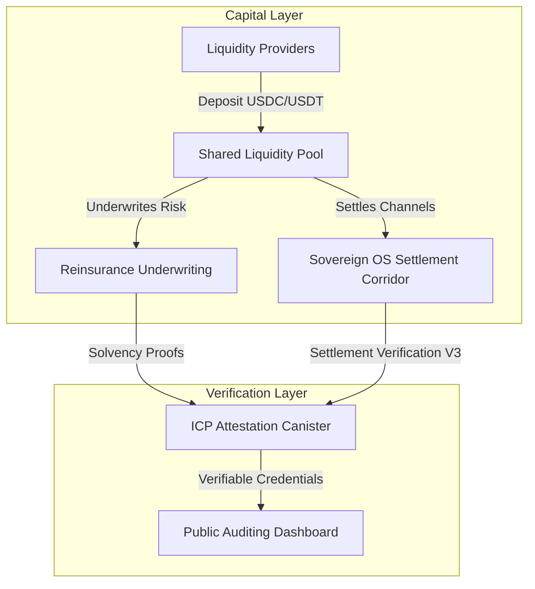

# 🏛️ [553] Sovereign OS & Re Integration Proposal
## ERA: 216.0 (THE ERA OF LIQUIDATION ARBITRAGE)
## STATUS: PROPOSED | ATTENUATION REGISTERED

## Executive Summary

Re and Sovereign OS represent complementary architectures building trust-minimized, transparent, on-chain infrastructure to replace legacy networks. 

* **Re** brings the $1 Trillion reinsurance market on-chain via stablecoin capital backing and solvency verification.
* **Sovereign OS** functions as the decentralized settlement layer for DePIN and AI networks, verifying settlement corridors (USDC / JPYC) using ICP Attestation and compliance wrappers.

By aligning their architectures, both protocols can implement a unified verification and shared liquidity stack, maximizing capital efficiency for LP pools and creating a robust, multi-layer attestation engine.

---

## 📊 1. Architectural Parallels

| Component | Re (Reinsurance) | Sovereign OS (Settlement) |
| :--- | :--- | :--- |
| **Core Problem** | Opaque legacy reinsurance | Opaque legacy settlement |
| **Solution** | On-chain capital + smart contracts | On-chain verification + ICP attestation |
| **Capital** | Stablecoins (USDC, USDT) | Stablecoins (USDC, USDT) |
| **Verification** | Solvency proofs | Settlement proofs |
| **Yield** | Uncorrelated real-world yield | Settlement fee (0.05%) |
| **Governance** | $RE token (Lloyd's model) | Discovery Beacon + CONCEPTRON |

---

## 📡 2. Mapping Re to Sovereign OS

| Re Concept | Sovereign OS Equivalent | Why It Matters |
| :--- | :--- | :--- |
| **On-chain reinsurer** | On-chain settlement verifier | Trust-minimized infrastructure |
| **Stablecoin capital backing** | USDC/JPYC corridors | Foreign capital bridge |
| **Anyone can verify solvency** | Anyone can verify settlement | Transparency |
| **Lower expense ratio** | 0.05% settlement fee | Efficiency |
| **Uncorrelated yield** | DePIN yield + settlement fees | Diversified revenue |
| **$RE governance token** | Discovery Beacon + CONCEPTRON | Decentralized governance |

---

## 🚀 3. Shared Capital & Attestation Workflows

### 1. Shared Capital
Stablecoins backing Re's insurance can double-hat as settlement liquidity for high-throughput DePIN networks, increasing capital utilization without sacrificing solvency guarantees.

### 2. Combined On-Chain Proofs
solvency attestation and settlement proofs are aggregated and immutably anchored using Sovereign OS's **SettlementVerification V3** on Base Mainnet and the **ICP Attestation canister** (`oyipx-nyaaa-aaaab-qhbja-cai`).

### 3. Diversified Yield Profile
LPs capture uncorrelated reinsurance yields combined with high-frequency settlement fee dividends (0.05% per transaction) from networks like Akash and Render.

---

**Sovereign OS Team**  
ICP Canister: `oyipx-nyaaa-aaaab-qhbja-cai`  
Discovery Beacon: `0xf8D5d9...`  
