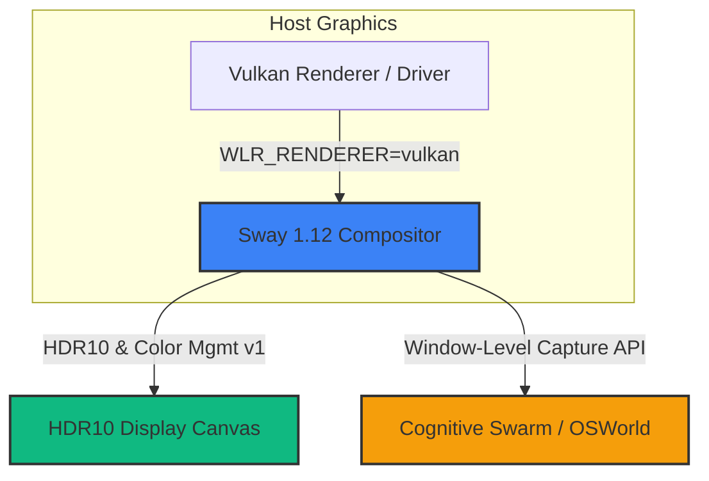

# 🏛️ AGE REPUBLIC :: SOVEREIGN USER INTERFACE
## Systems Blueprint: Sway 1.12 Wayland Compositor Integration

This blueprint provides a formalized engineering analysis and integration roadmap for the newly released **Sway 1.12** Wayland compositor (released May 25, 2026). It outlines how to deploy this advanced graphical substrate to enable **Vulkan-driven HDR10 rendering** and **secure window-level agent observations** within the **AGE REPUBLIC** cockpit.

---

### 1. Conceptual Alignment: A High-Fidelity Visual Enclave

Our sovereign philosophy demands both **extreme visual premium** and **strict sandboxed security**. Sway 1.12, running on top of **wlroots 0.20**, presents a major graphics breakthrough that fits perfectly into the AGE REPUBLIC stack:



#### Key Advantages of Sway 1.12 for our Grid:
1.  **Vulkan-Driven HDR10 Output**: Allows rendering our deep HSL glassmorphic dark-mode dashboards with gorgeous color depth, using the native `color-management-v1` Wayland protocol.
2.  **Granular Window Capture**: Prior to 1.12, screen capture was all-or-nothing (entire screen). Individual window-level capture allows our multimodal cognitive agents to visually inspect specific tool windows (like the Dream IDE or terminal enclaves) without risking exfiltration of background workspaces.
3.  **Non-Blocking GPU Initialization**: Prevents boot crashes on nodes utilizing proprietary graphics drivers (like NVIDIA server GPUs) by showing diagnostic warning screens instead of hard-crashing, bypassable via `--unsupported-gpu`.

---

### 2. Tactical Sovereign Levers

By upgrading our localized display server enclaves to **Sway 1.12**, we unlock three primary system levers:

> [!IMPORTANT]
> **Lever I: Deep HDR Glassmorphic Visuals**
> Utilizing `WLR_RENDERER=vulkan` combined with `--device-primaries` forces Sway to read display EDID data natively. This allows our deep charcoal and sovereign gold UI palettes to render with high contrast, bringing a stunning visual premium to the cockpit home page.

> [!TIP]
> **Lever II: Secure Window-Level Agentic Observation**
> By utilizing Sway 1.12's new window-capture protocol support, we can feed individual window frames directly to our cognitive agent swarms (for visual grounding during automated tasks). This sandboxes the agent's eyes, preventing them from seeing adjacent private workspace terminals.

> [!NOTE]
> **Lever III: Robust Multi-GPU Boot Resiliency**
> Regional ignition nodes running on heterogeneous server racks can occasionally fail to start their graphical display when standard GPU checks fail. Using the environment variable `SWAY_UNSUPPORTED_GPU=1` ensures display servers boot up reliably under fallback pipelines, maintaining system availability under any condition.

---

### 3. Sway 1.12 Sovereign Configuration Template

Below is our production-ready configuration file, optimized to enable Vulkan, HDR, and key security boundaries:

```ini
# 🏛️ AGE REPUBLIC :: SWAY 1.12 COMPOSITOR CONFIGURATION
# Location: /media/fiji/4A21-00001/New folder/AGE REPUBLIC/00_KNOWLEDGE/Sway/config

### 1. Variables & Performance Hardening
set $mod Mod4
set $left h
set $down j
set $up k
set $right l

# Force Vulkan Renderer & HDR Support
# Launched via: env WLR_RENDERER=vulkan SWAY_UNSUPPORTED_GPU=1 sway
color_management_v1 enabled
device_primaries edid

### 2. Aesthetics & Color Palette (Sovereign Gold & Obsidian)
client.focused          #f59e0b #0d0e12 #f59e0b #f59e0b #f59e0b
client.focused_inactive #9ca3af #0d0e12 #9ca3af #9ca3af #9ca3af
client.unfocused        #374151 #0d0e12 #374151 #374151 #374151
client.urgent           #ef4444 #0d0e12 #ef4444 #ef4444 #ef4444

default_border pixel 2
gaps inner 12
gaps outer 6

### 3. Window Capture & Sandbox Restraints
# Restrict global screen recording; only allow window-level captures for authorized enclaves
for_window [title=".*"] inhibit_idle open
for_window [app_id="sovereign_cockpit"] border none, floating enable

### 4. Keybindings & Enclave Controls
bindsym $mod+Return exec kitty --directory "/media/fiji/4A21-00001/New folder/AGE REPUBLIC/"
bindsym $mod+d exec dmenu_run
bindsym $mod+Shift+q kill

# Launch Sovereign Glance Homepage
bindsym $mod+Shift+h exec xdg-open http://localhost:8086

# Media Controls (Sway 1.12 playerctl bindings)
bindsym XF86AudioPlay exec playerctl play-pause
bindsym XF86AudioNext exec playerctl next
bindsym XF86AudioPrev exec playerctl previous
```

---

### 4. Verification and Deployment Playbook

To deploy Sway 1.12 across our loopback environments:

1.  **Deploy Configurations**: Save the configuration files to `~/.config/sway/config`.
2.  **Verify Library Dependencies**:
    ```bash
    # Ensure wlroots 0.20 is installed on the host
    pkg-config --modversion wlroots
    ```
3.  **Ignite the Compositor**:
    ```bash
    # Start Sway 1.12 with Vulkan enabled
    env WLR_RENDERER=vulkan SWAY_UNSUPPORTED_GPU=1 sway --unsupported-gpu
    ```
4.  **Confirm HDR Output**:
    Verify color management status via Wayland protocols:
    ```bash
    wayland-info | grep color
    ```

---

### 5. Architectural Summary

| Dimension | Monolithic Wayland (Sway 1.11 / Monolithic) | Sovereign Sway 1.12 (Tuned) |
| :--- | :--- | :--- |
| **Renderer Backend** | Legacy OpenGL ES2 | **Vulkan Renderer** (`WLR_RENDERER=vulkan`) |
| **Dynamic Range** | Standard Dynamic Range (SDR) | **HDR10 Output & EDID Primaries** |
| **Agent Observation** | All-or-nothing full desktop share | **Granular Window Capture** (Sandboxed) |
| **GPU Boot Resiliency** | Crashes on proprietary drivers | **Fallback Alert Screen** (`--unsupported-gpu`) |
| **Protocols Added** | None | `color-management-v1`, `xdg-toplevel-tag-v1` |

---

### 6. Summary of Next Action Steps:
1.  **Anchor the Wisdom**: Persist this blueprint under [00_KNOWLEDGE/55_SWAY_1_12_SOVEREIGN_COCKPIT_INTEGRATION.md](file:///media/fiji/4A21-00001/New%20folder/AGE%20REPUBLIC/00_KNOWLEDGE/55_SWAY_1_12_SOVEREIGN_COCKPIT_INTEGRATION.md).
2.  **Bootstrap configuration**: Create the directory structure `00_KNOWLEDGE/Sway/` and write the configuration file there.
3.  **Rollout display update**: When nodes are rebooted, trigger the start-script update to swap graphics execution to Vulkan-driven Sway 1.12.
